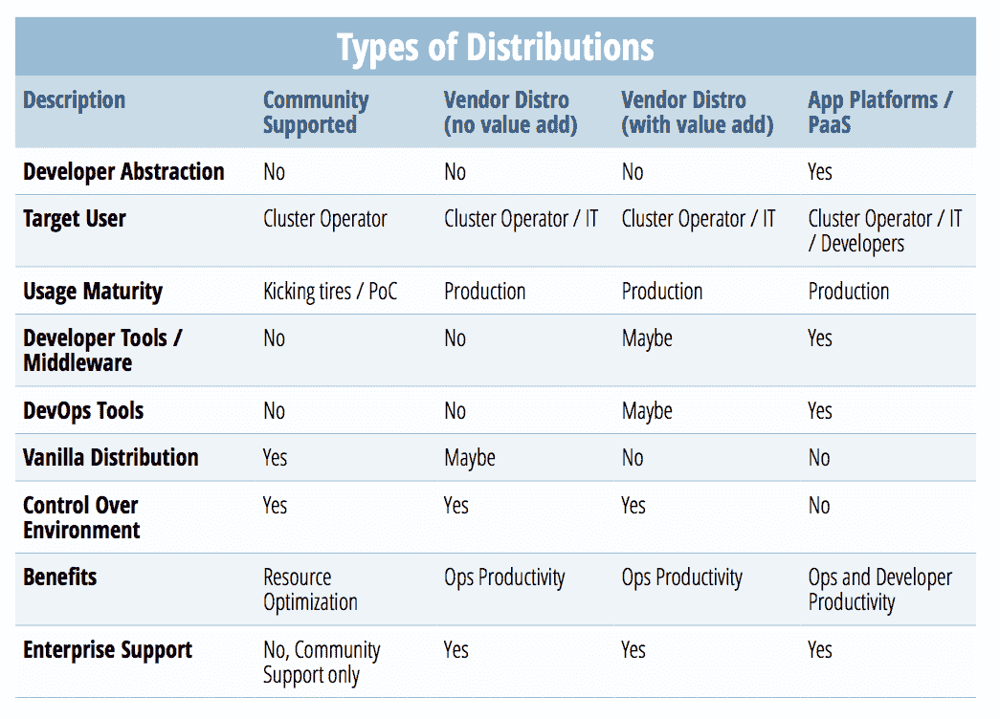
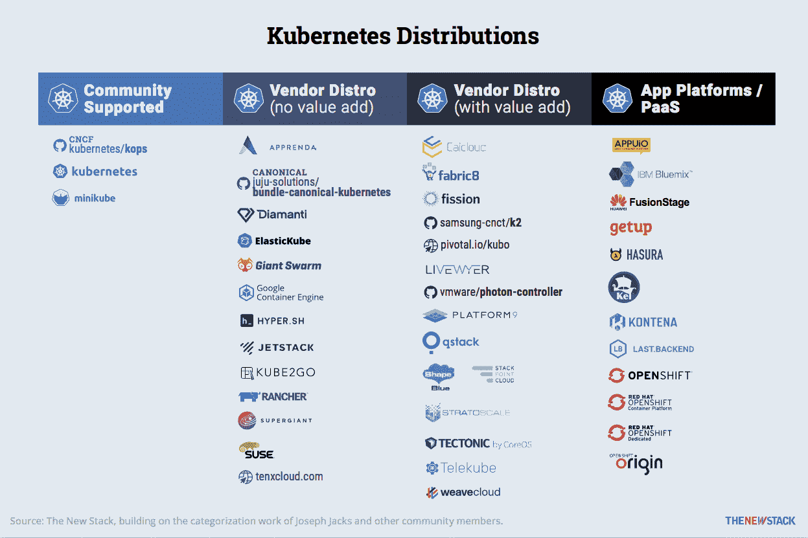

# 找到完美的 Kubernetes 发行版

> 原文：<https://thenewstack.io/find-perfect-kubernetes-distribution/>

 [克里希南·萨勃拉曼尼亚，瑞希多研究。

Krish Subramanian 是 Rishidot Research 的创始人，Rishidot Research 是一家专注于现代企业、应用平台和智能平台的研究和咨询公司。他为首席信息官和企业决策者的现代化战略提供建议，也是许多初创公司的顾问。此前，他是 CloudMunch 的战略副总裁和 Red Hat 的 OpenShift 战略总监。](http://rishidot.com/) 

在容器编排领域有许多不同类型的 Kubernetes 发行版。它们的范围从完全的社区产品到完全的商业产品，并且根据它们提供的工具和特性，以及提供的抽象和控制水平而变化。那么，哪种 Kubernetes 发行版适合您的组织呢？

您作为用户的需求——包括工作环境、专业知识的可用性以及您正在处理的特定用例——决定了容器即服务(CaaS)或抽象平台是正确的选择。没有一个简单明了的框架可以保证完美的决策。尽管如此，我们下面展示的两张图表可能是一个开始。

CaaS 平台包括 Kubernetes 项目，还打包了部署和管理该项目所需的其他工具。另一方面，抽象的平台远远超出了 CaaS 提供的运营效率，专注于提高开发人员的工作效率。

 [贾纳基拉姆·MSV

贾纳奇拉姆·MSV 是贾纳奇拉姆公司的首席分析师，也是国际信息技术研究所的兼职教员。他是 Google 认证的云开发人员、Amazon 认证的解决方案架构师、Amazon 认证的开发人员、Amazon 认证的 SysOps 管理员和 Microsoft 认证的 Azure Professional。Janakiram 是云本地计算基金会的大使，也是第一批获得认证的 Kubernetes 管理员之一。他之前的工作经历包括微软、AWS、Gigaom Research 和阿尔卡特朗讯。](https://www.janakiram.com/) 

使用 CaaS，开发人员需要将他们自己的代码打包到一个容器中，以便可以在集群中部署。尽管基于 Docker 的容器代表开发人员解决了这个打包问题，但抽象的应用程序平台可以完全封装内部构建容器映像的过程——自动化该过程，而不是一直牵着开发人员的手。一旦开发人员将代码推送到 GitHub 之类的源代码控制工具，或者 Jenkins 之类的持续集成/持续交付(CI/ CD)系统，她的任务就停止了，平台会完成剩下的工作。

通过设计，CaaS 与 Kubernetes 开源项目紧密结合，帮助它大规模地运行和管理容器。但是 CaaS 模型期望开发人员关注他们应用程序的所有依赖关系。从文化角度来看， [DevOps](/category/devops/) 模式遵循开发人员和运营人员利用跨职能知识共同工作的文化。在这个场景中，两个团队都知道的一件事是一长串的依赖项。

抽象应用平台使用 Kubernetes 作为核心组件，帮助 IT 以比 CaaS 更少的开销大规模运行容器。开发人员不必担心管理运行时或任何应用程序依赖性。相反，他们可以专注于编写应用程序代码，并将其推送到源代码控制存储库或 CI/CD 系统。

[cyclone slider id = " kubernetes-series-book-1-赞助商"]

抽象平台提高了开发人员的工作效率，同时消除了对底层组件的控制。你可以说 DevOps 仍然是这个模型的中心。但是有了抽象，就不需要这种跨功能的知识了——它变成了多余的繁忙工作。开发者不需要理解 Kubernetes 的基础或者如何管理它。

正如我们前面提到的，在 CaaS 和抽象平台之间没有直接的选择框架。您的选择取决于您的组织想要实现什么样的开发人员生产力，以及您为您的组织预见的具体用例。

## 库伯内特分布

一旦你对 CaaS 和抽象平台的需求有了一个好的概念，你就可以开始比较产品了。

 [斯科特·富尔顿三世

自 2014 年以来，斯科特·m·富尔顿三世一直是新堆栈的贡献者。Scott 为新的 Stack 编辑了 Kubernetes 生态系统的状态，还为技术出版行业制作和编辑了数不清的其他十几本书。他目前还是 ZDNet 发表的博客《规模:超越传统技术边缘的旅程》的作者。](http://scottfultononpoint.com) 

我们将可用的 Kubernetes 发行版分为四类。您可以通过这些软件包和服务获得或购买 Kubernetes 支持:

*   **社区支持的发行版**是免费的开源包，你可以用它们自己部署平台并尝试一下。 [Minikube](https://github.com/kubernetes/minikube) 是一个真正的 Kubernetes 环境，用于在单台计算机上进行本地实验性部署。
*   **Vendor distro(无增值)**展示了提供软件解决方案或基于云的平台的公司，包括纯 Kubernetes 和供应商支持。
*   **供应商发行版(带增值功能)**展示了提供更完整环境的公司，包括调度、开发和生命周期管理，以 Kubernetes 作为其系统的核心。
*   **App Platforms / PaaS** 展示了全面的平台即服务，包括 [Red Hat OpenShift](https://www.openshift.com/) ，它主动抽象出端到端自动化开发和部署环境背后的 Kubernetes 的管理和维护。

对于那些对更详细的集合感兴趣的人，可以看看这个频繁更新的、由社区管理的 Kubernetes 发行版列表:

Red Hat 的 Kubernetes 和 OpenShift 产品经理 Brian Gracely 告诉我们，他预计客户对 Kubernetes 的认知度实际上会下降，因为包含它的平台(自然包括他自己的平台)的势头会继续上升。

[cyclone slider id = " kubernetes-series-book-1-赞助商"]

“最终，这可以归结为，你是在围绕最终会变得无聊的想法建立商业模式吗？”优雅地问道。“你可以选择在此基础上或围绕此建立一些差异化。我们现在看到的是一个非常非常健康的生态系统，围绕着许多希望成为这个数字化转型时代一部分的公司——云原生应用——这太棒了。”

<svg xmlns:xlink="http://www.w3.org/1999/xlink" viewBox="0 0 68 31" version="1.1"><title>Group</title> <desc>Created with Sketch.</desc></svg>