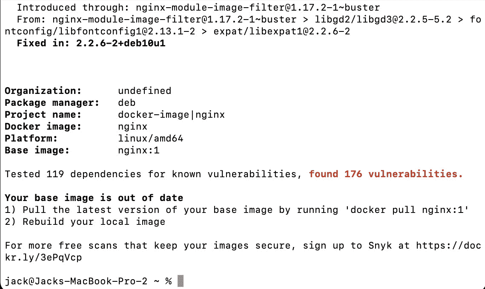

# 使用 Docker 扫描查找容器映像中的漏洞

> 原文：<https://thenewstack.io/find-vulnerabilities-in-container-images-with-docker-scan/>

随着您继续将开发过程转移到云本地计算，您会发现自己正在处理越来越多的容器映像。这些图片可能由制作它们的公司进行正式审查(例如来自 [Red Hat](https://www.openshift.com/try?utm_content=inline-mention) 、 [Canonical](https://thenewstack.io/canonical-enough-technical-assets-attract-investors/) 、 [Rocky Linux](https://thenewstack.io/post-centos-rocky-linux-fights-for-community-driven-enterprise-open-source/) 、 [NGINX](https://www.nginx.com?utm_content=inline-mention) 和 [AlmaLinux](https://thenewstack.io/almalinux-captures-the-soul-of-centos/) 的图片)，或者它们可能来自第三方来源，这些第三方来源可能不像那些大公司那样受到信任。在这种情况下，你会怎么做？你会盲目地相信你将要使用的图片是没有漏洞的吗？或者，您是否采取了谨慎的措施来确保您的容器部署的基础不包括破坏交易或危险的漏洞？

答案是始终保持一定的谨慎。一直都是。即使你使用的是来自知名公司的官方图片，你也应该采取同样的预防措施，因为你永远不知道什么时候会有什么东西从缝隙中溜走。

但是，如何扫描这些图像来寻找漏洞呢？有很多工具可用于这项任务，其中一些是昂贵的服务，而另一些是免费的替代品，使用起来非常简单和安全。

Docker 桌面就是这样一个工具。现在，最近有消息称 Docker 桌面将不再对大公司免费开放。但是如果你是个人开发者或者小企业(员工少于 250 人)，你可以继续免费使用这个工具。对于拥有超过 250 名员工或年收入超过 1000 万美元的企业，您必须拥有付费订阅才能继续使用 Docker Desktop。

但我关注的是那些仍然需要确保他们部署的容器基于没有漏洞的映像的云原生开发者。为了使这成为可能，Docker 桌面包括一个方便的扫描工具。这里的捕捉，不像你可以用 Docker 桌面做的，扫描仪是一个命令行工具。然而，幸运的是，这个命令非常容易使用。

这个扫描工具不仅仅在 Docker 桌面上可用。也可以添加到 Linux 上的 Docker。在我向您介绍了该命令如何在 macOS 版本的 Docker Desktop 上运行之后，我将向您展示如何做到这一点。

在你尝试之前，你首先需要[下载 Docker Desktop](https://www.docker.com/products/docker-desktop) 并安装在你的 macOS 机器上。幸运的是，开发人员已经让这变得像下载一个二进制文件并安装它一样简单，就像在 Mac 上安装任何应用程序一样。

安装 Docker Desktop 后，启动它并赋予它所需的权限。当 Docker 引擎运行时，您就可以下载图像并开始扫描了。

## 如何扫描图像

出于说明的目的，我在 Macbook Pro 上有一张 NGINX 的旧图像，想扫描一下。不久前，我用命令关闭了那个图像:

`docker pull nginx`

我可以用以下方式扫描图像:

`docker scan nginx`

扫描将很快开始并完成(当然，取决于图像的大小)。在我的情况下，Docker 会报告基本映像已经过时，并通知我应该下载一个新的映像。它还将报告在图像中发现了多达 176 个漏洞(**图 1**——因为它已经过时)。

图 1:我的旧 NGINX 映像包含太多的漏洞。

如果我们更新图像呢？为此，再次使用以下命令下载最新版本:

`docker pull nginx:latest`

在下载最新版本并重新运行扫描后，Docker 报告了相同的结果，我觉得很奇怪。因此，我尝试使用图像 ID 扫描图像。为了找到图像 ID，我发出了以下命令:

`docker images`

您应该会看到一个与 nginx 映像相关联的 ID。在运行命令 *docker scan ID* (其中 ID 是 NGINX 映像的 ID)之后，新的结果报告说我使用的是最安全的映像版本，但是仍然有 110 个与 136 个依赖项相关的漏洞。

好消息是，我下载了最新的 AlmaLinux 容器映像并运行了扫描。最终结果发现 0 个漏洞。万岁。

## 如何在 Linux 上使用 Docker 扫描

要在 Linux 上使用这个命令，我们首先必须用这个命令删除旧版本的 Docker:

`sudo apt-get remove docker docker-engine docker.io containerd runc -y`

删除旧版本后，使用以下命令安装必要的依赖项:

`sudo apt-get install apt-transport-https ca-certificates curl gnupg lsb-release -y`

使用以下内容添加码头 GPG 键:

`curl -fsSL https://download.docker.com/linux/ubuntu/gpg | sudo gpg --dearmor -o /usr/share/keyrings/docker-archive-keyring.gpg`

使用以下命令添加必要的存储库:

`echo "deb [arch=amd64 signed-by=/usr/share/keyrings/docker-archive-keyring.gpg] https://download.docker.com/linux/ubuntu $(lsb_release -cs) stable" | sudo tee /etc/apt/sources.list.d/docker.list > /dev/null`

用以下内容更新 apt:

`sudo apt-get update`

最后，安装 Docker 引擎:

`sudo apt-get install docker-ce docker-ce-cli containerd.io -y`

使用以下命令启动并启用 Docker 引擎:

`sudo systemctl start docker``sudo systemctl enable docker`

通过以下方式将您的用户添加到 docker 组:

`sudo usermod -aG docker $USER`

注销并重新登录，以使更改生效。但是，在运行扫描之前，您必须使用访问令牌登录 Docker Hub。您可以从 DockerHub 帐户的安全部分生成访问令牌。创建访问令牌后，使用以下命令登录:

`docker login -u USERNAME`

其中用户名是您的 DockerHub 用户名。

此时，您应该能够用与上述相同的方法在 Linux 中扫描图像。

## 结论

这就是使用 *docker scan* 命令扫描 docker 容器映像的全部内容，无论是从 Docker 桌面还是 Linux 上的 Docker 引擎。您应该将这一步放到您的容器开发工作流程中，这样您就可以确保您从一个坚实的安全基础开始。

<svg xmlns:xlink="http://www.w3.org/1999/xlink" viewBox="0 0 68 31" version="1.1"><title>Group</title> <desc>Created with Sketch.</desc></svg>