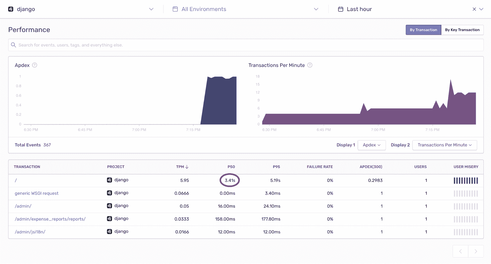

# 查找并修复 Django N+1 问题

> 原文：<https://thenewstack.io/finding-and-fixing-django-n1-problems/>

[哨兵](https://sentry.io/signup/)赞助此贴。

 [亚当·麦克里

Adam 是 Sentry.io 的工程经理，他从 15 岁起就开始建立网站。当他不在网上做东西的时候，他喜欢和家人环游世界，阅读旧的《星球大战》书籍，尝试烹饪。](https://www.linkedin.com/in/adammckerlie/) 

[Django](https://www.djangoproject.com) Python 框架允许人们以极快的速度建立网站。它最好的特性之一是对象关系映射器(ORM ),它允许您对数据库进行查询，而无需编写任何 SQL。Django 将允许您用 Python 编写查询，然后它会尝试将这些语句转换成高效的 SQL。大多数情况下，ORM 完美地创建了 SQL，但有时结果并不理想。

一个常见的数据库问题是 ORM 会导致 N+1 次查询。这些查询包括一个单独的初始查询(+1 ),该查询结果中的每一行都会衍生出另一个查询(N)。这些往往发生在你有亲子关系的时候。选择所有需要的父对象，然后在遍历它们时，为每个子对象生成另一个查询。这个问题一开始可能很难发现，因为您的网站可能运行良好。但是随着父对象数量的增加，查询的数量也在增加——到了让数据库不堪重负、让应用程序瘫痪的地步。

最近，我建立了一个简单的网站，记录费用和费用报告。我想使用 Sentry 的新[性能](https://sentry.io/for/performance/)工具来评估应用程序在生产中的表现。我使用 [Django](https://docs.sentry.io/performance-monitoring/getting-started/?platform=python) 的指令快速设置了它，并立即看到了结果。

[](https://cdn.thenewstack.io/media/2020/08/c9c72eb4-image1.png)

我注意到的第一件事是，中值根事务花费了 3.41 秒。这个页面所做的只是显示一个报告列表和一个报告上所有费用的总和。姜戈很快，绝对不应该用 3.41 秒。

```
```
# models.py
from django.db import models
class Reports(models.Model):
    name  =  models.CharField(max_length=255)
    submitted_date  =  models.DateTimeField(null=True,  blank=False)

    @property
    def get_expense_total(self):
        for expense in self.expenses.all():
            return expense.amount

class Expenses(models.Model):
    report  =  models.ForeignKey(Reports,  related_name=‘expenses’,  on_delete=models.CASCADE)
    amount  =  models.DecimalField(max_digits=10,  decimal_places=2)

# views.py
from django.views.generic.list import ListView
from expense_reports.models import Reports

class ReportsList(ListView):
    model  =  Reports
    context_object_name  =  'reports'

# report_list.html

    <div>
        <h2>{{  report.name  }}</h2>
        
                <small>{{  expense.name  }}</small>
                <small>{{  expense.amount  }}</small>
        
        <small>{{  report.get_expense_total  }}</small>
    </div>


```

```

看着代码，我看不到任何直接的问题，所以我决定深入到最近交易的事件详细信息页面。

[](https://cdn.thenewstack.io/media/2020/08/86b1a8df-image3.png)

我注意到的第二件事是 ORM 生成了多少查询。在这一点上，我发现我有一个单一的查询来获取所有的报告，然后对每个报告的另一个查询来获取所有的费用 *—* 一个 N+1 问题。

Django 默认情况下会延迟评估查询。这意味着 Django 不会运行查询，直到 Python 代码被评估。在这种情况下，当页面最初加载时，`**Reports.objects.all()**`被调用。当我调用`**{{ report.get_expense_total }}**`时，Django 运行第二个查询来获取所有的费用。有两种方法可以解决这个问题，这取决于你的模型是如何设置的:**[【select _ related()】](https://docs.djangoproject.com/en/3.0/ref/models/querysets/#select-related)**和[**【prefetch _ related()】**](https://docs.djangoproject.com/en/3.0/ref/models/querysets/#prefetch-related)。

`**select_related()**`遵循一对多关系，并将它们作为连接添加到 SQL 查询中。`**prefetch_related()**`工作方式类似，但它不是进行 SQL 连接，而是对每个对象进行单独的查询，然后用 Python 将它们连接起来。这允许您预取多对多和多对一关系。

我们可以更新报告列表以使用`prefetch_related()`。这将数据库查询的数量减少了一半，因为我们现在使用一个查询来获取所有的报告，一个查询来获取所有的费用，然后在`report.get_expense_total`中使用 n 个查询。

```
```
class ReportsList(ListView):
    model  =  Reports
    context_object_name  =  ‘reports’
    queryset  =  Reports.objects.prefetch_related(‘expenses’)
```

```

为了修复来自`report.get_expense_total`的`n`查询，我们可以使用 Django 的`[annotate](https://docs.djangoproject.com/en/3.0/ref/models/querysets/#django.db.models.query.QuerySet.annotate)`在将信息传递给模板之前获取信息。

```
```
# views.py
class ReportsList(ListView):
    model  =  Reports
    context_object_name  =  ‘reports’
    queryset  =  Reports.objects.prefetch_related(‘expenses’).annotate(total_amount=Sum(‘expenses__amount’))

# report_list.html

    <div>
        <h2>{{  report.name  }}</h2>
        
                <small>{{  expense.name  }}</small>
                <small>{{  expense.amount  }}</small>
 
        <small>{{  report.total_amount  }}</small>
    </div>

```

```

现在，交易时间中位数已降至 290 毫秒！

[](https://cdn.thenewstack.io/media/2020/08/e03fbbbd-image2.png)

如果查询数量增加到可能导致应用程序停机的程度，请尝试使用 prefetch_related 或 select_related。这样，Django 将获取所有的附加信息，而不需要额外的查询。这样做之后，我最终在主页上保存了 950 个查询，并减少了 91%的页面负载。

*这份文件是用[即时网页内容编辑器](https://htmleditor.tools/)编辑的，可以在 htmleditor.tools 找到，试试看。*

通过 Pixabay 的特征图像。

目前，新堆栈不允许直接在该网站上发表评论。我们邀请所有希望讨论一个故事的读者通过[推特](https://twitter.com/thenewstack)或[脸书](https://www.facebook.com/thenewstack/)访问我们。我们也欢迎您通过电子邮件发送新闻提示和反馈: [feedback@thenewstack.io](mailto:feedback@thenewstack.io) 。

<svg xmlns:xlink="http://www.w3.org/1999/xlink" viewBox="0 0 68 31" version="1.1"><title>Group</title> <desc>Created with Sketch.</desc></svg>