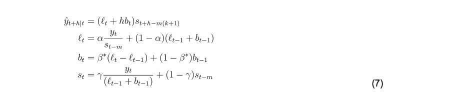
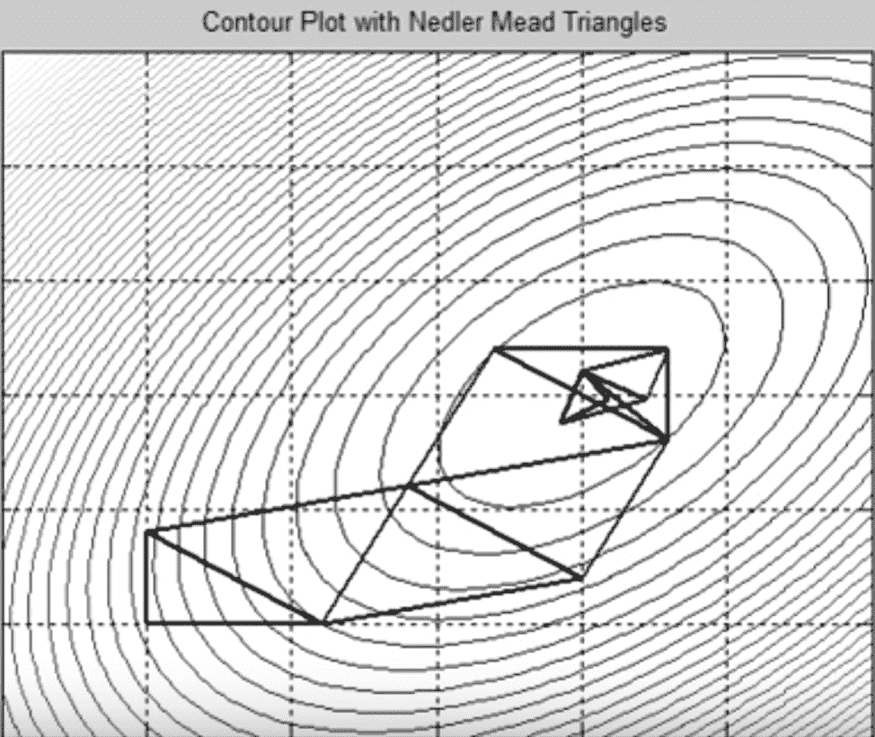

# 在霍尔特-温特斯发现更多隐藏的宝石

> 原文：<https://thenewstack.io/finding-more-hidden-gems-in-holt-winters/>

[InfluxData](https://www.influxdata.com/) 赞助了这篇文章。

 [阿纳伊斯·多蒂斯-乔治乌

Anais 是 InfluxData 的开发者倡导者，热衷于通过使用数据分析、人工智能和机器学习来使数据变得美丽。她将收集到的数据进行综合研究、探索和工程设计，将其转化为具有功能、价值和美感的东西。当她不在屏幕后面时，你可以发现她在外面画画、伸展身体或追逐足球。](https://www.influxdata.com/) 

欢迎回到这个关于霍尔特-温特斯的三部分博客系列，以及为什么它在今天仍然高度相关。为了理解第二部分，我建议阅读[第一部分](https://thenewstack.io/when-holt-winters-is-better-than-machine-learning/)，其中我们涉及到:

1.  何时使用霍尔特-温特斯；
2.  单一指数平滑的工作原理；
3.  单指数平滑最佳化的概念综述:
4.  Extra:线性回归残差平方和(RSS)优化的证明。

在这篇文章的第二部分，我们将探索:

1.  单指数平滑与三指数平滑/霍尔特-温特斯的关系；
2.  RSS 与均方根误差的关系(RMSE)；
3.  如何使用 Nelder-Mead 方法为霍尔特-温特斯优化 RMSE？

在第三部分，我们将探索:

1.  如何使用 InfluxDB 的内置乘法 Holt-Winters 函数对时间序列数据进行预测；
2.  学习资源列表。

### 单指数平滑与三指数平滑/霍尔特-温特斯的关系

像 SES 一样，Holt-Winters 可以作为一种强大而有效的预测性维护技术，它通过计算指数加权平均值来确定预测值，但并不止于此。

正如 Holt 和 Winters 之前所写的，如果您的数据具有趋势和季节性，那么您也应该计算这些值的加权平均值，并将它们合并到预测值中。

霍尔特-温特斯乘法看起来像这样:

其中，***【l _(t)***为平滑方程，***【b _(t)***为斜率， ***s_(t)*** 为季节性。另外还有两个平滑参数***β-star***和***γ***分别用于斜率和季节性。我们希望预测的点数由整数 ***h*** 表示。一个周期中的季节数(通常用年来衡量，但也可以用月或天来衡量，这取决于你的时间尺度)由 ***m*** 来表示， ***k*** 是一个指数，它确保预测基于适当的季节。预测值 ***y-hat*** 是考虑了数据的三个特征后得出的，这也是三重指数平滑得名的原因。但是，请注意，每个等式仍然与 SES 有许多相似之处，并且是指数加权平均值。

最后，等式(7)是乘法方法(还有加法霍尔特-温特斯方法)。当季节周期不变时，使用加法方法。当季节周期与系列的级别(或斜率)成比例变化时，使用乘法。这种比例由季节性方程的以下部分表示:

我完全同意霍尔特-温特斯看起来有更多的毛发。然而，现在你可以想象，我们需要做的是找到三个平滑参数，而不是一个和一些初始值。这种优化的执行方式与线性回归优化相同。唯一不同的是，我们不能只求偏导数来寻找平滑因子；相反，我们将使用内尔德-米德方法。我们将优化 RSME，而不是优化 RSS。“为什么？”你问吗？

### RSS 与 RMSE 的关系

使用 RMSE 有两个主要原因:1)它依赖于尺度，2)它是归一化的。因为误差用与***【y _(t)***相同的单位来表示，所以 RMSE 是比例相关的。由于误差在相同的范围内，它们有直观的意义。相比之下，使用 RSS，误差是平方的。RMSE 也是标准化的，而上证综指则更加多变，取决于样本量。

提醒一下，RSS 看起来是这样的:

而 RMSE 仅仅是，

换句话说，RMSE 是 RSS 的平方除以自由度的数量。

### 如何使用 Nelder-Mead 方法针对霍尔特-温特斯优化 RMSE

还记得我们为最小化 RSS 做的那个碗吗？为了找到一个平滑参数( ***alpha*** )和一个初始值( ***l_nought*** )？好了，现在我们还要再找两个平滑参数(***β星*** 和 ***伽马*** )和一个初始值( ***b_nought*** )。我们的优化已经从三维问题发展到了六维问题。我们将不得不执行一些非常困难的微分方程来解决它。我们也不再有漂亮的碗了。有局部极小值，也有全局极小值。因此，我们不能仅仅将偏导数设为 0，然后求解这些参数。相反，我们必须使用更复杂的方法:内尔德-米德法。 [Nelder-Mead](https://www.youtube.com/watch?v=HUqLxHfxWqU) 是一种[数值](https://en.wikipedia.org/wiki/Numerical_method) [方法](https://en.wikipedia.org/wiki/Numerical_method)，一种近似，一种数学工具或者解决数学难题的捷径。

在这张来自“内尔德·米德动画”的照片中，单纯形由二维空间中的一个三角形表示。

Nelder-Mead 方法不是真正的全局优化算法。然而，对于没有很多局部极小值的问题，比如我们的问题，它工作得很好。它的工作原理是在空间中放置一个单形。这个单形就像一个小变形虫或动画球。然而，它只能走下坡路。它向各个方向延伸一点，以确定下坡的位置。一旦它找到了，它就会向山下移动。它重复这个过程，直到它再也不能移动。在这一点上，单纯形是“快乐的”,我们已经找到了我们的最小值。单纯形的形状和位置由该方法确定。单纯形下坡的摆动仅通过在 for 循环中应用于它的一系列操作来执行，即迭代地执行。使用数值方法进行优化的好处是，我们可以通过使用简单的数学方法找到真正好的近似值，而不是尝试执行昂贵而复杂的代数计算。

一旦我们找到了最小值，我们就找到了平滑参数和初始值。我们有三个方程中所有缺失的部分，我们可以使用霍尔特-温特斯来进行预测。

我希望这篇教程能帮助你开始你的预测之旅。如果你有任何问题，请在[社区网站](https://community.influxdata.com/)上发表，或者发推特给我们 [@InfluxDB](https://twitter.com/InfluxDB) 。

阿奈斯·多蒂斯-乔治乌特写。

<svg xmlns:xlink="http://www.w3.org/1999/xlink" viewBox="0 0 68 31" version="1.1"><title>Group</title> <desc>Created with Sketch.</desc></svg>