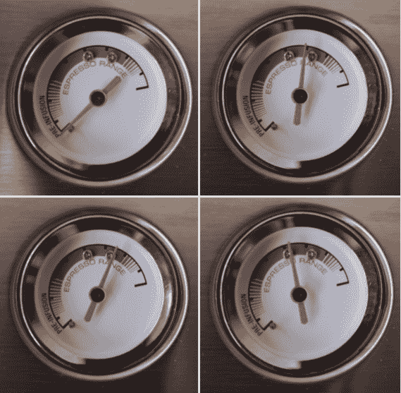
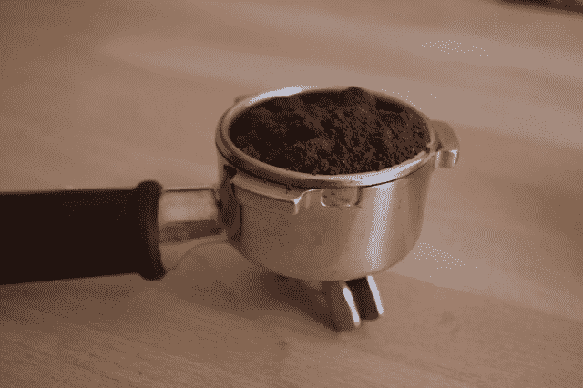
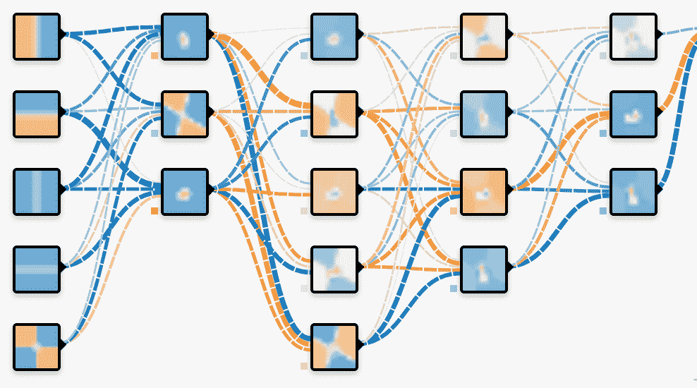

# 构建完美的人工智能管道就像酿造一杯完美的浓缩咖啡

> 原文：<https://thenewstack.io/finding-perfect-ai-pipeline-like-brewing-perfect-shot-espresso/>

 [斯科特·克拉克，SigOpt 联合创始人兼首席执行官

斯科特·克拉克是 SigOpt 的联合创始人兼首席执行官。多年来，他一直在工业界和学术界应用最佳学习技术，从生物信息学到生产广告系统。在 SigOpt 之前，Scott 在 Yelp 的广告定位团队工作，领导学术研究和推广项目，如 Yelp 数据集挑战和开源 MOE。Scott 拥有康奈尔大学的应用数学博士学位和计算机科学硕士学位，以及俄勒冈州立大学的数学、物理和计算物理学士学位。斯科特被选为 2016 年福布斯 30 位 30 岁以下富豪之一。](https://www.sigopt.com) 

建立最好的人工智能管道与制作一杯完美的浓缩咖啡惊人地相似。在这两种情况下，在流程开始之前就必须配置大量可调参数，这对最终结果有着巨大的影响。

从一个浓缩咖啡豆的水压和研磨到学习速度和神经网络中的隐藏层数，这些配置参数可以成就或破坏你的人工智能管道或完美的早晨拍摄。这些可调系统之间有许多类似的组件，但在这两种情况下，获得最佳结果历来是艺术多于科学。在本帖中，我们将讨论这两个过程的相似之处，以及优化它们和类似复杂系统的更好方法。

训练一个神经网络与酿造一杯完美的浓缩咖啡([或烘焙一批完美的饼干](https://blog.sigopt.com/posts/dealing-with-troublesome-metrics))没有太大的不同。水在一定的温度和压力下通过磨碎的浓缩咖啡豆，吸收味道和咖啡因，同时微妙地改变咖啡豆，最终在另一侧输出美味的浓缩咖啡。当数据通过深度学习管道时，它会转换其神经元的权重，吸收信息并收敛到一个模型，该模型可以应用于各种任务，如[自然语言处理](https://aws.amazon.com/blogs/ai/fast-cnn-tuning-with-aws-gpu-instances-and-sigopt/)或[序列分类](https://devblogs.nvidia.com/parallelforall/sigopt-deep-learning-hyperparameter-optimization/)。

通过浓缩咖啡豆的水类似于经过训练的神经网络中的数据。它穿过系统，通过与系统本身相互作用并改变系统本身的属性，最终成为不同的和令人满意的东西。人们可以调整水或数据如何与系统交互的各个方面，如压力和温度，以影响它如何被浓缩咖啡豆吸收或神经网络中的学习速率和随机梯度下降(SGD)参数。这些可调参数将影响水或数据如何影响咖啡渣或神经元的网络。

水压和温度会影响水通过磨碎的咖啡豆时加入的香料和咖啡因的量。

此外，浓缩咖啡豆本身类似于深度学习管道的整体架构。浓缩咖啡豆的一种变化与另一种变化在镜头上的差异可以与深度学习管道中卷积或递归神经网络之间的决策相同。咖啡豆的研磨和用量决定了水流过的网格，就像隐藏层神经网络的结构参数和每层神经元的数量一样。

以不同的方式烘焙咖啡豆将改变味道如何被每个研磨的咖啡豆颗粒吸收，就像神经网络中的激活功能允许数据对网络中的单个神经元产生不同的影响。不同的浓缩咖啡机对镜头有影响，即使配置参数完全相同，就像深度学习框架一样，如 [MXNet](https://mxnet.incubator.apache.org/) 、 [TensorFlow](https://github.com/tensorflow/tensorflow) 和 [Caffe2](https://caffe2.ai/) 可以将细微的差异传递给训练好的模型。

两个系统中的时间是类似的，你通过机器抽水的时间越长，它们对最终投篮的影响就越大(在大小和质量方面)，同样，你训练神经网络的时间越长(你训练的时期数)将对学习的内容、收敛的程度和结果产生影响。

浓缩咖啡豆的数量和研磨的粗糙程度改变了水吸收不同数量的咖啡因和味道的方式。

神经网络的架构，如隐藏层的数量和每层神经元的数量，会改变从数据中学习到的内容。

一旦你确定了一个参数配置来试着煮你的浓咖啡或者训练你的网络，下一步就是测量输出来决定它是否成功。一杯最好的浓缩咖啡在味道和咖啡因之间做出了完美的权衡，苦味需要恰到好处。类似地，深度学习管道有特定的，有时是竞争的指标，围绕准确性，鲁棒性或速度。此外，煮浓缩咖啡的结果可以后处理成拿铁、卡布奇诺或美式咖啡，每种咖啡都有自己的可调参数，就像神经网络输出可以输入到更大的管道中，用于欺诈检测或算法交易等应用程序一样。尽可能高效地找到这些系统的最佳配置可以提高这些模型的性能，或者在早上更好地提高咖啡因的含量。所有参数相互作用，以不同的、通常非直观的方式影响期望的输出。

> 这些方法的黑盒性质允许我们将浓缩咖啡酿造问题等同于调整人工智能管道。

自 19 世纪以来，大师们就一直致力于打造最好的浓缩咖啡。类似地，深度学习管道通常在实践中通过专家直觉进行调整，特别是当流行的暴力方法如网格和随机搜索由于配置参数的数量或训练模型的费用而变得难以处理时。不幸的是，对于不同的应用程序，这些管道的最佳配置在不同的数据集和不同的上下文中会有很大的不同。因此，手动调优方法通常归结为耗时且昂贵的试错优化，通常是在高维空间中，这浪费了宝贵的专家和计算资源。

贝叶斯优化技术允许在尽可能少的尝试中找到这些系统的最佳配置。这是通过借鉴像[最优学习](https://optimallearning.princeton.edu/)和[基于顺序模型的优化](https://www.cs.ubc.ca/~hutter/papers/10-TR-SMAC.pdf)等领域的学术研究来完成的。这些技术权衡了探索、了解更多关于参数如何相互作用和组合以影响预期结果的信息，以及利用我们已经知道的东西来提高性能。

这些方法的黑盒性质允许我们将浓缩咖啡酿造问题等同于调整人工智能管道。黑盒方法只观察系统的输入(要评估的特定配置)和输出(要优化的期望目标或目标集)。这使得贝叶斯优化工具可以轻松地安装在任何底层系统之上，而不需要任何关于专有数据或模型的信息。事实上，像 [MillerCoors 这样的公司已经将其应用于另一种类型的酿造](https://www.businessinsider.com/sigopt-raises-series-a-round-from-andreessen-horowitz-2016-8)。

通过比网格搜索等常见技术更快地获得最佳配置，并且不依赖于人类使用直觉在他们的大脑中进行高维优化，贝叶斯优化允许您获得模型的最佳版本，或完美的浓缩咖啡，比以往任何时候都更快和更便宜。

通过 Pixabay 的特征图像。

<svg xmlns:xlink="http://www.w3.org/1999/xlink" viewBox="0 0 68 31" version="1.1"><title>Group</title> <desc>Created with Sketch.</desc></svg>