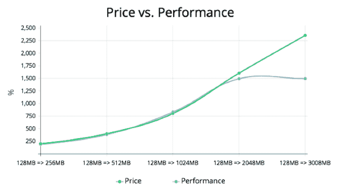
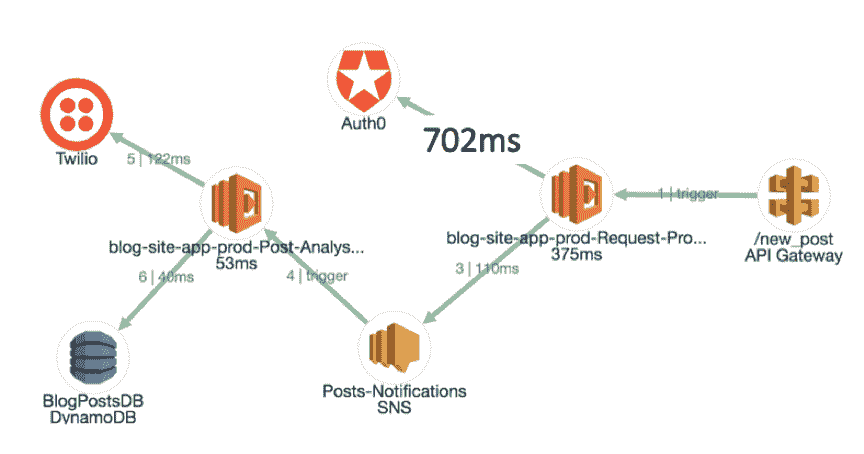
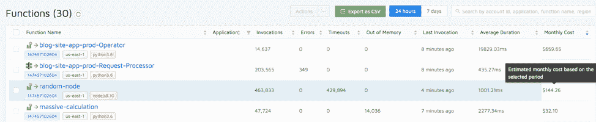
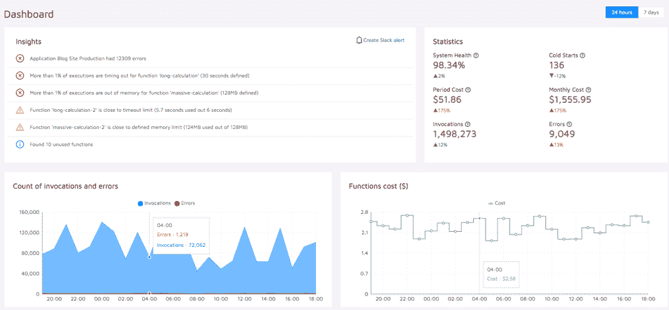

# 寻找无服务器的“隐性成本”

> 原文：<https://thenewstack.io/finding-serverless-hidden-costs/>

 [尼赞·沙皮拉

尼赞是爱普生的首席执行官和联合创始人。他是一名软件工程师，在编程、机器学习、网络安全和逆向工程领域拥有超过 13 年的经验。他还喜欢弹钢琴，是一个旅游爱好者，一个经验丰富的棋手，并沉迷于运动。](https://epsagon.com/) 

无服务器，即在不管理基础设施的情况下运行软件的概念，通常与按使用付费联系在一起。

像 [AWS Lambda](https://aws.amazon.com/lambda/) 这样的服务就是一个例子:你的代码每运行 100 毫秒，你[就向](https://aws.amazon.com/lambda/pricing/)支付一笔固定的费用。例如，内存为 512 MB 的 Lambda 的价格为 0.000000834 美元。最棒的是，当您的代码不运行时，您不需要付费——当大型组织中的服务器利用率低于 20%时，这将带来巨大的潜在财务节约。[公司已经看到了无服务器带来的巨大节约](https://read.acloud.guru/how-going-serverless-helped-us-reduce-costs-by-70-255adb87b093)。

那么，有什么条件呢？好吧，没有陷阱。这的确很有道理。然而，每项新技术都伴随着风险，这些风险必须被识别和减轻。Ran Ribenzaft 在特拉维夫 AWS 社区日发表的演讲[“按使用付费的真实成本”](https://www.youtube.com/watch?v=rVCx8dHidGg)涵盖了无服务器成本的几个关键方面。让我们在这里介绍其中的一些。

## 不要试图赢得配置战

当您部署无服务器功能时，通常您首先必须选择它的参数:内存和 CPU。在 Lambda 中，两者是一起的。内存涨了价格也涨了。因此，您应该选择低内存量以节省资金。对吗？不对！没有足够的内存来存储您的函数可能有几种含义:

*   内存越少，CPU 也越低，这意味着运行时间越长，并可能导致超时。超时可以与正在关闭的台式计算机相提并论，这是非常不可取的行为；
*   更长的运行时间也需要更多的钱。所以减少记忆会有相反的效果。

这个 [AWS Lambda 性能指标评测](https://epsagon.com/observability/how-to-make-aws-lambda-faster-memory-performance/)发现了令人惊讶的结果:性能随着价格一起上涨——直到某个点，更多的 CPU 不再有帮助。

因此，为您的功能选择精确的内存和 CPU 是不实际的，至少在第一次尝试时是这样。它也是动态的，随着功能的变化和发展，可能需要更多或更少的资源。

那么，解决办法是什么？

### 监控持续时间和内存使用情况

一如既往，在复杂系统中，最困难的问题发生在你不知道你不知道的事情的时候**。可观察性至关重要——不仅要检测错误和性能瓶颈，还要知道函数的内存消耗和运行时间。避免此类问题的最有效方法之一是，不仅在问题发生后发出警报**，而且根据静态规则或与正常行为相比的峰值预测问题何时会发生**。**

 **## API 调用是昂贵的

一个主要的观察结果是，性能问题**直接转化为更高的账单**。代码每运行一次，你就要付出更多。无服务器总成本由两个独立的数字组成:

*   您的代码执行您的业务逻辑的时间；
*   代码等待 API 调用的时间。

正如在[“API 在无服务器中的重要性和影响”](https://epsagon.com/observability/the-importance-and-impact-of-api-in-serverless/)中所展示的，一个简单的调用一个流行的服务，比如 [Auth0](https://auth0.com/) ，可能会消耗掉 Lambda 函数总运行时间的 80%以上。这并不意味着你不应该在无服务器中使用第三方 APIs 事实上，恰恰相反。它们是创建完全无服务器、可伸缩的应用程序的关键。但是，您应该意识到，与传统应用程序相比，您所做的选择以及配置这些工具的方式可能会对无服务器应用程序产生更大的影响。

## 让您的无服务器账单可预测

尽管传统上，云账单有时可能很难理解，但它通常是可预测的吗？您购买了一千台虚拟机，并且您知道您将支付多少费用。有了 Lambda，以及其他最近推出的服务，如[亚马逊 Aurora 无服务器服务](https://aws.amazon.com/rds/aurora/serverless/)，账单突然变得动态化，因此变得不可预测。

### 成本预测

掌握无服务器账单的一个有用方法是使用**预测**——根据当前时间段，你可以估计出当月月底的总成本。预测是消除月底惊喜的简单而有用的技巧。成本预测的一个简单公式是:

**月末成本=当前成本*(当月天数/今天)**

例如，如果一个月有 30 天，今天是第 15 天，总成本是 200 美元，那么月底的估计成本是 400 美元。这种预测适用于特定功能和无服务器总成本。在 Epsagon 中，function 视图包含一个专用于每个函数的估计成本的列。

### 成本监控

就像公司一直使用性能监控工具来确保他们的应用程序按预期运行一样；对于无服务器，监控成本也很有意义。作为我们的[无服务器监控公司 Epsagon](https://epsagon.com/) 的案例研究，我们分享了一个[个人故事](https://www.youtube.com/watch?v=MZmw-bb02Uo)我们遇到了一个严重的扩展问题，一个 Lambda 函数以非常高的并发性运行，最终每月花费超过 12K 美元。幸运的是，我们使用 Epsagon 仅仅几个小时后就发现了这个问题，当然，我们也用它来监控我们的系统。其他例子包括一家大公司发现并报告了一个[价值 5 万美元的 bug](/serverless-pricing-estimating-consumption-costs/) ，这多亏了 Epsagon 的监控功能。

[Lambda 成本计算器](https://epsagon.com/tools/how-much-does-aws-lambda-cost/)开源工具可以帮助你了解你期望为你的功能支付多少。

## 遗言

在无服务器应用程序中，按使用付费是一个很好的概念，很有意义，并且有很大的经济效益。必须意识到性能问题会直接影响每月的账单。

最大限度地利用按使用付费，并防止高额、不可预测账单的风险；成本预测和监控等技术非常有用。具体来说，在无服务器中很常见的 API 应该谨慎使用并受到监控，因为它们会很快成为性能和成本的主要瓶颈。

<svg xmlns:xlink="http://www.w3.org/1999/xlink" viewBox="0 0 68 31" version="1.1"><title>Group</title> <desc>Created with Sketch.</desc></svg>**