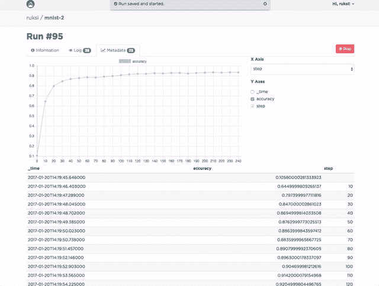

# 芬兰初创公司 Valohai 希望成为“机器学习的 GitHub”

> 原文：<https://thenewstack.io/finnish-startup-valohai-wants-github-machine-learning/>

在芬兰语中，瓦罗海是一种生活在海洋深处，通过生物发光提供照明的物种。这是机器学习即服务初创公司 [Valohai](https://valohai.com/) 的愿景。

这家总部位于芬兰图尔库的公司自称为“机器学习的 GitHub”，不仅提供机器学习基础设施即服务，还专注于协作和 ML 团队工作流，从而脱颖而出。

“每家公司都在试图重新发明轮子，而不是专注于他们实际的机器学习解决方案。联合创始人兼首席执行官[埃罗·拉克索宁](https://www.linkedin.com/in/eeroeero/?ppe=1)说:“我们正在自动化所有必要的繁重工作，并授权开发人员更快地带领我们走向未来。“所以这个名字是对深度学习工作的暗示。”

它的机器学习平台自动化了培训基础设施，并提供了协作工具。

“许多人觉得人工智能和自动化正在让社会失去人性；我们认为值得注意的是，我们正在努力实现相反的目标，”Laaksonen 说。

## 基础设施等

该公司成立于 2016 年 10 月，但 Laaksonen 表示，他和他的联合创始人 [Otso Rasimus](https://www.linkedin.com/in/orasimus/?ppe=1) 、 [Aarni Koskela](https://www.linkedin.com/in/aarni/?ppe=1) 和[ruk si Laine](https://github.com/ruksi)——至少可以追溯到 10 年前。

“在瓦罗海之前，我们学到了很多，建立了多家公司，在旧金山工作过。他说:“瓦罗海为我们提供了一个绝佳的机会，让我们可以一起做一些有意义的事情。

他说，许多机器学习算法并不新鲜，但现在我们有计算能力和数据来实际使用它们。

例如，Forrester Research 表示，2017 年将是企业通过新的认知界面和其他人工智能相关技术直接获得强大客户洞察力的一年。它预测，到 2020 年，全球人工智能市场将达到 1.2 万亿美元，而研究公司 [Markets and Markets](http://www.marketsandmarkets.com/Market-Reports/machine-learning-as-a-service-market-183667795.html) 预测，特别是机器学习即服务市场，到 2021 年将达到 375 万美元。

在 GPU 上训练模型只需要一个简单的配置文件，而不是几个月的开发工作。该服务维护自动扩展的工作服务器集群，供 AWS 上的客户端使用。它宣称这些比每秒计费的市场价低 50%。它也可用于使用可安装代理软件的私有环境。

“我们对机器学习所做的就像持续集成和版本控制对编程所做的一样，”该团队在黑客新闻的[论坛](https://news.ycombinator.com/item?id=13930796)上声明。它正在寻求公开测试版用户。

Valohai 支持诸如 [TensorFlow](https://www.tensorflow.org/) 、 [Keras](https://keras.io/) 、 [Torch](http://torch.ch/) 和 [Caffe](http://caffe.berkeleyvision.org/) 等框架——实际上，据该公司称，它可以运行任何可以打包成 Docker 映像的语言或机器学习库。

瓦罗海的机器学习服务

## 激烈竞争

该公司面临着激烈的竞争。[麦肯锡](https://www.forbes.com/sites/louiscolumbus/2017/07/09/mckinseys-state-of-machine-learning-and-ai-2017/#385f40b375b6)报告称，2016 年，百度和谷歌等科技巨头在人工智能上花费了 200 亿至 300 亿美元，其中机器学习吸引了近 60%的人工智能投资。****

拉克索宁将亚马逊、谷歌和微软列为“最可怕”的竞争对手。

“然而，他们的解决方案是专有的，黑箱和较低的水平，”他说。“例如，亚马逊网络服务目前的机器学习产品不允许你决定使用哪种算法，最终结果是一个网络 API。在 Valohai 上，你决定使用哪个框架和算法，产生的模型可以部署在你想部署的任何地方，无论是 web 服务器还是物联网设备。"

它还面临着像 [FloydHub](https://www.floydhub.com/) 和 [Nexosis](http://www.nexosis.com/) 这样的初创公司。

Laaksonen 强调，Valohai 不仅仅是提供基础设施。除了作为类似 GitHub 的团队空间的协作之外，它的重点是实时结果、记录保存和可重复性。

您可以运行多个平行实验。实验元数据实时可用，并在其他同时运行的实验之间可视化。一个或多个链接的 Git 存储库定义了什么样的“运行”或“任务”可以在项目上下文中执行。版本控制存储库将有一个 valohai.yaml 文件来定义这些执行模板。

执行所吸收和产生的一切都被记录下来，并可以通过 web 浏览器或命令行访问。您还可以通过 REST API 访问数据。

如果日志输出看起来像 JSON，那么它被解释为可图表化的元数据，您可以在执行之间进行比较。

由 [Dawn Sobieski](https://freerangestock.com/view_photog.php?photogid=862) 通过[散养畜](https://freerangestock.com/photos/9539/flatnose-shark.html)拍摄的特写图片。

<svg xmlns:xlink="http://www.w3.org/1999/xlink" viewBox="0 0 68 31" version="1.1"><title>Group</title> <desc>Created with Sketch.</desc></svg>