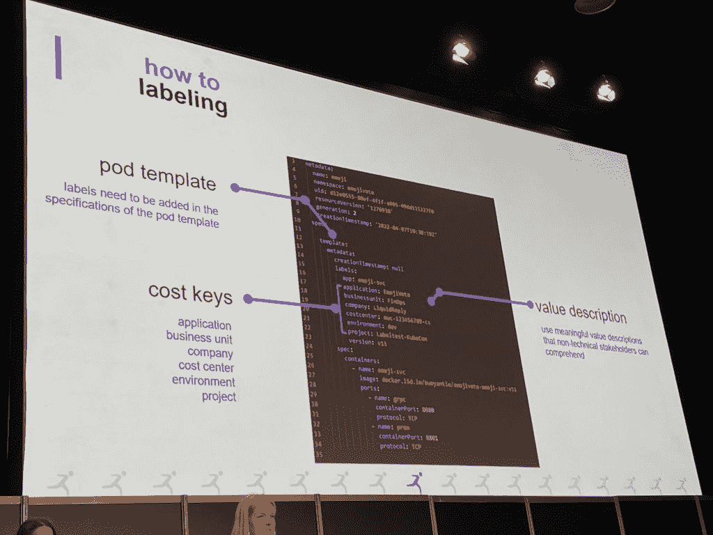
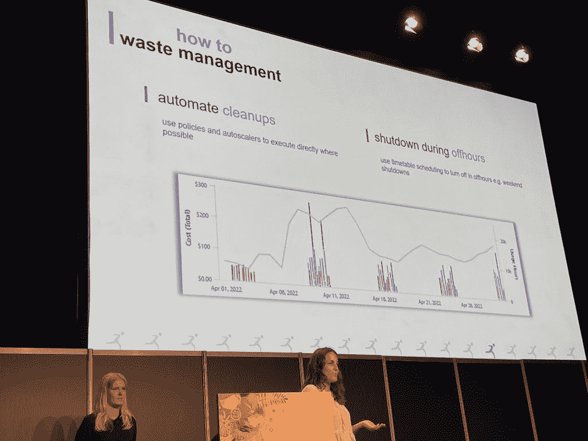

# fin ops:Kubernetes 团队如何更好地与财务部门合作

> 原文：<https://thenewstack.io/finops-how-kubernetes-teams-can-best-work-with-finance/>

西班牙巴伦西亚—大约 70%的组织只估算或根本不监控他们的 Kubernetes 的成本。而同一[云本地计算基金会](https://cncf.io/?utm_content=inline-mention) 的 [FinOps 调查](https://www.cncf.io/wp-content/uploads/2021/06/FINOPS_Kubernetes_Report.pdf) 的 86%受访者表示，他们的云成本正在上升。一直以来，当云账单从业务线下来时，它们都在 Excel 中。

“工程师只需按一下按钮就能产生成本，而会计和治理仍采用旧的传统流程”。这就是 Vanessa Kantner 介绍 FinOps 需求的方式，fin ops 是科技行业最热门的组合，这一次打破了开发人员和财务团队之间的孤岛。她和她的同事 [Manuela Latz](https://www.linkedin.com/in/manuela-latz/) 在[kube con+CloudNativeCon Europe 2022](https://www.cncf.io/kubecon-cloudnativecon-events/?utm_content=inline-mention)的第二天发言，分享了他们在 FinOps 和云咨询公司 Liquid Reply 以及作为 CNCF[FinOps 基金会](https://www.finops.org/introduction/what-is-finops/) 成员的经历。

Kubernetes 不仅创建了一个技术抽象层，还创建了一个跨业务和财务透明的抽象层。“Kubernetes 在技术和非技术之间创造了巨大的知识鸿沟，”Latz 解释说，因为财务方面“无法理解 Kubernetes 和云的成本动态是如何工作的。但我们(工程团队)需要他们的支持。”

虽然所有部门都必须与成本挂钩，但 FinOps 已经发展成为云财务管理的同义词。它的目标是帮助工程师做出数据驱动的支出决策，以增加 Kubernetes 对整个公司的价值，Latz 解释道。

那么对于 Kubernetes 来说 FinOps 是什么，DevOps 团队如何入门 FinOps 呢？请继续阅读。

## **Kubernetes 的 FinOps 是什么？**

在云出现之前，产品经理将管理和批准服务器分配的相关成本。现在工程师们正在计算成本。“所以你有更多的人来生产成本，只需按一下按钮，”Kantner 提醒 KubeConEU 的观众，“但与此同时，你也有适用的旧传统流程。”

Latz 让大约 200 名现场观众找出云账单上效率最低的工作负载。一个与会者可以。这证明 Kubernetes 用户无法避开 FinOps，因为 Excel 电子表格云账单不再足以分配预算或控制项目成本。Kantner 解释说，大多数时候，业务部门并不真正了解云是如何工作的。

然后，Kubernetes 在上面创建了另一个抽象层，进一步拉近了技术和非技术同事之间的距离。

“我们有机会建立和协调高绩效的 FinOps 团队，并让 DevOps 团队从成本管理的‘Uck’变得非常兴奋，”Latz 说，以描述她的工作目的。因为 FinOps 离不开 DevOps 团队的协作。

FinOps 的目的是在云中实现数据驱动的决策和更好的资源利用。最重要的是，它是关于创造透明度和科技与商业之间的共同语言，教育商业方面关于云和 Kubernetes 的成本可变性。

FinOps 的云财务管理实践旨在:

1.  打破开发运维团队和财务团队之间的孤岛。
2.  为整个公司增加云和 Kubernetes 的商业价值。
3.  支持基于数据的支出决策。

Kantner 说，走向 FinOps 的第一步是工程团队提出正确的问题:

*   一个产品或应用程序有多高效(或低效)？
*   每个环境、群集、命名空间或单元的支出驱动因素是什么？
*   哪个项目花费最高？
*   什么时候使用什么，由什么使用，是否需要？

当这些问题得到解答后，你就可以关注优化的内容、地点和对象了。她说，“这样就可以腾出钱来开发新的创新功能，或者雇佣新的同事。”

## **成本透明度的监控和标记**

Latz 解释说，监控不仅仅是关于性能，而是任何可以与成本指标相关联的东西。对于工程团队来说，这是一个不同于平常的数据源，包括:

*   云提供商账单
*   商定的折扣
*   保留
*   运行您的节点和集群的工作负载数量

“这是关于场景构建。如果我按需生产，成本会是多少？如果我们谈论 AWS，这个节约计划会花费多少？”Latz 解释说，“您的监控应该能够将这些指标联系起来，因为这样您不仅可以衡量效率，还可以知道成本。这让你离透明更近了一步。”

技术指标和成本指标之间需要有联系。技术指标包括:

*   中央处理器
*   随机存取存储
*   以小时计的连续工作时间
*   数据传输
*   日志，API
*   错误消息

对这些事情的监控是重要的，但是它们并不能帮助回答关键问题，例如项目花费，除非它们与成本指标联系起来，例如:

*   花费
*   总成本
*   保留覆盖范围
*   未使用的预订
*   潜在成本
*   定价模式和购买选项

这就是代码内标记将两组指标联系起来的地方。

“如果你不在配置模板的正确位置标注，你就无法监控成本，”Latz 说。然后她分享了她如何错误地标记了部署，所以她不得不从头开始。

键值对必须以成本管理为目标。FinOps 基金会提供了以下公认的成本键:

*   应用
*   营业单位
*   公司
*   成本中心
*   环境
*   项目

只要记住，“成本监控和从成本监控中得出的成本报告是为非技术人员准备的，所以当你写下你的价值时，你必须记住它们是非技术人员可以理解的，”Latz 说。

“因为，即使你设置了完美的标签，你有它的政策和一切运行，如果除了你之外没有其他人理解它，那么你也有同样的问题，你是唯一知道你的集群上运行什么，”她继续说。

FinOps 的症结在于，它可以归结为不同角色对其重要性的共同理解。标签和监控允许使用通用语言，理解和创建自定义标签和团队只会阻碍这种交流。这就是为什么 Liquid Reply 团队建议保留一个标签列表，使用标准化的拼写，由业务和财务部门批准，并包含在您的流程和文档中。

当谈到集群的命名约定时，无论您使用什么监视工具，都不要对两个不同的事物使用相同的名称。不仅仅是你的团队。

养成监控和标记的习惯很重要，所以一旦你创造了新的东西，它就会自动完成。

## **成本控制的合理调整和浪费管理**

成本透明很重要，但没有成本优化就什么都不是。**调整规模**为您的集群、节点或工作负载设置适量的资源，如内存或 CPU，以便您可以无浪费地进行扩展。合理调整从设置资源请求和限制开始。

默认情况下，Kubernetes 没有设置任何限制，所以，正如 Kantner 所说，你的 pod 可以消耗它想要的任何数量的资源。这使得工程师的任务是设置这些限制，以便自动进行自动缩放。

有三种常见类型的自动缩放器可供使用:

*   **垂直 pod 自动缩放器**–VPA 监控 Pod 的实际使用情况，并为资源请求建议新的值，特别是对于在有限的时间内只需要多一点的有状态工作负载。
*   **水平机架自动缩放**–HPA 还会监控实际使用情况，然后根据目标使用情况添加或删除机架副本，包括创建新的机架以达到 CPU 目标。
*   **集群自动缩放**–CA 添加和删除节点，但不是基于使用情况，而是基于 pod 的调度阶段。如果由于节点上的资源限制而无法扩展，那么 in 会带来一个新节点。

然而，消除浪费不仅仅是自动秤的事情。削减成本的一个简单方法是添加策略，在不需要时关闭环境和非关键工作负载，例如在非工作时间和周末关闭开发和测试环境。Kantner 分享了一个例子，这在个人层面上并不是一个巨大的成本削减，但在一个开发环境中，加起来就是 50 美元。

“FinOps 正在走出泡沫，看到大画面，因为当你为一个组织工作时，你不是唯一的客户，你不是唯一的项目，你不是唯一的开发者，”Latz 说，这是关于累积的浪费。

她说，第一步是承认 FinOps 是必要的，并理解这是为了实现数据驱动的决策。

一旦你建立了个人和团队的成本透明度和控制，下一步就是 [确定共享成本](https://www.finops.org/projects/identifying-shared-costs/) 并通过自动化不断改进。

[Liquid Reply](https://www.reply.com/liquid-reply/en/) 团队表示，目前还没有标准化，但 FinOps 从将人们聚集在一起、建立联盟和提出 FinOps 战略开始。

## **金融业的快速增长**

在各种规模的科技组织中，FinOps 是一个快速发展的学科。当新的 Stack 在 KubeCon 大厅与 [FinOps 基金会](https://www.finops.org/introduction/what-is-finops/)的营销副总裁 [Steve Trask](http://linkedin.com/in/steventrask) 交谈时，他说会员人数正在快速增长，已有超过 5600 名会员和 2000 多名认证从业者，包括 Atlassian、Spotify、Google、VMware 和 Target。

FinOps 基金会希望建立类似标签实践的标准。其核心是,“作为一个社区走到一起，围绕 FinOps 开发最佳实践，因为每个人都在努力做得更好，并从云支出中获得更多价值。”他继续解释说，他们的工作是通过社区、培训和最佳实践来帮助建立所需的互动和联系。

当然，削减成本不仅仅是省钱。事实证明 [削减云预算也能减少二氧化碳排放量](https://thenewstack.io/want-to-save-the-world-start-by-cutting-your-cloud-costs/) 。然而，Kantner 警告说，并不是所有的 FinOps 都是绿色操作，因为即使没有合理调整，你也会得到价格折扣。但是合理调整和自动缩放也总是更环保。

<svg xmlns:xlink="http://www.w3.org/1999/xlink" viewBox="0 0 68 31" version="1.1"><title>Group</title> <desc>Created with Sketch.</desc></svg>