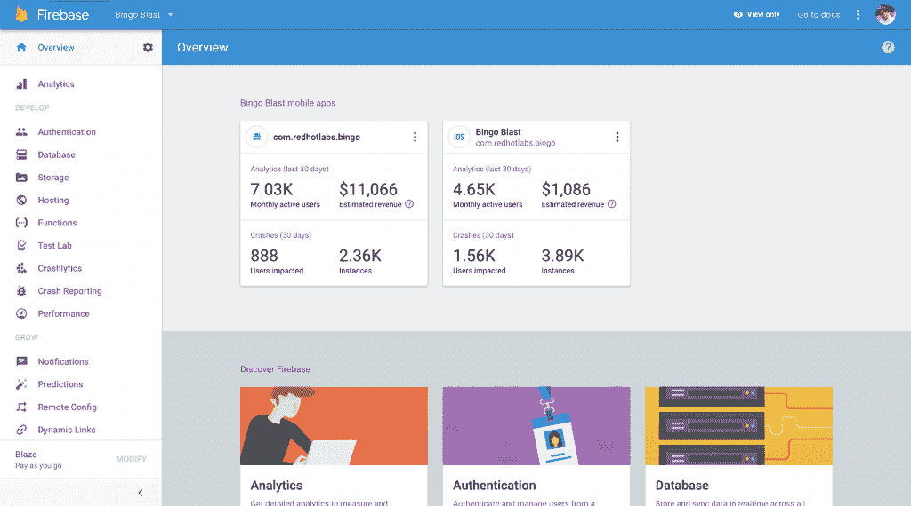
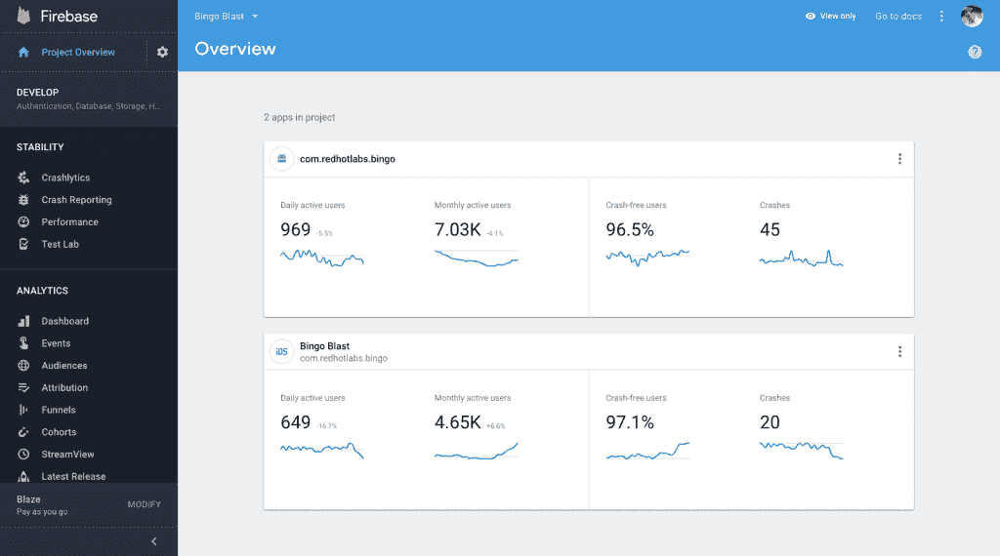
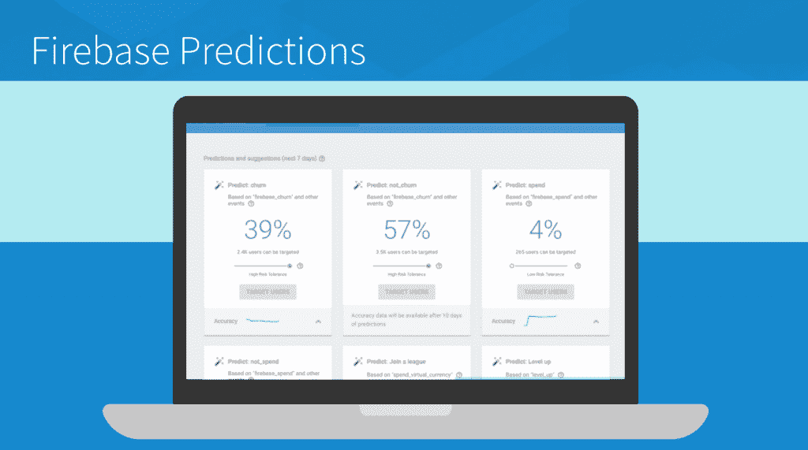
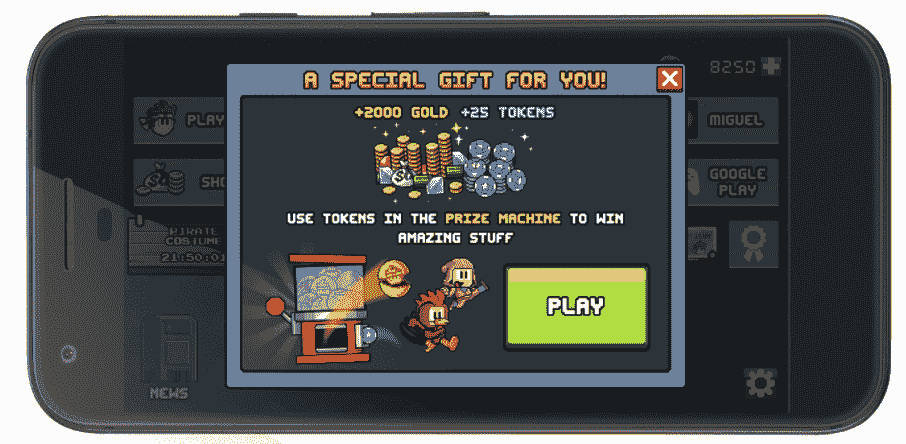

# 谷歌 Firebase 获得 Crashlytics，A/B 测试，基于人工智能的预测建模

> 原文：<https://thenewstack.io/firebase-suite-google-fires-new-mobile-dev-powers/>

本周，在阿姆斯特丹举行的第二届 [Firebase Dev 峰会上，谷歌推出了一系列强大的新功能和特性，这些功能和特性刚刚添加到统一移动开发平台中——包括谷歌的人工智能功能。](https://firebase.google.com/dev-summit-17/) [Firebase](https://firebase.google.com/) 的用户界面也进行了彻底改革，其控制台经过重新设计，以逻辑方式组织产品和信息，旨在帮助开发者快速找到他们需要的东西。

2014 年谷歌收购 [Firebase](https://firebase.google.com/) 时，该平台拥有 11 万用户；到 2017 年，Firebase 已经突破了 100 万用户大关。Firebase 是谷歌云服务和技术的一个便捷组合平台，集成到一个平台中，旨在解决开发者在应用开发周期的每个阶段通常会遇到的挑战。

“在过去的 18 个月里，我们一直致力于将 Firebase 的工具集深度集成到许多不同的产品中，”Firebase 项目经理 Francis Ma 在接受 TNS 采访时说。“我们敏锐地意识到，开发人员在应用的整个生命周期中不会只使用一种工具，他们会使用许多不同的工具。当这些工具连接在一起并紧密合作时，开发人员可以跳过重新发明轮子，只需专注于快速构建优秀的应用程序。”

## 碰撞分析

可能最重要的增加是添加了 [Crashlytics](https://try.crashlytics.com/) ，这是 Twitter 首次作为其移动开发应用程序结构套件的一部分构建的“同类最佳”崩溃报告系统。([2017 年 1 月谷歌收购 Fabric](https://techcrunch.com/2017/01/18/google-twitter-fabric/))。Crashlytics 是一个强大的响应工具，允许开发人员实时识别和解决影响应用稳定性的稳定性问题。

但除了简单地将 Crashlytics 添加到 Firebase 工具平台，谷歌团队还努力将其集成到该平台的其他实用程序中。马说，首先，用户将能够使用 Crashlytics 来触发谷歌云功能，以及定制工作流程。比如设置推送通知，让你只听到影响关键应用程序功能的稳定性问题，而不是不断轰炸小问题。

谷歌将在接下来的几个月里推出这一整合，不过好奇的人可以现在就查看测试版。

## 重新设计的控制台

将 Fabric 的功能集成到 Firebase 中是更新 Firebase 用户界面的及时机会。

Firebase 团队的重新设计部分基于新加入的 Fabric 团队的“经验教训”以及用户研究的反馈。“我们了解到，当开发者来到 Firebase 控制台时，他们通常会寻求相同的指标:日活跃用户数、月活跃用户数、无崩溃用户率和总崩溃数，”马解释说。“因此，我们将这四个应用程序放在项目中的最前面和最中心位置，此外，我们还添加了迷你图，直观显示您的应用程序随时间变化的趋势。”

主导航栏也被重组为“产品概述”屏幕，根据应用程序开发生命周期将 Firebase 产品分为四个主要领域:开发、稳定性、分析和增长。自然地，开发与编码和构建应用程序相关的集群工具，比如数据库和认证工具。稳定性类别包含帮助监控用户崩溃的工具，同时提供全面的应用性能指标。

“作为用户，我们总是在野外，在现实世界中发生这些崩溃，而不仅仅是在我们的办公室 wifi 上，”马说。“因此，稳定性类别比以往任何时候都更深入，有助于您从每个技术角度真正了解应用性能。”

新改进的分析仪表板现在将与谷歌分析完全集成。一个新的特性是“实时卡”,使开发人员可以一目了然地看到实时的性能数据。例如:“我们从 Fabric 团队了解到，对于移动应用开发者来说，当他们发布新版本时，与上一版本相比，事情发生了重大变化，这是一个关键时刻，”马说。“因此，我们创建了一个专用的实时视图，来显示用户从旧版本更新到新版本时的情况。”

Firebase 分析仪表板，之前…

Firebase 分析仪表板，之后。

“指定你发布的时刻，Firebase 可以立即告诉你你的发布是否影响了你的活跃用户群，以及他们是否遇到了崩溃，”马补充道。

新产品概述面板中的最后一个类别称为 Grow，致力于推动更好的用户参与和保留的工具，并“在获得实际结果的同时，将一些艺术转化为现实”

举例来说，马说，对一个实时移动应用的用户界面进行微调，以确保用户对你的应用保持关注，这可能很棘手。Firebase Grow 现在提供远程配置等工具，允许开发人员远程更改他们的应用程序，以测试不同的应用程序体验。“比如说你让按钮标签成为你配置的一部分，”马解释道。“现在，您可以远程将 diff 配置推送到您的应用程序，更改按钮标签或测试 diff 用户注册流程，作为远程调整用户体验和测量响应的一种方式。”

## 信息发送

Firebase 云消息传递(FCM)从一开始就是平台的一部分，允许开发人员通过 Firebase 控制台(如果需要，也可以通过编程方式)向用户发送消息。然而，发送跨平台通知是复杂的，有时需要重复创建多个单独的消息。新升级的 Firebase [现在提供了一个新的 RESTful，FCM HTTP v1 API](https://firebase.google.com/docs/cloud-messaging/send-message) ,使得向跨平台应用程序发送消息更加安全和容易。新的 FCM API 将特定于平台的字段统一在一个通知中。例如，马说，“现在你可以向 iOS 发送一个简单的文本通知，但向 Android 发送一个带有 click_action 的请求——所有这些都在一个 API 调用中。”

## A/B 测试框架

除了 FCM，另一个推动用户参与和保持的强大工具是远程配置。到目前为止，在 Firebase 中使用远程配置或 FCM 运行变体测试都必须手动完成。用户反馈非常明确，移动开发人员想要一种更快、更简单的方法来测试不同的应用变体或推送通知消息如何影响他们应用的关键业务指标。

因此，推出了 A/B 测试，这是一个新的 Firebase 功能，集成了分析、FCM 和远程配置。“这是建立在统计引擎和多年来从[谷歌优化](https://www.google.com/analytics/optimize/)——我们的免费网站测试和个性化产品——的学习基础上的，使得直接从 Firebase 控制台设计和部署实验变得很容易，”马说。

马说，建立 A/B 测试既快又简单。您可以使用远程配置或 FCM 创建一个实验，定义不同的变量值和群体大小进行测试，然后设置实验目标。接下来，Firebase 会处理剩下的事情，自动运行实验，然后让你知道什么时候会出现“统计意义上的赢家”。A/B 测试仍在测试阶段；点击这里，了解更多信息并[开始进行 A/B 测试。](https://firebase.google.com/docs/remote-config/abtest-config)

## 火情预测

Firebase Predictions 是该平台迈向未来的最大一步，也可以说是最令人兴奋的一步。“这是将谷歌的人工智能技术引入 Firebase 的第一步，”马说。“预测采用谷歌的机器学习，并将其应用于你的分析数据，以预测用户将在你的应用中采取的行动。”

Predictions 与 Firebase 的其他部分(分析、云消息、远程配置和 A/B 测试工具)紧密集成，以根据分析数据预测的行为自动创建动态用户组。

开箱即用，它将产生四个用户群:那些预计将与你的应用保持接触；那些预计在未来七天内流失(离开，甚至删除应用程序)的人；那些预计在未来七天内会花钱的人，以及那些预计不会花钱的人。

“您可以使用 FCM 中的 Remote Config and notifications composer 将这些预测用于目标定位，让您能够只向预测不会在您的应用中花钱的用户显示广告，或者向预测会流失的用户发送通知，”Ma 解释道。

简而言之，预测允许开发者预测用户可能离开，并采取措施留住他们。

在现实世界中展示预测的力量时，以应用商店主要产品水果忍者和 JetPack Joyride 而闻名的游戏工作室 Halfbrick 在系统上进行了 alpha 测试，使用预测和远程配置在他们的应用 Dan the Man 中创建了一个用户保留活动。当用户准备离开游戏时，如果他们留在游戏中，他们会收到一个提供更多虚拟商品的游戏内促销。结果是戏剧性的:Halfbrick 将其 7 天用户保留率提高了 20%。

马说，欢迎有兴趣加入 Firebase alpha 项目的开发者加入。

谷歌 Firebase 提供了一个[三级定价模式](https://firebase.google.com/pricing/)。有一个免费的原型和爱好者层，一个 25 美元的固定价格模型用于可预测的工作负载，以及用于大规模使用的商品价格。

谷歌是新堆栈的赞助商。

<svg xmlns:xlink="http://www.w3.org/1999/xlink" viewBox="0 0 68 31" version="1.1"><title>Group</title> <desc>Created with Sketch.</desc></svg>