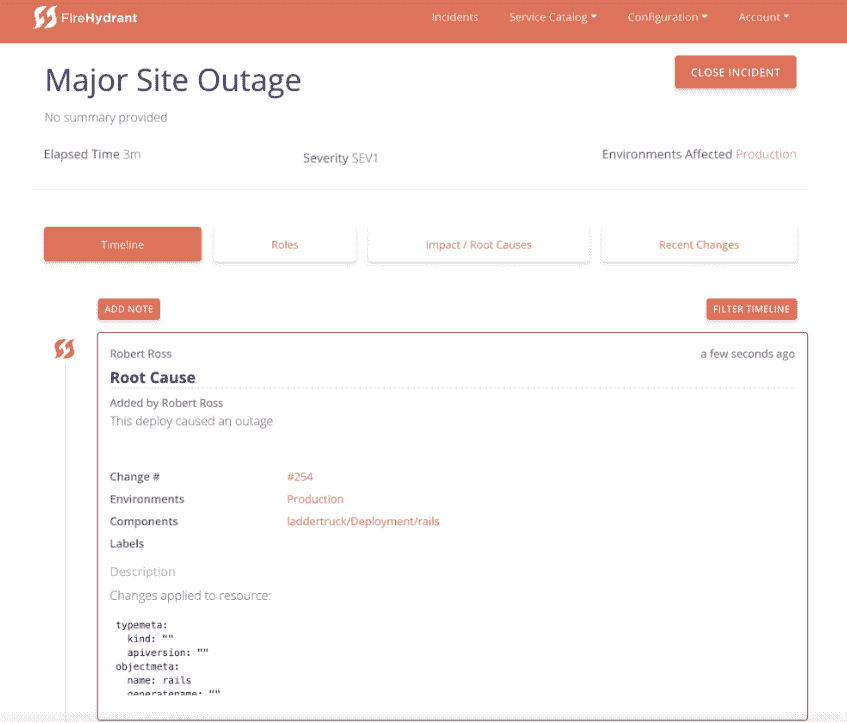

# 消防栓:管理事故，避免混乱

> 原文：<https://thenewstack.io/firehydrant-managing-incidents-without-the-chaos/>

像许多初创公司一样，当一名开发人员开始构建他希望拥有的工具时，事件管理工具[消防栓](https://www.firehydrant.io/)出现了。

[鲍比·罗斯](https://github.com/bobbytables)在人力资源软件初创公司[即](https://www.namely.com/)担任网站可靠性工程师。它是 Kubernetes 的早期采用者，并使用了其他相当新的开源工具，如 [Spinnaker](https://github.com/spinnaker/spinnaker) ，这导致了频繁的事件。

“我们没有关于基础架构变更的审核日志。因为 Kubernetes 太新了，所以在转向 Spinnaker 之前，我们基本上是手工部署到 Kubernetes 的，”Ross 解释道，他也被称为 [Bobby Tables](https://xkcd.com/327/) 。

“这是一个问题，因为我们不知道什么时候产品会真正投入生产。因此，一个应用程序团队会将某个产品投入生产，而 SRE 会收到一个页面，显示某个产品刚刚损坏。我们不知道有东西刚刚投入生产，我们只知道有东西刚刚下线。”

他说，消防栓利用这些较新的技术，让人们跟踪他们系统中发生的一切——配置变化或其他——并使用这些信息来帮助人们更快地解决问题，因为他们不需要做大量的研究来找出刚刚发生了什么变化。

### 驯服混乱

这家总部位于纽约的公司，包括联合创始人丹尼尔·康多米蒂和迪伦·尼尔森，最近从 Work-Bench 筹集了 150 万美元的种子资金。其团队曾在 DigitalOcean、CoreOS 和 Paperless Post 等公司担任现场可靠性工程师。

Work-Bench 的负责人在一篇[博客文章](https://medium.com/@v1p1n/announcing-our-investment-in-firehydrant-3fd88e9b2aa7)中写道:“虽然当前的监控和警报工具起到了烟雾报警器的作用，但在使用现场可靠性工程最佳实践来阻止火灾并提供可操作的情报以防止火灾发生方面，自动化事故后工作流程存在差距。”。

消防栓现在就像是其他公司之间的维恩图，每个公司都有一点重叠，包括[的 page duty](https://www.pagerduty.com/)； [OpsGenie](https://www.opsgenie.com/) ，被 [Atlassian](https://www.atlassian.com/) 收购；罗斯说，无可指责的 T10 是它最接近的竞争对手。

消防栓帮助您找出事故中发生了什么，以及在哪里寻找问题，然后进行事后分析，找出到底发生了什么，以努力防止这种情况再次发生。

罗斯在产品发布会上的一篇博客文章中写道:“我参与了几起救火事件——从生产数据库被丢弃到 Kubernetes 升级出错——每个事件都有一个共同的主题:绝对混乱。”。

Chamakkala 这样描述消防栓:

“消防栓方法的关键是它如何通过监控部署来跟踪和追踪变化，然后将您指向问题开始的区域。在此基础上，该工具根据 FEMA 的事件指挥官框架自动分配角色和任务，该框架用于解决现实生活中的紧急情况，并已得到证明。最后也是最重要的一点，该平台允许您通过分析和简单的事后分析流程从停机中吸取教训。这一过程确定了根本原因，从而允许团队做出必要的修正，并帮助管理人员了解他们系统的整体可靠性。”

它允许用户创建团队，并将他们负责的组件链接到这些团队。团队也可以完全被分配到特定的事件。

它与 Slack 完全集成[，允许用户快速轻松地创建事件沟通的渠道，这些渠道会被记录下来供以后查看，还有 GitHub 和 Kubernetes。](https://medium.com/firehydrant-io/slack-for-incidents-6b99da0eb81?ref=producthunt)

### 集成就绪

Ross 说，该团队已经采取了 API 优先的开发方法。

**"** 我们正努力打造一个高度集成的系统。我们所有的代码都是基于这样一个概念构建的，即我们将在某个时候进行其他集成。我们正在内部构建我们所有的集成，但是我们所有的 API 都是公开的[[在 GitHub](https://github.com/firehydrant)上]。基本上，如果你想建立我们的用户界面，你有这个选择，”他说。

开源项目是将呼叫总部并向消防栓发送关于您的基础设施的信息的部分。

“如果你使用开源工具向我们发送信息，它会变得更加强大，但如果你只想将它用于事故管理——作为一个指挥中心——你可以，”他说。

“一旦发生事故，你就可以建立一个指挥中心。假设你的网站瘫痪了。我们的软件将引导您完成在产品中设置的过程。如果你说，“我希望这些类型的人对某个事件做出反应，”我们会引导你完成这个过程。这个服务，这个团队。自动通知那些人在懈怠和电子邮件。以下是您应该了解的详细信息，以下是您应该加入的帮助解决此问题的指挥中心。”

它不依赖于监控工具，但它与 PagerDuty 完全集成，可以直接从这些警报中触发事件。

它提供了系统中所有更改的完整审计日志，使用户能够看到受影响的环境和服务，并确保每个团队知道他们需要做什么。

对于事后鉴定，它提供统计数据，如您的事件通常开放多长时间，以帮助用户了解哪些服务可能有问题，以及哪些团队最有效地灭火。

通过 Pixabay 的特征图像。

<svg xmlns:xlink="http://www.w3.org/1999/xlink" viewBox="0 0 68 31" version="1.1"><title>Group</title> <desc>Created with Sketch.</desc></svg>