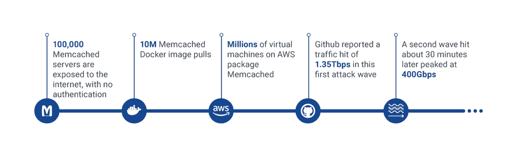

# 为什么防火墙不能抵御 Memcache DDoS 攻击

> 原文：<https://thenewstack.io/firewall-cant-protect-memcache-ddos-attack/>

 [尼赞·尼夫

尼赞·尼夫是软件行业 20 年的老兵。他目前是 Alcide 的系统架构师，并领导其安全性研究。此前，他在 Imperva 工作了八年，创建了内部 web 应用程序安全研究平台，并参与了各种 Web 应用程序防火墙研究项目和出版物。他拥有 Technion 以色列理工学院的计算机科学硕士学位、系统工程硕士学位和计算机工程学士学位。](https://www.alcide.io/) 

几天前，来自 [Akamai](https://blogs.akamai.com/2018/02/memcached-udp-reflection-attacks.html) 、Cloudflare 和 [Incapsula](https://www.incapsula.com/blog/inside-new-ddos-amplification-attack-vector-via-memcached-servers.html) 的安全研究人员报告称，他们观察到了一次大规模的分布式拒绝服务(DDoS)攻击。该攻击通过 Memcached 服务器使用了一种新的 DDoS 放大攻击媒介。攻击的目标之一是开发者平台 [GitHub](https://githubengineering.com/ddos-incident-report/) ，它报告了每秒 1.35 太比特的流量——这是迄今为止记录的最强大的 DDoS 攻击。

与之前大型 DDoS 攻击中使用的更常见的僵尸网络攻击不同，例如 2016 年针对 DNS 提供商 [Dyn](https://dyn.com/blog/dyn-analysis-summary-of-friday-october-21-attack/) 和法国电信 [OVH](https://www.ovh.com/world/a2367.the-ddos-that-didnt-break-the-camels-vac) 的攻击，Memcached DDoS 攻击不需要大型恶意软件驱动的僵尸网络来启动破坏性流量。相反，攻击者利用 Memcached，这是一种合法且流行的缓存组件，用于加速大规模 web 应用程序和数据库。

在正常的使用场景中，应用程序在 Memcached 服务器上存储小的信息包，并在请求时检索它们。DDoS 攻击利用了一个鲜为人知的 Memcached 功能——它通过 UDP 进行通信的能力——结合了 Memcached 服务器的不安全默认配置和互联网上大量的服务器部署(估计约 93，000 个)，而没有对进出 UDP 连接进行足够的安全保护。

图 numbers 中的 Memcached

攻击者首先像正常使用一样在 Memcached 服务器上存储信息。然后，他或她定期向其发送数据请求，这些请求是特制的，就好像是从攻击的目标受害者处发出的一样(称为“IP 欺骗”)。来自服务器的响应(通过 UDP 从端口 11211 发送)大约是攻击者请求的 51，000 倍。结果是，只需很少的努力和资源，攻击就能使被利用的 Memcached 服务器向受害者发送大量流量，目的是破坏他们的网络容量并关闭它们(至少暂时关闭)。在技术术语中，这种类型的攻击被称为“DDoS 反射攻击”

这种攻击依赖于攻击者向 Memcached 服务器发送恶意数据请求的能力、被滥用的 Memcached 服务器的配置(使其能够监听和响应此类请求),以及受害者通过从正常的传入 Internet 流量中识别和丢弃破坏性流量来减轻攻击的难度。当然，可以解决这些依赖关系中的每一个来防止攻击。显然，使用 Memcached 的组织不应该将这些服务器暴露在互联网上，因为它们可能会被外部攻击者滥用。相反，他们应该将它们部署在阻止访问 UDP 端口 11211 的防火墙后面。

## 现代数据中心的角度:你可能仍然是受害者

这个情节有一个关键的转折还没有被讨论。在现代数据中心中，在数据中心外围使用防火墙来保护 Memcached 服务器等内部服务免受外部滥用(即来自互联网的攻击)是不够的。

近年来，数据中心发生了变化。现在，它由许多复杂的分布式应用程序和数百个微服务组成，这些微服务使用 Docker 容器、虚拟机和裸机服务器等虚拟化技术的混合进行部署。如果这些应用程序或微服务中的任何一个受到威胁，无论是外部攻击者在面向 web 的服务上获得立足点、恶意的内部人员，还是在安全控制松散的数据中心中意外部署的受感染应用程序组件，都可能被用来在数据中心内部或从数据中心发起针对外部目标的攻击。

> 据报道，大约有 93，000 台 Memcached 服务器暴露在互联网上，我们估计可能有更多的 Memcached 服务器运行在组织的数据中心内，这些服务器没有暴露在互联网上，但也不能防止内部滥用。

考虑一个数据中心，其中 Memcached 服务器部署在传统防火墙后面，看起来很安全。如果恶意软件获得了对数据中心网络的访问权，这些服务器仍然可能被滥用为 DDoS 的潜在来源，目标可以是外部受害者，也可以是数据中心的基础设施本身。

从数据中心内部发起攻击的可能性有多大？想想 Memcached 服务器在现代数据中心有多普遍。虽然据报道有大约 93，000 台 Memcached 服务器暴露在互联网上，但我们估计可能有更多的 Memcached 服务器运行在组织的数据中心内，这些服务器不暴露在互联网上，但也不能防止来自内部的滥用。例如，这一估计是基于这样一个事实，即官方的 Memcached docker 映像被拉了[超过 1000 万次](https://hub.docker.com/search/?isAutomated=0&isOfficial=0&page=1&pullCount=0&q=memcached&starCount=0)，并且 Memcached 被默认打包在[亚马逊的 Linux 发行版](https://aws.amazon.com/amazon-linux-ami/2017.09-packages/)中，该发行版被 AWS 上的数百万个虚拟机使用。

如果你需要知道…你会想知道的！

组织的安全团队是否知道数据中心中运行的每个 Memcached 服务器实例？鉴于现代基础设施的复杂性和动态变化的性质，了解在任何给定时间运行的内容是一项挑战。有多少内部 Memcached 服务器受到保护，免受数据中心内运行的恶意软件发送的恶意制作的 UDP 数据包的攻击，其目的是发起 DDoS 反射攻击？是否有良好的安全策略和强制机制来防止这些服务器发出 DDoS 数据包？

让我们假设组织完全了解驻留在数据中心的应用程序组件的海洋，以及严格的安全程序。此外，这些过程规定，只有当 Memcached 这样的服务对业务功能至关重要时，才在经过审查，并且其配置得到开发团队的批准之后进行部署。即使在这种乐观的情况下，安全人员仍然必须能够通过应用总体运行时安全策略和限制来确保基础设施的健康，这些策略和限制是指对这种服务的合法使用，以及应该阻止哪些流量。在虚拟工作负载、大规模和动态变化的背景下，这些策略和限制必须在数据中心内强制执行。

Alcide 是新堆栈的赞助商。

通过 Pixabay 的特征图像。

<svg xmlns:xlink="http://www.w3.org/1999/xlink" viewBox="0 0 68 31" version="1.1"><title>Group</title> <desc>Created with Sketch.</desc></svg>