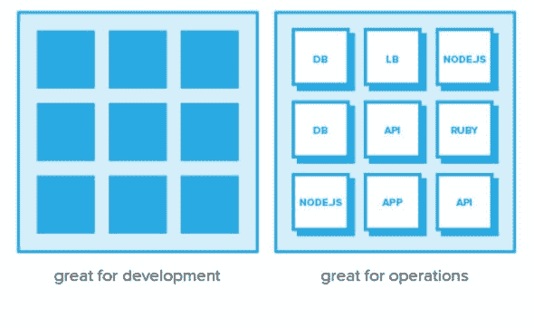
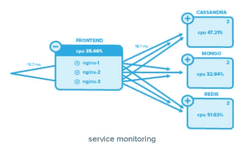
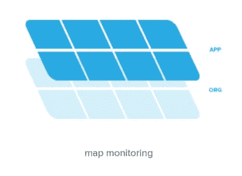

# 监控微服务的五大原则

> 原文：<https://thenewstack.io/five-principles-monitoring-microservices/>

 [洛里斯·德吉奥安尼，创始人&首席执行官，Sysdig

洛里斯·德吉奥安尼是 Sysdig 的首席执行官和创始人。他是流行的开源故障排除工具 Sysdig 和开源容器安全工具 Falco 的创造者。在创立 Sysdig 之前，洛里斯参与创建了 Wireshark，这是一款开源网络分析器，目前拥有 2000 多万用户。洛里斯拥有都灵理工大学的计算机工程博士学位，现居加州戴维斯。](https://sysdig.com) 

对微服务的需求可以用一个词来概括:速度。更快地交付更多功能和可靠性的需求已经彻底改变了开发人员创建软件的方式。毫不奇怪，这种变化在软件管理中引起了连锁反应，包括监控系统。在本帖中，我们将重点关注有效监控生产中的微服务所需的根本变化。我们将列出五条指导原则，让您的监控方法适应这种新的软件架构。

监控是微服务控制系统的关键部分，因为你的软件越复杂，就越难了解其性能和解决问题。然而，考虑到软件交付的巨大变化，监控需要彻底检查，以便在微服务环境中表现良好。本文的其余部分介绍了监控微服务的五个原则，如下所示:

1.  监控容器和里面的东西。
2.  提醒服务性能，而不是容器性能。
3.  监控具有弹性和多位置的服务。
4.  监控 API。
5.  将您的监控与您的组织结构对应起来。

利用这五个原则，您可以在迈向微服务的过程中建立更有效的监控。这些原则将允许您应对与微服务相关的技术变革，以及与之相关的组织变革。

## 微服务监控的原理

### 1.监控容器及其内部运行的内容

容器作为微服务的构建模块变得越来越重要。容器的速度、可移植性和隔离性使得开发人员很容易接受微服务模型。关于容器的好处已经写了很多，所以我们在这里就不一一赘述了。

对于周围的大多数系统来说，容器是黑匣子。这对开发来说非常有用，从开发到生产，从开发人员的笔记本电脑到云，都支持高度的可移植性。但是，当涉及到操作、监控和故障排除服务时，黑盒使常见的活动变得更加困难，这让我们不禁要问:容器中运行的是什么？应用程序/代码的性能如何？它是否会产生重要的自定义指标？从 DevOps 的角度来看，您需要深入了解容器内部，而不仅仅是知道一些容器的存在。

非容器化环境中的典型插装过程——一个驻留在主机或 VM 的用户空间中的代理——对于容器来说不太适用。这是因为容器受益于小的、隔离的、依赖尽可能少的进程。

此外，在大规模部署中，运行数千个监控代理，即使是中等规模的部署，也是一种昂贵的资源使用和编排噩梦。容器有两种潜在的解决方案:1)让开发人员直接检测他们的代码，或者 2)利用通用内核级检测方法来查看主机上的所有应用程序和容器活动。这里不做深入探讨，但每种方法都有利弊。

### 2.利用编排系统对服务性能发出警报

在集装箱化的环境中理解运营数据是一个新的挑战。单个容器的指标比组成功能或服务的所有容器的聚合信息具有更低的边际价值。

 [Apurva Dave，Sysdig 营销副总裁

Apurva 是 Sysdig 的营销副总裁。二十年来，他一直在帮助人们分析和加速基础设施。他之前在 Riverbed 从事 WAN 加速和网络分析产品，在 Inktomi 从事基础设施产品。他拥有布朗大学的计算机科学学位和加州大学伯克利分校的 MBA 学位。](https://sysdig.com) 

这尤其适用于应用程序级别的信息，如哪些查询的响应时间最慢或哪些 URL 出现的错误最多，但也适用于基础架构级别的监控，如哪些服务的容器使用的资源超过了分配给它们的 CPU 份额。

软件部署越来越需要一个编排系统来将逻辑应用程序蓝图“翻译”成物理容器。常见的编排系统包括 Kubernetes、Mesosphere DC/OS 和 Docker Swarm。团队使用编排系统来(1)定义您的微服务，以及(2)了解部署中每个服务的当前状态。你可能会认为编排系统甚至比容器更重要。实际的容器是短暂的——它们只在存在的短暂时间内有意义——而您的服务在其有用的生命周期内有意义。

DevOps 团队应该重新定义警报，以关注尽可能接近于监控服务体验的特征。这些警报是评估应用程序是否受到影响的第一道防线。但是获得这些警报是有挑战性的，如果不是不可能的话，除非您的监控系统是容器本地的。

[容器原生](https://techcrunch.com/2016/04/27/lets-define-container-native/)解决方案利用编排元数据来动态聚合容器和应用程序数据，并计算每个服务的监控指标。根据您的编排工具，您可能希望深入到层次结构的不同层。例如，在 Kubernetes 中，通常有一个名称空间、复制集、pod 和一些容器。无论组成服务的容器的物理部署如何，在这些不同的层进行聚合对于逻辑故障排除都是必不可少的。

### 3.为弹性和多位置的服务做好准备

弹性服务当然不是一个新概念，但是在容器原生环境中的变化速度要比虚拟化环境快得多。快速变化的环境会对脆弱的监控系统造成严重破坏。

频繁监控遗留系统需要基于软件的单独部署来手动调整指标和检查。这种调整可以具体到定义要捕获的单个指标，或者基于特定容器中运行的应用程序来配置收集。虽然在小范围内(想想几十个容器)这可能是可以接受的，但在任何更大的范围内这将是无法忍受的。以微服务为中心的监控必须能够在无需人工干预的情况下，与弹性服务同步轻松扩展和收缩。

例如，如果 DevOps 团队必须手动定义一个容器包含在什么服务中以进行监控，那么他们无疑会犯错误，因为 Kubernetes 或 Mesos 会在一天中定期创建新的容器。类似地，如果在构建新代码并将其投入生产时，要求运营部门安装一个定制的 stats 端点，那么当开发人员从 Docker 注册表中提取基础映像时，可能会出现挑战。

在生产中，针对跨多个数据中心或多个云的复杂部署构建监控。例如，如果您的服务跨越您的私有数据中心和 AWS，那么 AWS CloudWatch 只能让您做到这一步。这就需要实现一个监控系统，该系统可以跨越这些不同的位置，并且可以在动态的容器本地环境中运行。

### 4.监控 API

在微服务环境中，API 是通用语言。本质上，它们是服务中向其他团队公开的唯一元素。事实上，即使没有正式的 SLA 定义，API 的响应和一致性也可能是“内部 SLA”。

因此，API 监控是必不可少的。API 监控可以采取多种形式，但是很明显，必须超越二进制 up/down 检查。例如，了解作为时间函数的最常用端点是很有价值的。这允许团队查看服务使用中是否有任何明显的变化，无论是由于设计变化还是用户变化。

您还可以考虑服务中最慢的端点，因为这些端点可以揭示重大问题，或者至少指出系统中最需要优化的地方。

最后，通过系统跟踪服务调用的能力是另一项关键能力。虽然通常由开发人员使用，但这种类型的分析将帮助您了解整体用户体验，同时将信息分解为您环境的基础架构和基于应用程序的视图。

### 5.将监控映射到您的组织结构

虽然这篇文章的大部分内容都集中在微服务和监控的技术转变上，但像任何技术故事一样，这不仅是关于软件的，也是关于人的。

对于那些熟悉康威定律的人来说，他提醒我们，系统的设计是由构建它们的团队的组织结构来定义的。创建更快、更敏捷的软件的诱惑促使团队考虑重组他们的开发组织和管理它的规则。

因此，如果一个组织想要从这种新的软件架构方法中受益，他们的团队必须自己镜像微服务。这意味着更小的团队，松散耦合；他们可以选择自己的方向，只要它仍然符合整体的需要。在每个团队中，对使用的语言、如何处理 bug，甚至是操作职责的控制比以往任何时候都多。

DevOps 团队可以启用一个监控平台，该平台可以做到这一点:允许每个微服务团队隔离他们的警报、指标和仪表板，同时仍然为运营提供全局系统视图。

## 结论

有一个明确的触发事件促成了向微服务的转移:速度。组织希望在更短的时间内向客户提供更多的功能。一旦发生这种情况，技术就介入了，体系结构向微服务的转移和向容器的潜在转移使得速度发生。任何挡在前进列车上的东西都会在铁轨上被碾死。

因此，监控的基本原则需要适应伴随微服务的底层技术和组织变化。认识到这种转变的运营团队可以更早、更容易地适应微服务。

<svg xmlns:xlink="http://www.w3.org/1999/xlink" viewBox="0 0 68 31" version="1.1"><title>Group</title> <desc>Created with Sketch.</desc></svg>