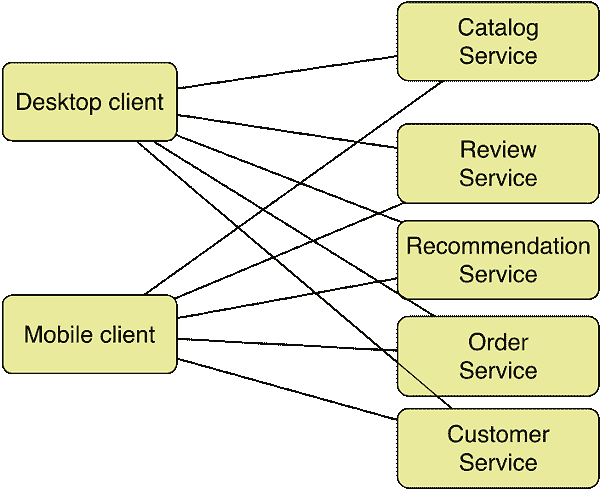
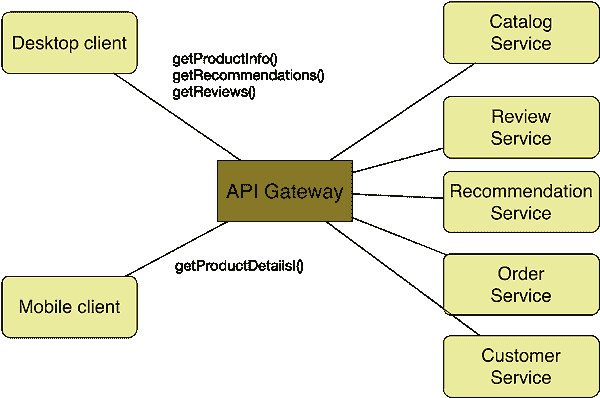
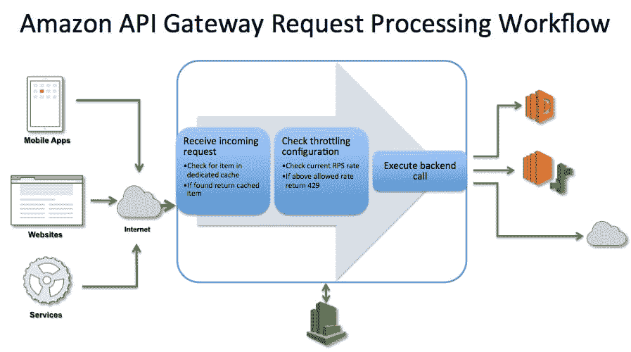
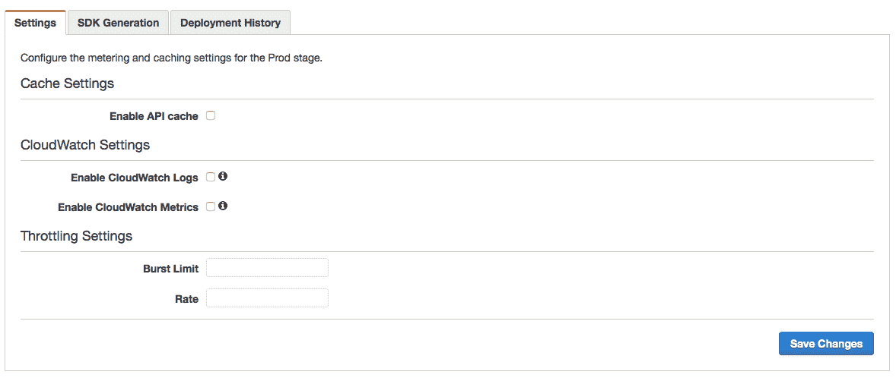
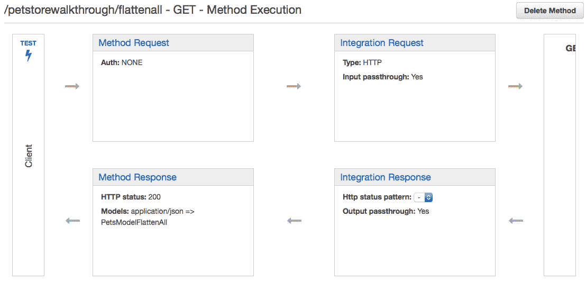
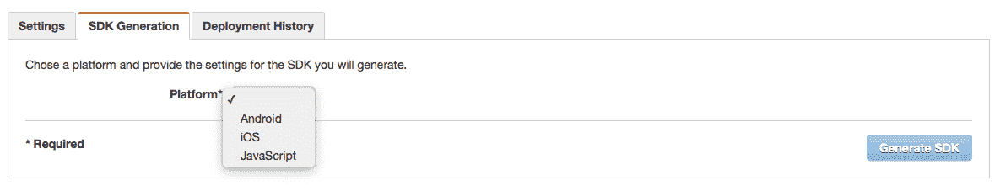

# 为您的下一个微服务项目考虑 Amazon API Gateway 的五个理由

> 原文：<https://thenewstack.io/five-reasons-to-consider-amazon-api-gateway-for-your-next-microservices-project/>

在过去的几年里，多语言编程已经成为事实上的标准。开发人员开始选择最好的语言、框架和运行时来编写他们的代码。最初，是平台即服务(PaaS)产品，如 Heroku、Engine Yard、Cloud Foundry 和 OpenShift，鼓励开发人员构建多语言应用和服务。

感谢 Docker，作为新微服务现象的一部分，设计、开发和部署多语言代码变得更加简单。不仅仅是服务——甚至微服务的消费者也通晓多种语言。用当代 JavaScript 框架构建的 Web 应用，如 AngularJS 和 BootstrapiOS 和 Android 中开发的原生移动应用；物联网应用消耗多语言[微服务](https://thenewstack.io/microservices-vs-monoliths-an-operational-comparison/)。这种模式的关键使能因素是 API 层，它充当连接服务和消费者的粘合剂。

API 已经成为应用程序设计不可或缺的一部分。架构师和开发人员在设计 API 层上花费了大量时间。网飞——多语言服务和 API 的早期采用者之一——[分享了在他们的服务架构中实现 API 层的一些优势](http://techblog.netflix.com/2013/01/optimizing-netflix-api.html)。Chris Richardson，原始 Cloud Foundry 的创始人，微服务专家，[阐述了](http://www.infoq.com/articles/microservices-intro) [API 网关模式](http://microservices.io/patterns/apigateway.html)的重要性。据 Chris 称，API 网关不仅优化了客户端和应用程序之间的通信，还封装了微服务的细节。

[在](http://www.infoq.com/articles/microservices-intro)实现 API 网关**之前:**

[在](http://www.infoq.com/articles/microservices-intro)实现一个 API 网关 ****:**** 

甚至在微服务和物联网之前，API 生命周期管理已经成为应用管理的重要组成部分。察觉到这一机会，3Scale、Apigee、Intel 和 Layer 7 等公司已经创建了企业级 API 管理平台。这个领域最近的进入者之一是 Mashape，它推出了开源 API 管理平台 [Kong](https://thenewstack.io/mashape-opens-kong-a-microservices-proxy-built-on-nginx/) 。公共云服务提供商已经开始将 API 网关作为服务公开。2013 年，微软[收购了](http://azure.microsoft.com/blog/2013/10/23/microsoft-acquires-apiphany/)一家位于华盛顿州 DC 的初创公司，名为 Apiphany，最终成为 [Azure API Management](http://azure.microsoft.com/en-us/services/api-management/) 。虽然不是一个成熟的 API 管理服务，谷歌也通过[云端点](https://cloud.google.com/appengine/docs/java/endpoints/)涉足 API，这是一个暴露部署在 App Engine 上的服务的层。随着 [API Gateway](http://aws.amazon.com/api-gateway/) 的推出，亚马逊正式进入了拥挤的 API 管理工具市场。

尽管许多人认为它来晚了，但 API Gateway 在亚马逊的 PaaS 战略中发挥着重要作用。在我最近发表在《福布斯》上的一篇文章中，我[讨论了](http://www.forbes.com/sites/janakirammsv/2015/07/16/paas-vendors-watch-out-amazon-is-all-set-to-disrupt-the-market/)AWS 如何通过其 NoOps 方法颠覆 PaaS 市场。Joe Emison 在他的文章[中分享了一个略有不同的观点，即亚马逊网络服务为什么没有成功以及它带来的问题](https://thenewstack.io/amazon-web-services-isnt-winning-problems-poses/)。

AWS 客户可以以多种形式实现 API Gateway。他们可以推出运行第三方 API 管理平台(如 3Scale 或 Intel Mashery)的 AMI。为了更好地控制，DevOps 团队还可以在 EC2 上配置 Mashape Kong，运行在弹性负载平衡器之后。但是 API Gateway 对于开发者和 DevOps 团队来说有着独特的优势。尤其是如果他们正在 AWS Lambda 和 Amazon EC2 容器服务上实现微服务。与企业 API 管理平台相比，AWS 产品可能缺少一些特性。但这是一项 V1 服务，亚马逊有发送 MVP 的传统，并在每次迭代中让它变得更好。就个人而言，我并不担心 API 的供应商锁定，因为它们可以在其他平台上实现，而不会对客户端造成太大的干扰。我试图在 AWS 上部署微服务的背景下强调 Amazon API Gateway 的功能。

尽管 Amazon API Gateway 可能并不适合所有场景，但对于在 AWS 上有大量投资的组织来说，它是一个极好的解决方案。使用 Amazon 的 ALM 服务(如 CodeCommit、CodeDeploy 和 CodePipeline)的团队会发现集成起来非常容易。最后，如果你正在开发一个基于 Lambda 的微服务应用，API Gateway 将成为你的服务的监护人。

资料来源:http://aws.amazon.com/api-gateway/details/

## 1.云中的弹性、自助服务和按使用付费的 API 外观

像大多数 AWS 服务一样，Amazon API Gateway 是开发人员和管理员的自助服务工具。不用启动 EC2 实例，安装和配置网关软件，开发人员可以使用 API Gateway 立即投入使用

API 管理层非常类似于 web 工作负载。它大多是无状态的，需要进行负载平衡才能扩展。定制解决方案需要 ELB 和 EC2 实例的组合。API Gateway 具有弹性，无需手动配置即可动态扩展和扩展。每百万次 API 调用收费 3.50 美元，该服务是市场上负担得起的网关之一。开发人员只需点击鼠标，就可以在几分钟内为他们现有的后端实现一个 API 网关。

## 2.与 AWS Lambda、IAM 和 AWS 服务集成

亚马逊正朝着创建无服务器后端基础设施的方向前进。Cognito、DynamoDB、RDS、Directory Services 等服务希望开发人员点击鼠标，而不是提供 EC2 实例。AWS Lambda 是朝着这个方向迈出的一大步。开发人员可以创建独立的、无状态的、自治的代码片段，这些代码片段将在运行时进行编排。在 API Gateway 推出之前，Lambda snippets 仅限于一组由 S3、SNS、Kinesis 和 DynamoDB 等服务引发的预定义事件。开发人员不能通过 REST 端点按需调用他们的代码。通过使 API Gateway 成为 AWS Lambda 的前端，亚马逊实现了一个杀手级场景。开发人员可以将他们的代码和数据带到 AWS 并配置整个堆栈，而无需启动虚拟机。这种集成实现了真正的 NoOps 平台。

除了 Lambda，API Gateway 还集成了 IAM 以保证安全性。通过这个，开发者可以授权访问他们的 API。还可以生成定制的 API 键，与需要直接调用的客户机共享。所有对 Amazon API Gateway 的 API 调用都记录在 cloud trail(AWS 审计跟踪服务)中。这包括创建、修改、删除或部署 REST APIs 的 API。

API 网关可以成为现有 AWS 服务端点的代理。开发人员可以混合和匹配 EC2、Lambda、Elastic Beanstalk 和 EC2 容器服务中托管的自定义 API 后端，以及 Salesforce、Twilio 和 Twitter 等第三方 API。这一层成为所有入站 API 调用的统一前端。

## 3.API 日志记录、缓存、节流、突发和监控

开发人员可以配置缓存来提高性能，而不是每次客户端调用都调用后端 API。缓存设置允许开发人员控制缓存键的构建方式以及为每个方法存储的数据的生存时间(TTL)。可以调用管理 API 来使缓存无效。此功能的[定价](http://aws.amazon.com/api-gateway/pricing/)基于高速缓存的大小。

开发人员需要保护他们的后端 API 不被故意误用。他们可能还想限制调用 API 的速率。通过节流，可以设置 API 请求的速率限制，以避免突然的高峰。API Gateway 还可以配置为处理特定场景的 API 调用突发。当客户端由于限制而收到 429 HTTP 响应时，它们可以包含自动重试逻辑。通过正确配置缓存和节流，开发人员可以在保护后端 API 的同时提高性能。

由于 API Gateway 是应用程序的一个关键元素，因此需要监控它的正常运行时间。对于自定义网关，管理员需要配置结合代理的本机监控。Amazon API Gateway 与 CloudWatch 集成，cloud watch 是所有 AWS 服务的一站式监控服务。通过配置对 CloudWatch 日志具有写访问权限的 IAM 角色，可以针对各种指标对 API Gateway 进行监控。

配置缓存、日志记录、监控和节流

## 4.API 生命周期管理

API facade 成为需要与 CI/CD 管道集成的应用程序的重要元素。API Gateway 支持可以与应用程序的其余部分保持一致的分段和版本控制。

例如，开发人员可以拥有用于测试、试运行和生产阶段的专用端点。API 的每个版本都可以与一个自定义域相关联。一个 管理员可以切换多个版本，同时保持自定义域和端点不变。这使得轻松回滚 API 版本成为可能。A/B 测试和蓝/绿部署也可以利用这一特性。通过管理 API，DevOps 可以将 API 网关与 CI/CD 管道集成在一起。

## 5.有效载荷建模和转换

API Gateway 的高级特性之一是有效负载建模和转换。这让开发人员有机会在请求和响应周期中修改 JSON 模式。通过定义一个模板，请求和响应负载可以被转换以反映一个定制的模式。这对于将来自多个来源的输出聚合到一个 JSON 有效负载中特别有用。虽然 API Gateway 不支持从 [RAML](http://raml.org) 导入和导出 API 定义，但是它有一个[工具可以从 Swagger](https://github.com/awslabs/aws-apigateway-swagger-importer) 导入。Swagger 定义可以包括指向将用于有效载荷建模的模板的指针。

转换 JSON 有效负载

## 额外收获:本机代码生成

使用 API Gateway 的主要优势之一是能够为客户端生成原生 SDK。一旦部署了 API，开发者就可以为 Android、JavaScript 和 iOS 生成 SDK。将来可能会支持其他平台，如 Apache Cordova、Xamarin 和 Windows Phone。

本机代码生成

## 摘要

亚马逊 API Gateway 可能无法与 3Scale、Apigee、CA、Intel、MuleSoft 和 Akana 等成熟的企业产品相媲美。但它确实通过一个简单但实用的服务迎合了 AWS 开发者。像大多数其他 AWS 服务一样，API Gateway 将在一段时间内变得成熟。它可能并不完美，但对于在 AWS 上实现微服务的开发人员来说，这是一个很好的起点。

<svg xmlns:xlink="http://www.w3.org/1999/xlink" viewBox="0 0 68 31" version="1.1"><title>Group</title> <desc>Created with Sketch.</desc></svg>