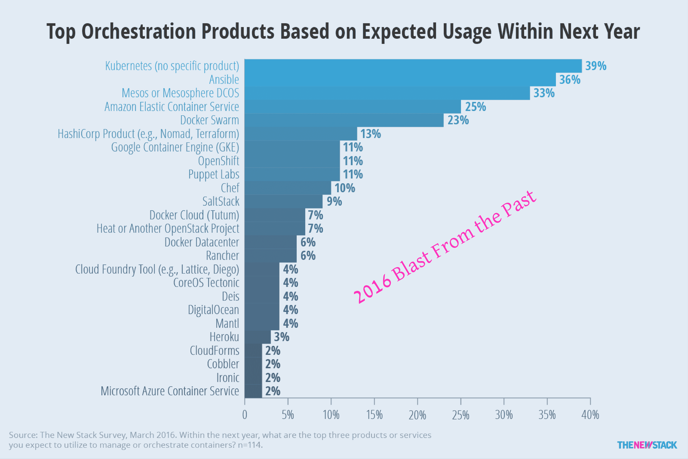

# 5 本书出版了 5 年

> 原文：<https://thenewstack.io/five-takes-from-five-years-of-publishing/>

2019-07-18 10:09:50

5 本书出版了 5 年

研究，

# 5 本书出版了 5 年

每周我们都会分析数据，以更好地了解 at scale 开发、部署和管理的复杂性。为了庆祝新书库的五周年纪念日，我们重新分享了五本电子书中使用的数据集。以下是我们与读者分享的几点心得:

Jul 18th, 2019 10:09am by [Lawrence E Hecht](https://thenewstack.io/author/lawrence-hecht/ "Posts by Lawrence E Hecht")

每周我们都会分析数据，以更好地了解 at scale 开发、部署和管理的复杂性。为了庆祝新书库[五周年](/going-to-oscon-lets-party-at-the-new-stacks-5th-birthday-gig/)，本周，我们重新分享了在我们的五本电子书中使用的[数据集](https://drive.google.com/open?id=1fsPc30tsOIIEPyd19IWX8asFaB19aT1d) *(选择文件>下载为)*。以下是我们与读者分享的几点心得:

1.  ****使用公司数量来衡量开源健康:**** 研究人员已经确定，来自少数个人或少数公司的高度集中的贡献表明项目长期成功的可能性较低。我们确定了一个受 Docker 启发的新变量——鲸鱼因子——来描述有多少贡献者来自少数几家公司。在分析时，58%的 Docker 贡献来自 Docker，Inc .,而该公司只雇佣了 9%对项目有贡献的实际员工。我们认为有更多利益相关者(公司)的项目更有可能是可持续的。(参见“[应用和微服务与 Docker &容器”](/ebooks/docker-and-containers/applications-microservices-docker-containers/)的第 52 页)
2.  **Kubernetes by a Mile:**2016 年初，Kubernetes 是 [309 名调查对象](https://thenewstack.io/tns-research-present-state-container-orchestration/)的计划中最常提及的编排工具。该研究还发现，58%的人认为，对于 container orchestrator 工具来说，为开发人员和 it 运营人员提供集成工具是极其重要的。
3.  **商业 Kubernetes 的早期:**"[Kubernetes 生态系统的状态"](https://thenewstack.io/ebooks/kubernetes/state-of-kubernetes-ecosystem/)用户调查发现，只有 45%的 Kubernetes 用户拥有至少部分来自供应商的解决方案。托管的 Kubernetes 服务要获得相当大的吸引力还需要一年或更长的时间。
4.  **关注中国的 Kubernetes:**使用云计算原生计算基金会调查的数据，我们发现[的中国受访者](https://thenewstack.io/this-week-in-numbers-chinese-adoption-of-kubernetes/)认为可靠性是或将是部署容器的挑战的可能性是其他受访者的两倍。一年半后， [21%的 Kubernetes 认证的](https://thenewstack.io/add-it-up-china-uses-open-source-to-deliver-cloud-services/)服务提供商位于中国。
5.  **AWS Lambda 不是唯一的展会:**2018 年，我们发现虽然 AWS Lambda 是使用最多的 FaaS 平台，但其他云提供商的产品可能会受到关注。阅读我们的“[无服务器技术指南](https://thenewstack.io/ebooks/serverless/guide-to-serverless-technologies/)”，了解更多有关 608 名参与者调查的信息

云计算原生计算基金会是新堆栈的赞助商。

<svg xmlns:xlink="http://www.w3.org/1999/xlink" viewBox="0 0 68 31" version="1.1"><title>Group</title> <desc>Created with Sketch.</desc></svg>

TNS 的所有者 Insight Partners 是新堆栈 Docker 的投资者。

新的堆栈更新一份时事通讯摘要，对本周最重要的新闻进行分析&。

新的堆栈不会出售您的信息，也不会与无关的第三方共享。如果继续，您同意我们的

[Terms of Use](/terms-of-use/)

和

[Privacy Policy](/privacy-policy/)

.