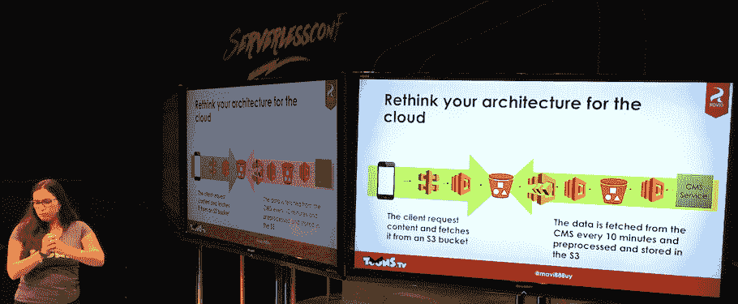

# 在企业中建立无服务器团队的五个技巧

> 原文：<https://thenewstack.io/five-tips-building-serverless-teams-enterprise/>

流媒体视频提供商卡通。电视由芬兰企业 Rovio Entertainment 所有，因其卡通系列《愤怒的小鸟》而闻名，在过去四年中积累了约 85 亿次流媒体观看。Rovio Entertainment 的全栈开发人员 Marcia Villalba 在最近于奥斯汀举行的 Serverlessconf 会议上发言，讨论她的团队如何重新定位到无服务器方法，以应对这些挑战并加快他们的后端系统。

就像愤怒的小鸟游戏本身一样，在企业中实现无服务器的挑战可以被视为挫折的来源或达到下一个级别的挑战。以下是她在途中学到的一些经验:

## 1.一起训练团队

在将[无服务器](/category/serverless/)理念引入企业时，Villalba 采用的方法之一是创建小团队，让他们一起学习和工作。在 Rovio，Villalba 的团队每周举行研讨会，回顾无服务器前景的可能性，并进行小型冲刺。

“在一周内，我们就完成了身份管理的概念验证，”她举了一个例子。在此之后，她的团队进行了图像大小调整、视频转码和数据库迁移的概念验证。

由于无服务器是一项新技术，工程团队中的每个人都处于同一水平，因此留出时间来学习、实验和构建有助于在 Rovio 创建一个强大的无服务器团队。

## 2.反思云

Villalba 和她的团队对无服务器的一个惊喜时刻是重新思考云架构模型是什么样子的。

Villalba 讨论了一个相当常见的[无服务器设计模式](https://thenewstack.io/serverless-architecture-five-design-patterns/)，其中 API 可以调用来检查是否有新的图像可用于内容。

“我们让一切脱钩。这个想法是用不同的方式重新思考建筑，”维拉巴说。在 Rovio，主要问题来自于拥有一个遗留系统，在该系统中，请求响应与一系列参数捆绑在一起，其中一些参数是业务关键型的(如知道查看者位于何处，以便可以强制执行与内容供应商的查看合同)，而另一些则不是(例如查看者显示界面的图像)。当处理观看者的视频内容时，大量的请求/响应与参数交织在一起意味着巨大的成本。对于 Rovio 来说，这是一个重新思考如何使用无服务器管理应用交付的机会。

“由于我们的内容变化不大，我们能够每隔十分钟从数据库中取出内容，并将其放入一个桶中。为了让所有的变化都到位，我们砍掉了所有不属于业务的参数，只保留了国家和应用程序，”Villalba 说。

该团队使用 [Amazon Step Functions](https://aws.amazon.com/step-functions/) 对所有不同的变体进行预处理，构建 JSON 文件并将它们存储在 bucket 中。“现在，我们所有的变化都是因为我们的内容是静态的而产生的，我们不需要服务器来一遍又一遍地创建我们的内容，”她说。[AWSλ](https://aws.amazon.com/lambda/)服务处理请求，从内容交付网络返回一个 JSON 文件。

“每个国家都有自己的 CDN，所以它非常好用，而且非常便宜，”Villalba 说。

然而，由于所有这些概念验证和向无服务器的迁移，Villalba 的团队很快就陷入了混乱，“数百万的功能、资源、数据库、代码转换和其他东西四处流动。”

Villalba 说，为了解决这个问题，他们开始将他们的无服务器组件组织成[微服务](/category/microservices/)。“所有关于内容的东西都属于一个无服务器项目，所有关于代码转换的东西都进入另一个无服务器框架项目。然后，我们不再有数百万的资源四处流动，而是可能有十个，每个代表一个不同的微服务。管理起来非常简单，因为你可以使用 GitHub repos，如果你需要部署内容回购，你知道所有的资源都会被部署。所以我们称之为服务堆栈。”

Villalba 说还有一些资源在服务之间共享，包括文档和 SSL 证书。“但我们希望所有东西都是代码。因此，我们使用 Python 和 Cloud Formation 创建了一个永久堆栈，并将其存储在一个 repo 中，每当我们需要一个新环境时，我们只需创建几个新的环境变量，然后噗！所有东西都在 GitHub 上，所以我们可以跟踪它，我们可以看到谁做了什么等等。”

## 3.测试你的极限

Villalba 说，当她的团队开始在生产中实施无服务器架构时，他们测试了所有东西。但是她的团队很快意识到这不是在无服务器环境中进行测试的方法。

“你需要用不同的方式测试它们，”维拉巴说。“我们还针对云中的托管服务进行了测试。但是这减慢了我们很多单元测试的速度。我们决定只对我们的业务逻辑进行单元测试。我们必须创建一个抽象，然后我们可以对我们的业务逻辑进行适当的单元测试，并对其余部分进行集成测试。”

Villalba 敦促说，在无服务器环境中，由于一切都是解耦的，进行集成测试变得至关重要。

维拉巴说，负载测试也是一个违反直觉的领域。这种想法可能是因为它是一个无服务器架构，一切都可以扩展，所以负载测试是不必要的。但通过进行负载测试，Villalba 的团队能够确定他们在 AWS 中订阅的所有托管服务的软限制。

随着客户规模的扩大。电视有可能在任何时候出现流量和使用高峰，企业需要能够在购买更多 AWS 服务时管理其成本。“你需要知道你的软限制，如果你正在接近它们，你需要打电话给亚马逊，要求他们提高价格，但你不想提前这样做，因为如果你这样做，这意味着如果有人想攻击你，你就让他们花光了你的钱，”维拉巴说。(这就是安全专家 Guy Podjarny 描述的计费 DDoS 。)

“我们还使用负载测试来了解系统的成本，因为我们不知道它会低多少，所以我们使用负载测试来了解我们的定价。我不知道这是不是正确的方法，但它对我们很有效，”维拉巴说。

## 4.别往心里去

Villalba 说，无服务器还有很多东西要学:我不知道如何一次运行一个 lambda，我仍然不知道如何做到这一点，”她说。

随着无服务器市场发展如此之快，她的团队经常构建解决方案组件，然后直接从亚马逊作为新产品提供。

“我们编写了授权网关，然后亚马逊在一周后发布了一个。我们写了一个 orchestrator lambda，然后加入了阶跃函数。所以你需要做好改变的准备，意识到即将到来的事情以及代码环境是如何变化的，”Villalba 建议道。“愿意把很多东西扔进垃圾桶。”

## 5.…玩得开心

Villalba 在 Servelessconf 上的演示是最具活力的演示之一，反映了无服务器应用的真实世界。Villalba 认为 serverless 是她开发生涯中最有趣的事情。

[https://www.youtube.com/embed/rULteFMDKuQ?feature=oembed](https://www.youtube.com/embed/rULteFMDKuQ?feature=oembed)

视频

“我不能只在谷歌上搜索我的问题，我必须思考如何解决问题，”她说。这是在企业级实现无服务器的团队经常需要的态度。很多情况下，地图还没有画出来。

<svg xmlns:xlink="http://www.w3.org/1999/xlink" viewBox="0 0 68 31" version="1.1"><title>Group</title> <desc>Created with Sketch.</desc></svg>