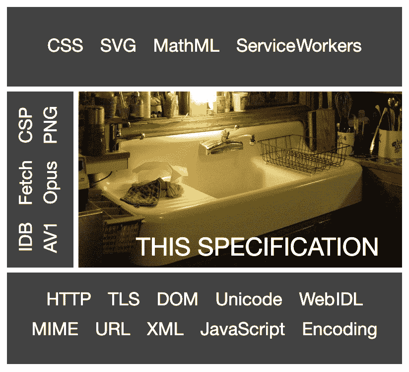

# Flash 已经一去不复返了，网络标准现在在多媒体领域占据着至高无上的地位

> 原文：<https://thenewstack.io/flash-is-gone-and-web-standards-now-reign-supreme-in-multimedia/>

 [理查德·麦克马努斯

理查德是 New Stack 的高级编辑，每周撰写一篇关于网络和应用程序发展趋势的专栏文章。此前，他在 2003 年创立了读写网，并将其打造为全球最具影响力的科技新闻和分析网站之一。](https://twitter.com/ricmac) 

曾经非常受欢迎的多媒体软件平台 Adobe Flash 于 2020 年底停止使用，这在社交媒体和开发者生态系统中引起了积极的反应。尽管我们中的许多人深情地回顾了 Flash 在 20 世纪 90 年代释放的视觉创造力，但从 21 世纪初开始，很明显 Flash 并没有持续多久。Adobe 包容性设计负责人 Matt May 总结得最好:

*“作为一个动画平台，Flash 将 web 推向了新的方向。但一旦它成为一个没有网络或操作系统应用结构的 UX 平台，它就把数百万人抛在了身后。”*

正如梅在他的推特长帖中解释的那样，Flash“没有内在的语义或结构。”它基本上是网络电视——特别是 90 年代中后期的网络，当时网络标准仍在发展。不仅如此，浏览器大战使得使用 HTML 和 CSS 的视觉设计更加困难。因此，在那个时代，Flash 被视为设计师和公司在网站上展示视觉天赋的灵丹妙药。

但在 2021 年，谢天谢地，web 标准不仅仅等同于作为多媒体软件平台的 Flash，它们还包含了语义和结构。HTML5 和 CSS3 是取代 Flash 的两个关键的开放 web 技术，尽管还有其他几个重要的支持技术(如 JavaScript 和 WebGL，我将在下面讨论)。

2021 年的网络仍然由“围墙花园”平台统治，比如脸书和苹果的 iOS 移动操作系统。然而，多媒体是网络标准占优势的一个领域。也许具有讽刺意味的是，史蒂夫·乔布斯在 2010 年 4 月让这个球滚了回来，当时他写了[一封关于 Flash 的著名的信](https://web.archive.org/web/20100502021750/http://www.apple.com/hotnews/thoughts-on-flash)。在这篇文章中，他将 Flash 定位为一个封闭的专有平台，苹果将不再支持它，而 HTML5 则是一个技术上等价的开放标准，苹果将会支持它:

*“html 5 是一种新的网络标准，已被苹果、谷歌和许多其他公司采用，它让网络开发人员无需依赖第三方浏览器插件(如 Flash)即可创建高级图形、排版、动画和过渡。HTML5 是完全开放的，由一个标准委员会控制，苹果是该委员会的成员之一。*

当时，媒体对乔布斯这封信的关注集中在 Flash 的安全漏洞上(“Flash 是 MAC 电脑崩溃的头号原因，”乔布斯写道)。但他的论点的关键是，web 开发人员可以做很多他们在 Flash 中做的事情，但用 HTML5 代替。今天更是如此。

## HTML5 在 2021 年的状态

Flash 被用于不同类型的多媒体，例如动画、在线视频和在线游戏。但是所有这些事情现在都可以在 HTML5 的基础上完成。

当谈到今天的网页动画制作时，[例如](https://www.smashingmagazine.com/2018/03/from-flash-html-css-javascript/)，一个类似 Flash 的动画可以使用一些简单的 HTML 和 CSS 特性来实现:`@keyframes`、`transform`和`animation`。

我们要感谢主要的浏览器公司，因为今天的网络标准非常成熟。HTML5 过去是由万维网联盟(W3C) web 标准组织定义的，但自 2019 年以来，一个名为 Web 超文本应用技术工作组(WHATWG)的浏览器供应商组织已经接管了主要的看管者。WHATWG 由苹果、谷歌、Mozilla 和微软运营。它为 HTML 制定了所谓的“T9”生活标准。2019 年 5 月，W3C [签署了两个组织之间的](https://www.w3.org/html/)协议。

虽然 WHATWG 声称 HTML [的“生活标准”基本上是 HTML5](https://html.spec.whatwg.org/multipage/introduction.html#is-this-html5?) ，但它也有点轻视这个术语:

“…术语“HTML5”作为一个流行词被广泛使用，指的是现代网络技术，其中许多(但绝不是全部)是由 WHATWG 开发的。”

在[网站的另一个页面](https://spec.whatwg.org/)上，WHATWG 澄清说 HTML 规范不再仅仅是定义一种标记语言:

*“HTML 标准是一个充满网络技术的厨房水槽。它包括 web 的核心标记语言 HTML，以及许多 API，如 Web Sockets、Web Workers、localStorage 等。*

WHATWG 甚至在其“web 平台规范堆栈”图形中包含了一张厨房水槽的照片，以防我们没有得到提示:

HTML 厨房水槽；来源:WHATWG

## 网络动画的艺术状态

也许 Flash 如何在在线多媒体中被篡夺的最好例子来自游戏世界。

Awwwards，一个来自意大利的网页设计最佳实践网站，[最近写道](https://www.awwwards.com/best-webgl-games-best-HTML5-games.html)“从 Flash 的第一天开始，以及后来被 HTML5、canvas 和 WebGL API 取代以避免第三方插件，基于网页的游戏已经有了很大的发展。”

[Web GL](https://en.wikipedia.org/wiki/WebGL)(Web Graphics Library)是一个 JavaScript API，根据 [Mozilla 文档](https://developer.mozilla.org/en-US/docs/Web/API/WebGL_API/Tutorial/Getting_started_with_WebGL)，它可以“在支持 HTML 画布的浏览器中实现 2D 和 3D 渲染，而无需使用插件。”它是由 Khronos 集团开发的网络标准，和 HTML5 一样，得到了所有主流浏览器公司的积极支持。

就像 JavaScript 本身一样，有大量的[框架、库和工具](https://gist.github.com/dmnsgn/76878ba6903cf15789b712464875cfdc)可以让使用 WebGL 进行开发变得更加容易。

要想知道如今基于浏览器的游戏有多复杂，看看 [Beat That](https://playbeatthat.acura.com/) 吧——这是一款为本田豪华车部门 Acura 打造的 WebGL 赛车游戏。由设计者[主动理论](https://activetheory.net/)撰写的[aww wards 案例研究](https://www.awwwards.com/case-study-acura-beat-that.html)中概述的技术清单令人望而生畏。但底线是，由于网络标准，它在浏览器中运行得很漂亮。

## 结论

我必须承认，当我在 Twitter 上看到 Flash 将于 2020 年底正式消亡的消息时，我有一丝怀旧之情。但是当我环顾网络，看到浏览器内部不可思议的动画和多媒体效果——看不到插件——这让我庆幸网络标准最终胜出了。

或许在未来十年，我们甚至会看到在线多媒体网站的复兴。

特色图片经[讴歌击败](https://playbeatthat.acura.com/)。

<svg xmlns:xlink="http://www.w3.org/1999/xlink" viewBox="0 0 68 31" version="1.1"><title>Group</title> <desc>Created with Sketch.</desc></svg>