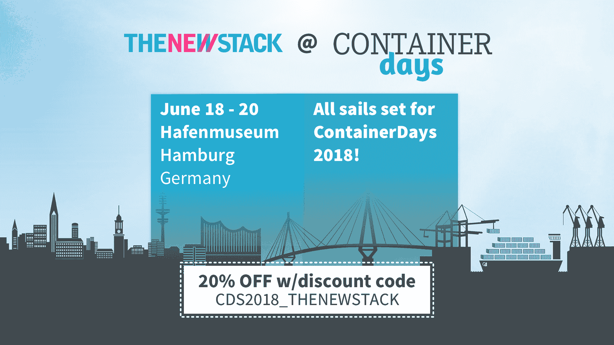

# flat car Linux:core OS 操作系统超越红帽继续存在

> 原文：<https://thenewstack.io/flatcar-linux-the-coreos-operating-system-lives-on-beyond-red-hat/>

作为将容器化 Linux 推向市场的公司的产品线与所有企业 Linux 中最强大的名称之间整合的一部分， [Red Hat](https://www.openshift.com/) 已经表示，它将在即将发布的自己的容器 Linux 版本中采用“CoreOS”名称。然而，尽管“红帽 CoreOS”将采用使 CoreOS 公司的产品具有竞争力的自我更新技术，[一位红帽官员告诉新堆栈](https://thenewstack.io/coreos-says-red-hat-will-help-introduce-openshift-to-operators/)，内核将保持与它已经生产的 Fedora/Atomic/RHEL 基础基本兼容，原因是该官员说主要涉及维护运行在该内核上的系统的认证。

因此，当 Red Hat 计划如何处理 CoreOS Container Linux 时，其他人也在关注代码库，毕竟，它仍然是在 Apache 2.0 许可下的开源项目[。在哥本哈根举行的最后一次](https://coreos.com/legal/open-source/) [KubeCon + CloudNativeCon](https://www.cncf.io/kubecon-cloudnativecon-events/) 会议期间，与会者被重新介绍给了 Kinvolk，这是一个总部位于柏林的开源贡献者团体，其中包括 [Chris Kühl](https://twitter.com/blixtra?lang=en) ，他是 CoreOS 设计的 **rkt** 容器运行时的早期贡献者，并从[起捐赠给了 CNCF](https://thenewstack.io/separate-votes-cncf-adopts-dockers-containerd-coreos-rkt/) 。现在，库尔和他的同事们致力于生产和维护 CoreOS 容器 Linux 的一个分支。名为 Flatcar Linux，它的直接目标是维护其容器无关的架构，也许以后会尝试恢复自己的开发道路。

“通过 Container Linux，CoreOS 创建了一个非常接近云原生基础设施的理想操作系统，”Kühl 在一份关于新堆栈的说明中表示。“当宣布收购时，人们对它会发生什么感到非常困惑。因此，对于 Flatcar Linux，我们首先希望通过提供一个替代产品来缓解这些担忧。

“但 Flatcar Linux 很可能在收购宣布之前就已经出现了，”他继续说道。“我们已经收到了支持 Container Linux 的请求，[正如我们在 FAQ](https://www.flatcar-linux.org/faq/) 中提到的，如果不控制完整的构建管道并维护它，我们看不到任何为操作系统提供商业支持的方法。”

## 重新启动引导

4 月 30 日，Kinvolk group 正式发布了作为公共项目的 Flatcar Linux，拥有自己的存储库。对其文档初稿的检查显示，该小组显然在继续 CoreOS 的工作，使容器配置文件更容易为人类生产。(如果你愿意的话，可以将科瑞奥斯的草稿与[金沃尔克的](https://docs.flatcar-linux.org/os/migrating-to-clcs/)进行比较。)前身公司的 Container Linux Config Transpiler 项目，[仍然在 GitHub](https://github.com/coreos/container-linux-config-transpiler) 上，它使用户能够起草一个更容易阅读的 YAML 配置文件，来代替一个更显而易见的，可能很难汇编的 JSON 文件。Transpiler 将前者转换为后者，在配置过程中增加了一个步骤，但减少了许多麻烦。

Red Hat 的 Atomic 一直在使用最初的 CoreOS 避开的[云配置**和**云初始化**语法**](https://access.redhat.com/documentation/en-us/red_hat_enterprise_linux_atomic_host/7/html-single/installation_and_configuration_guide/index)。这是一个安全的赌注，新的“红帽 CoreOS”将继续沿着原子的道路为这方面的系统。

> “我们是 Kubernetes 的大力支持者，但我们认为 Flatcar Linux 应该保持最小的发行版，不希望将其直接绑定到特定的容器编制器上。”——克里斯·库尔

“就红帽 CoreOS 而言，红帽提议的改变对红帽来说很有意义，在技术上也是合理的，”库尔说。“但是这些变化很容易被看作是收购驱动的工程*的例子，这对于收购公司来说是必要的，但是对用户来说没有增加什么价值。很难找到一个容器 Linux 用户要求对 Red Hat CoreOS 进行修改。”*

库尔举了一个例子，他声称这是一个提议，Red Hat 未来将在其容器化操作系统的未来版本中包括 Kubernetes 的 kube let——报告集群中节点健康状况的远程代理。“我们是 Kubernetes 的大力支持者，”库尔告诉我们，“但我们认为 Flatcar Linux 应该保持最小的发行版，而不希望将其直接绑定到特定的容器 orchestrator 上。”

在 Linux 社区的一些人当中，有一种看法认为，Red Hat Enterprise Linux 的生命周期，以及 RHEL 轨道上的内核，已经变得无法忍受的长。在最近由 OpenShift 高级产品经理[吉米·泽林斯基](https://twitter.com/jimmyzelinskie)发布的黑客新闻帖子中，一位 CoreOS 的忠实客户评论道，“我们使用 CoreOS 的主要原因之一是它提供了来自最新 Linux 内核的稳定和最先进的特性，所以像 [eBPF](http://prototype-kernel.readthedocs.io/en/latest/bpf/) 这样的特性和基础设施是可用的，可以毫无问题地使用。另一方面，RHEL 内核是古老的，严重过时，只是从上游内核反向移植了一些较新的功能，因此使用它的用户空间无法再运行，从而阻碍了最新的创新。

这使得 Zelinskie 评论道，“RH CoreOS 不会有一个与 RHEL 发布周期同步的内核。我们正在努力找出我们希望支持哪些类型的认证要求，并以此为指导，我们将尽可能推出最新的内核。”

尽管这个内核可能被称为“CoreOS”，但它不会是 Flatcar 的配置系统在本机语法中称为 **coreos** 的内核。

## 重燃点火

还有一个问题是包含 OSTree 和 Ignition，这两个组件分别来自 Atomic 和 Container Linux。 [OSTree](https://ostree.readthedocs.io/en/latest/) (在 Project Atomic 中表示为 **[rpm-ostree](https://github.com/projectatomic/rpm-ostree)** )是一种打包、部署和管理不可变文件系统树的方法。通过这种方式，当下载最新的组件时，例如“空中下载”，存储库可以从所有必需的组件中交付未更改的源模块，部署系统可以在客户端执行合并，从而得到干净的最新部署

[另一方面，Ignition](https://coreos.com/ignition/docs/latest/what-is-ignition.html) 是 CoreOS Inc .设计的一个系统，用于在引导之前预先提供容器 Linux 系统需要的资源。它使用户能够起草一个更容易阅读的 JSON 配置文件，而不是一个更明确的，可能很难汇编的 YAML 文件。因此，它可以替代金沃尔克团队正在继续研究的云初始化系统。

在他的黑客新闻帖子中，Red Hat 的 Zelinskie 明确表示 OpenShift 的未来版本将支持 Container Linux 和 Red Hat CoreOS。这样做的话，OpenShift 将包含“一个利用点火和不变性来提供运行 Kubernetes/containers 所需的最小环境的 Linux 发行版。”

然而，Flatcar Linux 项目的库尔告诉我们，“我们也不认为迫切需要添加 OSTree，这似乎是计划的一部分。”然而，在没有具体提及点火的情况下，库尔发表了一份声明，暗示在他看来，从 Flatcar 中移除点火不会是一种改进。

“在我们看来，Container Linux 是一个成熟的产品，几乎不需要改变，”库尔告诉新的堆栈。“我们致力于保持与上游项目的兼容性，并将其作为集装箱工作负载的坚实平台。任何我们认为有必要的改变都会向上游项目提出，然后合并到 Flatcar Linux 中。”

## 重新装配内核

然而，未来将会有“定制的、专门构建的平板 Linux 构建”——这是一种手段，Kühl 说，供 Kinvolk 的工程师在操作系统上进行特殊用例的实验。在去年 4 月 25 日的一篇公司博客文章中，Kinvolk 设法暗示了一个这样的用例，文章的标题很奇怪，叫做“[走向无特权容器构建](https://kinvolk.io/blog/2018/04/towards-unprivileged-container-builds/)”在这篇文章中，Kinvolk 的技术负责人 Alban Crequy 吹嘘了一种系统的好处，这种系统可以从归档中打包和重建文件系统，特别是供容器使用，不需要 root 权限。

在过去的两年中，我们已经在新的堆栈中多次讨论过这个概念。2016 年夏天，是软件工程师杰西·弗雷泽勒发起的[运动——当时是 Docker Inc .，现在是微软。Frazelle 当时提出，如果没有 **sudo** 的要求，自动化系统可以用更少的步骤建造一系列集装箱，尽管仍然提供安全性——只是没有栓上。最近几天，Frazelle 的工作在微软蓬勃发展，成为 Kubernetes](https://thenewstack.io/quest-build-unprivileged-container/) 的[“硬多租户”项目——只是 Docker 引发的利润丰厚的想法的最新例子，但在其他地方继续。](https://blog.jessfraz.com/post/hard-multi-tenancy-in-kubernetes/)

Crequy 的帖子解释了为什么 Docker 架构及其 **build** 命令需要 root 权限的所有原因。它基于 Linux 体系结构的基本原则生成文件系统和名称空间——如果我们最终可以假设 CoreOS 和其他系统是从这个基本状态发展而来的，那么这些原则就不一定有效。

当被问及 Crequy 的帖子是否暗示了 Flatcar Linux 的未来时，Chris Kühl 态度缓和了。“你可以看到，如帖子中所述，需要大量内核补丁来支持非特权容器构建，”他告诉新堆栈。

“公平地说，进入主线内核需要一些时间，”他继续说道。“为了让用户更快地获得这一功能，我们希望创建的一个特定用途的构建是一个映像，它将具有支持非特权容器构建所需的内核补丁。我们正积极寻求与有兴趣实现这一目标的其他人合作。”

<svg xmlns:xlink="http://www.w3.org/1999/xlink" viewBox="0 0 68 31" version="1.1"><title>Group</title> <desc>Created with Sketch.</desc></svg>