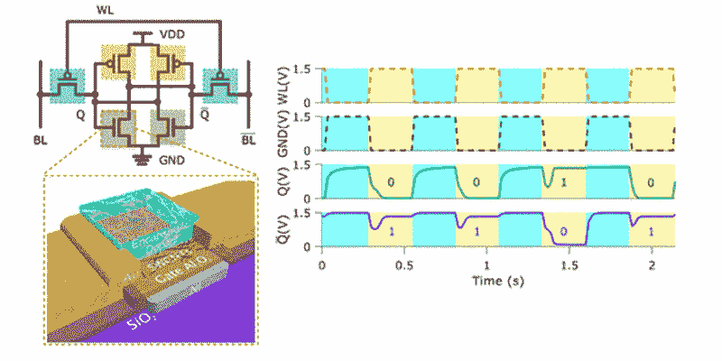

# 碳纳米管可以为真正的随机数生成提供基础

> 原文：<https://thenewstack.io/flexible-true-random-number-generator-printed-using-carbon-nanotubes/>

生成随机数是一件非常有用的事情。拥有一串不容易预测的数字是计算机模拟、加密以及安全应用所需要的。虽然有软件可以生成一组看似随机的数字，但这些数字不是真正的随机数，而是“伪随机数”，因为这些程序依赖于计算算法来生成这些数字的长序列。然而，如果有人能够破解潜在的模式，用这种伪随机方法保护的系统可以被黑客攻击。

在寻找真正的随机数发生器的过程中，人们已经尝试利用熵现象产生的混沌运动，如无线电噪声、放射性衰变甚至[时钟漂移](https://en.wikipedia.org/wiki/Clock_drift#Random_number_generators "Clock drift")。现在来自[西北大学](http://www.northwestern.edu/)的研究人员已经创造了一个真正的随机数发生器(TRNG)，它利用热噪声的波动来产生这些随机比特，并且很灵活。

在发表于 [*Nano Letters*](http://pubs.acs.org/doi/abs/10.1021/acs.nanolett.7b02118) 的一篇论文中，该团队描述了他们如何使用静态随机存取存储器(SRAM)单元构建随机数生成器，该单元使用由单壁碳纳米管组成的半导体墨水打印。该团队表示，这种印刷的随机数生成 SRAM 单元可以被集成到智能服装、可穿戴电子产品、传感器、防篡改标签和标记中——这些物品由于其灵活性或可处置性，在为它们配备传统刚性硬件以使它们更加安全时，会带来独特的挑战。在这种情况下，就大规模生产而言，像这样的印刷解决方案会便宜得多，也更具可扩展性。

“我们使用一种非传统的半导体材料，即溶液处理的半导体单壁碳纳米管，开发了一种最重要的加密技术，”材料科学教授和论文作者之一马克·赫萨姆对 *[数字趋势](https://www.digitaltrends.com/cool-tech/carbon-nanotube-random-number-generator/)* 解释道。“这种 TRNG 具有其组成溶液加工材料的优势，例如能够以低成本在柔性塑料基板上印刷，这使得它非常适合新兴的柔性电子应用，如可穿戴设备和物联网传感器。”

一旦 SRAM 单元被打印出来，研究小组就操纵 SRAM 的反相器来产生随机位。通常，SRAM 单元中的交叉耦合反相器将值从 1 切换到 0，反之亦然。

因此，为了让反相器以随机的方式工作，以不可预测的方式在这些二进制值之间交替，研究小组关闭了电池的电源。然后用电流电击电池，迫使两个反相器输出一连串的 1。再次接通电源并移除外部电流，其中一个反相器将进入随机翻转 1 或 0 的状态，第一个数字位将是 1 和 0 的随机序列。无论是否施加电压，该单元都将被连续复位以产生这种随机的位串，这种随机性是由于热噪声的不规则变化或导电材料内部的电子搅动造成的。

诚然，该团队的 SRAM 单元相对较慢，每秒仅翻转几个比特，迄今为止只能产生 61，000 多一点的比特。但是好的一面是，当这一串数字用由[国家标准与技术研究院](https://www.nist.gov/) (NIST)创建的测试进行随机性统计测试时，结果是令人鼓舞的。

该团队目前正在努力优化这一过程的速度。当优化时，这种随机数生成单元可以单独运行或作为一个组运行，以保护可穿戴电子设备或其他印刷的柔性设备，而不需要高成本、电力需求或复杂的计算开销。随着柔性电子设备和传感器在新兴的物联网中变得越来越普遍，找到最高效和最有效的方法来确保它们发送的数据被安全加密将是势在必行的。

图片:[Mstroeck](https://en.wikipedia.org/wiki/User:Mstroeck "wikipedia:User:Mstroeck")([CC BY-SA 3.0](https://creativecommons.org/licenses/by-sa/3.0/))，西北大学。

<svg xmlns:xlink="http://www.w3.org/1999/xlink" viewBox="0 0 68 31" version="1.1"><title>Group</title> <desc>Created with Sketch.</desc></svg>