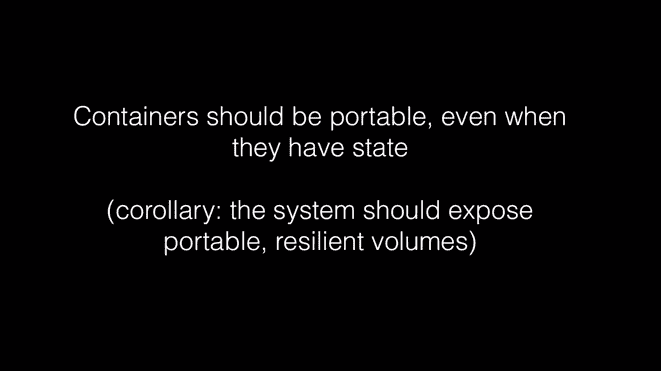
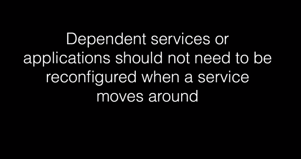
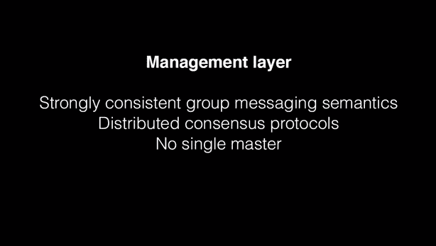

# Flocker 是一个新生的 Docker 服务，它让容器、数据和所有东西都变得便携

> 原文：<https://thenewstack.io/flocker-a-nascent-docker-service-for-making-containers-portable-data-and-all/>

Flocker 的开发者已经开始开发一项服务，解决让容器变得真正可移植的复杂问题。搬运集装箱是一回事。但是移动装有数据的容器是另一回事。Flocker 是 T2 cluster HQ 的 T3 的一次尝试，旨在使 Docker 成为一种生产就绪服务，用于包含多种类型图像的完全不同类别的应用程序。在这种情况下，开发人员可以在 Docker 中运行数据库、队列和键值存储，并像他们应用程序的其他部分一样轻松地移动它们。

“容器无法处理数据，”ClusterHQ 营销副总裁迈克·费兰蒂(Mike Ferranti)说，该公司正在开发 Flocker。

他说，许多操作，如将数据库从一个版本升级到另一个版本，数据库的灾难恢复和移动应用程序，都需要用户关闭他们的应用程序。他说，结果是人们最终只能在 Docker 这样的容器中运行 API 服务器和 Web 前端。这可能会迫使开发人员在测试、开发和生产中使用不同的数据服务，从而在到达那个阶段时引入潜在的问题。

Flocker 的补救措施是一个命令行工具和一种配置语言，它将基于 Docker 的应用程序部署到一个或多个主机上。部署后，应用程序将可以访问为其配置的卷。当用于在 Flocker 集群中的不同主机之间移动容器时，这些卷将跟随容器。

帮助 Cloud Foundry 部署的公司 CloudCredo 的首席执行官 Colin Humphreys 告诉 ClusterHQ，数据问题确实阻碍了容器的使用。“解决数据问题，使数据库和其他数据支持的服务可以在容器内运行，这将释放出对容器和 PaaS 的大量被压抑的需求，”他说。

ClusterHQ 正在开发一个开源系统，该系统基本上将各种组件映射到 Docker 容器中，使用户可以轻松指定将它们移动到哪里，例如，将应用程序转移到生产中。

Flocker 有一个功能叫做应用清单。有了清单，开发人员就可以定义应用程序由哪些 Docker 映像组成。例如，这可能是一个 MongoDB Docker 映像和一个 Nginx Docker 映像。它还有一个部署清单，指定在哪里部署容器，比如哪些服务器和哪些数据中心。要将数据库之类的东西从一台服务器迁移到另一台服务器，用户需要更新部署清单并运行“flocker-deploy”命令。

ClusterHQ 正在发布该软件的一个非常早期的版本，希望吸引开发者的兴趣和投入。但是它的创造者承认它目前有一个很大的缺点。

目前，当 Flocker 用户移动数据容器时，在将数据复制到新节点的过程中会出现停机。数据量越大，停机时间越长。这违背了初衷，因为 Flocker 旨在消除使用容器时与更改数据库相关的停机时间。

“虽然我们没有宣布在 0.1 版本中提供解决此问题的解决方案，但我们完全理解这种停机时间对于生产应用程序来说是不可接受的。我们基于 FreeBSD 的平台(Flocker 就是在该平台上建模的)包括一个连续复制系统，使得在几秒钟内迁移非常大的数据库成为可能。ClusterHQ 在一份声明中说:“在我们全面推出之前，用户可以期待类似的功能将被包括在 Flocker 中。

在添加该功能之前，Flocker 不会很有用。然而，ClusterHQ 表示，发布该软件早期版本的部分原因是试图激起人们对这一概念的兴趣。由于这是一个开源项目，认为整体概念有价值的开发人员可以帮助解决问题。

关于弗洛克尔的更多信息，请听 ClusterHQ 联合创始人兼首席执行官卢克·马斯登的一段对话:

[https://www.youtube.com/embed/n7of6f3MYxs?feature=oembed](https://www.youtube.com/embed/n7of6f3MYxs?feature=oembed)

视频

<svg xmlns:xlink="http://www.w3.org/1999/xlink" viewBox="0 0 68 31" version="1.1"><title>Group</title> <desc>Created with Sketch.</desc></svg>