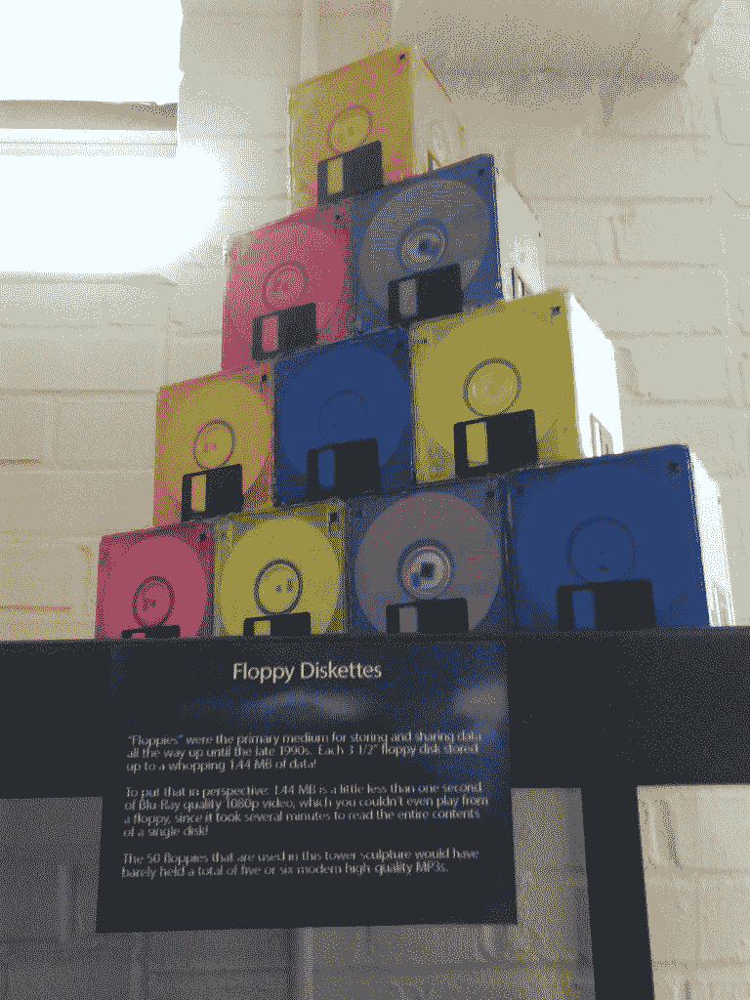

# 软盘幸存了下来——多亏了一位 73 岁老人的生意

> 原文：<https://thenewstack.io/floppy-disks-survive-thanks-to-one-73-year-olds-business/>

“软盘”这两个词让那些还记得事物原貌的人想起了很久以前的事情。从 40 多年前开始，软盘是世界上第一台家用电脑数据备份和共享的主要存储机制。

本月，73 岁的汤姆·珀斯基发现自己接到了来自路透社、T2、NPR 和 T4 的关于软盘的采访请求，这些人都是新书的作者，更不用说 2017 年在 CNN 的露面了。他的存在提供了一个奇怪而鼓舞人心的机会，让我们反思我们今天的技术，一个更大的生态系统，其中一种媒体总是让位于另一种媒体，同时带来了意想不到的挑战——以及一些不便的问题。

但最令人惊讶的是，这也是一个生态系统，看似古老的软盘格式仍然存在于世界上——这要归功于一位敬业的企业家的不懈努力，他自称是“软盘行业的最后一人”

## 软盘天堂

在加利福尼亚州森林湖的一个不起眼的工业园区，路透社参观了 Persky 独一无二的仓库，这是一个软盘天堂，大量不同颜色的磁盘——绿色、橙色、蓝色、黄色或黑色的磁盘——“来自世界各地”，整齐地堆放在他的仓库货架上。

CNN 称之为“你所有的软盘去了哪里。”

“我开始是一名税务律师，然后是一名软件开发人员，然后是一家复制公司，现在销售软盘，”Persky 在周四的一次电子邮件采访中告诉我。

然后他开玩笑地补充道，“谁知道呢？”

从他在即将出版的新书《[软盘热:灵活媒体的奇妙来生》中的采访来看，帕斯基正在进行的工作最终为他赢得了一种狂热的地位。在采访中，帕斯基回忆起他的妻子是如何在 30 多年前(“1990 年左右”)第一次购买了域名](https://www.onomatopee.net/product/floppy-disk-fever/)[floppydisk.com](https://www.floppydisk.com)——但就在最近的 2002 年，帕斯基唯一的业务是*复制*软盘。

“我从来没有想过我会卖空白软盘，”他告诉该书的作者。“在 20 世纪 80 年代和 90 年代初，复制磁盘就像印刷钞票一样简单。利润高得令人难以置信。随着时间的推移，我开始有机销售空白副本。”然而，过去他 90%的业务是复制 CD 和 DVD，现在他 90%的业务是销售空白软盘。

“这让我震惊，”帕斯基在书中说。

他在三名员工的帮助下维持着公司的运营。“这项技术很有趣，”Persky 周四告诉我，“我喜欢解决人们提出的无数问题……”Persky 还为那些再也无法访问软盘的人提供检索软盘上存储的文件的服务。

在 2015 年的一次播客中，Persky 指出“仍有数百万张软盘存有小说、论文、地址簿和各种人们想从中获取数据的东西的初稿。”帕斯基告诉新书的作者，这项工作非常令人满意。“你不会相信我们收到的一些信。人们再次看到他们已故的祖母或他们的婴儿照片，这对他们来说非常重要…

“很高兴知道我们正在给人们提供他们真正需要的东西。”

事实上，[这本书在亚马逊](https://www.amazon.com/Floppy-Disk-Fever-Afterlives-Flexible/dp/9493148866)的描述承诺它挑战了过时本身的概念——同时传递了一个重要的信息。

“通过观察过去技术的现状，我们可以评估我们的现状，并推测我们媒体领域的未来发展……”

北卡罗来纳州的一家电脑维修店展示了一座由 50 张磁盘组成的塔，作为过去的古董——还配有一块解释它们是什么的铭牌。图片由大卫·卡塞尔提供。

## 重新想象未来

即将出版的这本书的前言是由一个对很久以前的技术有自己欣赏的人写的:[洛里·爱默生](https://www.colorado.edu/cmci/people/iawp/lori-emerson)，他是科罗拉多大学博尔德分校的副教授，也是一个名为[媒体考古实验室](https://www.mediaarchaeologylab.com/)的过时技术博物馆的创始人。

爱默生在电子邮件采访中告诉我，这是“一个动手实验室，充满了从 19 世纪末到现在仍在运行的媒体”。“我们最喜欢的一些参观者是年轻人，他们通常会先盯着我们 20 世纪 70 年代的电脑和游戏机，然后他们会继续检查不太明显、不太迷人的箱子、盒子、托盘、信封和装满各种大小软盘的柜子——有些贴着手写标签，有些印有公司标志，许多完全空白。通常这些年轻人会拿起软盘，在空中挥舞，并大声说，“我不知道它们是软盘！”"

“我们甚至把软盘送给他们，看着他们走出实验室，似乎既渴望一个他们从未生活过的世界，又希望未来的世界与他们现在所处的世界不同。”

爱默生强调，她并不是在“劝说”人们回到软盘的黄金时代——而是将它们视为激发严肃和深思的时刻，作为“重新思考什么是实用和哲学上可能的工具”如果我们有意接受小而慢的计算，会对我们的生活节奏和质量产生什么影响？如果软盘提供的限制允许我们重新考虑我们通常消耗的能源和电子设备的数量，会怎么样？如果软盘让我们想起了一种不受监控的文件共享模式，那会怎么样呢？"

爱默生说，即将出版的这本书“为我们提供了一系列机会，让我们以完全不同于计算机行业强加给我们的方式来重新想象计算机的现在和未来。”

## 生活在时间扭曲中

许多行业仍在使用软盘。Persky 告诉路透社，它们被用于刺绣、工具和模具行业，并在 2017 年告诉 CNN，他的大多数客户都是商业和工业客户。从商业航空到 ATM 机，软盘被用于各种用途，他还向美国政府出售软盘。(2016 年，美国消费者新闻与商业频道指出，美国的核力量是由一个使用 8 英寸软盘的计算机系统[协调的。)](https://www.cnbc.com/2016/05/25/us-military-uses-8-inch-floppy-disks-to-coordinate-nuclear-force-operations.html)

然而，帕斯基告诉 CNN，他是这个行业的最后一个人，“因为我基本上忘了退出这个行业。”当这本书的作者问帕斯基他有多少软盘库存时，他给了他们两个答案:“大约 50 万张”和“没有我想要的那么多。”然后他补充道，“人们已经依靠库存生活了五到十年”

“在这个办公室里，我们处于时间扭曲之中，”佩尔斯基在 2017 年告诉美国有线电视新闻网。“磁盘的生产已经结束。所以所有要制作的磁盘*都已经*制作好了。”

但奇怪的是，人们还不断给他发送光盘。“每天都有这些包裹进来，这里每天都是圣诞节，”帕斯基告诉该书的作者。(“如果在纸套里，也许上面有咖啡圈污渍？这不是一个好兆头，”佩尔斯基在 2015 年的播客中开玩笑说。)

所以他继续着，被命运赋予了一个在世的任何人都无法比拟的地位。“是的，世界上可能有数十万或数百万新的未使用的磁盘，”Persky 周四告诉我，“但它们分散在地球上。没有人知道他们在哪里。”

这么多年过去了，他不知道世界上还有其他类似的存货。如果一颗流星摧毁了他在南加州的仓库，“这个行业就会消失。马车鞭子、打字机、8 轨盒式磁带……嘿，生活还在继续……奥布拉迪，奥布拉迪……”

“只要人们继续想要这些磁盘，我就会在这里，”Persky 告诉路透社，并补充说“但这不是永远。”

当我问他成为软盘行业的最后一个人感觉如何时，他变得很有哲理，用约翰·列侬的一句歌词来回答。

"生活就是当你忙于制定其他计划时发生的事情。"

* * *

# WebReduce

<svg xmlns:xlink="http://www.w3.org/1999/xlink" viewBox="0 0 68 31" version="1.1"><title>Group</title> <desc>Created with Sketch.</desc></svg>