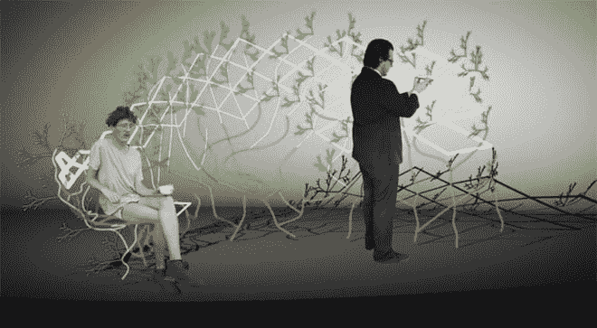
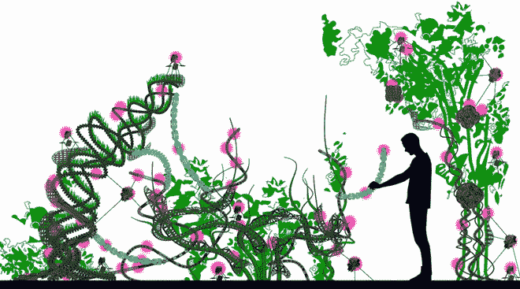
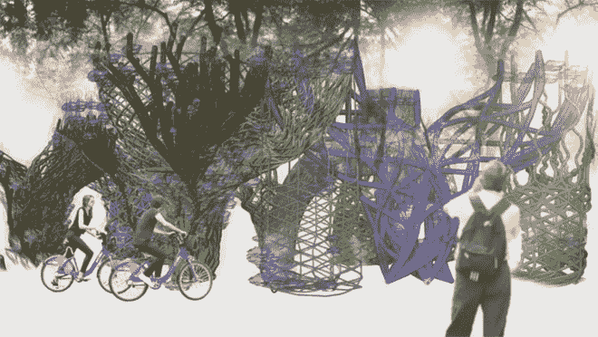
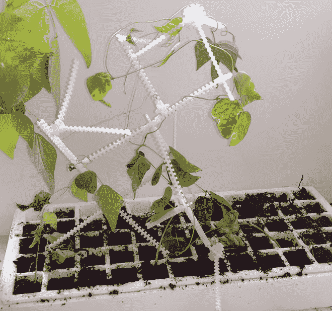
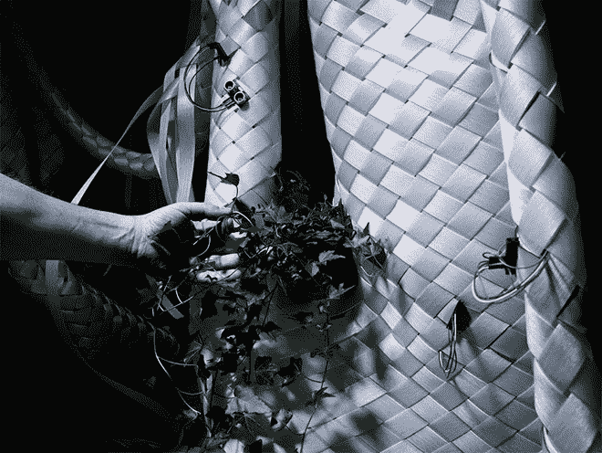
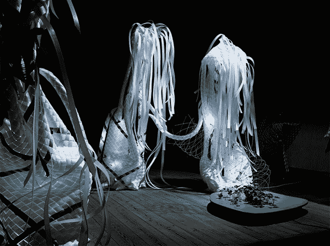

# 让机器人来照料你的花园

> 原文：<https://thenewstack.io/flora-robotica-let-robots-tend-gardens/>

20 世纪 60 年代的绿色革命引入了许多有助于提高全球农作物产量的技术，包括使用杂交种子、合成肥料和杀虫剂。但是，下一次植物种植革命可能不会来自这些化学物质的使用或转基因种子。相反，它可能来自植物和机器人之间的联盟。

这是 T2 植物机器人 T3 项目的前提，该项目由一群来自波兰、丹麦、德国和奥地利的欧洲研究人员承担，由欧盟资助。该项目将从多学科的角度探索植物和机器之间共生关系的可能性，以创造一个“生物杂交社会，它在一个自组织的分布式认知系统中发挥作用，能够通过与人类的互动而增长和发展，从而创造建筑结构。”

该团队的[论文](http://www.florarobotica.eu/wp-content/uploads/2016/01/Flora-Robotica-Mixed-Societies_IEEE-ALIFE_2015.pdf)将他们的目标描述为开发一个“分布式机器人花园”,其中的植物充当一种生物传感器，向它们的机器人组件提供反馈。这些机器人-植物杂交体将使用机器人组件来支持和促进植物的自然生长周期，并提供一种“脚手架”来帮助植物进行自我调节。植物对光、重力和水等事物的自然适应行为(也称为向性)将被利用，而可编程机器人组件将影响自然生长过程，进一步触发人工生长。但是让我们听听研究人员自己的看法:

[https://www.youtube.com/embed/Byo55asQUwM?feature=oembed](https://www.youtube.com/embed/Byo55asQUwM?feature=oembed)

视频

## 未来真正的绿色城市

分布式机器人花园的想法可能会有很多影响:它不仅会对我们这些想要在家里大规模建设更多生活和绿色空间的人有潜在的好处，它可能意味着城市有更大更好的绿色空间，更自动化的垂直园艺和更高效的城市中心食品生产。

帕德博恩[大学计算机科学教授](https://www.uni-paderborn.de/en/university/) [Heiko Hamann](http://heikohamann.de/) 告诉[数字趋势](http://www.digitaltrends.com/cool-tech/flora-robotica-robot-plant/)“我们来自所谓的‘混合社会’的研究，在那里机器人与动物混合在一起。“例如，有研究表明，昆虫可以被说服聚集在受移动机器人影响的不同地点。我们想把机器人和自然植物混合在一起影响它们。我们想让植物长成我们决定的形状和形式。我们希望通过这种方式创造绿色墙壁，种植屋顶甚至房屋。”

希望机器人和植物之间的这种伙伴关系能够产生一种高度动态并对其环境做出响应的建筑(或食品生产环境)。

“在未来，我们可能能够通过人、机器人和植物之间的合作来建造一个自我修复、自我生长的建筑，”玛丽·凯瑟琳·海因里希说，她是丹麦皇家美术学院的博士研究员。“它可以适应不断变化的需求。”

在研究人员的初步实验中，通过首先构建一个带有杆和节点的脚手架结构，并配备小型自主设备，如传感器、致动器和能量收集系统，所有这些都通过小型 Raspberry Pi 或 BeagleBone Black 计算机无线连接和控制，这些计算机又可以连接和扩展到一个更大的系统。该系统被设计成模块化，可以根据用户的需求和目标进行定制。为了给系统供电，可以利用太阳能电池板、微型风力涡轮机或微生物燃料电池。

该团队的其他[实验](http://www.florarobotica.eu/?page_id=22262)包括使用[胸腺机器人](http://www.techykids.com/product/thymio-ii-2/)，运行群体智能程序，为植物生长创造编织结构。研究人员还进行了计算机模拟，以调查分布式人工结构中控制器和机器人的使用。

## 集体植物-人类-机器人智能

虽然创造房屋大小的植物机器人生物杂交体还有一段时间，但研究人员预计，机器人植物群落的概念可能会对建筑产生重大影响。建筑不再关注组装成最终产品和物品的预制材料，而是关注生长过程和系统设计，并变得更加了解园艺原理。

随着人类参与生物混合系统，这些分布式机器人花园也可能具有社交成分，也许是参与植物互联网的集体园丁，或者是使用增强现实(AR)技术的游戏玩家。

更令人感兴趣的是将人工智能的发展、学习和生长模型纳入神经网络，与对植物智能的令人着迷的新研究相结合，这表明植物实际上能够学习和保留记忆。把所有这些放在一起，有一天我们可能会拥有整个的农场、城市和建筑，它们是生长出来的，而不是建造出来的，并且完全适应它们的环境，而不是与之相抵触。

图片:机器人植物

<svg xmlns:xlink="http://www.w3.org/1999/xlink" viewBox="0 0 68 31" version="1.1"><title>Group</title> <desc>Created with Sketch.</desc></svg>