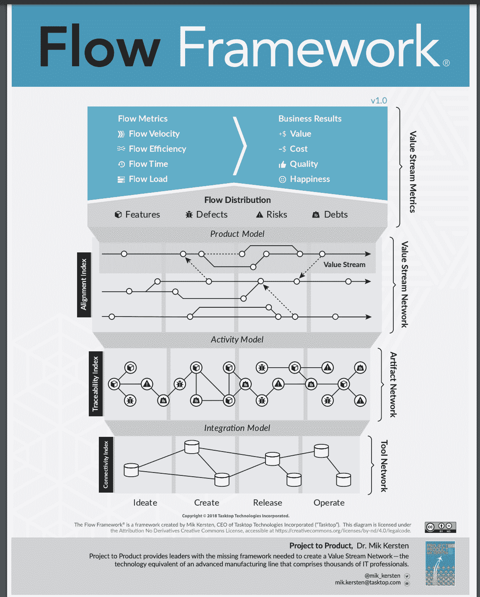

# 流量测量可以消除开发中的瓶颈

> 原文：<https://thenewstack.io/flow-measurements-can-eliminate-bottlenecks-in-development/>

在代码编写完成后，只有 8%的敏捷团队计划被交付，20%的特性被取消。

这些发现来自于由[Mik Kersten](https://www.linkedin.com/in/mikkersten/?originalSubdomain=ca)创立并领导的价值流管理平台公司 Tasktop Viz 收集的价值流。克斯滕补充道:

*   35%的产品在 12 个月或更长时间内没有新工作的生产能力；和
*   85%的在售产品投资于证券和债券

这些问题可以通过测量流量来识别和解决，Kersten 周三在 VMware Tanzu 举办的虚拟会议 [DevOps Loop、](https://devopsloop.io/) 上告诉观众。

“虽然我们可能有非常敏捷的团队，但是在那些开发团队的上游和下游都有重量级的过程，”Kersten 说。“当然，这导致了更慢的速度，更长的时间来评估我们交付的东西，以及我们团队中的许多挫折。”

他说，与此同时，其他组织已经掌握了交付。那么问题就变成了:DevOps 如何确保组织能够以软件公司的速度创新，从而为客户交付价值。

“要做到这一点，我们实际上需要了解瓶颈在哪里，”克斯滕说，“价值在哪里减速？开发者在哪里受挫？我们的大部分事故来自哪里？”

为了解决瓶颈挑战，克尔斯滕创建了 [流程框架](https://flowframework.org/) ，这是他周三讨论的重点。最初出现在[Project to Product:How to Survive and Thrive in the Age of Digital Disruption with the Flow Framework](https://www.amazon.com/Project-Product-Survive-Disruption-Framework/dp/1942788398/ref=asc_df_1942788398/)中，该框架旨在提供 [语言和方法论](https://flowframework.org/about/) 来“系统地缓解减缓软件交付和影响业务结果的瓶颈”

首先，它有助于了解软件交付中的“流程”。Kersten 说，流程是功能、风险、缺陷(通常由客户提出)和技术债务。

流程框架概述了组织应该监控的流程度量，以检测软件开发中的瓶颈:

流程框架；资料来源:Mik Kersten

**流动速度** —在特定的时间单位内完成了多少流动项目。“流动速度是一个非常重要的指标，它只是告诉我们——忘记故事点，忘记每个用户故事的细节，或者问题、缺陷或事件——在一段时间内发生了多少流动，无论是冲刺、一个月、一个财年、一个季度——诸如此类？”

**流程效率** 告诉 DevOps 流程在哪里等待。它是活动工作日与等待状态的比率，因此一个处于活动状态 10 天但同时处于活动和等待状态 30 天的项目的流程效率为 33%。

“等待状态是死亡之吻，”他说。“基本上，我们在哪里颠簸？阻碍我们完成工作的因素在哪里，流程时间只是交付价值的端到端时间，但它是端到端的，而不是从代码提交到代码部署需要多长时间。”

**流程时间** 是工作所花费的时间，从设计开始到工作完成以及其间的所有等待状态——如等待批准、等待开发工作完成、等待分类。

**流量负载** 是价值流上的负载量。“这是一个正在进行的度量，但这跨越了团队，它显示了团队有多少负载，”他说。他说，如果流动负载过高，流动速度实际上会变慢，流动时间会变长，因为“我们让团队超负荷，会发生混乱”。

**流程分布** 简单来说就是特性、缺陷、风险和技术债务的分布。他说，流量分布可能会有所不同——快速移动的面向消费者的应用程序可能需要快速的功能流来进行 AB 测试，而另一个应用程序可能需要稍微慢一点的功能流，但为了风险管理和安全，需要非常快的流量。

流程指标共同构成了价值流。

Kirsten 补充道:“因此，每一个价值流都应该根据业务成果所需的流量分配进行调整。

根据流程框架图，这些指标可以映射到价值、成本、质量和客户满意度方面的业务成果。

Kirsten 解释说，组织甚至可能知道他们的瓶颈在哪里，但是流程框架提供了一种监控和优先改进的方法。

他分享了一个未透露姓名的组织的例子，该组织知道自助测试是一个瓶颈，但一旦他们优先改进它并测量后端自助测试，他们发现通过加速功能，他们释放了 45%的已有容量，但却陷入了瓶颈。

他说:“在交付这些路线图项目的过程中，他们实际上在业务案例中拉动了 1.5 亿美元。“这正是以这种方式衡量流量的伟大之处——它为您提供了一种将平台、API 和基础设施以及新服务和云的投资与业务成果联系起来的方式。”

<svg xmlns:xlink="http://www.w3.org/1999/xlink" viewBox="0 0 68 31" version="1.1"><title>Group</title> <desc>Created with Sketch.</desc></svg>