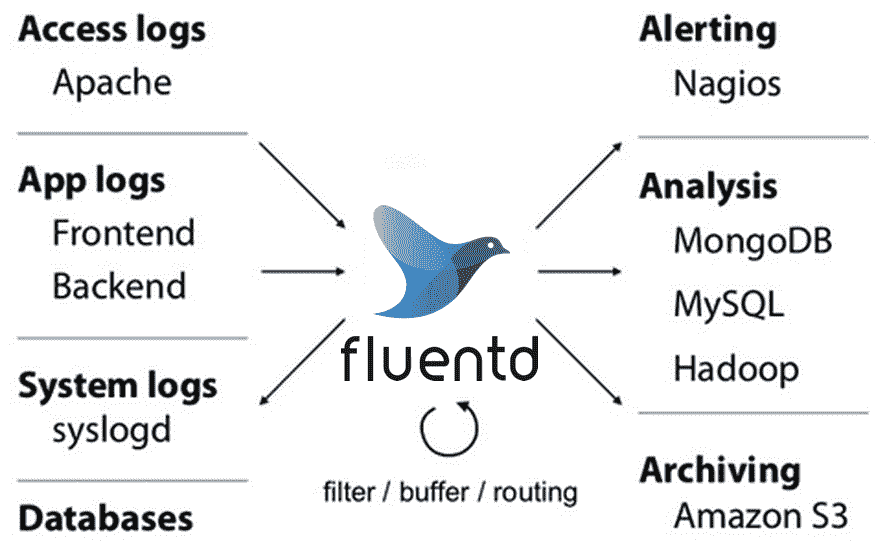
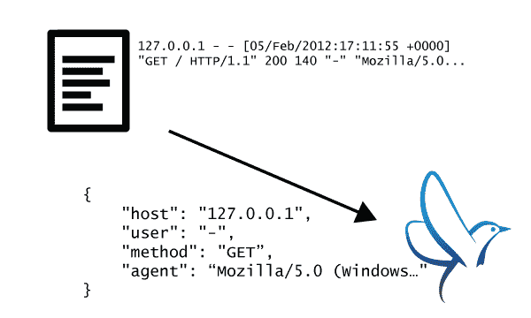

# Fluentd 为微服务和云监控提供全面的日志收集

> 原文：<https://thenewstack.io/fluentd-offers-comprehensive-log-collection-cloud-microservices-world/>

对于那些需要从各种不同的数据源和后端收集日志的人来说——从访问和系统日志到应用和数据库日志——开源的 [Fluentd](https://github.com/fluent/fluentd) 软件正成为越来越受欢迎的选择。

分析师 [RedMonk](http://redmonk.com/) 的 [Stephen O'Grady](https://twitter.com/sogrady) 解释说，这个基于[宝藏数据](https://www.treasuredata.com/)创建的框架是一个日志收集器，其功能类似于 Elastic 的 [Logstash](https://www.elastic.co/products/logstash) 。“Fluentd 擅长收集大量半结构化或非结构化数据，并根据路由规则将它们导向其他存储后端，如 Elasticsearch 或 PostgreSQL。它受到了包括亚马逊和谷歌在内的各种云提供商的好评，”他说。

事实上， [Google Cloud Platform](https://cloud.google.com/) 的 [BigQuery](https://cloud.google.com/bigquery/) 推荐 Fluentd 作为默认的实时数据摄取工具(尤其是因为它让你可以将数据从 AWS 记录到 BigQuery 中)。它也在 Docker 中得到原生支持，并被微软用作新的[微软运营管理套件](https://thenewstack.io/microsofts-jeremy-winter-qa-automation-new-visualization/) (OMS)在 Linux 上的分析和日志监控代理。为什么它如此受欢迎？

## 输入、输出、路由

像 Unix [syslogd](https://linux.die.net/man/8/syslogd) 实用程序一样，Fluentd 是一个监听和路由消息的守护进程。根据您的日志基础设施，您可以将它用作收集器或聚合器。你可以过滤来自各种来源的日志，并通过插件将其发送到大范围的输出中——目前有超过 300 个插件。Treasure Data 的 Kiyoto Tamura 建议,“如果 syslogd 再发展一点，更现代一点，更容易破解”。我们做了[Fluentd],因为我们无法让 syslogd 做我们想让它做的事情。"

微软为 OMS 选择 Fluentd 的部分原因是 Linux 社区的人们已经在使用它，但是微软的 Anurag Gupta 称赞了输入和插件模型的模块化以及广泛的支持。

MySQL 监控是最受欢迎的用途之一，但也有针对 Kafka、Twitter、 [Kubernetes](/category/kubernetes/) 、 [Twilio](https://www.twilio.com/) 以及短信服务( [SMS](http://searchmobilecomputing.techtarget.com/definition/Short-Message-Service) )通知和[简单网络管理协议](https://www.digitalocean.com/community/tutorials/an-introduction-to-snmp-simple-network-management-protocol) (SNMP)数据的插件。

古普塔说:“种类繁多，出去创造一个这样的东西是很容易的。”。“作为一名 IT 人员，我没有时间用本机代码构建复杂的东西，但我不介意编写几行脚本，这样我就可以使用现有的插件。Fluentd 的灵活性适用于许多场景。”

田村证实，这是 Fluentd 的目标之一。"我们开始的想法是输入和输出应该是可配置的."你可以通过选择源插件和输出插件，并给它们参数来实现。“我们还强烈认为，对于来自运营背景的人来说，应该包括路由，但它还应该能够处理非常复杂的逻辑，这就是基于标记的路由背后的想法。”

来自源的每个事件都有一个标记、一个时间戳和一个记录，标记是路由引擎用来指引事件的，记录是一个 [JSON](http://www.json.org/) 对象。配置文件中的 Match 命令告诉 Fluentd 哪个输出插件路由带有特定标签的事件，或者您可以使用 filter 命令来设置路由管道，以便在事件被发送到输出插件之前对其进行处理。

Tamura 说，超过一半的 Fluentd 插件是用于输出的。“输入是 HTTP、文件、 [TCP](https://www.ietf.org/rfc/rfc793.txt) 、 [UDP](https://www.ietf.org/rfc/rfc768.txt) ，但是输出是区别于许多其他工具的一个重要因素。最受欢迎的输出是 [Tableau](http://www.tableau.com/) ，接下来是 [Google spreadsheets](https://www.google.com/sheets/about/) ，我们正在与一家 SQL Server 商店合作。Fluentd 可以作为连接所有这些多个平台的结缔组织，”Tamura 说。

> Fluentd 能够通过 TCP 实现每秒 2，000 条消息，没有任何问题，只需一个代理运行在一个带 1Gb 网卡的单核系统上

Gupta 指出，匹配和过滤可能是复杂的。“你可以做很多事情。您可以将 JSON 转换成 XML 或者只有输出可以识别的加密流。对于 OMS，我们使用 Fluentd 增强了一些数据；我们获取原始 SQL 日志并添加计算机名称，然后我们可以将其标记到特定字段中。我们审计了多个领域的数据；我们有数十万个事件采用多行事件，通过过滤器，我们可以明确地告诉您哪些事件适用。”

但是整体模型仍然很简单。“模块化是巨大的，”古普塔告诉我们。“它帮助开发人员思考如何使用 Fluentd 进行构建；我需要为某个端点构建一个源或输出，或者我需要过滤数据。当我们构建更多的监控和功能时，源、过滤器和输出这三者对我们来说非常好，对于任何使用 Fluentd 的开发人员来说，这给了他们很多自由。他们得到所有这些资源、过滤器和转换，进入并扩展到外部服务；这可能是 OMS，也可能是另一个外部日志分析服务，也可能是 API 端点。”

“所有这些 API 端点只需要一些数据源；Gupta 继续说道:“你可以使用 Fluentd 作为中间人，它在任何需要传输数据、对数据进行计算、将数据发送到一个端点并在中央回购中关联所有数据的地方都很有用。”

Fluentd 特别适合微服务和容器，在这些情况下，日志记录是一个比单一的 n 层服务更复杂的问题，因为它可以集中化。田村说，事实上，这是最初的灵感之一。

“我们构建它本质上是因为堆栈越来越模块化。”但是这不是你使用它的唯一方式，古普塔证实。

[英特尔的 Matthew Brender 讨论遥测技术和英特尔 Snap 工具](https://thenewstack.simplecast.com/episodes/intels-matthew-brender-discusses-telemetry-and-the-intel-snap-tool)

“Fluentd 非常适用于基于节点的体系结构，在这种体系结构中，我有一个非常特定的服务器运行我的关系数据库，我需要将日志从这一台计算机流式传输到一个中心位置，而不会给工作负载带来任何痛苦。或者，如果我有 100，000 个容器，并且我需要一个中心点来获取来自 **stdout** 和 **stderror** 的所有日志，我可以使用 [Docker Fluentd 驱动程序](https://docs.docker.com/engine/admin/logging/fluentd/)将它带到单个节点集或者可能是一个集群，并将其发送到一个中心位置。您可以在整个容器主机上进行基于容器的日志记录。”

## 缓冲和队列

Tamura 解释说，在具有大量事件的大型系统中实现高效的路由和处理是关键。“我们真正想做好的一件事是在不依赖外部队列或缓冲的情况下保持高性能和可靠性。这是我们和 Logstash 早期最大的区别；它有一个更简单的排队模型，但是它依赖 Redis 来实现一致的排队。我们尝试在我们自己的内部缓冲区中进行(你可以在内存或文件中进行缓冲)。”

Fluentd 是用 Ruby 写的——“我们从厨师和木偶那里得到了启示。”田村说，“这意味着它可以被相当多的人攻击。”

Gupta 说，这使得它易于部署，这有助于微软选择它而不是同样流行的 Logstash，但是队列提供的性能和可靠性的组合也是关键。“Logstash 正在使用 JRuby，所以你需要启动一个 JVM 它没有 Fluentd 那么轻巧。”

Gupta 说:“企业最关心的一个问题是，你希望确保消息传递是可靠的，而 Fluentd 拥有的 Logstash 本身没有的一个重要功能是缓冲机制，以确保消息是通过 TCP 发送的，并验证消息是否已传输。”"对于 Logstash，你必须设置 Redis 缓存监视器，并确保它设置正确."许可证也更简单，这对企业客户很重要。“我可以为只想要 OMS 的客户捆绑 Ruby 和 Fluentd 他们不用关心细节，他们只知道我有监控。”

在微软的性能测试中，Gupta 告诉我们，“Fluentd 能够在 TCP 上实现每秒 2000 条消息，没有任何问题，一个代理在一个带有 1Gb 网卡的单核系统上。”

## 分析和运营

虽然明显的比较是 Logstash，特别是作为常见的[elastic search-log stash-Kibana](https://thenewstack.io/comparison-cloud-based-elasticsearch-elk-solutions/)(ELK)堆栈的一部分，以及像 Prometheus 这样的监控系统，Tamura 建议“最大的竞争是 Splunk。”

日志记录比以往任何时候都更重要，不仅仅是对于超负荷的运营团队，还因为它越来越成为分析的来源。

“日志越来越多地被用于事件分析和临时根本原因分析的最初用例之外。现在它是洞察力和创新的源泉。通常是运营和开发人员有权访问日志，但他们的主要职责不是分析数据；他们的主要责任是保持照明。数据科学人员告诉我们，他们想要更多的数据，但当他们去找运营部门时，这是一个笨拙的过程，一些开发人员甚至想删除日志记录代码，以使系统更加高效。Fluentd 的动机是消除这种摩擦。”

Docker 是新堆栈的赞助商。

通过 Pixabay 的特征图像。

<svg xmlns:xlink="http://www.w3.org/1999/xlink" viewBox="0 0 68 31" version="1.1"><title>Group</title> <desc>Created with Sketch.</desc></svg>