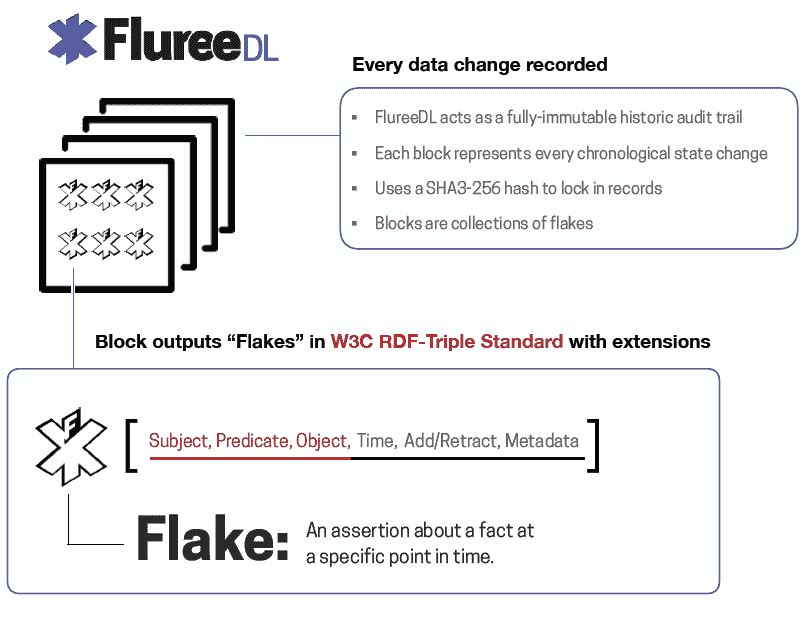

# Fluree 通过语义网技术扩展了区块链的覆盖范围

> 原文：<https://thenewstack.io/fluree-extends-blockchains-reach-with-semantic-web-tech/>

区块链数据平台 Fluree 的发展趋势使得共享和协作可验证的数据成为可能。

Fluree 在语义图数据库和万维网联盟的[语义网标准](https://www.w3.org/2001/sw/wiki/Main_Page)的基础上使用分布式分类账，跟踪数据的来源，使时间旅行到其历史上的任何一点，建立信任和可验证性作为允许人们合作的基础。

Fluree 联合创始人 [Brian Platz](https://www.linkedin.com/in/brianplatz/) 表示:“Fluree 是一个解决我们在数据管理方面遇到的挑战的机会，特别是当它与一些新的外部要求和数据压力相关时。“我们已经看到一些非常有趣的技术在过去的 5 到 10 年中出现，比如区块链，比如 W3C 语义网标准，我们真的看到了一个机会，可以利用这些技术，将它们结合起来，以解决这些新出现的问题，并在企业内更具战略性地处理数据。”

## 数据优先方法

布莱恩·普拉茨

普拉茨和连续创业者 Flip Filipowski 于 2011 年在北卡罗来纳州的温斯顿塞勒姆创办了这家公司。

普拉茨说，Fluree 正在从传统的区块链后退一步，使其更加通用，然后试图进一步服务于更多的用例。

他说，许多区块链技术都专注于分散化的金融用例，拥有简单的数据类型，如账户、余额和钱包。它使用常规数据库，而不是预定义的数据类型和数据行为，因此，当您可以跟踪货币时，您也可以使用它来跟踪发票或供应商或身份。

其中一个项目是与美国教育部合作，利用区块链提供教育证书的安全共享。它还与国防部和美国空军签订了合同，建立一个安全的数据共享平台，以验证信息是如何进入其系统以及由谁进入的。[威克森林医学院](https://flur.ee/2020/02/25/wake-forest-school-of-medicine-partners-with-fluree-to-improve-research-analysis/)正在使用 Fluree 整合来自多种医疗保健设备的数据，以加快关键分析和决策的速度。

根据 Platz 的说法，与传统区块链的另一个区别是，它针对数据进行了[优化。区块链不是那么优化，所以你必须在链外存储数据，“因为它太差了，”他说。](https://www.thenewstack.io/distributed-data-not-apps-build-the-foundation-for-web3)

“我们真的把它翻了过来；对区块链来说，这是一种非常数据优先的方法，”他说。正如 git 使软件开发人员能够在源代码上进行合作一样，他将其称为“git for data”产品，提供了一个不可变的分类帐，能够看到事情如何随着时间的推移而变化，具有一层互操作性，以及该公司所谓的 SmartFunctions，以提供对权限的严格控制。

[TerminusDB](https://thenewstack.io/terminusdb-takes-on-data-collaboration-with-a-git-like-approach/) 、 [Dolt](https://thenewstack.io/dolt-a-relational-database-with-git-like-cloning-features/) 和开源的 [Noms database](https://thenewstack.io/noms-database-aims-become-git-shared-data/) 都是其他具有自己的“git for data”方法的产品，尽管没有区块链。

## 去耦架构

有两个部分:FlureeDL，这是一个不可变的分布式分类帐，可以防止数据篡改，以及 FlureeDB，这是一个语义图数据库，经过优化可以在 FlureeDL 上构建应用程序。每个部分独立运行和扩展。

在这两个系统中，开发人员使用 SmartFunctions 逻辑来实施定制的读/写权限和规则。

Fluree 将事务组合成不可变的时间戳块，并使用高级加密技术锁定它们，以实现安全性和数据完整性。私有-公共密钥基础设施为授权用户提供访问。权限嵌入在数据层，而不是用 API 的网络缝合在一起。可以在单元级别对其进行配置，以根据其安全许可和角色来限制谁可以查看信息。

FlureeDL 是一个可编程的分类账，它通过各种检查点验证每笔交易。例如，每笔交易都通过提交用户的唯一密钥来签名；根据模式规则检查每个事务；智能功能控制许可权；并且对照先前的事务检查每个事务散列以寻找可能的重复，从而防止中间人攻击。

每次更新都记录在一个块中，该块包括前一个块的散列和它自己的安全散列算法 [SHA3-256](https://en.wikipedia.org/wiki/SHA-3) 。

它通过可编程规则和 [Raft](https://raft.github.io/) 或 [PBFT](https://medium.com/thundercore/consensus-series-pbft-3e011e7f3691) 共识机制实现智能治理，提供了到历史上任何时间点的时间旅行、审计跟踪以及分散部分或全部应用程序数据的能力。

此外，公司可以在多个区块链上划分数据，每个都有自己的治理规则和共识属性。然后，FlureeDB 可以查询它有权访问的每个 FlureeDL，并将结果作为统一的数据集进行检索。

FlureeDL 以 W3C 标准化的 [RDF 格式](https://www.w3.org/RDF/)输出不可变的块数据，这使得结构化和半结构化数据能够在不同的应用程序和数据库之间混合和共享。

当应用程序想要进行更改时，它会向 FlureeDL 网络中的服务器提交一个事务，服务器会根据适用的模式和规则对其进行验证，然后生成 RDF 格式的数据，表示有效事务的数据库增量，以及相关的元数据。

Fluree 支持 SQL、 [GraphQL](https://graphql.org/) 和 [SPARQL](https://www.ontotext.com/knowledgehub/fundamentals/what-is-sparql/) ，而自己的 FlureeQL 可以结合 SPARQL 的图查询优势和 GraphQL 的图抓取能力。

“你可以使用它们中的任何一个或全部，你可以随心所欲地混合它们，”普拉茨说。“与任何其他查询接口相比，[fluresql](https://docs.flur.ee/docs/query/analytical-query)所做的事情实际上是用 JSON 来表示的，这使得它非常容易使用。”

语义数据库 FlureeDB 本身理解关系和时间，对于高度分析性的聚合和图形查询非常有用。

虽然大多数数据库要求在应用程序的 API 层构建权限层，但 FlureeDB 中的权限逻辑作为元数据直接嵌入到数据中，消除了该公司认为不必要的集成层。

### 内置防御

Platz 在谈到给予数据自我保护的能力以及数据遵守既定标准时，提到了粒度许可。

“每个连接到 Fluree 实例的人都有一个基本上为他们生成的个性化数据库。它非常有效，发生在幕后，但它只包含他们有权访问的数据，”他解释道。“这就是允许最终用户发出任何他们想要的查询的原因，因为他们只有他们可以看到的那种虚拟数据库中的数据。

“通常，您必须通过构建自定义 API，以许可的方式完成与外部方的数据共享。…或者您必须将它们部署在实施所有这些权限的应用服务器上。因此，我们通过允许您将这些许可规则放入数据层来解决这个问题。通过这样做，您实际上给了您的客户更多的灵活性。您可以这样做，而不必构建自定义 API，也不必强迫他们为您的自定义 API 构建自定义代码。这是保护数据的更好方式。”

他说，因为系统理解关系，它可以消除定制的需要。

“我们的锁定机制可以实现逻辑。我们称之为智能函数，它们和数据一起存储。使它们比典型的“许可”范式更强大的是，因为它在数据中，并且是数据的一部分，它可以在规则中利用数据。所以你可以在供应链系统中动态地更新这个发票，因为你为公司工作，在公司中有这个角色，而公司就是开发票的人。但你不能更新别人的发票，”他说。

他说 Fluree 可以简化构建分布式应用程序的过程。

“Fluree 本身就是一个数据库，因此您无需在其他地方存储外链数据。它可以在本地存储这些信息。它还公开了这些查询接口，GraphQL 将是一个常用的接口，类似 React 这样的前端 web 应用平台可以与这些接口进行本机对话。因此，您可以在 Fluree 上部署这个权限分类帐。这是管理所有这些数据，智能功能，数据自我保护，你实际上可以建立一个前端用户界面，可以直接连接到区块链。你不需要保持任何东西同步，你不需要集成任何东西，你不需要构建任何 API，你有一个实时的前端应用。因此，构建分布式应用程序或分散式应用程序变得非常容易，”他说。

作为其投资者之一——该公司已经筹集了 750 万美元——[Ray Roth rock](https://twitter.com/rayrothrock?lang=en)，Venrock 的前管理合伙人，在谈到该公司时说道:

“随着 Web 3.0 机器对机器实时人工智能应用的出现，网络安全方法需要从只允许阶段门访问数据转向允许多方实时访问数据，同时仍然确保其完整性，而 Fluree 位于区块链的数据平台正是这样做的。”

<svg xmlns:xlink="http://www.w3.org/1999/xlink" viewBox="0 0 68 31" version="1.1"><title>Group</title> <desc>Created with Sketch.</desc></svg>