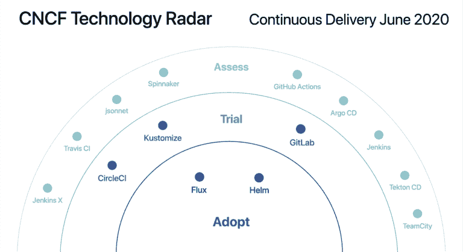

# Flux、Helm Top Cloud 本地用户对持续交付的建议

> 原文：<https://thenewstack.io/flux-helm-top-cloud-native-user-recommendations-for-continuous-delivery-technologies/>

Helm package manager 和 Flux GitOps operator 是支持云原生连续交付运营的两项最受推荐的技术，由[云原生计算基金会的](https://www.cncf.io) [终端用户社区](https://www.cncf.io/people/end-user-community/)确定。

生态系统主任 Cheryl Hung 在介绍该项目的网上研讨会上说[这些评估是新的](https://www.oicheryl.com/) [CNCF 技术雷达](https://www.cncf.io/blog/2020/06/12/introducing-the-cncf-technology-radar/)的一部分，这是一个新的倡议，旨在在从业者之间分享关于他们正在使用什么云原生工具，以及他们为这些软件栈开发了什么最佳实践或模式的信息。来自大约 140 个组织的代表参加了这个小组，该小组每两周举行一次私人聊天，讨论他们的经验。

Hung 说，“我们的目标是广泛地观察一系列公司”，而不是从使用什么技术以及如何部署这些技术的单一角度出发。

CNCF 长期以来一直提供[云原生交互路线图](https://www.cncf.io/people/end-user-community/)，以帮助架构师理解云原生计算所需的工具。这是 CNCF 可用于云原生部署的所有技术的综合列表，不仅仅是 CNCF 托管的技术。这份名单本身就很庞大——最近一次统计列出了 1395 个条目。虽然全面，但交互式地图留下了许多问题:首席技术官如何选择和评估适合这项工作的工具？这个项目计划突出那些组织可能想先看看的技术。

这就是科技雷达可以帮忙的地方。

这份报告的格式被 ThoughtWorks 咨询公司采用，该公司十多年来一直用它来评估技术。对于每个技术类别，技术都经过评估，并被归入以下四个类别之一:

*   **采用**:已经在生产中使用了一段时间的稳定且有用的技术。最高推荐。
*   **试验**:测试已经成功部署的技术的建议
*   **评估**:已经过测试并显示出前景的技术，但尚未获得足够的认可。
*   持有:一种有更合适替代品的技术

该小组计划每个季度在一个预定义的用例中评估 10-20 项云原生技术。每个参与公司都有一份技术清单(加上添加他们自己的技术的机会)，并被要求在上面列出的四个选项下评估这些技术。

对于最初的一轮，该小组着眼于持续交付(CD)工具，这是当前发展的温床。共有 33 家公司参与进来。

在这里，通量和舵都属于“采用”类别，因为它们的有用性和稳定性早已被证明。“Flux 和 Helm 都有很多公司表示会采用，也有几家公司表示会保留，但总的来说(他们)有积极的共识，”Hung 说。Hung 指出，虽然 Helm 不是专门的 CD 技术，但它广泛用于许多 CD 场景。

在 CD 用例的“试用”类别中，有 [CircleCI](https://circleci.com/) 、 [Kustomize](https://kustomize.io/) 和 [GitLab](https://www.gitlab.com) ，它们中的每一个都显示出了希望，但可能缺乏某些功能，或者可能还没有足够的冠军。技术可以归入“评估”类别有多种原因:[例如，CloudBees 的 Jenkins](https://www.cloudbees.com/jenkins) 仍然被广泛使用，尽管没有多少用户推荐它用于新的安装，而是指向更多的云原生就绪技术，如 GitOps-ready Flux。或者，Spinnaker 也属于“评估”类别，在社区中有广泛的认知度，但是还没有足够的用户推荐它。

作为第一版的编辑，洪承认排名永远不可能完全客观。她必须对介于两者之间的技术做出判断。此外，考虑到云计算开发的动态特性，该列表是一个时间点的快照，并且会经常更改。“这不是 CNCF 说你应该这样做。如果一个项目在这里没有被推荐，这并不意味着它没有价值，这只是意味着从这个特定的队列中，这些是数据反映的结果，”她说。

在附带的视频中，Hung 还反思了她在汇编结果时观察到的一些情况，这让我们得以一窥组织如何看待 CD。她注意到，许多组织已经测试了多达 10 项技术，但实际使用时只选择了 2-4 项。此外，许多公司从自建系统开始，尽管没有一家使用 CNCF 景观中的商业云服务。

CNCF 还提供了许多案例研究来补充这份报告，包括医疗保健提供商 Babylon 和 T2 金融服务巨头 Intuit。

[https://www.youtube.com/embed/0792Q3l6tK8?feature=oembed](https://www.youtube.com/embed/0792Q3l6tK8?feature=oembed)

视频

CircleCI、CloudBees、Cloud Native Computing Foundation 和 GitLab 是新堆栈的赞助商。

通过 Pixabay 的特征图像。

目前，新堆栈不允许直接在该网站上发表评论。我们邀请所有希望讨论一个故事的读者通过推特或脸书访问我们。我们也欢迎您通过电子邮件发送新闻提示和反馈:[feedback @ thenewstack . io](mailto:feedback@thenewstack.io)。

<svg xmlns:xlink="http://www.w3.org/1999/xlink" viewBox="0 0 68 31" version="1.1"><title>Group</title> <desc>Created with Sketch.</desc></svg>