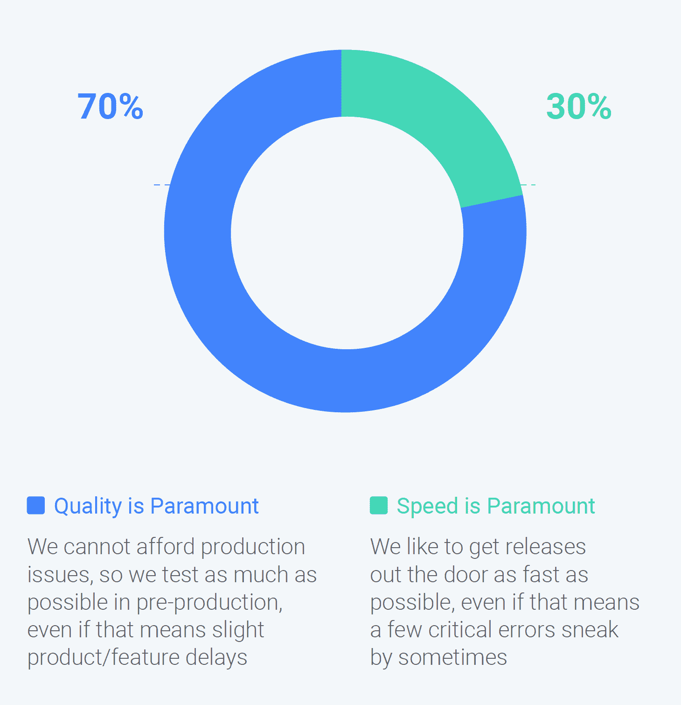

# 关注速度并不意味着关注自动化

> 原文：<https://thenewstack.io/focus-on-speed-doesnt-mean-focus-on-automation/>

根据帮助识别和修复软件问题的供应商 [OverOps](https://www.overops.com) 对 600 多名 IT 专业人员进行的[调查](https://land.overops.com/state-of-software-quality2020)，当被迫做出选择时，质量十次有七次胜过速度。在现实世界中，选择并不明显。新的堆栈使用了 2020 年版“[国家软件质量](https://land.overops.com/state-of-software-quality2020)”中没有包括的数据，来研究偏向于快速发布软件的含义。

偏爱速度的人更快。28%偏好速度的人至少每天发布新功能，而喜欢质量的人只有 17%的时间这样做。结果是，71%的“速度”受访者的组织每月至少遇到一次生产中的关键或影响客户的问题，而其他人的 53%也是如此。

虽然可能有更多的关键问题，但这并不意味着在故障排除上花费更多的时间。在那些负责故障排除的人中，大约 65%的人花费不到 25%的时间进行故障排除，不管他们是否关心质量。在发布代码之前花些时间并不能减少发布到产品中所花费的时间。开发人员可能会利用这些额外的时间来调整新特性和解决不太重要的功能。

具有讽刺意味的是，70%更喜欢质量的受访者使用自动化测试预生产，相比之下，只有 54%的人声称关心速度。自动化测试是为了让事情变得更快，但是它也执行策略并减少人为错误的机会。更喜欢速度的公司专注于后一个问题，几乎一半(48%)的公司表示生产错误的主要原因是缺乏正确的流程，相比之下，其他人的比例为 28%。

接受调查的 IT 专业人士中，大约一半是开发人员或软件工程师。来源:Overops《2020 年报告》软件质量状况。

这些结果需要一些背景知识。有许多不同类型的测试:单元测试、集成测试、功能测试、负载测试等等。不同的工作角色通常要求对每种类型承担主要责任。根据 Tricentis 和几个合作伙伴发布的“[开源测试状态](https://www.tricentis.com/state-of-open-source-2020/)”，功能测试是质量保证/测试的领域，缺乏时间是其最大的障碍。

在另一项来自 GitLab 的调查中，测试是软件开发延迟的首要原因。无论测试是为了安全、客户体验还是性能优化，当另一个部门导致延迟时，人们都会感到沮丧。

考虑到这一点，这里是最后一项研究，“T2 2020 开发和测试报告，这是由 [Diffblue](https://www.diffblue.com) 委托的。在这份报告中，81%的开发人员表示，创建“测试文化”的最大障碍是缺乏来自管理层的专用资源，而管理层本身不太可能认为资源是一个问题。也许经理们知道他们正在资助一个独立的测试部门。这将举例说明想要承担更多测试责任的开发人员和 DevOps 团队所面临的难题。如果组织中没有专门的 QA/测试团队，QA 能做好吗？

Tricentis 是新堆栈的赞助商。

通过 Pixabay 的特征图像。

<svg xmlns:xlink="http://www.w3.org/1999/xlink" viewBox="0 0 68 31" version="1.1"><title>Group</title> <desc>Created with Sketch.</desc></svg>