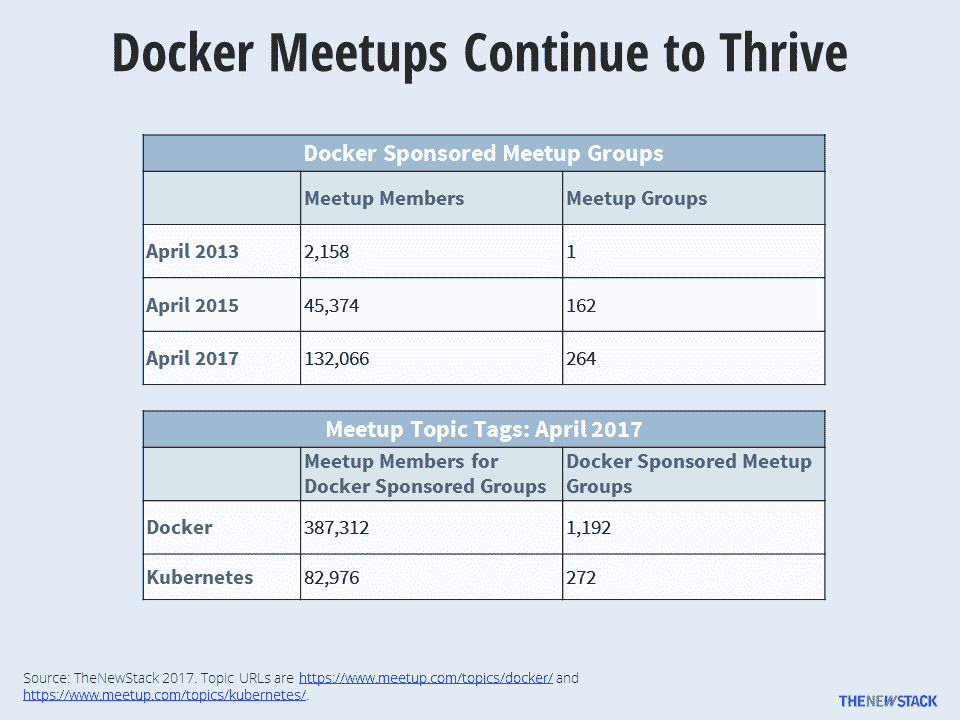
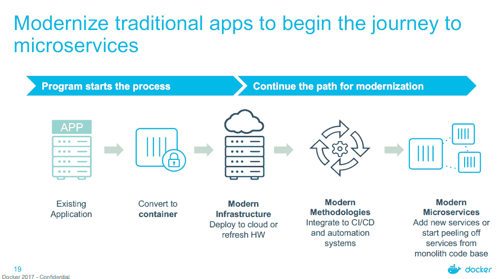

# Docker 并不害怕 Kubernetes，而是将目光投向了企业

> 原文：<https://thenewstack.io/focused-enterprise-docker-doesnt-fear-kubernetes/>

听听 Docker 首席执行官 Ben Golub 是怎么说的，当 Docker 的销售代表拜访一个对使用 Kubernetes 开源 orchestrator 和相关工具拼凑自己的容器化基础设施感兴趣的组织时，销售代表会安排一个提醒，提醒他们几个月后再打电话给该组织，以便再次登记。

Golub 解释说，这些努力往往会失败。“一个公司的五人团队很难复制一个 150 人的团队过去两年在 Docker 所做的事情，”他说。即使组织成功地构建了一个平台，它仍然必须努力确保来自多个供应商的支持。

“所以对我们来说，Kubernetes 是一项有趣的技术，但它不是一个特别的竞争威胁，”Golub 在上周在奥斯汀举行的 DockerCon 2017 新闻午宴上说。在过去一年左右的时间里，围绕容器的很多讨论都被吸引到了 Google 开源的容器编排软件 Kubernetes。特别是在上个月 KubeCon Europe 会议成功之后，该软件越来越被吹捧为运行云原生应用程序的逻辑基石。但是在 Golub 看来，buzz 并不是唯一一个成功的企业技术。

Golub 说:“很明显，人们对 Kubernetes 很感兴趣，”但他很快补充说，编排只是运行容器基础设施的一个难题。“编排是一个非常重要的层，但也有各种不同的安全层。有网络存储，最重要的是建立一个安全的供应链。”

Golub 表示，在竞争性销售电话中，Docker 并不像其他成熟的容器云平台那样关注 Kubernetes，如红帽的 [OpenShift](https://www.openshift.com/) 或其他各种平台即服务或容器即服务提供商。

“Docker 不仅仅是容器，”Golub 说。

在 DockerCon，该公司强调了它为满足企业需求所做的努力。也正是 [RedMonk](http://www.redmonk.com) 分析师芬坦·瑞安向我们指出，今年 DockerCon 与会者的平均年龄稍大，可能比往年更保守一些。换句话说，企业经理们都出席了，并愿意看看 Docker 能做些什么。

Docker meetups 仍然远远超过 Kubernetes (TNS 分析师劳伦斯·赫克特)。

## 商店中的 Oracle

为此，围绕为企业配备集装箱，DockerCon 推出了大量新产品和服务。

例如，Oracle 已经准备了其广泛的数据库、中间件和开发工具系列，因此可以从最近推出的 Docker Store(Docker 的容器化应用市场)中访问它们。

甲骨文负责产品管理和战略的副总裁 [Sidhartha Argawal](https://www.linkedin.com/in/siddharthaagarwal/) 说:“我们的目标是消除在 Docker 基础设施中使用甲骨文内容的人们之间的任何摩擦。

首批 Oracle 软件版本包括 Oracle 数据库、Oracle MySQL、Oracle Java 8 SE 运行时环境、Oracle WebLogic Server、Oracle Coherence 和 Oracle Instant Client。随着时间的推移，更多的 Oracle 软件也将被装箱并存放在 Docker Store 中。

定价将与[常规 Oracle 采购流程](https://www.oracle.com/corporate/pricing/index.html)相同，大多数软件可免费用于测试和开发，并获得生产工作许可。如果已经有许可协议，用户可以通过现有的许可协议为生产拷贝付费。为了进一步润滑轮子，该公司提供了 300 美元的信用点数来测试这些容器化的应用程序。

从 Oracle 目前的角度来看，容器主要是作为一种简化软件的持续集成和部署的方式。Argawal 说:“Docker 本身使得通过 DevTest 过程、通过构建过程获得某些东西的管道变得很容易。

Argawal 说:“现在，我没有在生产中发现大量的 Docker 部署，”他补充说，总的来说，将 Docker 引入企业还有许多工作要做，

Argawal 说:“现在，开发人员必须做大量的工作来使基于 Docker 的环境运行起来。“他们不得不担心编排。他们不得不担心调度，负载平衡。开发人员不得不做比以前更多的事情。这就是生态系统必须进化的地方，让它变得容易得多。”

随着时间的推移，容器化可能会更倾向于容器即服务(CaaS)，例如负责这些任务的 [Oracle 容器服务](https://cloud.oracle.com/container)。

他进一步解释说，甲骨文认为有两类 it 客户对容器感兴趣。有人对在网飞构建一个云原生基础设施非常感兴趣(但仍处于早期阶段)。这一组客户最感兴趣的是尽可能保持对基础架构的控制。用户群的另一部分也对容器感兴趣，尽管它必须维护相当多的遗留软件。

“企业客户群中的每个人都有遗留应用程序。你不能就这样把它们扔掉。因此，许多无状态的微服务需要与有状态的应用程序对话，”Argawal 说。“因此，我们创建了到 Oracle 数据库、WebLogic 等的自然连接。，所以无状态应用程序不需要做很多工作来与有状态应用程序对话。”

事实证明，Docker 本身也对满足这部分企业用户的需求非常感兴趣。

生态系统合作伙伴对 Docker 和 Kubernetes 都有计划(TNS 分析师劳伦斯·赫克特)。

## 一个企业 Java 和。网络世界

“每当我们开始与企业客户打交道时，第一个问题不可避免地是‘我如何开始微服务之旅？’Docker 首席运营官斯科特·约翰斯顿说道。

在会议上，该公司推出了一个新的计划，以帮助组织将遗留应用程序转移到容器中。根据 Johnston 的说法，这是通往集装箱化基础设施的第一步。

尽管围绕容器使用的早期努力主要围绕构建新的应用程序，但大多数企业将大部分 IT 预算(超过 80%)用于维护当前的应用程序。约翰斯顿说，该公司希望“在他们所在的地方见到他们”。

因此，Docker 推出了一项专业服务，旨在帮助组织在一周内启动并运行一些基于容器的操作。这些服务由系统提供商提供，如微软、HPE、思科和埃维诺，埃维诺是一家由微软和埃森哲合作成立的系统公司。

在为期五天的过程中，[传统应用程序现代化](https://goto.docker.com/MTAkit.html) (MTA)项目引导客户将传统应用程序迁移到容器化平台。“我们可以采用一些自动化和方法，将现有的应用程序容器化。我们不必回到源代码，也不必重新设计应用程序，”约翰斯顿说。

最终的堆栈使用 [Docker 企业版](https://thenewstack.io/docker-launches-enterprise-edition-refines-market-strategy/) (EE)构建，并使用合作伙伴提供的混合云基础架构产品的模板化堆栈。一旦到位，由此产生的基础架构有望将新应用程序的配置时间减少 75%，并减少对虚拟机的需求，使应用程序更易于移植。

该服务的初始应用程序并不是大型企业应用程序，如 SAP 或 Peoplesoft，而是小型定制的业务线应用程序。Net 和 enterprise Java，它们需要从老化的服务器转移到云中。Johnston 说，Docker 为将这些应用无缝迁移到容器中而构建的自动化工具将在未来扩展到支持更多类型的应用。

“电梯移位在市场的某些领域名声不佳，因为它允许糟糕的架构持续存在。但是我们喜欢说‘这不是你祖父的电梯’约翰斯顿说:“这是一个传统应用的现代化，但它让你踏上了微服务之旅。

[红帽](https://www.openshift.com/)是新栈的赞助商。

专题图片:Docker 首席执行官 Ben Golub 在 DockerCon 2017。

<svg xmlns:xlink="http://www.w3.org/1999/xlink" viewBox="0 0 68 31" version="1.1"><title>Group</title> <desc>Created with Sketch.</desc></svg>