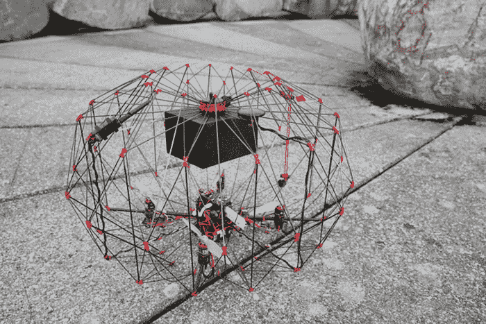
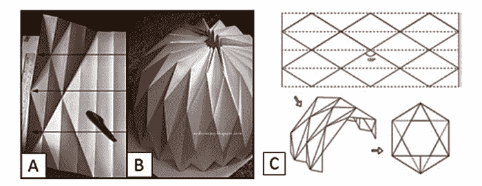
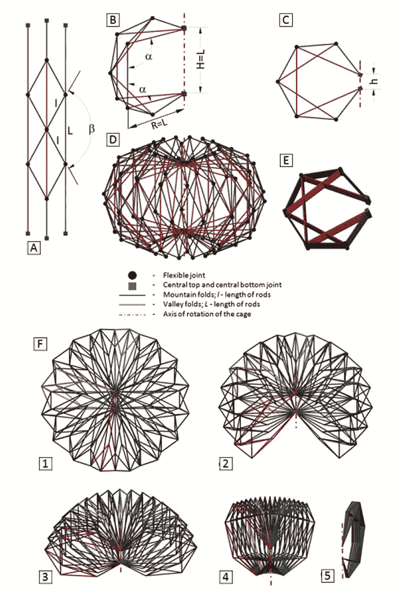
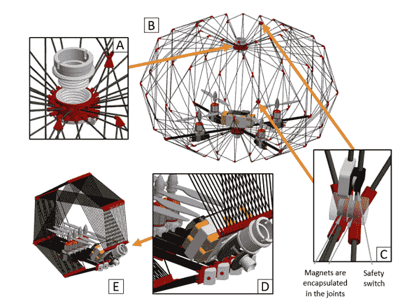

# 带有折纸式保护笼的可折叠无人机有助于更安全的交付

> 原文：<https://thenewstack.io/foldable-drone-origami-like-protective-cage-makes-safer-deliveries/>

无人驾驶飞机已经准备好接管天空，它们不仅可以快速运送你刚刚在网上订购的[甜甜圈和热咖啡](https://thenewstack.io/seven-eleven-kicks-off-era-commercial-drone-deliveries/)，还可以运送[拯救人类生命的医疗用品](https://thenewstack.io/drones-deliver-life-saving-medical-supplies-rwanda/)和[濒临灭绝的雪貂](https://thenewstack.io/glorified-gumball-machine-drones-airdrop-vaccine-pellets-endangered-ferrets/)(更不用说可能会毁了你的婚礼)。

无人机确实正在改变我们的世界，但在所有这些情况下，安全是最重要的问题。毕竟，没有人希望无人机在他们等待送货的时候砸碎或割伤他们的脸，或者不小心把东西掉在他们的头上。

瑞士洛桑联邦理工学院 (EPFL)智能系统实验室[的工程师们有一个解决方案:一架可折叠的多翼无人机，当它在空中飞行时，会在自身和货物周围形成一个保护笼，当它不在飞行时，可以折叠成一个整洁的小包裹。](http://lis.epfl.ch/)

[https://www.youtube.com/embed/rvijnNm2Djw?feature=oembed](https://www.youtube.com/embed/rvijnNm2Djw?feature=oembed)

视频

## 折纸和灯笼

受日本折纸和中国纸灯笼折叠结构的启发，EPFL 的折纸式货运无人机可以折叠起来，体积减少 92%。当无人机的笼子打开时，其巨大的内部容积有助于产生容纳包裹所需的升力——对于目前的原型来说，最大重量为 500 克。这听起来没什么，但这里的想法是解决点对点和商业交付中“最后一厘米”的安全问题。据该团队称，尽管有无人机，但没有其他无人机像这种无人机一样，这不仅增加了用户的安全性，还消除了对专用着陆垫的需求，并解决了便携性问题。

“有了这个新概念，无人机就成了包装，”实验室主任达里奥·弗洛雷亚诺说。“包装折叠起来就变得很小，可以储存和运输。当[无人机包裹]在包裹周围展开时，它为人们提供了保护，因此他们不会被割伤，它也为包裹提供了保护。”

研究小组转向折纸技术寻找线索，因为折纸结构显示出很高的强度重量比，并且能够通过折叠显著收缩。如果你曾经仔细看过如何折叠一件折纸作品的教学图，你会注意到它是由“瓦片”组成的，这些瓦片依次由表示折叠的虚线连接起来。

在这种以折纸为灵感的货运无人机的情况下，它的笼子采用了模块化设计，由碳纤维支柱勾勒出的重复片段组成，并用灵活的 3D 打印接头连接。这些段折叠并围绕中心轴旋转。正如该团队在他们的论文中所写的那样:“每一段都是全等等腰三角形镶嵌的结果，其中边是支柱，顶点是柔性接头。”

这种设计为多翼飞机的螺旋桨提供了最佳的气流，此外还创造了一个坚固耐用的结构，在飞行过程中提供了更大的稳定性，特别是相对较重的货物，可能会导致无人机在空中摇晃和不稳定。由于有大量的分段，模块化结构非常密集，这意味着接收用户可以更安全地抓住它，但代价是阻力增加，允许的有效载荷更小。

该团队还发现，货物在多翼飞机上方飞行效率更高，因此螺旋桨的气流不会被阻挡，这将降低它们的效率。该设计还用多翼机的臂代替了笼中的一些支柱，从而该结构是一个整体，减轻了重量并简化了装置的打开和关闭。作为一个额外的保护功能，笼子有一个安全锁定机制，一旦它在打开的位置停止螺旋桨。

该团队最近在智能机器人和系统国际会议上展示了原型。该团队的目标是现在致力于将这种类似折纸的货运无人机扩大到更大的有效载荷，原型可能会扩大到 15 公里以上的运载能力为 2 公斤，他们估计这将占亚马逊所有交付的 86%。研究人员还计划探索不同形状的笼子，以适应不同类型的包裹，并可能添加降落伞、额外的传感器和摄像头等功能，与智能手机应用程序相联系，这将有助于远程控制和验证收件人的身份。

从广义上讲，这是一种解决问题的聪明方法，随着无人机在各种应用中变得越来越广泛，这个问题变得越来越重要。这种无人机不仅可以让送货更加安全，还更适合飞入危险的地形或灾区，这要归功于它们的保护罩和潜在的易用性，即使对没有经验的人来说也是如此。

图片:EPFL

<svg xmlns:xlink="http://www.w3.org/1999/xlink" viewBox="0 0 68 31" version="1.1"><title>Group</title> <desc>Created with Sketch.</desc></svg>