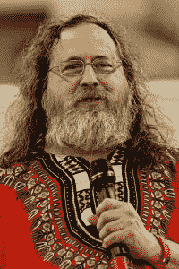

# 不管是好是坏，理查德·斯托尔曼回到了自由软件基金会

> 原文：<https://thenewstack.io/for-better-or-worse-richard-stallman-returns-to-the-free-software-foundation/>

我已经花了超过 24 小时思考如何处理这件事。老实说，我仍然不确定。

你看，我们生活在一个由#MeToo 运动推动的时代，在这个时代，每个人的声音都很重要。所以当宣布理查德·M·斯托曼被欢迎回到自由软件基金会的董事会时，我的第一反应是，“为什么？”

在我进入这个话题之前，让我们回顾一下，列举一些事实。

[理查德·斯托尔曼](https://stallman.org/)，简称 RMS，一直是一个有争议的人物。一方面，几十年来，他一直是自由软件的最大拥护者。他发起了 GNU 项目，为 Linux 搭建了舞台。你可以说是他发明了“开源”这个概念，尽管他更喜欢你称之为更严格定义的“[自由软件](https://www.gnu.org/philosophy/open-source-misses-the-point.en.html)”另一方面，他对自由软件相当绝对的态度有助于在 Linux 和开源社区内建立一个派别，在那里使用任何非自由软件都是被看不起的。但在这样做的同时，斯托曼积累了一些荣誉和奖项。

但是代价是什么呢？

## 斯托曼做了什么？

RMS 最大的问题是，很长一段时间以来，他的主要关注点，可以说，是支持和建立一个狂热的追随者，而不是开源软件。斯托曼最后一次对开源做出真正的贡献是在 2007 年，Gnu 公共许可证 v3 发布了。从那以后，开源软件有了很大的发展。

最大的问题是，RMS 有吗？

我记得，很久以前，在我第一次参加 Linux 大会的大厅里(大约是在 1999 年)，我感受到了与一个由失败者和独特的个人组成的社区的联系，他们只有一个目标——让 Linux 成为这个星球上的主流操作系统。这些人中有一些是我见过的最聪明的开发者和黑客。也有一些更喜欢 Linux 和开源软件的人仍然被蒙在鼓里，所以这可能是一个没有人知道或理解的神秘实体。他们希望开源软件成为用户和开发人员的秘密领地，他们能够运行鲜为人知的操作系统。他们认为自己是 l33t，如果你不知道 l33t 是什么，你就不配。

几十年来，Linux 和开源已经变得完全不同。Linux 不仅变得令人难以置信的用户友好，而且开源也成为许多企业系统构建的基础。考虑到这一点，我不得不问，“RMS 如何适应开源的新世界秩序？”

开源是关于包容、平等、成长和授权的。这不再是一个秘密，也不再是一场基于纯粹主义者意识形态的运动，而且(坦率地说),带回关于开源应该是什么的老派思想很可能不仅对开源社区有害，而且对企业业务也有害。

想想这个:自从 RMS 在 2019 年离开自由软件基金会以来，它和 GNU 之间的紧张关系已经消失了。这两个组织现在和谐共存，这是斯托曼执掌 GNU 时从未有过的。

## 不再有眼罩

除了斯托曼的怪癖，还有更多不可原谅的时刻，比如他对恋童癖的评论，或者他对杰弗瑞·爱泼斯坦的年轻受害者的不可原谅的评论。这并不是说他的一些评论可能被断章取义了(这不是我或你或新堆栈可以决定的)，但考虑到他入侵的频率和性质，对于一个最终赢得了应有尊重的组织来说，这是一个非常危险的命题。

老实说，让斯托曼回归可能是一颗随时可能引爆的#MeToo 炸弹。由于所有的指控，没有证据表明他已经接受了他的罪责或表现出任何悔意。事实上，自他发表声明以来，RMS 所做的只是声称这些声明被断章取义了。他有没有费心为他的麻木不仁和有害的主张道歉？他甚至愿意发表公开声明，给我们任何迹象表明他已经改变或看到他以前的方式的错误吗？

> 开源是关于包容、平等、成长和授权的。它不再是一个秘密，也不再是一场基于纯粹主义者意识形态的运动。

开源软件是企业业务的宠儿。如果没有开源，云原生或容器就不会存在。没有开源，我们就不会有 Linux，或 Android，或 ChromeOS，或 Kubernetes…或，或，或(这个列表可以一直列下去)。

那么，如果 RMS 被重新安装到 FSF 中会发生什么，多米诺骨牌效应是企业不得不重新考虑他们是否能因为一个人而支持一场软件运动？

自由软件基金会无法承受戴上这样的眼罩，除非他们愿意冒因公众舆论可能的强烈反对而导致挫折的风险。是的，会有人为这一举动欢呼。为什么？斯托曼有相当多的追随者。这并不意味着这是一条正确的道路。鉴于 RMS 已经宣布(通过在 Twitter 上分享的[视频)他在 2019 年](https://twitter.com/nixcraft/status/1373905399707955202)因其言论被驱逐后再次回到 FSF 董事会[，该组织其他成员(如 Vicky Brasseur)对此消息反应不佳也就不足为奇了。布拉瑟尔在推特上谈到了 RMS 的新闻，“尽管众所周知的毒性，@FSF 已经宣布 RMS 将重返董事会。他们在 2019 年 9 月向前迈出的一步转变为回到#自由软件黑暗时代的两大步。”](https://www.theverge.com/2019/9/17/20870050/richard-stallman-resigns-mit-free-software-foundation-epstein)

布拉瑟尔继续说道，“我现在很惭愧我在 2019 年 9 月加入了@FSF。我觉得被欺骗了，我相信组织致力于改变。让 RMS 重返董事会证明了他们只致力于现状，保持保守派的权力，而不是推动包容的运动。”

应该对权力说真话的有力的话。最大的问题是，自由软件基金会会听吗？对于一个宣称自由和解放的团体来说，欢迎斯托曼回归将是一个挑战。

作为一个几十年来一直关注开源发展的人，我不希望看到这样的举动将社区(以及它所做的一切积极的事情)和所有的前进势头推回到十年前。

<svg xmlns:xlink="http://www.w3.org/1999/xlink" viewBox="0 0 68 31" version="1.1"><title>Group</title> <desc>Created with Sketch.</desc></svg>