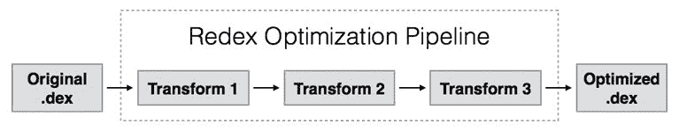
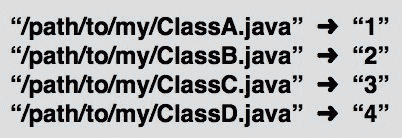
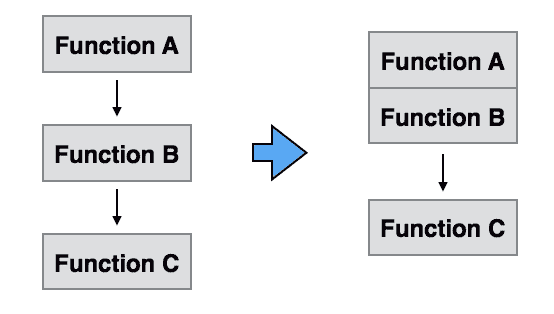

# 对于脸书和 Instagram 来说，一切都是为了自动化工作流程

> 原文：<https://thenewstack.io/for-facebook-and-instagram-its-all-about-automating-the-workflow/>

当经营一家有许多有才华(高薪)的软件工程师和开发人员的商店时，你希望让他们的创新尽可能快地推出。

因此，脸书和脸书旗下的 Instagram 开发工具来加速新服务和功能从工作台转移到一线服务器的过程也就不足为奇了。

在本周发布的独立博客文章中，脸书软件工程师[描述了](https://code.facebook.com/posts/1480969635539475/optimizing-android-bytecode-with-redex/)他们创建的一个新的工作流工具，该工具可以自动优化该公司 Android 应用程序的字节码，Instagram [吹捧](https://engineering.instagram.com/posts/496049610561948/flexible-feature-control-at-instagram)一种新的编程语言，用于指定更新如何在系统中传播。

两者都完全符合 [DevOps](https://thenewstack.io/application-architecture-key-predictor-overall-business-success-shows-new-devops-study/) 的实践，DevOps 寻求加强开发人员和运营人员之间的反馈回路，以加速向用户提供新功能和服务的过程。

据《邮报》报道，脸书的工作是为了提高其 Android 应用程序的性能，这是由脸书软件工程师马蒂·格里尼亚、伯特·马赫和沙恩·奈共同撰写的，他们主要在该公司加州总部门洛帕克从事该项目的工作。

这篇文章详细介绍了一个叫做 Redex 的内部应用程序的工作原理，它就像一条字节码优化的生产流水线。

有了 Redex，脸书开发者可以将他们自己的优化转换插入到编译 Android 代码文件的过程中，这些代码文件被称为。dex 文件(Dalvik 可执行文件的简称)。每次脸书更新其 Android 应用程序时，代码都会通过这个工具链运行，从而解决效率低下的问题。

Java 编译器产生 Java 字节码。dex 编译器获取 Java 字节码并生成。dex 字节码。Redex 采用。并根据需要优化它，”Maher 在后续的电子邮件中解释道。

Redex 管道

优化字节码的工作本身是非常不寻常的，尽管不是前所未有的。说到优化代码，大多数开发人员都专注于调整源代码。

字节码本身被设计得非常紧凑，为每条机器指令提供了字节大小的缩写。被编译成 Java 虚拟机可以读取的字节码是程序员的源代码和处理器运行的最终机器语言之间的中间步骤。

尽管如此，脸书发现压缩字节码还是有好处的。更少的字节码意味着应用运行更快，需要执行的指令更少。该应用程序本身在设备上占用的空间更少，下载速度也更快。

> “脸书的工程师往往行动迅速，所以我们想设计一些能够受益于多名工程师进行大量优化的东西，”该帖子的作者在 Redex 中写道。

他们列出了一些优化。

一个插件做缩小。开发人员可能会使类路径名或函数名非常具有描述性——也就是说很罗嗦——以便日后调试和理解代码。缩小插件用较短的占位符替换长字符串。它还生成一个备份映射，开发人员可以在以后调试时使用。

缩小

另一个插件做内联。同样，内联背后的思想是程序员的最佳实践不一定是机器最有效的实践。

对于编写代码，良好的软件工程实践要求将代码分离或封装成离散的功能块。

内联只是将被调用的函数移动到更靠近进行调用的函数。这可能需要将一个子函数放在它的父函数旁边。或者它可能涉及到删除一个中间包装器，该包装器被设计来平滑编写函数调用的过程。

“每当我们将一个函数内联到另一个函数时，我们可以减少与函数跳转相关的开销(和字节码)，”开发人员写道。

内嵌

虽然脸书已经自动化了优化字节码的过程，但 Instagram 在推出新功能的过程中做了一些改进。

像大多数网络规模的公司一样，Instagram 喜欢每次在一部分用户身上测试新功能。如果该功能有效，那么它可以分阶段推广到更大的用户群。如果它破坏了系统中的其他东西，或者如果最初的用户讨厌它，可以在它弄脏整个关节之前把它拉回来。

最初，Instagram 通过名为 IG Gateway 的软件控制这些级联发布。

IG Gateway 有其局限性。开发人员必须将部署说明直接写入功能代码本身。这意味着当需要全面部署该特性时，更新后的代码必须重新发送到全球的所有服务器上。它也没有提供关于如何推出或收回新功能的细微差别。正如 It 架构师常说的那样，它不可扩展。

因此，同样在门洛帕克工作的 Instagram 工程师 Chenyang Wu 创建了一种基于 Python 的领域特定语言(DSL)，Instagram 开发者可以用它来更严格地控制他们在 Instagram 上的更新。

Instagram 声称，基于 Python 的 Gate Logic 语言非常简单，甚至项目经理和销售人员都可以添加自己的条件。

这种语言旨在用简单的布尔逻辑来表达推出新功能的条件。例如，工程师可以指定某个国家或地区来引入某个功能，或者只在某个操作系统上运行该功能，或者甚至在某个操作系统的特定版本上运行该功能。

Instagram 的门逻辑

在工程师编写了展示条件之后，它们被编译成原生 Python 字节码，并被添加到数据库中，在那里它们可以被 Apache Zookeeper 获取，这是一款开源软件，Instagram 使用它来调度其全球服务器上的操作。

> “通过 Gate Logic，我们能够以一种安全而灵活的方式控制功能的推出，与硬编码的 Python 相比，没有性能损失，”吴写道。

脸书和 Instagram 都没有立即开源软件的计划。

特色图片[通过](https://code.facebook.com/posts/1480969635539475/optimizing-android-bytecode-with-redex/)脸书博客。

<svg xmlns:xlink="http://www.w3.org/1999/xlink" viewBox="0 0 68 31" version="1.1"><title>Group</title> <desc>Created with Sketch.</desc></svg>