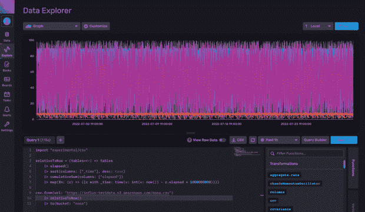
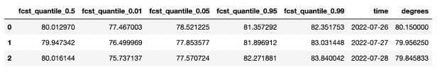

# 使用 Kats 和 InfluxDB 进行预测

> 原文：<https://thenewstack.io/forecasting-with-kats-and-influxdb/>

[](https://www.linkedin.com/in/anais-dotis-029623113/)

[Anais dot is-乔治乌](https://www.linkedin.com/in/anais-dotis-029623113/)

 [Anais 是 InfluxData 的开发者倡导者，热衷于使用数据分析、人工智能和机器学习来美化数据。她收集数据，进行综合研究、探索和工程设计，将数据转化为功能、价值和美感。当她不在屏幕后面时，你可以发现她在外面画画、伸展身体、登船或追逐足球。](https://www.linkedin.com/in/anais-dotis-029623113/) [](https://www.linkedin.com/in/anais-dotis-029623113/)

Python 库 [Kats](https://github.com/facebookresearch/Kats) 可用于[时间序列分析](https://www.influxdata.com/time-series-analysis-methods/?utm_source=vendor&utm_medium=referral&utm_campaign=2022-08_spnsr-ctn_kats-influxdb_tns)、[异常检测](https://www.influxdata.com/blog/birch-for-anomaly-detection-with-influxdb/?utm_source=vendor&utm_medium=referral&utm_campaign=2022-08_spnsr-ctn_kats-influxdb_tns)和预测。在本教程中，我们将了解如何使用 Kats 从 InfluxDB 时间序列数据库中预测数据。

我们还将使用 InfluxDB Python 客户端库来查询来自 InfluxDB 的数据，并将数据转换成一个 [Pandas DataFrame](https://www.influxdata.com/blog/getting-started-with-influxdb-and-pandas/?utm_source=vendor&utm_medium=referral&utm_campaign=2022-08_spnsr-ctn_kats-influxdb_tns) 以便更容易地处理时间序列数据。然后我们将进行预测，最后我们将把预测写回 InfluxDB。

本教程的目的是帮助用户开始使用 InfluxDB、InfluxDB Python 库和 Kats 一起进行时间序列预测。

它不是帮助用户决定他们应该使用哪种模型。Kats 有一个回溯测试模块，可以帮助您评估哪个模型最适合您的时间序列数据。

## 要求

本教程在 macOS 系统上执行，通过自制软件安装了 [Python 3。我建议设置额外的工具，如](https://docs.brew.sh/Homebrew-and-Python) [virtualenv](https://pypi.python.org/pypi/virtualenv) 、 [pyenv](https://github.com/pyenv/pyenv) 或 [conda-env](https://github.com/conda/conda-env) 来简化 Python 和客户端的安装。不然完整要求在这里:

```
influxdb-client=1.30.0
pandas=1.4.3
requests>=2.27.1  
notebook>=6.4.0
kats>=0.2.0

```

本教程还假设您已经创建了一个[自由层 InfluxDB Cloud](https://cloud2.influxdata.com/signup/?utm_source=vendor&utm_medium=referral&utm_campaign=2022-08_spnsr-ctn_kats-influxdb_tns) 帐户。它还假设您具有:

*   [创建了一个桶](https://docs.influxdata.com/influxdb/cloud/organizations/buckets/create-bucket/?utm_source=vendor&utm_medium=referral&utm_campaign=2022-08_spnsr-ctn_kats-influxdb_tns)。您可以将 bucket 视为一个数据库或 InfluxDB 中最高层次的数据组织。在本教程中，我们将创建一个名为 NOAA 的存储桶。
*   [创建了一个令牌](https://docs.influxdata.com/influxdb/cloud/security/tokens/create-token/?utm_source=vendor&utm_medium=referral&utm_campaign=2022-08_spnsr-ctn_kats-influxdb_tns)。

## Kats 库的功能

本节重点介绍 Kats 库的一些关键特性和工具，但不是全部。对于时序分析，Kats 为用户提供了使用 [TsFeatures](https://github.com/facebookresearch/Kats/blob/main/tutorials/kats_203_tsfeatures.ipynb) 方法从时序数据中提取重要特征的能力。这些功能可以帮助您确定调整预测模型时要使用的参数。

它们还可以帮助您评估哪些预测算法最适合您的数据。它们还可以帮助您确定根据时间序列数据生成准确预测的难度。您还可以使用 Kats 来执行自动超参数调整。

超参数是用于控制学习过程的机器学习模型的参数。流行的时间序列预测算法需要超参数调整(例如包括 ARIMA 模型)。一些模型通过寻找全局最大和最小或最优参数来最大化预测精度。

通常，用户必须提供初始值，算法会找到这些最佳参数。这些用户提供的初始值通常是最佳猜测。然而，如果用户提供的初始值与最佳值相差太远，算法会陷入局部最大值和最小值。

超参数调整是向模型提供不同的初始参数以获得全局最大值和最小值的过程。解决这个问题最简单的方法是对每个参数进行一系列组合。这种方法被称为网格搜索。这也是 Kats 提供的方法。最后，Kats 还有一个回溯测试模块，可以帮助用户决定使用哪种预测方法。它允许您比较不同预测模型的不同误差指标。

Kats 提供了很多时间序列异常检测的方法。变化点检测是识别变化点的过程。变化点是指时间序列数据中统计属性的突然变化，包括方差、均值、相关性、空间密度等。

变化点通常意味着异常。Kats 提供了多种用于变点检测的方法，包括用于自动变点检测的 ProphetTrendDetector 方法。Kats 还提供了动态时间扭曲(DTW)来比较两个系列的相似性和差异，以识别异常。

最后，Kats 还提供了许多预测选项，如 SARIMA 萨里玛(自回归综合移动平均)、霍尔特-温特斯、西塔、先知、神经先知、线性、LSTM(长期短记忆)、RNN(递归神经网络)、VAR(向量自回归)等。它甚至有一个 [Kats Ensemble](https://github.com/facebookresearch/Kats/blob/622dca5a661ba5e1815e0414a2365cfe1f1736d4/kats/models/ensemble/kats_ensemble.py) 方法，允许你组合各种统计时间序列预测模型。

[GM 集成方法](https://github.com/facebookresearch/Kats/blob/main/tutorials/kats_205_globalmodel.ipynb)允许你用 RNNs 建立指数平滑。通过这种方式，Kats 旨在成为时间序列数据科学问题的一站式解决方案。在本教程中，我们将使用 Kats 的预训练 [RNN-GME 全球模型进行预测。像这样的混合方法被证明是最有效的。这个特定的模型是在来自 M4](https://github.com/facebookresearch/Kats/blob/main/tutorials/kats_205_globalmodel.ipynb) (第四届 Makridakis 竞赛，一个备受推崇的时间序列预测竞赛)的 [100，000 个时间序列上训练的。M4 竞赛的获胜者采取了同样的方法。我决定尝试用这个模型进行预测，正是因为 ES-RRN(RNN 指数平滑)模型在 M4 竞赛中的成功。](https://www.sciencedirect.com/science/article/abs/pii/S0169207018300785)

## 资料组

对于本教程，我们将使用来自 InfluxDB 的一个[样本数据集](https://docs.influxdata.com/influxdb/cloud/reference/sample-data/?utm_source=vendor&utm_medium=referral&utm_campaign=2022-08_spnsr-ctn_kats-influxdb_tns)。InfluxDB 允许您轻松导入数据集，以便开始使用 InfluxDB 的查询、脚本和数据处理语言 [Flux](https://www.influxdata.com/products/flux/?utm_source=vendor&utm_medium=referral&utm_campaign=2022-08_spnsr-ctn_kats-influxdb_tns) 。具体来说，我们将使用 [NOAA 水样数据集](https://docs.influxdata.com/influxdb/cloud/reference/sample-data/#noaa-water-sample-data?utm_source=vendor&utm_medium=referral&utm_campaign=2022-08_spnsr-ctn_kats-influxdb_tns)(国家海洋和大气协会)。该数据集包含加利福尼亚州两条小溪的环境数据。要将这些数据写入 InfluxDB，导航到**浏览器页面**并复制以下 Flux 脚本:

```
import  "experimental/csv"

relativeToNow  =  (tables=<-)  =>  tables
    |>  elapsed()
    |>  sort(columns:  ["_time"],  desc:  true)
    |>  cumulativeSum(columns:  ["elapsed"])
    |>  map(fn:  (r)  =>  ({r  with _time:  time(v:  int(v:  now())  -  r.elapsed *  1000000000)}))

csv.from(url:  "https://influx-testdata.s3.amazonaws.com/noaa.csv")
    |>  relativeToNow()
    |>  limit(n:1000,  offset:  0)    
    |>  to(bucket:  "noaa")

```



使用 Flux 将 noaa 水样数据集写入桶“NOAA”后来自 InfluxDB UI 的截图。

## 使用 Python 客户端库查询 InfluxDB

接下来，我们将使用 [InfluxDB Python 客户端库](https://www.influxdata.com/blog/getting-started-with-python-and-influxdb-v2-0/?utm_source=vendor&utm_medium=referral&utm_campaign=2022-08_spnsr-ctn_kats-influxdb_tns)从我们的 InfluxDB 实例中查询数据。首先，我们导入客户端库并实例化它。然后我们构建我们的 Flux 查询，查询我们的实例并返回一个数据帧。我们将查询 Coyote Creek 的温度数据。

```
client  =  InfluxDBClient(url="http://localhost:8086",  token="xxx==",  org="<org or orgID>")
write_api  =  client.write_api(write_options=SYNCHRONOUS)
query_api  =  client.query_api()
df  =  query_api.query_data_frame('from(bucket: "noaa")'
  '|> range(start: -40d)'
  '|> filter(fn: (r) => r["_measurement"] == "average_temperature")'
  '|> filter(fn: (r) => r["_field"] == "degrees")'
  '|> filter(fn: (r) => r["location"] == "coyote_creek")'
  '|> aggregateWindow(every: 1d, fn: mean, createEmpty: false)'
  '|> pivot(rowKey:["_time"], columnKey: ["_field"], valueColumn: "_value")'
  '|> keep(columns:["_time","degrees"])')

```

我们查询过去 40 天的数据。然后我们过滤我们想要的数据。最后，我们应用一个 [aggregateWindow()](https://docs.influxdata.com/flux/v0.x/stdlib/universe/aggregatewindow/?utm_source=vendor&utm_medium=referral&utm_campaign=2022-08_spnsr-ctn_kats-influxdb_tns) 函数来获得日平均温度。我们添加这种转换来准备我们的数据，以便使用 Kats 的预训练 [RNN-GME 全球模型进行预测。它进行每日预测，所以我们需要我们的数据是每日的。接下来，我们使用](https://github.com/facebookresearch/Kats/blob/main/tutorials/kats_205_globalmodel.ipynb) [pivot()](https://docs.influxdata.com/flux/v0.x/stdlib/universe/pivot/?utm_source=vendor&utm_medium=referral&utm_campaign=2022-08_spnsr-ctn_kats-influxdb_tns) 函数来改变数据的形状，这样我们得到的数据帧就是预期的形状。最后，我们删除所有不需要的无关列。

## 使用 Kats 进行预测

要使用预训练的 RNN 全球模型进行预测，我们必须首先使用 load_gmensemble_from_file 方法来加载预训练的模型。你可以在这里得到预先训练好的模型。

`gme_rnn = load_gmensemble_from_file("pretrained_daily_rnn.p")`

然后，我们指定要在预测中包含多少个点。我们预测未来三天 Coyote Creek 的温度。

`fcsts = gme_rnn.predict(df_ts, steps = 3)`

接下来，我们将结果转换为数据帧，并与数据集的验证部分相结合。

```
fcsts_df  =  list(fcsts.items())[0][1]
fcsts_df  =  fcsts_df.join(test["degrees"])
fcsts_df.head()

```



我们在这里可以看到，我们的实际值“度”非常接近我们的预测中值(fcst_quantile_0.5)。

## 结论

*本教程并没有涵盖每一行代码。要查看完整的脚本，请查看此* [*回购*](https://github.com/InfluxCommunity/Notebooks/blob/master/Forecasting/Kats_GM_RNN.ipynb) *。*

我希望这篇博文能启发你利用 Kats 和 InfluxDB 进行预测。使用 Kats 的好处是，它提供了许多工具来解决[时间序列](https://www.influxdata.com/what-is-time-series-data/?utm_source=vendor&utm_medium=referral&utm_campaign=2022-08_spnsr-ctn_kats-influxdb_tns)数据科学问题。如果你想了解更多关于 RNN 模型是如何工作的，我强烈推荐阅读[这篇关于 RNNs 和 LSTMs(一种 RNN)的文章](http://colah.github.io/posts/2015-08-Understanding-LSTMs/)。我还鼓励你看一看 repo 之后的[，其中包括如何使用这里描述的许多算法和 InfluxDB 进行预测和执行异常检测的示例。](https://github.com/InfluxCommunity/Notebooks)

<svg xmlns:xlink="http://www.w3.org/1999/xlink" viewBox="0 0 68 31" version="1.1"><title>Group</title> <desc>Created with Sketch.</desc></svg>