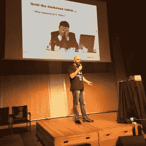
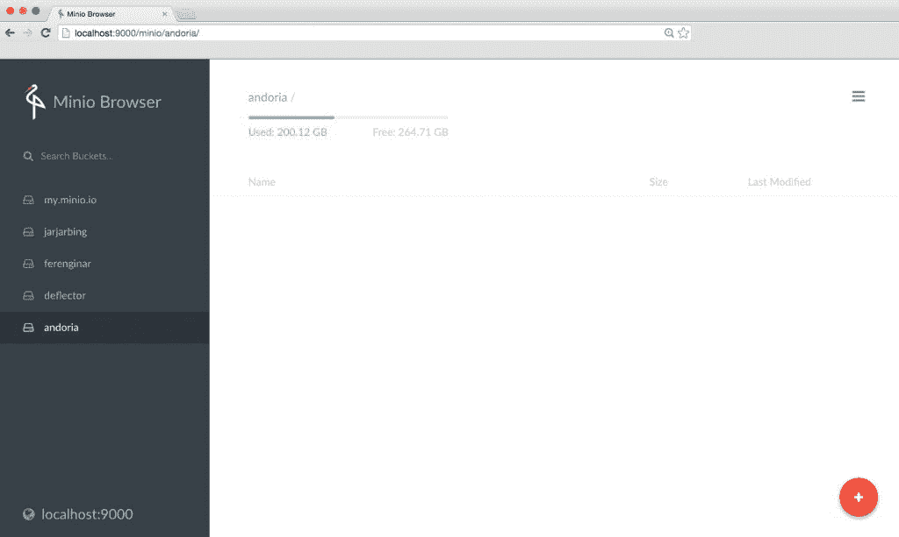

# 忘记文件系统:可扩展云存储的未来将是对象

> 原文：<https://thenewstack.io/forget-file-system-future-scalable-cloud-storage-will-objects/>

传统的企业级存储方法已经力不从心。组织积累了太多数据，无法维持存储所有数据的传统管理方法。

SUSE 委托进行的一项研究发现，超过 70%的受访者认为成本、性能、复杂性和碎片化都令人沮丧。他们期待“软件定义的存储”能够帮助解决所有这些问题。

这种挫败感是许多支持者称赞对象存储的优点的原因，对象存储很可能成为在云原生的数据聚集操作环境中发展的存储格式。

如今，每个组织都在产生极其大量的非结构化数据。这不是十年前企业存储提供商所预期的数据世界。在过去的半个世纪里，[文件系统](http://www.tldp.org/LDP/sag/html/filesystems.html)的概念已经很好地为计算服务了，它为计算机提供了一个接口，可以预测并一致地找到存储在磁盘上的数据。

> “我的云本机应用程序不需要文件系统来实现持久存储。”——Andrew Boag

但是，当存储管理员在其当前设置中不再能有效地管理数据量时，会发生什么情况呢？一种方法是通过集群或分布式文件系统，将数据分布在单个名称空间内的多个服务器上，例如针对 Hadoop 的 [GlusterFS](https://www.gluster.org/) 、 [CephFS](http://docs.ceph.com/docs/master/cephfs/) 、 [HDFS](https://hortonworks.com/apache/hdfs/) 、 [Lustre](http://lustre.org/) 和 Oracle 集群文件系统。但是，这些文件系统中有许多可能需要相当多的维护工作，这些工作会随着群集节点本身的增加而增加—对于预算有限而数据无限的组织来说，这不是一个最佳解决方案。

无论如何，MongoDB 或 Elastic search 等最新的应用程序倾向于将数据存储为对象。与其跨多个存储节点管理单个名称空间(尽管其固有的复杂性)，为什么不让每个节点拥有自己的文件系统，并通过单个对象存储来管理数据，让 Kubernetes 等外部代理来协调数据的分发呢？

## 存储期货

Andrew Boag:为什么要搞乱文件系统？存储的未来是基于对象的。

新西兰开源系统提供商 [Catalyst IT Limited](https://catalyst.net.nz/) 的董事总经理 [Andrew Boag](https://www.linkedin.com/in/aboag) 在最近于 10 月份在巴塞罗纳举行的 OpenStack 峰会上，在[关于集群文件系统的演讲](https://youtu.be/KVRAc56Js8Q)中建议，随着时间的推移，你应该转向对象存储。

Boag 说:“我们看到了使用对象的云原生应用的未来，我们已经开始这样做了。”“物品有太多的优点了。”

Catalyst IT [已经使用](http://www.catalyst.net.nz/blog/our-glusterfs-experiences)多种集群文件系统为其拥有大量数据的客户提供可扩展的存储解决方案，并且发现这些数据非常缺乏。例如，该公司使用 [GlusterFS](https://www.gluster.org/) 运行澳大利亚 MOOC(大规模开放在线课程)。

GlusterFS 的一个潜在问题是，只有在挂载了文件系统本身的情况下，文件才是可访问的，如果挂载的 GlusterFS 共享存在性能问题，这可能会产生问题。

总的来说，GlusterFS 最适合大型不可变文件，不太适合经常访问的较小文件。有问题的 GlusterFS 实现会导致超时、性能下降、文件操作失败甚至集群失败。

Boag 看好对象存储，主要是因为随着系统变得越来越大，传统的基于文件的存储需要越来越多的管理。对象存储将底层工作抽象化，例如担心单个磁盘、容量管理、备份。

[https://www.youtube.com/embed/KVRAc56Js8Q?feature=oembed](https://www.youtube.com/embed/KVRAc56Js8Q?feature=oembed)

视频

## 存储的未来就是存储的未来

存储咨询公司[剑桥计算机](http://www.cambridgecomputer.com)的首席技术官[雅各布·法默](https://www.linkedin.com/in/jacobfarmer)在 12 月于波斯顿举行的[USENIX·丽莎 2016](https://www.usenix.org/conference/lisa16) 会议期间的数据存储日小型会议上指出，对象存储的定义可以有很大的不同，这取决于谁提供了定义。

在最基本的情况下，对象存储只是指可以单独寻址的数据块。数据可以有与之相关联的元数据，并通过 API 进行访问。

一些对象地址没有绑定到物理硬件位置。有时候对象是可变的(也就是说，它们可以被修改),有时候则不是。Farmer 指出，你可以将一个对象存储与传统存储栈的任何级别相协调，或者你可以组成奇怪的不同的存储栈。

大多数现代存储阵列都是基于对象存储的，其中有一个内部逻辑，可以对存储进行分块、分配和寻址。事实上，大多数 NoSQL 数据库都是对象存储。例如，MongoDB 将所有内容存储为一个 JSON 文档。许多重复数据消除设备和内容管理系统— Sharepoint、Documentum、Filenet —将内容作为对象存储，并使用元数据获取内容。

到目前为止，大多数组织都拥有数 Pb 的存储容量。Farmer 指出，管理这么多的数据并不是一项简单的任务，这些数据可能超过 10 亿个文件。“真正的问题不在于存储，而在于元数据和文件系统，”他说。“只有少数几家供应商能够可靠地做到这一点，而且他们总是收取额外费用。

通常，如此大的存储系统会变得太脆弱。备份和存储这些数据变得非常困难。Farmer 说，将 10 亿个文件移动到第二个位置，然后再将它们移回来“需要移动的数据太多了”。切换硬件变得更加困难，管理名称空间问题也是如此。

对象存储的美妙之处在于，您管理的不是大数据块(例如单个驱动器上的所有数据)，而是更小的数据块，这些数据块可以更容易地跨多个磁盘分布和复制。“你不是在硬盘上应用数据保护逻辑，而是在数据本身上，”Farmer 说。

许多对象存储供应商似乎在产品中采用的方法，如 EMC 的 Isilon，是使用擦除编码的 [RAID 6 方法](http://searchstorage.techtarget.com/podcast/Erasure-coding-definition-RAID-5-RAID-6-are-most-common-forms)。实际上，您可以对数据集进行 RAID 条带化。Farmer 指出，为了实现弹性，组织甚至可以跨广域网(WLAN)对数据进行条带化，尽管要实现这一点，需要带宽和一定的延迟容忍度。

Boag 说，也就是说，向基于对象的存储的转移将面临挑战。最大的变化可能是你的应用程序将不得不通过一个 API 来访问它的对象。开发人员将不得不仔细检查他们的应用程序，用对对象的调用来代替对文件系统的调用。对象可访问性可能无法提供与基于文件的存储相同的一致性。

“如果你的应用程序理解这一点，那很好，”Boag 说。访问延迟仍然是一个问题。

## 让 Kubernetes 来解决吧

当然，许多云提供商提供对象存储。亚马逊网络服务的[简单存储服务](https://aws.amazon.com/s3/)是 AWS 最受欢迎的服务之一，作为其他 AWS 服务消费的存储基础。Azure 提供 blob 存储，就像 S3 提供的 500TB，[虽然是通过单个 Blob 容器](http://www.ctera.com/company/blog/aws-s3-ia-vs-azure-cool-blob-comparison/)，而不是 AWS 为每个帐户创建的 100 个 5TB 对象。[统一对象存储](https://cloud.google.com/storage/)是来自谷歌云的产品。DigitalOcean 告诉我们它计划提供对象存储，尽管还没有给出时间表。

但是，如果您想将数据保存在内部，该怎么办呢？一家致力于可扩展对象存储的公司是 Minio。Minio 联合创始人兼首席执行官 Anand Babu peri Samy 是 Gluster 的联合创始人之一，Gluster 是 GlusterFS 的幕后公司。Gluster 于 2011 年被红帽收购。佩里萨米说，他想避免格鲁斯特夫犯的错误。

Minio 对象存储服务器在 Apache 2.0 许可下开源，提供 AWS S3 兼容的存储服务。因此，就开发人员而言，REST API 提供了存储不可变数据的网关。对象的最大大小可以是 5TB。GitHub 页面称，服务器可以捆绑成一个应用堆栈，就像 Node.js、Redis 和 MySQL 一样。

一切都好。但天才之处在于:与 GlusterFS 不同，Minio 并不试图构建一个集群文件系统，这需要所有节点之间不断增加的协调量。它把扩展的工作留给了 Kubernetes container orchestrator，[TNS 的普通读者都知道](/category/kubernetes/)，Kubernetes container orchestrator 非常擅长管理分布式系统上的多个工作负载。

Minio 服务器带有一个基于 web 的嵌入式对象浏览器。

为了实现这一奇迹，Minio 在 Docker 上运行，每个容器持有一个单独的帐户。然后，Kubernetes 在多台服务器之间平衡使用帐户——就像您将部署 Node.js 的多个副本一样，您将为 Minio 做同样的事情。

这种方法是有意义的，特别是对于 web 规模的应用程序。

佩里萨米说:“如果你建立一个像 Dropbox 这样的(服务)，你不会想把所有的客户都放在一个单一的大型分布式应用程序中。”

Periasamy 认为，在多租户环境中，让每个租户拥有自己的虚拟存储服务器比让多个帐户争夺同一组存储管理资源更有意义。每当添加新节点或新用户时，管理集群文件系统都需要管理员的关注。

<svg xmlns:xlink="http://www.w3.org/1999/xlink" viewBox="0 0 68 31" version="1.1"><title>Group</title> <desc>Created with Sketch.</desc></svg>