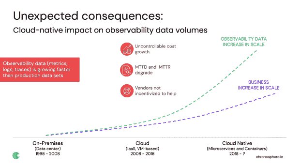
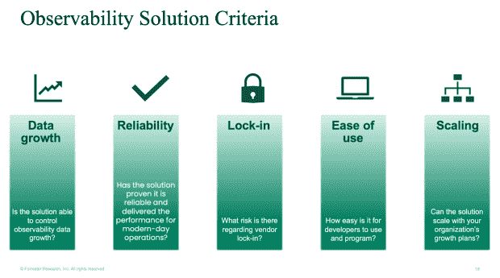
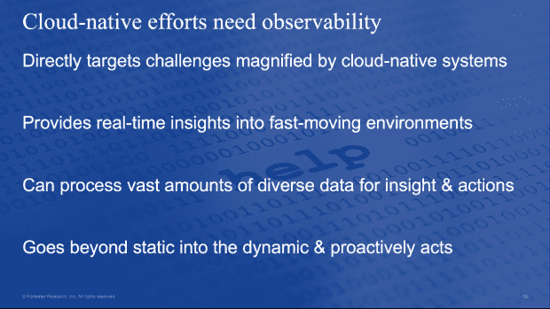

# Forrester 分析师:可观察性如何推动业务

> 原文：<https://thenewstack.io/forrester-analyst-how-observability-boosts-business/>

围绕可观测性有很多问题。我立刻想到了三个问题:在一个可观测性解决方案中，我应该寻找什么？我的组织将从可观察性中获得什么好处？见鬼，可观察性到底是名词还是动词？

最近，我邀请了 Forrester 首席分析师卡洛斯·卡萨诺瓦(Carlos Casanova)来回答这些问题。在最近的网络研讨会“今天、明天和未来的[可观测性:消除噪音](https://chronosphere.io/learn/webinar-observability-today-tomorrow-and-the-future-cutting-through-the-noise/)”中，我们分解了“什么是云原生可观测性？”分享为什么可观察性可以带来更好的业务成果。

作为我们谈话的快速预览，我将我们的讨论总结如下:

## 采用原生云的意外后果

 [雷切尔·迪内斯

Rachel 负责 Chronosphere 的产品和技术营销。此前，Rachel 在 CloudHealth(已被 VMware 收购)担任过多个营销职位，并在 NetApp 领导云集成存储的产品营销。她还在 Forrester Research 担任了多年的分析师。工作之余，Rachel 试着照顾她年幼的儿子和极度活跃的狗，当她有时间的时候，她喜欢在波士顿当地的餐馆做手工和吃饭。](https://www.linkedin.com/in/rdines/) 

我们首先设置了可观察性场景，并描述了迁移到原生云的一些意想不到的后果。如此多的公司采用原生云是有原因的，这已经成为在当今高速和高风险的竞争格局中保持同步的一项要求。

虽然云原生的敏捷性和速度的优势非常真实，但它们也带来了一些意想不到的挑战。例如，可观察性数据——意味着您需要监视和观察您的系统的遥测技术，如日志、指标和分布式跟踪——正以比业务数据产生更快的[速度增长。随着我们向云以及云原生(微服务和容器)迁移，数据量开始呈指数级增长。](https://chronosphere.io/learn/observability-data-growth-to-reach-tipping-point-this-year/)

需要一个迁移到云原生可观察性解决方案的例子吗？[异常安全](https://chronosphere.io/learn/abnormal-security-chooses-chronosphere/)，一家快速增长的 SaaS 电子邮件安全初创公司，能够通过[时间球可观测性](https://chronosphere.io/platform/)提高其度量系统的可靠性和稳定性。异常消除了公制体积的大峰值，并将整体稳定性提高到 99.9%以上的正常运行时间。

如果更多的遥测技术带来更好的结果，这种趋势可能更容易合理化——如果这意味着更快的平均解决时间(MTTR)或更少的关键事件，我们大多数人都愿意忍受拥有额外数据的痛苦。

相反，公司得到的可观察性数据比他们能有效利用的多。他们的可观察性解决方案越来越贵，但公司并没有获得增值。在许多情况下，价值正在急剧下降。云原生可观测性解决方案可以帮助解决这一数据增长挑战。

## 但是什么是可观测性呢？

有时候，解决问题的第一步是后退一步，重新评估我们试图实现的目标。当我们说“可观察性”时，我们指的是什么？当我问卡萨诺瓦这个难以捉摸的问题时，他给出了一个很长的回答，这并不奇怪，因为可观测性的定义已经随着当今云原生架构的复杂性而发展。特别是，一些[遗留监控厂商](https://chronosphere.io/learn/apm-vendors-are-creating-confusion-about-observability-dont-fall-for-it/)正在将他们自己插入到可观察性的对话中，这造成了混乱。

以下是卡萨诺瓦回答的片段，他承认很难将其归纳为两句话。您可以从 14:30 左右开始观看视频，了解更完整的回顾。

**Casanova:** 在我向试图实现可观测性的供应商和组织进行询问和简报的过程中，很明显，人们对这个术语的定义有些困惑…但是如果我们看看 DevOps 社区是如何定义可观测性的，它是基于探索没有预先定义的属性和模式。

卡萨诺瓦补充说，“可观察性是由一个实体共享信息、允许信息被探索、允许信息被分析的内在能力来定义的。”

**我的回答:**摘自我最近的博客，“可观察性的三个支柱仍然相关吗”:可观察性既是一种实践(或过程)，也描述了服务的属性(或状态)。像 DevOps 一样，可观察性是分布式系统工程的核心能力。这是云原生开发人员在日益复杂的系统中每天都在做的实践。可观察性也是系统的一个属性——不管它是否产生可以用来回答开发人员提出的任何问题的数据。

云原生环境中的工程和 SRE 领导者应该考虑三个阶段，而不是关注三大支柱(日志、指标和跟踪)的可观察性:

*   **知道**:意识到有问题
*   **分类**:阻止问题产生额外的负面结果
*   **了解**:深入问题根源

为什么？因为可观察性的三个阶段回答了关于操作他们构建的代码和系统的关键问题。

## 在可观测性解决方案中，你应该寻找什么？

在建立了可观察性的定义之后，卡萨诺瓦列出了在采用可观察性解决方案之前要问的五个问题。以下是他的五大清单，但你可以在 34:00 左右收听他对每一点的深入研究。可观察性平台应提供:

1.  控制数据增长的能力:解决方案能够控制可观察性数据增长吗？
2.  可靠性:该解决方案是否已被证明是可靠的，并为现代运营提供了性能？
3.  避免供应商锁定:供应商锁定有什么风险？
4.  易用性:开发者使用和编程的难易程度如何？
5.  可伸缩性:该解决方案能随着您组织的增长计划而伸缩吗？

## 

## 可观察性能推动竞争优势吗？

云的本地可观察性如何与现代企业的积极成果直接联系起来？卡萨诺瓦把这个问题交给了我，因为这是一个我非常热爱的领域，我们公司在可观察性领域有着深厚的根基。

作为一家公司，Chronosphere 的使命是引导现代企业将可观察性作为一项重要的竞争优势。调到 39:00 左右，听我快速回顾一下[超时空球的起源故事](https://chronosphere.io/learn/happy-second-birthday-chronosphere/)和我们的共同创始人在优步的历史。

Casanova 同意并补充说，云原生计划需要可观察性才能成功，因为随着云原生环境中复杂性和速度的增加，会出现许多陷阱。除此之外，他指出，Forrester 最近的一项调查发现，那些利用基础设施、应用和业务服务来衡量关键绩效指标(KPI)的企业更有可能在 2021 年实现正收入增长。

这是我的总结！还有更多的内容要听，请点击这里收听整个网络研讨会。

<svg xmlns:xlink="http://www.w3.org/1999/xlink" viewBox="0 0 68 31" version="1.1"><title>Group</title> <desc>Created with Sketch.</desc></svg>