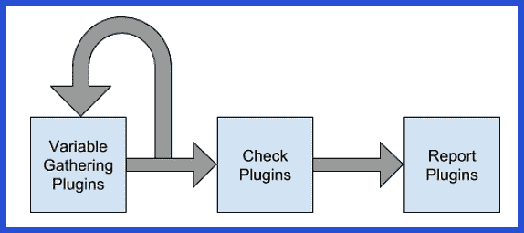
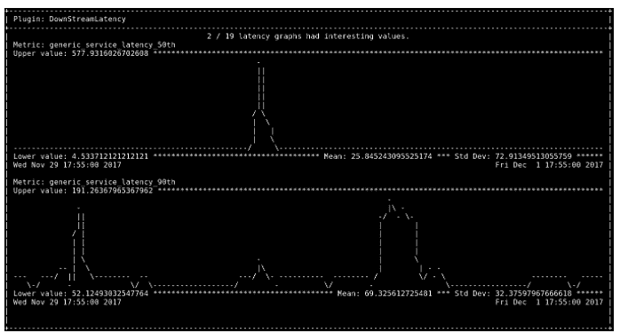

# Fossor Fuel: LinkedIn 开源自动调查应用程序问题的新工具

> 原文：<https://thenewstack.io/fossor-fuel-linkedin-open-sources-new-tools-automated-investigation-application-issues/>

如今，我们很多人都害怕有一天自己的工作会被机器人取代。另一方面，史蒂文·卡利斯特正在积极努力将这一可怕的可能性变成现实。

作为实现这一目标的一步，Callister——T2 LinkedIn T3 的高级网站可靠性工程师——创建了两个新的开源工具，旨在当服务器或应用程序出现故障时，自动识别和排除故障。 [Fossor](https://github.com/linkedin/fossor) 是一个面向插件的 Python 工具和库，旨在自动调查损坏的主机和服务。 [Ascii Etch](https://github.com/linkedin/asciietch) 是一个 Python 库，可以选择性地附加到 Fossor 插件上，通过使用 Ascii 字符将数字流渲染成图形来可视化地显示输出。

作为一名 SRE，Callister 的工作确实是尽可能地自动化工作。此外，撇开机器人霸主不谈，自动化有很多好处:通过接管重复或单调的工作流程任务，它可以节省大量时间。这使得忙碌的工程师可以专注于开发下一个很酷的东西，或者获得更多的睡眠。或者，正如卡利斯特解释的那样，

“一次特殊的经历真正让我开始为 Fossor 编写代码。一天晚上 3:00，我在电话中收到了一个升级，这使我通过三个不同的服务跟踪一个问题，我发现自己在每个服务中键入了相同的命令，因为我越来越接近根本问题。我认为必须有一些方法来自动化这些步骤，以帮助加快调查速度，同时也帮助我下次获得更多的睡眠。”

对利用自动化的力量不仅自动化必要的调查步骤，而且并行执行它们感兴趣，Callister 开始尝试构建自己的工具。他意识到，除了专门针对他当前的服务集执行检查之外，他还可以根据需要灵活地在将来添加新的检查。

## 你能理解吗？

就这样，福瑟诞生了。Fossor 来自拉丁语，意为“挖掘者”(另一个翻译是“掘墓人”，但我们还是用第一个吧)，Fossor 的命名是为了帮助用户挖掘服务器或应用程序问题。为了避免在工具本身中引入性能或应用程序破坏错误，Fossor 由两部分组成:引擎本身和插件库。

独立引擎负责收集必要的插件，然后在自己的进程中运行每个插件。通过将每个插件隔离在其自己的进程中，主引擎可以避免单个插件导致应用程序失败和崩溃。这种弹性是软件可靠性工程的关键原则，允许 Fossor 安全地管理来自许多贡献者的插件。

Callister 写的第一个插件解决了他的团队最近面临的一个棘手的问题。这个问题被证明是内存碎片，起初很难识别，因为他们以前从未遇到过这个问题，团队花了很长时间才最终找到它。“一旦我们发现了问题所在，我们也不希望其他人不得不从头开始，”卡利斯特说。“如果不提醒其他人注意这种可能的问题，感觉就像是浪费宝贵的经验教训。因此，内存碎片插件成为我为 Fossor 编写的第一个插件。”

## 插入电源

“插件方面实际上是他最喜欢的 Fossor 方面,”Callister 继续说道。在这一点上，Fossor 的插件库有能力检查数百个不同的网站问题，用户可以建立自己的检查菜单。

Callister 说，Fossor 的协作方面——任何人都可以贡献一个插件，尤其是现在该工具已经开源——也令人兴奋。“一旦一个插件被贡献出来，其他用户都会受益。总的来说，这个工具汇集了来自不同专业领域的人的知识，分享他们最好和最有用的检查。”

Fossor 工作流。

“而且，因为 Fossor 充分利用了计算机并行运行检查的能力，所以没有理由让一个人必须选择先检查什么。您可以同时对多个问题进行检查，包括您自己可能没有想到的问题，”他补充道。

Fossor 支持三种类型的插件:变量收集、检查和报告，由引擎按照下面的流程执行。插件本身是小类，都使用相同的基本结构，必须实现一个方法，run 方法。如果 run 方法返回输出，这表明输出是“有趣的”,应该报告给用户。run 方法接受一个参数，一个名为“variables”的 Python 字典，用于可选地向插件提供外部信息。

目前 Fossor 库中的一些通用插件调查高内存或磁盘使用率、网络错误、日志中的错误模式、高平均负载和最近的内核消息。更多细节和具体代码示例，请查看 Callister 的博客文章。

## 获取图形

下游延迟插件显示轮询 LinkedIn 的服务指标，以检查每个下游服务的延迟。如果延迟出现异常，插件会使用 Ascii 蚀刻库向用户打印一个 ASCII 图形。

Callister 预见到了并行服务自动化可能带来的一个问题:输出太多，关键数据很难从流中提取出来。Fossor 的报告功能是特定于每个插件的，它只报告被认为重要的信息。这种有组织的输出使访问感兴趣的数据变得更加容易，但 Callister 意识到他还可以更进一步，创建一个实用程序来执行数据的图形翻译和输出。

因此，Callister 为 Fossor 编写了一个名为 Ascii Etch 的伙伴，它创建了数据的图形输出，使报告更容易阅读。Ascii Etch 最初的任务是在 Fossor 的命令行上向用户显示延迟图。Fossor 的原始下游延迟插件显示平均、最小和最大延迟。虽然这些是有用的统计数据，但一个快速的图表可以更清楚地显示下游是否真的存在延迟，”他解释道。

## 开源未来

自从推出以来，Fossor 和 Ascii Etch 已经帮助 LinkedIn 缩短了事件响应时间。“通过并行执行我们的调查检查，然后只报告有用的信息，我们能够更快地确定应用程序问题的原因，通过一个命令简化调试过程，”Callister 说。

Fossor 基于插件的方法的优势在于，它可以通过创建不同的插件来实现难以置信的特定性，同时其贡献库也非常庞大。既然这些工具已经被开源，LinkedIn SRE 团队期待看到它们会是什么样子。

“由于 Fossor 随着每个额外的插件变得更加有用，我们希望开源社区发现使用这个自动化工具的价值，并为其萌芽的调查检查库做出贡献，”Callister 总结道。

<svg xmlns:xlink="http://www.w3.org/1999/xlink" viewBox="0 0 68 31" version="1.1"><title>Group</title> <desc>Created with Sketch.</desc></svg>