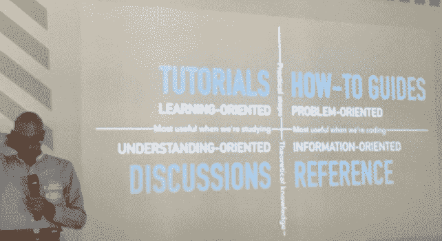

# 成功软件文档的要素

> 原文：<https://thenewstack.io/four-elements-successful-documentation/>

关于你的文档，没人告诉你什么？基本上很烂。至少 Divio AG 的社区和文档经理和 T2 Django 董事会成员 T4 Daniele Procida T5 是这么说的。他给 API 带来了伦敦文档(Docs London)的一些原因，为什么你的文档做得不对，更重要的是，你可以做得正确的方法。

更好的是，他说，“简单的方法才是正确的方法。”

Procida 认为，适当的 API 文档——以及所有的技术文档——都遵循严格的四部分模式:教程、操作指南、参考指南以及讨论和解释。

他说，虽然你可以而且应该将这四个部分联系起来，但是“这四个功能中的每一个都有明确的工作”，不应该重复另一个已经做了什么。

## 面向学习的教程

Procida 声称教程是四个必需的文档部分中最难的，但这并不意味着多年的经验将有助于你更好地掌握它们。相反，他说这篇文章更适合那些经验不足、更擅长从初学者的角度理解的人。

他将这篇文章描述为“带领读者通过一系列步骤完成项目的课程。”

它也给读者一种成就感。

"向初学者展示你可以用这个产品做一些有用的事情."

美食家普罗奇达从头到尾都在用烹饪这个引申的比喻。他把这份文件比作教孩子烹饪。

“你教给孩子什么基本上是不相关的——孩子学到的重要的一点是，厨房是一个令人愉快的做事场所，”他说，“并给他们做事的工具。”

那么，一个优秀的文档教程应该包含哪些内容呢？就像厨师的第一堂课:

*   这是实践，你在实践中学习。
*   它始于“入门”阶段。
*   这会激发信心，让他们信任你和你给他们的软件。
*   教程必须适用于任何技能水平或任何平台。
*   它是可重复的。
*   它提供了一种立竿见影的成就感。
*   是具体的，不是抽象的。
*   除了他们从 A 地到 b 地所需要的，没有解释的余地。
*   它不包含任何其他干扰。
*   它不是操作指南，也不是参考指南，也不是讨论。

因此，根据这些提示，编写文档的最佳人选通常是您团队的最新成员——这也是从用户的角度了解软件的一个很好的方式！另外，不要忘记将你的教程传递给你的 QA 测试团队。应该不断地进行测试，以确保这些指南不仅是最新的，而且与代码一起不断地工作。当然，自动化这些测试更好。

## 面向问题的操作指南

对读者有益的东西通常也对搜索引擎优化有益；谷歌最喜欢以这种读者友好的格式呈现的信息。当然，当人们在谷歌上搜索某些东西时，他们更容易无意中发现你的文档。

Procida 将这些操作指南描述为解决特定问题的步骤，预测需要什么，以一种易于搜索引擎定位的方式进行格式化。

“操作指南是对初学者可能无法清楚表达的问题的答案，”他继续说道。

Procida 认为，每个操作指南都应该:

*   包括一系列步骤。
*   专注于一个目标。
*   解决一个特定的问题。
*   不要解释任何不必要的东西。
*   有一点灵活性——不同的做事方式。
*   专注于实际的可用性问题，而不是理论上的完整性。
*   有好的命名，比如“如何创建基于类的视图”

虽然这是技术文档作者的会议，但毫无疑问，成功的文档是一种协作的体验。在这种情况下，让技术支持和客户成功团队参与创建过程是关键。

毕竟，他们是新手，回答你经常问的问题。当然，从长远来看，这可以节省您的支持团队的时间和金钱。

## 面向信息的参考指南

Procida 将参考指南描述为“机器及其操作方法的技术说明”

这种非常面向信息的文档通常包含一些例子——最好用不同颜色的文本给出，以便让用户突出——但他认为这部分不是关于例子或概念的。更确切地说，他说这是一些严肃而中肯的东西，只是关于机器的事实。

维基百科条目是典型的参考指南范例。继续他的厨师比喻，他为金吉提供了简单的[维基，它有很好的描述和公正的事实。](https://en.wikipedia.org/wiki/Ginger)

Procida 接着说，您的文档参考指南应该包含以下内容，但仅此而已:

*   和你的代码库或者软件或者你描述的任何东西一样的结构，
*   像百科全书一样的一致性，在形式、语气和结构上保持一致，
*   只有描述才重要，
*   保持准确和最新。

他评论说，这是开发人员倾向于做得最好的部分，但是他们继续下去，通过添加其他三个部分中任何一部分的其他内容，甚至是根本不应该包含在文档中的部分，破坏了参考资料。

## 面向理解的讨论和解释

虽然前三篇文档阐明了是什么和如何做，但这一篇是关于为什么。Procida 表示，它提供了一个更广阔的视角来帮助澄清一些特定的主题，并提供更好的理解。

解释为您的用户提供了以下好处:

*   他们给出了背景。
*   他们解释了为什么事情是这样的，无论是设计决策还是有历史原因。
*   他们为同一个问题提供了一些选择和多种方法。
*   它们连接在一起，所以你可以从远处看到东西是如何连接在一起的。

本节不包括任何说明和技术描述。这是关于提供一个故事，把所有这些联系在一起。这一节允许更好地理解代码，并提供了大的图片，加上澄清的事情。但是不要认为这一部分是孤立的，因为它仍然链接到文档的其他方面。

但是这个完美的文档看起来像什么呢？不出所料，Procida 把 Django 的文档作为正确遵循这个严格的文档象限的一个例子。他还提供了工具[Sphinx](http://www.sphinx-doc.org/en/stable/index.html)Python document generator 来帮助你组织和展示这一切。

最后，他说，如果做得正确，你的文档“将更容易写和读。”

最后，他提醒我们“要清楚地解释它是如何被组织起来的”并在文档之间建立链接。

当然，所有好的软件文档都是以用户为中心编写的。

通过 Pixabay 的特征图像。

<svg xmlns:xlink="http://www.w3.org/1999/xlink" viewBox="0 0 68 31" version="1.1"><title>Group</title> <desc>Created with Sketch.</desc></svg>