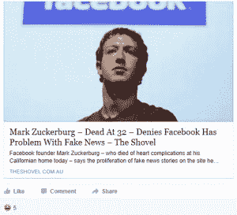

# 你会相信谁？在奇怪的，可怕的有影响力的假新闻行业里

> 原文：<https://thenewstack.io/frauds-behind-fake-facebook-news-feeds/>

有很多关于假新闻的讨论——但是谁在写假新闻呢？在各种网站的零散文章中，媒体已经开始调查，慢慢揭开帷幕，揭露那些用谎言填充我们信息的精明的社交媒体骗子。

“我认为唐纳德·川普入主白宫是因为我，”一名假新闻提供者[周四告诉《华盛顿邮报》。](https://www.washingtonpost.com/news/the-intersect/wp/2016/11/17/facebook-fake-news-writer-i-think-donald-trump-is-in-the-white-house-because-of-me/)

"亚米希游说团、同性恋婚礼货车和国歌禁令有什么共同之处？"《邮报》的领导调侃道，“它们都是虚构的——而且是同一个人发明的。”

38 岁的亚利桑那州人保罗·霍纳声称他一个月能赚 10，000 美元，除了发布假新闻什么都不会。一个可笑的标题写道“美国的阿米什人承诺投票给唐纳德·特朗普；保证他赢得总统大选。”但霍纳告诉邮报，他从来没有想过特朗普可能真的会赢。具有讽刺意味的是，至少有一篇完全虚构的文章是唐纳德·特朗普的竞选经理以及特朗普的女婿在推特上发布的。

谷歌新闻将他的网站列为 ABC 新闻——事实上，这是它的名字，尽管如果你仔细看，它的域名实际上是 abcnews.com.co。上周六，他的另一个(虚假)故事在网上疯传——称奥巴马总统已经宣布第二次选举，将于 12 月 19 日举行。它在脸书上被分享了 25 万次，当被问及为什么他有一个明确的答案时。“老实说，人们肯定更笨了…没有人再去核实任何事情了…”

霍纳实际上认为事实核查最终会使有偿抗议者的整个想法失去信誉。“我的意思是，事情总是这样:有人发布我写的东西，然后他们发现这是假的，然后他们看起来像白痴。”但相反，人们只是继续报道他的故事，“回头看，我认为我没有伤害竞选，而是帮助了它。这感觉很糟糕。”

本周，谷歌和脸书都宣布改变他们的广告计划，以便切断这些脸书诈骗的现金流。《财富》杂志报道称:“从商业角度来看，假新闻问题对谷歌至关重要，因为许多广告商不希望他们的品牌与可疑内容一起被吹捧。”。霍纳对这些努力表示赞赏，但补充道:“我只是希望他们不要把我的也扔掉。”

但是假新闻爱好者们不用担心，他已经在计划继续从谷歌和脸书赚广告费的方法——“我现在至少有 10 个网站。”因为如果他们真的切断了假新闻报道的资金来源？“那就糟了。我不知道我会怎么做。”

## 马其顿的联系

也许人们会为了钱做任何事情——即使是在离美国 6000 英里的地方。选举前五天，BuzzFeed 追踪许多假新闻网站到马其顿的失业青少年。在 2016 年大选前夕，马其顿的[韦莱斯](https://www.google.com/maps/place/Veles,+Macedonia+(FYROM)/@41.7146662,21.7351529,13z/data=!3m1!4b1!4m5!3m4!1s0x13542bc1d2b9c535:0xe4cd993f2bdee535!8m2!3d41.7164563!4d21.7722966)(人口 45000)“经历了一场数字淘金热，当地人创建了至少 140 个美国政治网站。”是的，甚至 USADailyPolitics.com 的也源自马其顿——他们最大的假新闻网站最终拥有成千上万的粉丝。

一名大学生向 BuzzFeed 承认，“博客中的信息是糟糕的、虚假的和误导性的，但基本原理是‘如果它让人们点击它并参与其中，然后使用它’，”如果一个假故事变得足够受欢迎，他们可以在一天内赚到 3000 美元，马其顿街上的 word 每月赚到 5000 美元。

为什么不报道*马其顿*政治？因为对广告商来说，来自美国的点击量是来自其他国家的点击量的四倍，正如 BuzzFeed 所指出的那样，“在 Veles 中走得很远。”他们指出，他们现在唯一的问题是“市场现在变得拥挤，赚钱变得更加困难。”

事实上，BuzzFeed 的另一项分析发现，脸书顶级政治页面上的故事有很高比例是虚假或误导性的——在 20%到 38%之间——并得出结论说这归结于激励。

BuzzFeed 报道说:“在世界上最大的社交网络上吸引和培养政治内容受众的最佳方式是避免事实报道，而是利用虚假或误导性信息来迎合党派偏见，这些信息只是告诉人们他们想听的东西。”

选举后的第二天，前脸书产品设计师 Bobby Goodlatte 发布了一个惊人的帖子。“遗憾的是，新闻订阅针对参与度进行了优化。正如我们在这次选举中了解到的那样，胡说八道极具吸引力。”假新闻网站只是给他们想要的，而“我们的新闻环境鼓励胡说八道。”

一项研究计算出 62%的脸书用户[从脸书](https://www.journalism.org/2016/05/26/news-use-across-social-media-platforms-2016/)获取新闻故事。由于三分之二的美国人使用脸书，他们计算出它将覆盖 44%的美国人。根据皮尤研究中心的一项新研究。“20%的社交媒体用户表示[他们因为在社交媒体上看到的材料而改变了对社会或政治问题的立场](https://www.pewresearch.org/fact-tank/2016/11/07/social-media-causes-some-users-to-rethink-their-views-on-an-issue/)，17%的用户表示社交媒体帮助他们改变了对特定政治候选人的看法。”

“根据牛津大学研究人员周四发表的一份报告，在总统选举前几天，支持唐纳德·特朗普的自动聊天机器人军队以五比一的比例击败了支持希拉里·克林顿的类似程序，”《纽约时报》报道。

但《财富》杂志最近提出了另一种理论:人们不分享脸书的新闻故事，因为它们是真实的。他们分享它们是因为他们感觉真实，或者因为分享它们是一种表明自己属于特定文化群体的方式。”

## 脸书:单点故障

早在 11 月初，一名研究人员告诉《纽约时报》[,这极大地改变了分享的标准](http://www.nytimes.com/2016/11/03/technology/how-the-internet-is-loosening-our-grip-on-the-truth.html),并“创造了一个信息的真实价值无关紧要的生态系统。重要的是这些信息是否符合你的叙述。”

哈佛的内曼实验室总结了这个问题。“2016 年的美国政治话语似乎是在两套自成一体、从不重叠的信息上运行的。”在选举日的第二天，内曼实验室的约书亚·本顿写道“今天的媒体生态系统的结构鼓励这种分离，而且每天都在这样做。

“大众媒体商业模式的衰落；个性化社交媒体的持续崛起，以及在其中轻松传播的内容；远离海岸的报道工作的空洞化:这些就像宇宙的膨胀一样，在各个方向上把我们推得越来越远…

“有很多人应该受到指责，但演员名单必须从脸书开始……”他写道，称脸书是“公民信息的单一失败点”选举的前一天，他在路易斯安那州雷恩市长的脸书供稿上发现了至少四个虚假的故事，称“脸书已经建立了一个积极传播这些谎言的平台”——甚至还有一个经济激励。我们一直生活在自己的媒体泡沫中，但本顿认为，现在我们的泡沫已经被武器化了。“这次选举中有太多的人投票，因为他们被网上看到的虚构的东西激怒了。”

就连爱德华·斯诺登也加入了进来。“要让一家公司有足够的能力重塑我们的思维方式，我认为我不需要描述这有多危险，”他在 Fusion Real Future Fair 上说[。](http://www.scribblrs.com/snowden-stop-relying-facebook-news/)

有时甚至连假新闻的作者*都不存在。10 月，美国有线电视新闻网(CNN)报道称，研究发现，两位美国候选人*超过五分之一的 Twitter 流量是由机器人创建的。

还有一种更阴暗的可能性——一些留在真实新闻网站上的真实评论可能是由怀有敌意的外国政府赞助的。《乔恩·斯图尔特每日秀》的一名前记者最近调查了她所称的“巨魔工业联合体”，这是一个由俄罗斯资助的宣传单位，据《纽约时报》报道，有 400 名员工，每年的预算约为 500 万美元。《泰晤士报》报道称，“一名员工估计这次行动占据了 40 个房间”。在她的有线电视节目*正面全裸和萨曼莎·比*中，这位记者开玩笑说，虽然美国的网络流氓是“坐在地下室里在网上发布下流言论的可悲的失业者，但在俄国，这些人是由政府付钱的。”

Bee 与《纽约时报》杂志的一名撰稿人合作，飞往俄罗斯并采访了其中一名“巨魔”，他说他有数百个虚假账户，用于在美国顶级新闻网站——华尔街日报、华盛顿邮报、纽约邮报——的评论区发表评论，当然，还有 Twitter 和脸书。

[https://www.youtube.com/embed/OauLuWXD_RI?feature=oembed](https://www.youtube.com/embed/OauLuWXD_RI?feature=oembed)

视频

几天后，俄罗斯政府资助的网站今日俄罗斯认为[整个采访是一个精心策划的骗局](https://www.rt.com/news/366576-kremlin-trolls-full-frontal-hoax/)是在听说该节目在寻找俄罗斯巨魔后即兴创作的。“因为他们找不到，我们也肯定他们也找不到，所以我们想:‘好吧，我们假装成巨魔。’我们照做了。她掉进了自己的陷阱。"

你现在会相信谁？

Bee 采访中最有趣的时刻之一是，她的一个受试者回应了一项指控，即政府资助的评论员可能最终改变选举结果。“这要怪俄罗斯巨魔吗？也许人们也有责任。他们很懒，相信他们读到的一切。”

它不会消失的。本周一，华盛顿邮报[采访了 Prntly.com](https://www.washingtonpost.com/news/the-fix/wp/2016/11/14/googles-top-news-link-for-final-election-results-goes-to-a-fake-news-site-with-false-numbers/)。“由一个名叫亚历克斯·波特利的前囚犯创建，prunt in 是一个广泛的海外网站的一部分，这些网站获取关于美国政治的新闻，以支持特朗普的方式(通常以牺牲准确性为代价)制作新闻，然后在页面上布满广告。”

选举后的第二天，谷歌新闻被看到突出了另一篇假文章——误报哪位候选人赢得了普选。《华盛顿邮报》发现谷歌新闻已经链接到一个名为 70news 的 WordPress 网站，该网站引用了 USASupreme.com 的一条推文作为其来源，“另一个实际上不包括数字本身的随机网站”，并且他们的文章指出“看起来非常像 prunt，一个我们今年早些时候看过的虚构的新闻网站。”

这使得关于假新闻的讨论从脸书扩大到了谷歌。谷歌首席执行官桑德尔·皮帅[告诉 BBC](http://www.bbc.com/news/business-37988095) ，“不应该有假新闻被传播的情况，所以我们都支持做得更好。”BBC 记者几次问他假新闻是否会影响美国的选举结果，特别是因为许多比赛都很接近。

他们报告说，他在回答“当然”之前停顿了一会儿

* * *

# WebReduce

通过 Pixabay 的特征图像[。](https://youtu.be/OauLuWXD_RI)

<svg xmlns:xlink="http://www.w3.org/1999/xlink" viewBox="0 0 68 31" version="1.1"><title>Group</title> <desc>Created with Sketch.</desc></svg>