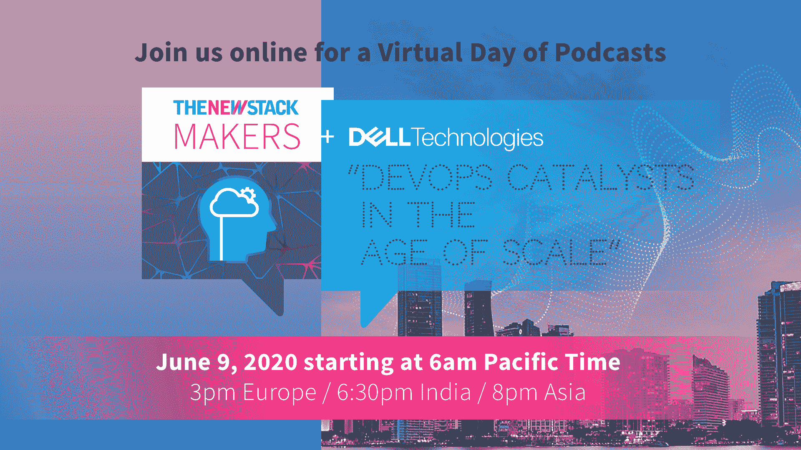

# 释放您的应用，简化您的操作

> 原文：<https://thenewstack.io/free-your-apps-simplify-your-operations/>

[戴尔科技](https://www.delltechnologies.com/en-us/index.htm)赞助了这次播客。

释放你的应用。简化您的操作。

这听起来很基本，但是让您的基础架构为现代应用做好准备，并集中管理您的云和集群需要现代化的应用平台。

[https://www.youtube.com/embed/w9CGdoiJ4i0?feature=oembed](https://www.youtube.com/embed/w9CGdoiJ4i0?feature=oembed)

视频

这正是我们与[戴尔科技](https://www.delltechnologies.com/en-us/index.htm)在我们的五场系列讨论中探索的内容，该系列讨论计划于明天，6 月 9 日，太平洋时间早上 6 点，在新 Stack 的 Periscope 和 YouTube 频道上播放。

这里有一个难题。但丁的地狱？是的，这里有联系。

该系列涵盖的内容:

*   如何在多云环境中利用四种分布式服务技术实现应用平台的现代化。
*   如何在持续开发过程中保护您的数据，以满足现代应用程序新的弹性要求，这些应用程序依赖于分布式工作负载的一致性、效率和可扩展性。使用这些实践来更快地交付优秀的软件，并通过现代软件供应链提高开发速度。
*   将服务升级交付时间从数周缩短到数小时的方法，并帮助开发适用于混合云环境的软件。
*   看看在政府组织带头采用集装箱技术的情况下，欧洲市场加速发展的速度有多快。
*   Kubernetes 和容器存储接口作为云原生架构催化剂的方式。云不是一个地方，而是一种管理运营以实现自助服务、弹性化规模和敏捷应用程序开发目标的方式。
*   如何在云原生环境中管理生产就绪的 Kubernetes 和扩展现代应用程序，方法是解决以下关键问题:保持开发团队敏捷的资源分配自动化、数据安全性和主权、工作负载移动性、联网、生命周期管理以及集群配置和管理

戴尔科技和 [VMware](https://www.vmware.com/company.html) 正在继续投资云本地市场。最明显的例子可能是对一些公司的收购，如 [Heptio](https://www.vmware.com/company/acquisitions/heptio.html) 、 [Wavefront](https://www.wavefront.com/) 、 [Bitnami](https://bitnami.com/) 以及最近的 [Pivotal](https://tanzu.vmware.com/labs) 。现在，它已转化为使用戴尔技术和 VMware 的 Tanzu 解决方案组合的计划。VMware Tanzu 建立在 Pivotal、Heptio、Bitnami、Wavefront 和其他 VMware 团队为这一新的产品和服务组合带来的公司基础架构产品和技术之上。

[戴尔技术播客虚拟日先睹为快:释放您的应用程序，简化您的操作](https://thenewstack.simplecast.com/episodes/dell-technologies-virtual-day-of-podcasts-sneak-peek-free-your-apps-simplify-your-operations)

采访发生在一切都在变化的时候。不仅仅是应用程序现代化，变化也是生存所必需的。变革的组织知道这意味着什么。改变是有风险的。但是今天的一切都是关于风险和如何计算风险。对系统的改变使适应变得对每个人都更容易理解，而不仅仅是对少数人。

变化是开发者运动的指导原则。人们想要改变，想要表达自己。他们想要创造东西，与团队合作，感觉自己是贡献者，而不仅仅是被利用和剥削。踢出代码是一回事；当过程是整体的，贡献得到尊重，并通过渐进的改变实现时，这完全是另一回事。

这就是 DevOps 及其背后运动的力量。人很重要，变革通过适应和尊重从事工作的人的系统出现。对于更大的世界来说也是如此，当我们释放我们的应用程序并简化操作时，这一切都变得不同了。

*[立即注册](https://www.eventbrite.com/e/virtual-day-of-podcasts-with-dell-technologies-registration-104428791326?utm_source=thenewstack&utm_medium=website)收听明天的五场精彩讨论，主题是 DevOps 作为规模化时代的催化剂，引领 DevOps 之旅的思想领袖将参与其中。*

[VMware](https://www.vmware.com/company.html) 是新堆栈的赞助商。

<svg xmlns:xlink="http://www.w3.org/1999/xlink" viewBox="0 0 68 31" version="1.1"><title>Group</title> <desc>Created with Sketch.</desc></svg>