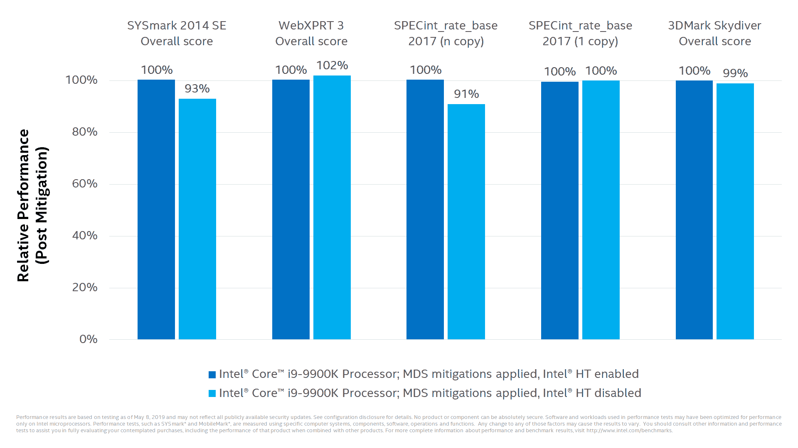

# 新的 Spectre 漏洞可能会迫使云提供商禁用英特尔超线程技术

> 原文：<https://thenewstack.io/fresh-spectre-exploits-may-force-cloud-providers-to-disable-intel-hyper-threading/>

去年，当 Spectre 处理器漏洞的消息首次浮出水面时，观察家警告说，这可能是在英特尔(和其他)处理器的投机性执行中发现的第一个其他可能的缺陷。周二，多组研究人员共同揭示了另外四个与 Spectre 相关的缺陷，统称为微架构数据采样(MDS)。

这些缺陷影响了自 2011 年以来所有英特尔处理器上运行的所有操作系统，包括台式机和服务器。它们可以让攻击者秘密收集内存中的敏感数据，如密码或令牌。根据情报，在野外没有发现已知的攻击。

虽然软件提供商匆忙推出补丁，但最终用户仍将支付性能损失，因为补救措施的一部分涉及关闭英特尔芯片中增强性能的超线程功能。

“该漏洞可能对密集的多租户公共云提供商影响最大。在单用户环境中，这远没有一个租户能够监视另一个租户有趣，” [Twistlock](https://www.twistlock.com) 首席技术官 [John Morello](https://www.twistlock.com/about-us/team/john-morello/) 在一封电子邮件中写道。

因为禁用超线程会降低处理器速度——例如，苹果已经看到“[高达 40%](https://support.apple.com/en-us/HT210108) ”服务器性能因禁用超线程而下降——这些措施“可能会因这些云提供商环境中可用密度的损失而带来实际成本，”他写道。

例如，云提供商 [DigitalOcean](https://www.digitalocean.com/) 建议其用户[更新其“水滴”](https://blog.digitalocean.com/may-2019-intel-vulnerability/)(虚拟机)的内核，并应用最新的漏洞修复和安全补丁。

## 机器中的幽灵

正如[去年](https://www.youtube.com/watch?v=8FFSQwrLsfE&feature=youtu.be)披露的那样，Spectre 可以通过滥用英特尔微处理器的分支预测和推测性执行，从单个进程中泄漏数据。MDS 是这些幽灵弱点的一个子类。英特尔[在一个信息页面](https://www.intel.com/content/www/us/en/architecture-and-technology/mds.html?_ga=2.228996436.913383825.1557956181-1729543665.1557956181)上表示:“MDS 技术是基于使用本地执行的推测性执行侧通道对 CPU 内的小型结构泄露的数据进行采样。一份红帽咨询总结了这四种技术:

*   [CVE-2018-12126](https://access.redhat.com/security/cve/CVE-2018-12126) (昵称“辐射”)是一个可能导致处理器存储缓冲区信息泄露的缺陷(严重性影响评级为重要)。
*   [CVE-2018-12127](https://access.redhat.com/security/cve/CVE-2018-12127) 是对微处理器加载操作的一种利用，它可以向攻击者提供关于 CPU 寄存器和 CPU 流水线中操作的数据(严重影响:中等)。
*   [CVE-2018-12130](https://access.redhat.com/security/cve/CVE-2018-12130) (“僵尸加载”)涉及微处理器填充缓冲区的实施，并可能暴露该缓冲区内的数据(严重影响:中等)。
*   [CVE-2019-11091](https://access.redhat.com/security/cve/CVE-2019-11091) 是“填充缓冲区”实现中的一个缺陷，这是一种现代 CPU 在 L1 CPU 缓存上出现缓存未命中时使用的机制(严重影响:中度)。

这些漏洞可以通过更新 CPU 微码、应用内核补丁和禁用超线程来弥补。

红帽[已经发布了](https://access.redhat.com/security/vulnerabilities/mds)内核安全更新来解决这些漏洞，红帽原子主机，红帽 OpenStack 平台，红帽虚拟化(RHV/RHV-H)，红帽企业 Linux，回到 RHEL 5。它还建议容器用户更新他们的依赖项，特别是**内核**、**内核-实时**、 **libvirt** 、 **qemu-kvm** 、 **qemu-kvm-rhev** 和**微码 _clt** 。

来自 ZombieLoad 网站的这段视频演示了如何利用该漏洞从浏览器收集个人信息:

在去年在[的一次网络广播中，](https://www.youtube.com/watch?v=8FFSQwrLsfE&feature=youtu.be) [SANS Institute](https://www.sans.org/) 讲师兼分析师 [Jake Williams](https://twitter.com/MalwareJake?ref_src=twsrc%5Egoogle%7Ctwcamp%5Eserp%7Ctwgr%5Eauthor) 指出，虽然围绕推测性执行的许多安全研究都集中在英特尔处理器上，但 AMD 和 ARM 等其他处理器架构也使用类似的预测处理技术，因此也容易受到类似的攻击。

<svg xmlns:xlink="http://www.w3.org/1999/xlink" viewBox="0 0 68 31" version="1.1"><title>Group</title> <desc>Created with Sketch.</desc></svg>