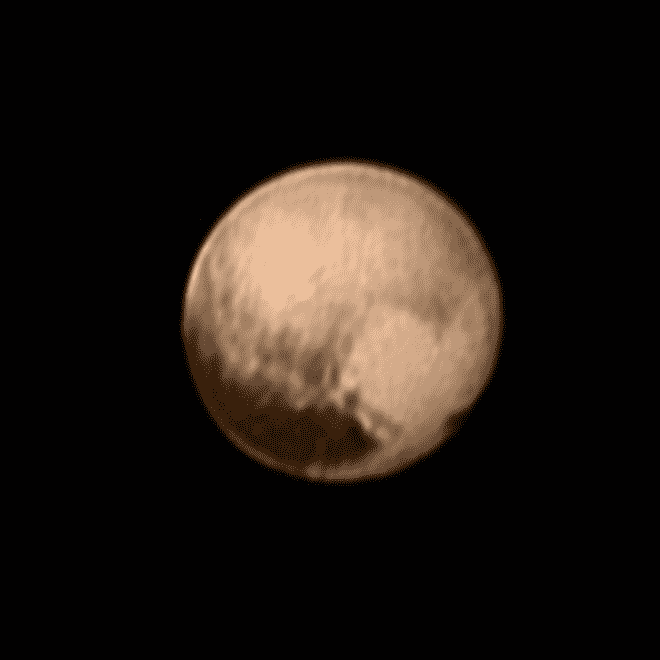
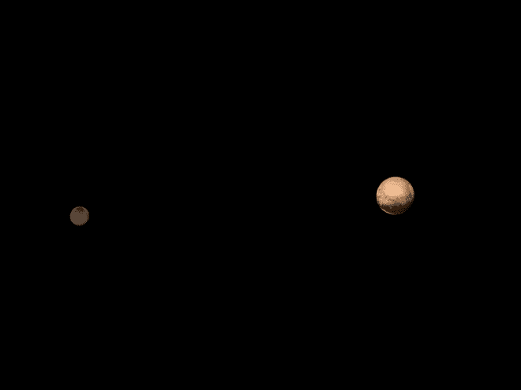
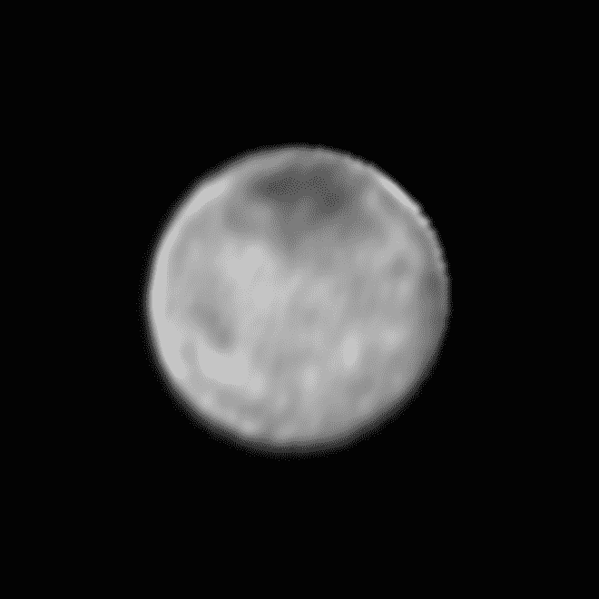
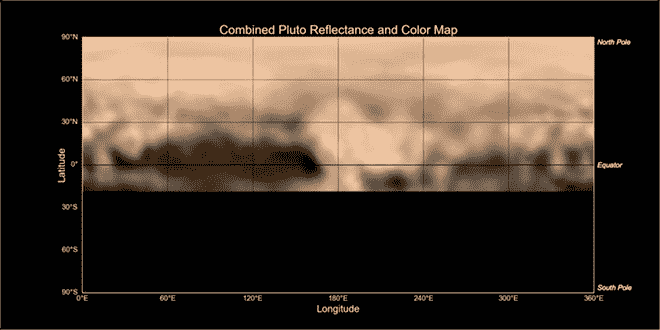

# 来自太空中的电脑:冥王星的夜晚区域，被冥卫一的卫星照亮

> 原文：<https://thenewstack.io/from-a-computer-in-space-the-night-region-of-pluto-illuminated-by-the-moon-of-charon/>

周二，美国国家航空航天局的新视野号将获得冥王星夜间区域的第一张照片。下面是他们对即将到来的的[精彩描述:](http://pluto.jhuapl.edu/News-Center/News-Article.php?page=20150711)

> 冥王星上是南极的冬天。在这个寒冷的南极地区，已经有 20 年看不到太阳了；再过 80 年，它就不会再发光了。自然光的唯一来源是冥王星最大的卫星卡戎的星光和月光。

随着技术人员进一步开发能够处理来自外太空的数据的软件，我们对太空的迷恋确实与这些新的堆栈世界有着必然的联系。新视野号是这一旅程的见证，但在另一个维度。它是一台在太空中飞行的计算机，备份数据，为它收集的新数据腾出空间，并在它不得不进入[安全模式](http://www.washingtonpost.com/news/speaking-of-science/wp/2015/07/06/after-a-heart-stopping-glitch-nasas-new-horizons-prepares-for-its-historic-pluto-flyby/)时让科学家保持紧张，就像本月早些时候一样。

从新地平线发回的图像结束了近十年的等待和 30 亿英里的漫长旅程。在过去的一周里，探测器越来越近——大约 500 万英里——揭示了神秘矮行星的一些从未见过的特征，展示了各种黑暗和明亮的区域，美国宇航局的科学家们将其命名为“[鲸鱼](http://pluto.jhuapl.edu/News-Center/News-Article.php?page=20150707)、“甜甜圈”，以及更可爱的“[心脏](http://pluto.jhuapl.edu/News-Center/News-Article.php?page=20150708)”

冥王星明亮的“心形”区域在这张由探测器相机拍摄的图像中可见。

早在 2006 年发射的新视野号宇宙飞船配备了各种一流的成像设备，包括一台远程侦察成像仪(LORRI)和一台昵称为“Ralph”的复杂的小相机，它从光谱的各个部分收集数据，以生成冥王星冰表面的彩色图像。在接近冥王星之前，探测器还发回了冥王星五颗卫星中最大的[冥卫一](https://en.wikipedia.org/wiki/Charon_(moon))的数据，揭示了任务团队所称的[一个“暗极”——一个神秘的黑暗区域，形成了一种“反极”帽。](http://pluto.jhuapl.edu/News-Center/News-Article.php?page=20150622-3)

冥王星和冥卫一的图像；下图:罗莉拍摄的卡戎特写。

但是 7 月 8 日早些时候传回的冥王星的图像只是初步的见解，[博尔德西南研究所的](http://pluto.jhuapl.edu/News-Center/News-Article.php?page=20150707)约翰·斯班瑟解释道，他也是地质、地球物理和成像小组的副组长:

> 我们正处于观察冥王星的“月球人”阶段。很容易想象你在这个奇怪的明暗特征集合中看到了熟悉的形状。然而，

这张冥王星表面地图左侧的黑暗区域，非正式地称为“鲸鱼”。

科学家猜测，这个明亮的心形区域直径 1200 英里，由冻结的甲烷、氮气和可能的一氧化碳的新沉积物组成，而在“鲸鱼”的右侧——一个 1860 英里宽的黑暗区域——是一个明亮的、200 英里大小的“甜甜圈”形区域，可能是一个火山口或其他类似火山的地质特征。这些特征的真实性质尚不完全清楚，但研究人员希望下周当探测器按计划于 7 月 14 日进行飞越时，能够获得更详细的分析，届时它将再次经过这颗行星，以观察穿过其大气层的阳光。

还是来自美国国家航空航天局:

如果你站在冥王星的夜晚区域，在“新视野”号最接近的时候——抬头看一颗明显灰色的卡戎——它在天空中看起来比地球的月亮大七倍。虽然卡戎距离太阳有 30 亿英里，但它离冥王星如此之近，又如此被冰覆盖，以至于从地球上看到的它只会比满月暗五倍。在你的脚下，冰冷的表面——看起来像一个煤灰色的雪堆——将沐浴在卡戎微弱的光芒中。你周围的区域会很暗，但不会暗到撞到东西。

到目前为止，该团队的发现令人兴奋，他们热切地期待着下周可能的发现。正如科学团队的共同研究者和成像负责人、美国宇航局艾姆斯研究中心的杰夫·摩尔解释的那样，“在冥王星和冥卫一上明确探测到明亮和黑暗的地形单元，表明这对行星上有广泛多样的景观。例如，我们在冥王星上看到的明亮边缘可能代表蒸发的极冠沉积的霜，它现在在夏天的太阳下。下一次我们以最接近的方式看到冥王星的这一部分时，这个区域的一部分将以比我们今天看到的分辨率高 500 倍的分辨率成像。会很不可思议！”

美国宇航局的[新视野](http://pluto.jhuapl.edu/index.php)将会有更多的更新。

图片:美国宇航局

<svg xmlns:xlink="http://www.w3.org/1999/xlink" viewBox="0 0 68 31" version="1.1"><title>Group</title> <desc>Created with Sketch.</desc></svg>