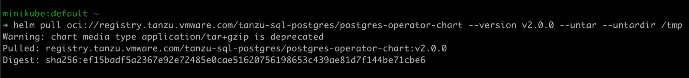
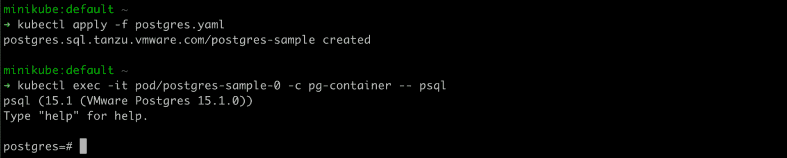

# 来自一个粉丝:PostgreSQL 的崛起

> 原文：<https://thenewstack.io/from-a-fan-on-the-ascendance-of-postgresql/>

[Stack Overflow 2022 开发者调查](https://survey.stackoverflow.co/2022/#databases)已经发布了几个星期了，它包含了大量有用的信息，可以帮助最终用户和技术供应商更好地了解软件开发人员最近在做什么。该调查基于 70，000 多名参与者的反馈，他们代表了一个具有不同背景、兴趣和经验水平的全球开发人员社区。您会发现一些章节探讨了从他们喜欢并有兴趣使用的技术到他们最喜欢的异步协作工具以及他们赚了多少钱。

报告中让我特别兴奋的一部分是一个与我的心脏(和大脑)密切相关的话题。):数据库。

## **专业开发人员♥️·波斯格里斯**

该调查调查了 63，000 多名开发人员，询问他们最喜欢哪些数据库。总体而言，MySQL 胜出(所有受访者的支持率为 46.85%对 43.59%)。但是，重要的是，在那些自我认同为专业人士(相对于学生)的人中，PostgreSQL 以 46.48%比 45.68%胜出。勉强算赢，但还是赢了。多么了不起的一件*事情。我们漫长的噩梦结束了:人们给了 PostgreSQL 它应得的爱。终于！*

不可否认，我有偏见，这不仅仅是因为我工作的公司几十年来一直活跃在 Postgres 上。我认为 PostgreSQL 是更好的工具。所以，是的，当甲骨文几年前收购并试图破坏 MySQL 时，我可能会高兴得跳起来，因为这给了人们一个重新审视 PostgreSQL 的好理由。

## **数据库持久**

作为堆栈中[最复杂的部分之一，数据库是出了名的难以迁移。我只能冒险说，这种“数据库持久性”是 MySQL 在那些自称学习编码的人中胜出的原因。二十年前，MySQL 无处不在。看在上帝的份上，是"灯"堆里的" M "!它很容易安装在任何操作系统上，并且是开源的。相比之下，PostgreSQL 直到 2005 年的 8.0 版本才在 Windows 上运行，这距离它首次亮相已经整整 13 年了。不难想象为什么 PostgreSQL 的维护慢了这么多，PostgreSQL 让出了很多地盘。因此，虽然 MySQL 的惰性意味着它仍然是学习编码的人首先要做的事情，但我希望这种情况会改变。](https://tanzu.vmware.com/content/blog/moving-from-monoliths-to-microservices-don-t-forget-to-transform-the-data-layer-here-s-how)

## **PostgreSQL ♥️s 容器**

PostgreSQL 是一个非常棒的工具，在基于容器的架构中更是如此。与此同时， [Kubernetes 运营商模型](https://core.vmware.com/blog/vmware-sql-postgres-kubernetes-20-whats-new)使得在集群中加速、供应和管理多个数据库实例变得更加容易。

在今天的世界中，使用 Docker 容器，很容易就可以启动并运行一个 PostgreSQL 或 MySQL 实例。这里有一个你可以用来定义你的`docker-compose.yaml`文件的定义:

```
```yaml
version:  '3'
services:
  Postgres:
 image:  postgres:latest
 environment:
 -  POSTGRES_USER=postgres
 -  PGUSER=postgres
 -  POSTGRES_NAME=postgres
 -  POSTGRES_PASSWORD=postgres
 ports:
 -  "5432:5432"
```
​

```

然后直接运行:

```
```shell
docker-compose up
```

```

假设您已经安装了`psql` CLI，您可以连接:

```
```shell
PGPASSWORD=postgres psql  -U  postgres  -h  localhost postgres
```

```

简单！我明白为什么专业开发人员喜欢 PostgreSQL 了。

这是另一个使用 VMware Postgres 运算符实现这一点的简单示例。

一些简单的设置:





安装操作器:


部署 Postgres。几秒钟之内，您就有了一个正在运行的 Postgres 服务器。



## **企业♥️ PostgreSQL**

PostgreSQL 拥有所有常见的特性:ACID 遵从性、可伸缩性、数据完整性、出色的安全性等。现在，我知道您对今天的这些东西没有什么印象，因为大量的 SQL(和一些 No/NewSQL！)数据库声称能提供这种功能，但它是必不可少的。

请记住，曾经有一段时间，MySQL(v3 和更早版本)的默认后端引擎 MyIASM 会愉快地接受 DDL(数据定义语言)外键引用来加强数据完整性，然后悄悄地忽略它们，让用户放入他们想要的任何内容。如果我不能相信我的数据库能够正确保存——确切地说是保存它——那么它就很难说是一个**数据库**,它更像是一个**基础**。

## **真实的谈话**

为什么我真的很爱 PostgreSQL？首先，因为它在 Spring 和 Java 应用程序中工作得非常好。因此，无论您是使用反应式 API，还是计划将新的 project Loom 与传统的 JDBC (Java database connectivity，Java 数据库连接)API 结合使用，您都可以确信 PostgreSQL 提供了出色的开发人员体验，性能良好，并且最有可能满足您的用例。更进一步，PostgreSQL 是早期支持 MVCC(多版本并发控制)的数据库之一，这是一种旨在保持读写一致性而不互相阻塞的模式。

现在，我是否可以说它能满足您的所有需求，以及最昂贵的数据库，如 Oracle？大概不会。但这不是价值主张。事实上，它做了我想要的大部分事情，详尽的生态系统填补了空白。

我记得在 2008 年了解到一个叫做 [Compiere](https://en.wikipedia.org/wiki/Compiere) 的东西，这是一个开源的 ERP 系统，使用 Java(和很好的 ol’Swing)编写，广泛使用了 Oracle 数据库。与此同时，有人向 PostgreSQL 引入了兼容性特性，这样这个庞大的、专门构建的 ERP 系统就可以在 PostgreSQL 上运行。太神奇了！这远远超出了仅符合规范的范围！

有很多项目旨在构建 PostgreSQL 并增加 Oracle 兼容性(包括我自己的雇主)。我的朋友们，这说明了我为什么如此热爱 PostgreSQL:它是可扩展的！有许多项目改变了 PostgreSQL 支持的范式:

*   Citrus 为 PostgreSQL 提供了分布式表。
*   Greenplum 现在是 VMware 的一部分，于 2005 年首次亮相，是一个基于 MPP(大规模并行处理)体系结构和 PostgreSQL 的大数据数据库。
*   TimescaleDB 是一个内置于 PostgreSQL 的时间序列数据库，类似于网飞地图集、普罗米修斯或数据狗。
*   霓虹云为 PostgreSQL 提供了无止境的存储。
*   YugabyteDB 的创始人创建了 Apache Cassandra 和 HBase 等，为 PostgreSQL 提供了一个可水平伸缩的引擎。
*   EnterpriseDB 提供了 PostgreSQL 的工业级发行版。
*   [`pgbouncer`](https://www.pgbouncer.org/) 是 PostgreSQL 的轻量级连接池程序。
*   `pgbackrest`提供简单的自动化备份和恢复

PostgreSQL 的类型系统也有大量的扩展:

*   PostGIS 为 PostgreSQL 提供了地理空间查询和功能。
*   `btree_gin`和`btree_gist`增加新的 BTREE 类型。
*   `cites`支持不区分大小写的字符串值。
*   `cube`添加多维立方体类型。
*   `dblink`可以将远程 PostgreSQL 数据库视为本地数据库。
*   `earthdistance`模块提供了两种计算地球表面大圆距离的不同方法。
*   `file_fdw`是一个外来的数据包装器(有很多)用来访问服务器文件系统中的数据文件。
*   `http`使从 PostgreSQL 发出 HTTP 请求成为可能。
*   `isn`为以下国际产品编号标准提供数据类型:EAN13、UPC、ISBN(图书)、ISMN(音乐)和 ISSN(期刊)。
*   `pg_cron`支持在 PostgreSQL 中运行定期作业。
*   `pg_trgm`基于三元模型匹配和支持快速搜索相似字符串的索引运算符类，可以确定字母数字文本的相似性。
*   `pg_audit`通过 PostgreSQL 提供的标准日志记录工具提供详细的会话和对象审计日志记录。
*   `pgcrypto`为 PostgreSQL 提供加密函数。谢天谢地，不需要比特币！

甚至还有对语言的扩展，你可以使用 PostgreSQL 的类型系统！例如，PostgreSQL 支持 PG/PSQL 的几种替代语言，您可以用它们来编写函数:

*   `plcoffee` —用 PL/Coffeescript (v8)在 PostgreSQL 中运行 CoffeeScript。
*   `pljava`支持在 PostgreSQL 中使用 [Java 语言。](https://tada.github.io/pljava)
*   `plls`支持使用 LiveScript 语言。
*   `plv8`允许您使用 Google V8 OSS JavaScript 引擎(Node.js 最初基于该引擎)运行 JavaScript。

如今，在任何主要的云供应商上，将 PostgreSQL 实例部署到任何您想要的地方都是轻而易举的事情。事实上，所有云供应商都为他们的各种 PostgreSQL 实例提供了可水平扩展的、无限的集成。

PostgreSQL 是无处不在的，多用途的，健壮的，可扩展的，快速的，可伸缩的等等。在我看来，堆栈溢出调查的结果令人惊讶，只是因为结果如此接近。PostgreSQL 太神奇了！如果你还没试过，你应该试试。

Jinali Sheth 对本文有贡献。

<svg xmlns:xlink="http://www.w3.org/1999/xlink" viewBox="0 0 68 31" version="1.1"><title>Group</title> <desc>Created with Sketch.</desc></svg>