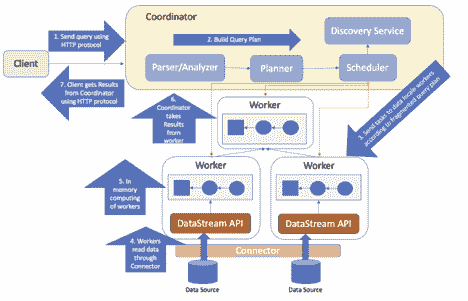

# 从大到快:云数据湖分析继续大放异彩

> 原文：<https://thenewstack.io/from-big-to-fast-presto-continues-to-shine-for-cloud-data-lake-analytics/>

[George Wang](https://ahana.io/)

[George Wang 拥有超过 13 年的核心数据库工程师经验，加入 Ahana 担任联合创始人兼首席工程师。最近，作为一名高级软件工程师，George 构建了许多关键功能和创新，以支持阿里巴巴基于 Presto 的云服务 AnalyticDB 的高吞吐量和低延迟计算引擎。在阿里巴巴工作期间，他是 Presto 基金会外联委员会的成员。在此之前，George 是 IBM 的一名软件工程师，工作了 10 多年，开发了 DB2 for z/OS 的多种特性和增强功能。](https://ahana.io/)

在过去三十年中，已经开发并应用了各种技术来对结构化和非结构化业务数据进行大数据分析。由于当今大多数公司在多个位置的不同平台上以各种数据格式存储数据，这些庞大而多样的数据集通常会阻碍捕捉实时机会和提取可操作的数据洞察的能力。传统上，来自这些多个系统的企业组织数据经过提取、转换和加载(ETL)过程，将数据从其操作状态转换为更适合查询的状态，然后数据通常被移动到企业数据仓库中。

ETL 过程给数据工程师、数据科学家和系统管理员等用户带来了一个大问题，因为在处理多个数据库和数据存储时，用于数据管道和数据移动的 ETL 作业可能非常耗时，并且难以管理。因此，分析即服务的需求已经成为一种新的模式，以满足归档和实时数据的业务需求。

## 为什么这么快？

联合数据计算框架允许用户从多个数据源检索和分析数据，并在一个集中式平台中进行计算，这是在当今数据环境中实现快速数据分析的更好解决方案。

Presto 是一个开源平台，最初旨在取代 Hive，即 Hadoop 上的 SQL 批处理方法，与 Apache Hive 相比，它具有更高的性能和更多的交互性。Presto 的概念是支持 MPP(大规模并行处理)框架来计算大规模数据，因此该架构模型旨在支持计算和存储的分解，并处理实时和高性能的数据分析。Presto 不应该存储数据，而是通过各种连接器访问数据源。

经过多年的开发，PrestoDB 的[最新版本支持 SQL-on-Anything，是一个交互式查询框架，可以作为内存查询引擎适合任何企业架构。](https://prestodb.io/download.html)

## Presto 是如何工作的？

Presto 基于一个标准的 MPP 数据库架构，该架构支持水平可伸缩性和处理大量数据的能力。Presto 的内存功能允许跨各种数据源平台的交互式查询。为了访问不同位置的数据，Presto 被设计成可扩展的可插拔架构。许多组件可以添加到 Presto 中，使用这个架构进一步扩展它，包括连接器和安全集成。

## 基本概念:

Presto 集群是一个查询引擎，它在每个实例或节点上运行单服务器流程。它由两种类型的服务进程组成:一个协调节点和一个工作节点。协调器节点的主要目的是接收来自用户的 SQL 语句，解析 SQL 语句，生成查询计划，以及调度任务以跨工作节点进行分派。同时，工作者节点可以与其他工作者节点通信，并执行来自协调器的查询计划中的任务，该任务被分段用于分布式处理。

### 1.协调者

Presto 协调器是为管理集群而部署的单个节点。协调器允许用户通过 Presto CLI、使用 JDBC 或 ODBC 驱动程序的应用程序或其他可用的客户端 API 连接库提交查询。协调者还负责与工作人员交流以获得更新状态、分配任务，并将输出结果集发送回用户。所有的通信都是由协调器的 **StatementResource** 类通过 RESTful API 完成的。

### 2.工人

在 Presto 集群中，可能有一个带有多个工作节点的协调器节点。如果协调者是领导者，那么工作者节点就是追随者。每个工作节点都作为一个服务进程保持活动状态，该服务进程监听协调器的任务执行和实际计算。工作人员将通过 RESTful API 定期向发现服务器发送心跳信号，向服务器发送工作人员在线还是离线的健康状态信号。这让协调器从发现服务器知道当用户提交查询时哪些工作节点可用于分派任务。

Presto 的逻辑实现如下所示。运行查询有七个基本步骤:

1.  用户通过 HTTP 协议从客户端 API 向 Presto 协调器提交查询。
2.  协调器接收文本格式的 SQL 语句，遵循一系列步骤来解析、分析和创建逻辑计划，以便使用称为 Presto 查询计划的内部数据结构来执行。优化查询计划后，会相应地生成三个内部类，包括查询执行、阶段执行和任务分布，以便协调器可以根据数据局部性属性创建 HTTP 任务。
3.  根据数据所在的位置，协调器生成任务并分派给指定的工作节点，通过 **HttpRemoteTask** 的 HttpClient 进行处理。HttpClient 创建或更新任务请求，本地数据工作者节点上的 **TaskResource** 提供 RESTful API。 **TaskResource** 接受请求，或者在相应的 Worker 节点上启动一个 **SqlTaskExecution** 对象，或者更新对象的分割。
4.  上游任务从相应的连接器读取数据。
5.  下游任务消耗上游任务的输出缓冲区，并开始在所有工作节点上计算其阶段内的数据处理。Presto 是一个内存计算引擎，所以内存管理必须精细化，以保证查询的有序平滑执行，并且会出现一些饥饿、死锁等情况。因为 worker 节点是为纯内存计算而设计的，所以当内存不足时，不会有数据溢出到磁盘。因此，查询可能会因内存不足而失败。然而，Presto 的最新版本支持磁盘溢出，这是一个供用户调整的选项，但不建议使用，因为如果打开交换机，它将带来高延迟成本。
6.  一旦协调器跨工作节点分派任务，它就在最后阶段持续监听以检索任务的计算结果。
7.  在客户机提交 SQL 语句后，客户机继续监听，以从协调器检索最终结果集。当输出可用时，使用 HTTP 协议将这些结果集一部分一部分地流回客户机。

Presto 不用 MapReduce。它通过自定义查询和执行引擎进行计算。它的所有查询处理都在内存中，这是其高性能的主要原因之一。

## Presto 的用例

Presto 是一个分布式 SQL 引擎，用于对数据仓库和其他不同数据源进行数据分析。对于实时或准实时分析计算，它可以获得优异的性能。查询运行的响应时间从毫秒到秒。对于配置正确的复杂查询，如果在 Hive 系统上运行，运行时可以在几分钟内完成，而不是几小时或几天。凭借其联合架构，Presto 是一项成熟的技术，最适合以下应用场景:

*   替换配置单元查询以获得更好的性能。Presto 的执行模型是纯内存 MPP 模型，比 Hive 使用的磁盘洗牌 MapReduce 模型至少快 10 倍。
*   统一 SQL 执行引擎。Presto 与 ANSI SQL 标准兼容，可以连接到多个 RDBMS 和数据仓库数据源，在这些数据源上使用相同的 SQL 语法和 SQL 函数。
*   为没有 SQL 执行功能的存储系统提供 SQL 执行功能。例如，Presto 可以为 HBase、Elasticsearch 和 Kafka 带来 SQL 执行能力，甚至是本地文件、内存、JMX 和 HTTP 接口。
*   通过联合查询多个数据源构建虚拟统一数据仓库。如果需要访问的数据源分散在不同的 RDBMS、数据仓库，甚至其他远程过程调用(RPC)系统中，Presto 可以直接将这些数据源关联在一起进行分析(SQL Join)，不需要从数据源复制数据，也不需要集中在一个位置。
*   数据迁移和 ETL 工具。Presto 可以连接多个数据源，加上它有丰富的 SQL 函数和 UDF，可以方便地帮助数据工程师从一个数据源向另一个数据源拉取(E)、转换(T)、加载(L)数据。

## 一个流行的数据湖分析引擎

首先，Presto 采用了性能优异的全内存计算模型，特别适用于即席查询、数据探索、BI 报告和 dashboarding、轻量级 ETL 等业务场景。

其次，与其他引擎只支持部分 SQL 语义不同，Presto 支持完整的 SQL 语义，所以你不用担心任何 Presto 无法表达的需求。再者，Presto 有一个非常方便的插件机制，你可以在不改变内核的情况下添加自己的插件。理论上，您可以使用 Presto 连接任何数据源，以满足您的各种业务场景。

最后，Presto 有一个非常活跃的社区。作为 [Linux Foundation 的 Presto Foundation](https://prestodb.io/join.html) 的一部分，除了脸书之外，许多大型企业公司，如 Twitter、优步、亚马逊雅典娜和阿里巴巴，都采用 Presto 的数据湖分析功能，使用 Presto 的代码库开发功能，以在他们自己的数据联合系统上支持大规模、高容量的 OLAP 交易。基于上述优势，Presto 是一项成熟的技术，可以提供云数据湖分析作为底层分析引擎。

数据湖的优先级设计，通过开放底层文件存储，给数据入湖带来最大的灵活性。进入数据湖的数据可以是结构化、半结构化甚至完全非结构化的原始日志。此外，开放式存储还为上层引擎带来了更大的灵活性。各种引擎可以根据自己的场景读写存储在数据湖中的数据，只需要遵循相对宽松的兼容性约定(这样的宽松约定会有隐藏的挑战，后面会提到)。但与此同时，文件系统直接访问使得许多更高级的功能难以实现。比如细粒度(小于文件粒度)的权限管理、统一的文件管理、读写接口升级也非常困难(每个 access 文件引擎都需要升级才能完成升级)。

## 快速 SQL 引擎

Presto 还具有高性能的 SQL 处理功能。以下是几个原因:

1.  Presto 支持标准的 ANSI SQL，包括复杂的查询、聚合、连接和窗口函数。作为 Hive 和 Pig 的替代品(Hive 和 Pig 通过 MapReduce 管道完成 HDFS 数据查询)，Presto 本身不存储数据，但可以访问多个数据源，支持跨数据源的级联查询。
2.  YARN 是一个通用的资源管理系统。但是不管 Hive 在执行 SQL 时使用什么样的引擎，比如 MR 和 TEZ，每个执行操作符都是在 YARN 容器中运行的，YARN 拉起容器的性能特别低(秒级)。这就像一个应用程序拉起一个进程，打开多线程。线程更轻量，操作简单启动线程速度更快，加速更明显；但是启动过程要繁琐得多，而且容易受到操作系统的限制。Presto 调度使用线程，而不是进程。
3.  Presto 的协调器/工作者架构更像是 Spark 独立模式，只在两个进程和服务中完成。但是 Spark 更侧重于 SparkRDD 之间的依赖关系，阶段失效和线性恢复导致开销较高。Spark input 还直接依赖 Hadoop 输入格式 API，这使得 SparkSQL 无法在运行时将 SQL 优化细节传输给 input format。Presto 抛弃了 Hadoop inputformat，而是采用了类似的数据分区技术。SQL 被解析后，它可以生成一个元组域，条件从这个域传递给连接器。连接器可以根据 metastore 数据根据数据源使用一定程度的索引下推，大大减少数据扫描间隔和计算涉及的数据量。
4.  Presto 是完全基于内存的并行计算。与需要将中间数据写入磁盘的 Hive MR/ TEZ 或需要将溢出数据写入磁盘的 Spark 不同，Presto 完全假设数据可以有效地放入内存。此外，由于 Presto 的流水线作业计算能力，显示的数据可以通过分析 SQL 的执行计划立即返回。虽然这给用户一种非常快的“错觉”，但这种“错觉”也是情有可原的。即使我们从一个结果中提取大量数据，我们也要遍历光标。当我们遍历到那个位置时，后续的结果数据已经被连续计算了，这并不影响我们的结果。

## 结论

在许多场景中，Presto 的即席查询运行时预计在几秒或几分钟内比 Hive 快 10 倍。它支持多种数据源，如 Hive、Kafka、MySQL、MongoDB、Redis、JMX 等等。作为一个开源的分布式 SQL 查询引擎，Presto 是一个成熟的分析框架，可以快速分析任何大小数据的查询。它支持非关系和关系数据源。支持的非关系数据源包括 Hadoop 分布式文件系统(HDFS)、亚马逊 S3、Cassandra、MongoDB 和 HBase。此外，Presto 支持 JDBC / ODBC 连接、ANSI SQL、窗口函数、连接、聚合、复杂查询等。这些关键特性是构建基于云的数据湖分析的基石。

Linux 基金会是新堆栈的赞助商。

<svg xmlns:xlink="http://www.w3.org/1999/xlink" viewBox="0 0 68 31" version="1.1"><title>Group</title> <desc>Created with Sketch.</desc></svg>