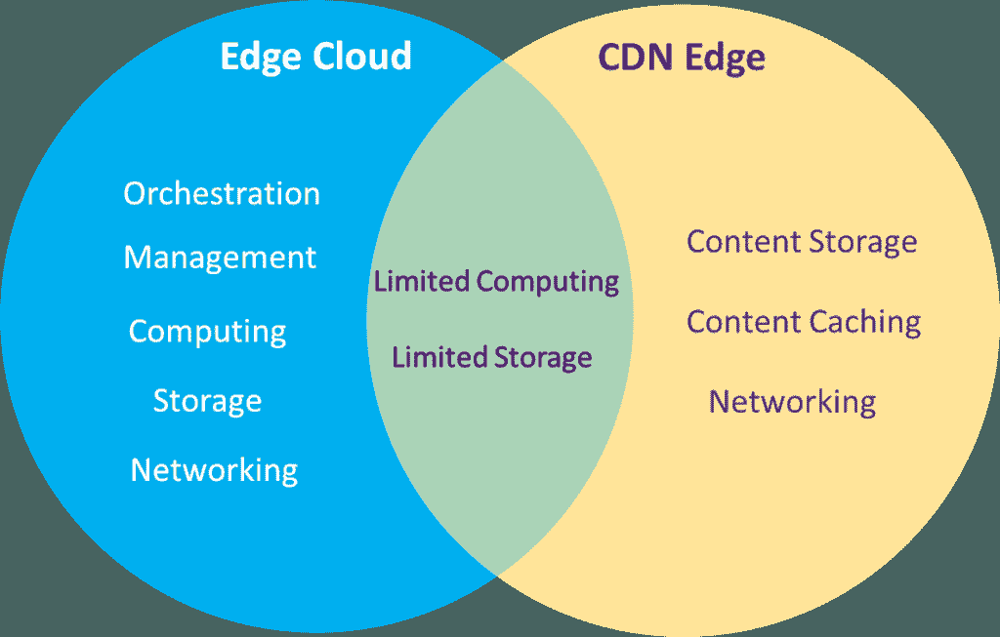
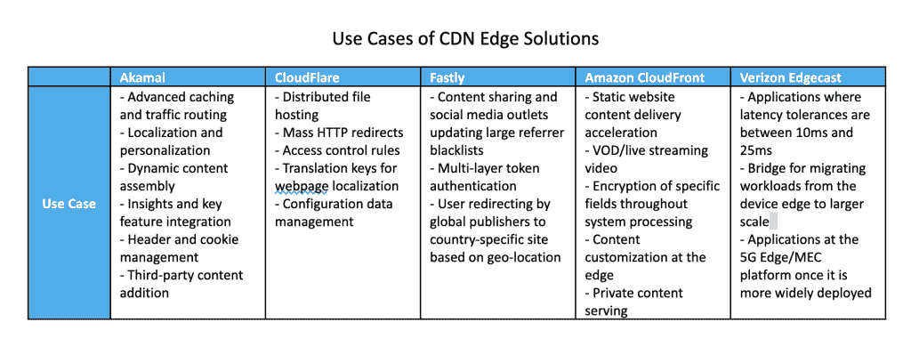
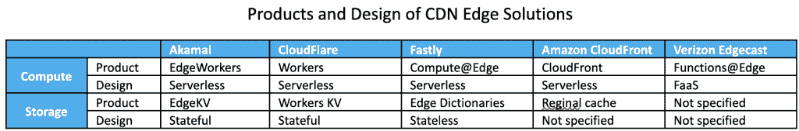
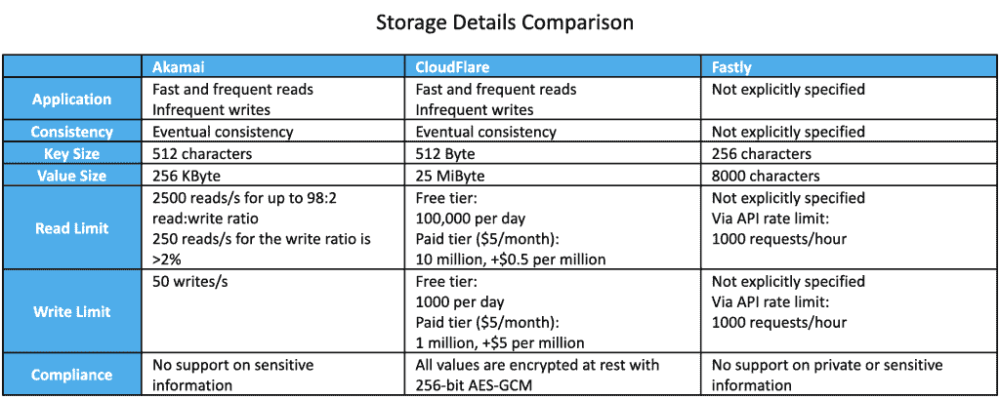

# 从 CDN Edge 到 Fornax:迈向下一代 Edge 云平台

> 原文：<https://thenewstack.io/from-cdn-edge-to-fornax-toward-a-next-gen-edge-cloud-platform/>

[柯是 Futurewei Technologies 的首席架构师，领导下一代边缘云的边缘存储解决方案的创建。在加入 Futurewei 之前，他是 AT & T 技术团队的主要成员和戴尔的高级工程师。2021 年，他领导了电信生态系统的 5G 网络数据民主化计划。](https://www.linkedin.com/in/ke-xu-13930529)

你可能喜欢在任何地方观看 YouTube 视频，或者随时从手机上滑动观看下一个抖音视频。无论内容是简单的静态网页还是实况视频，一些内容交付网络(CDN)提供商都在幕后扮演着重要的角色。

您可能也听说过边缘计算或边缘云，这不仅引起了云行业的关注，也引起了主要 CDN 提供商的关注。我们在 Linux 基金会下的开源 Fornax 就是这样一个边缘云项目。

在调查边缘计算领域时，我们发现了解 cdn 在该领域的现有发展作为参考很有意思，特别是其用户场景中的重叠功能。CDN edge 和 edge cloud 有什么区别？我们可以从 CDN edge 中学到什么来帮助我们设计 Fornax edge 计算平台？让我们仔细看看。

## CDN 边缘与边缘云

 [杜鹏

彭是未来微科技的高级云架构师。他的工作重点包括下一代云和边缘平台的研发。彭拥有高性能计算稠密线性代数博士学位。在加入未来微之前，彭曾在 AWS 和微软担任软件工程师。偶尔，彭还在华盛顿大学博泰尔分校兼职教授算法和数据结构。](https://www.linkedin.com/in/peng-du-ph-d-14b0a11b) 

CDN 提供商是先于其他行业将边缘计算能力引入生产网络的先驱之一，主要是为了促进快速内容交付。

另一方面，Edge cloud 旨在将云计算能力分布到云数据中心之外，靠近最终用户或创建数据的地方。与 CDN 提供商类似，目标包括通过“现场”执行计算来实现更好的延迟和/或更少的数据传输，例如出于安全原因

此外，边缘云与传统的云数据中心有一些共同的要求，如资源管理和编排。下图说明了 CDN edge 和云 edge 的共性和差异。

有限计算和存储的公共区域意味着只能提供某些形式的计算和存储，例如无服务器和键值存储(我们将在后面详细讨论)。

除了有限的计算能力，CDN edge 并没有提供更多的计算能力和灵活性，因为它主要服务于内容托管和交付。相比之下，边缘云具有中央云的典型组件，因此可以服务于范围更广的应用程序。

虽然 edge cloud 和 CDN edge 互不相同，但它们在业务方面有一些共同的兴趣，并相互交流。例如，[中国电信](https://mp.weixin.qq.com/s/BT_ks3ucJBNbDAktPkHFnw)在 2021 年 11 月的云原生边缘计算论坛上展示了其基于 KubeEdge 设计和部署 CDN 边缘节点的经验。同样，[来自 Futurewei](https://github.com/CentaurusInfra/fornax) 的 Fornax 项目也是基于边缘云平台的愿景而建立的，该平台具有高度灵活的可配置性、连接性和容错性。

了解现有的 CDN 边缘解决方案是设计未来边缘云平台的必要起点。

## Edge 对 CDN 来说并不陌生

“边缘”这个概念在 CDN 领域已经存在很久了。通常，一个主要的 CDN 提供商管理和操作大量的内容服务器，这些服务器在地理上分布在不同的地区、国家甚至大洲。除了原始服务器之外，内容的副本也缓存在不同的服务器上。缓存内容为客户端提供了更快的加载体验，因为它们的请求可以由地理位置更近的服务器来响应。

相对于原始服务器，这样的服务器被称为 CDN 边缘服务器。不仅减少了内容检索延迟，而且网络流量更加分散和平衡，不会在源服务器上产生流量高峰和繁重的工作负载。此外，源服务器暴露于网络攻击和其他威胁的风险也减少了。

除了地理上的内容缓存之外，边缘计算的需求在边缘云计算平台端进一步扩展。用例不仅包括内容检索，还包括那些需要计算和交互通信的内容。让我们想象一下，你戴上虚拟现实/增强现实(VR/AR)耳机，走进元宇宙的一个虚拟办公室。你对那个古怪的软件开发者 Mark 说“你好”(当然这是 3D 虚拟和真人 Mark)，他连头都没回，忙着在终端里打东西。你坐在你的虚拟简约办公桌前，打开你的电子邮件收件箱，虚拟地开始你的一天。

图片来源:脸书

这种情况可能不会发生在今天的每个人身上，除了一些视频游戏玩家，但随着元宇宙关键生态系统技术的快速发展，普通用户可以很快采用这种情况。显然，在地理上缓存内容已经不够了。越来越多的计算和网络能力必须被带到边缘平台；否则，您可能会看到带有毛刺的模糊镶嵌标记类型。

CDN 提供商已经开始构建边缘计算环境，在网络边缘提供计算资源。边缘计算服务器旨在为海量原始数据和延迟敏感型应用提供数据处理，包括物联网、AR/VR、自动驾驶、5G 等。

## CDN 提供商如何设计边缘平台

让我们来看看 CDN 提供商今天是如何设计和提供他们的边缘平台的。我们选择了 Akamai、CloudFlare、Fastly、亚马逊 CloudFront 和威瑞森 Edgecast 进行对比。在这些提供商中，Akamai 是市场上传统和主要的 CDN 提供商。CloudFlare 和 Fastly 是最近迅速崛起的两家公司，带来了许多创新和竞争。亚马逊 CloudFront 和威瑞森 Edgecast 是两家分别从云和电信领域涉足该市场的提供商。

这些 CDN 提供商针对的 edge 用例非常相似，主要集中在高级内容缓存、服务本地化和定制以及轻量级 web 服务，而威瑞森 Edgecast 专注于 5G 网络中的延迟敏感型应用。这种相似性很容易理解，因为它自然来自边缘计算的低延迟优势，这可以被当前的 CDN 服务所利用。到目前为止，考虑到前面提到的一些未来应用程序，所有的提供商还没有走出他们的舒适区。

对于计算解决方案，无服务器或功能即服务(FaaS)是趋势。这种计算模式源自主流云开发，可以提供更具成本效益的计算平台，缩短开发周期，消除基础架构配置和管理需求。当大量边缘节点开始发挥作用时，这种计算模型的优势将显而易见。

键值(KV)存储是 CDN 提供商采用的常见存储解决方案。键值存储或数据库是一种非关系数据库，它使用简单的键值方法来存储数据。具体来说，让我们深入了解 KV 商店解决方案。我们只列出 Akamai、CloudFlare 和 Fastly 进行比较，因为亚马逊 CloudFront 和威瑞森 Edgecast 没有提供关于其存储解决方案的足够信息。

显然，KV 存储支持快速、频繁读取和不频繁写入的应用程序。这个特性仍然属于内容缓存或交付领域的性质。

最终的一致性模型通常在不同的提供者之间使用。对于边缘计算应用程序，通常对快速传播没有严格的要求，对于 CloudFlare Workers KV，可能需要 60 秒才能将更改传播到所有边缘位置。但是，如果一些具有最新更改的节点失败，它可能会遭受数据丢失。

键和值的大小决定了可以在 KV 存储中存储多少信息。我们可以看到，在所有提供商中，CloudFlare 提供了最大的价值。从应用的角度来看，除了基于文本的内容，256 KB 不能支持太多的用例，而 25 MiB 为其他类型的值提供了更多的可能性，如图像或视频剪辑内容。

对于读取和写入的限制，Akamai，每秒测量，相对于其他提供者允许更多。Akamai 和 CloudFlare 的写入限制远低于读取限制。虽然 Fastly 没有为读/写指定数字，但它限制了 API 调用速率，这也不是一个很大的数字。

对于所有 CDN 边缘平台而言，合规性是一个非常有趣的方面。Akamai 和 Fastly 都警告用户，他们不支持存储私人或敏感信息。CloudFlare 的首席执行官 Matthew Prince 将[合规性作为最高要求](https://blog.cloudflare.com/cloudflare-workers-serverless-week/)，而速度是最不重要的。

## 未来边缘云面临的挑战

虽然 CDN 提供商已经开始将其边缘解决方案部署到生产中，但他们仍然面临着设计和构建边缘云的挑战。

*   **这是边缘环境中资源管理的“狂野西部”。**边缘的计算资源在计算能力、存储联网能力和可靠性方面的容量可能会有很大差异。对于更大规模的云数据中心，包括 CDNs 的区域数据中心，工程师在那里维护专用资源，可以快速轻松地访问。

*   **复杂的应用层级。**为了享受边缘计算的好处，如低延迟和高可扩展性，边缘应用通常采用一定级别的分层架构。这需要对应用和边缘框架进行根本性的设计改变。

*   **规模超越集群。**边缘计算还具有在更大规模上处理应用服务和协调的潜力。网络和存储将跨越集群或数据中心的边界，智能调度机制将有助于在大型逻辑和地理区域实现高资源利用率和性能的平衡。

*   **快速和频繁的读/写对于未来的用例非常重要。**应用中的交互通信在边缘变得越来越重要，甚至在内容领域也是如此。如何更好地服务于频繁的读取和写入是未来边缘设计面临的挑战。

*   **在哪里存储键和值？**在内存中还是在磁盘上？我们没有从文档中看到任何关于这个问题的信息。也许这是专有信息，不能公开。答案很重要，因为它直接影响读/写性能和成本。

*   **最终的一致性模型不能服务于所有用例。**一些未来的用例，如自动驾驶汽车，可能需要一个强一致性模型，其中所有信息都需要及时更新。

*   **如何实现全球传播？**第一个问题是如何定义“全局”所采用的机制需要考虑多集群通信和同步，这不是一个小问题。

*   **法规和安全合规性是一个普遍关注的问题。**到目前为止，没有一个提供商有能力和信心在边缘处理私有或敏感数据。这可能会成为一个大话题，因为在一些用例中，如元宇宙或自动驾驶汽车，必须处理移动中的私人数据。

## 摘要

我们调查 CDN 边缘计算产品的目标是为下一代边缘计算平台(如 Fornax 项目)的设计收集经验并构建愿景。无论是在元宇宙召开会议、管理工业自动化、进行医疗操作、在海洋深处钻探石油还是监控风力发电场，边缘计算都为不稳定和稀疏的物理环境中的大规模分布式系统带来了特殊的挑战。CDN 提供商已经将边缘计算功能引入生产，以处理内容缓存和相对轻量级的计算。

展望未来，高度安全和灵活、快速响应和可扩展的下一代应用需要更强大的边缘云平台，这些平台具有灵活的边缘集群层次结构、高效的集群间联网、存储和调度等功能。我们的 Fornax 项目在欣赏 CDN 提供商的开拓性探索的同时，也在特色景观中加入了这些元素。

<svg xmlns:xlink="http://www.w3.org/1999/xlink" viewBox="0 0 68 31" version="1.1"><title>Group</title> <desc>Created with Sketch.</desc></svg>