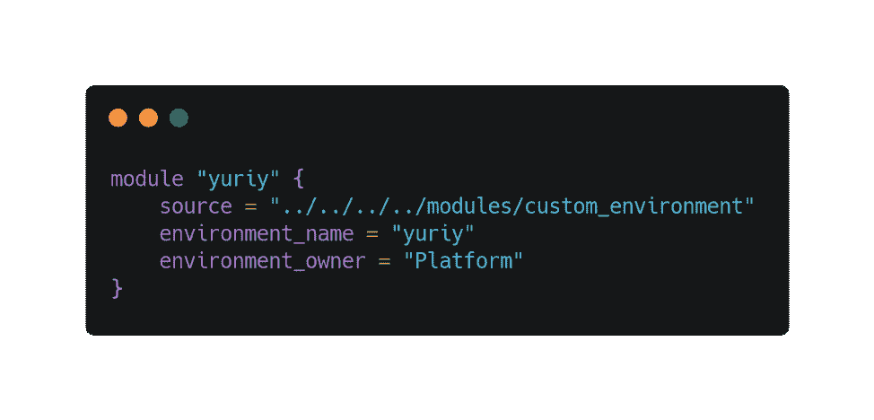
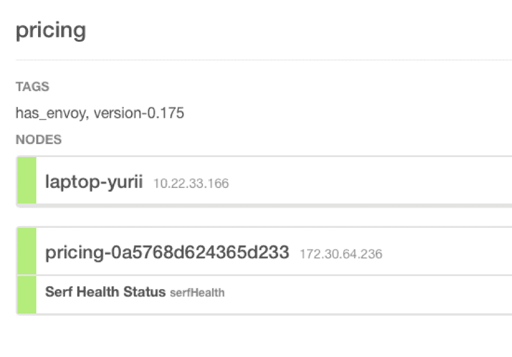
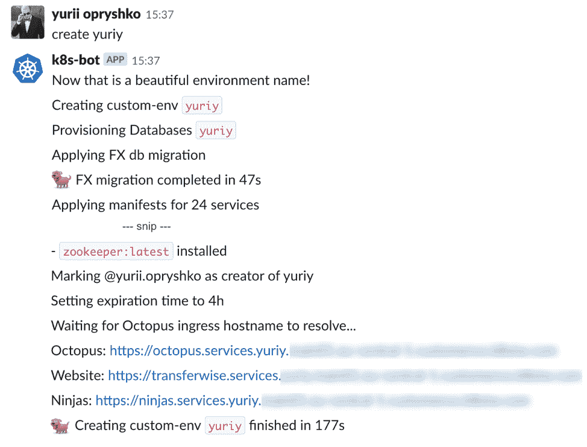

# 从笔记本电脑到云计算再到 Kubernetes

> 原文：<https://thenewstack.io/from-laptop-to-cloud-to-kubernetes/>

云本地计算基金会赞助了这篇文章。

[TransferWise](https://transferwise.com) 于 2011 年推出，与 5 年多前成立的大多数公司一样，我们从一个整体应用程序开始。然而，[我们迅速扩展](https://medium.com/transferwise-ideas/from-2-founders-to-1000-employees-how-a-small-scale-startup-grew-into-a-global-community-9f26371a551b)，事情开始迅速变得更加复杂。几十万客户变成了几百万客户。我们的产品在快速发展。我们的代码库必须跟上。

我将探索我们从卑微的开始到复杂的系统变化的旅程，以及我们现在如何为未来做准备。我还将分享一些挑战和一路走来的收获。

## 更简单的时代

大约在 2015 年的某个时候，我们发现微服务越来越多。到目前为止，一切顺利。在一台笔记本电脑上运行我们的 web 应用程序以及我们需要的两到三项服务相当容易。

然而，我们发展很快(当时我们大约有 80 名工程师，现在我们有 300 名！)并且我们到达了一个点，我们需要在几个具有几十个依赖项的服务中做出改变。这使得地方发展不再可行。

因此，我们的开发团队转向我们的测试环境来测试变更。但是由于这只是由多个团队共享的单一环境，它成为了不稳定和挫折的巨大来源。

## 当事情不再那么简单的时候

我们的外部合作伙伴(如银行和其他支付用户)使用暂存环境来测试他们与 TransferWise 的集成，这加剧了暂存环境的情况。可以理解，他们对我们系统的频繁不稳定感到沮丧。

我们的平台团队做出了一个关键的决定，那就是创建一个独立的环境，在这个环境中，我们的合作伙伴，以及最终我们的开放 API 的任何用户，都可以在其中发挥作用，而不会受到十几个开发团队的摆布。

当我们探索新的环境时，我们意识到我们不应该只是建造一个。我们觉得让这个过程完全自动化会更好，所以我们能够构建任意数量的环境，供我们越来越多的开发团队和外部合作伙伴使用。

## 标准环境的地形定义

 [塞维多夫·奥普瑞什科

塞维多夫是 TransferWise 的平台工程师，transfer wise 是一家成立于 2010 年的金融公司，其愿景是让国际汇款变得便宜、公平和简单。Opryshko 在 TransferWise 工作了四年，与平台和产品工程师合作，帮助客户、合作伙伴和团队成员构建快速、简单和可靠的系统。作为一名超过 10 年的开发人员，他在各种创业公司和咨询公司工作过。](https://www.linkedin.com/in/mcm69/) 

我们称之为定制环境。它是这样工作的:

1.  在我们的 [Terraform](https://terraform.io) 存储库中创建一个拉请求，添加一个如上图所示的定义，并可选地定制默认服务集。
2.  一旦进入，就触发 Terraform 运行，这将在 AWS 上提供以下内容:

*   主应用程序和服务的数据库实例；
*   安全组，控制内部环境和外部流量；
*   用于 Consul、Kafka、Zookeeper 和其他平台依赖虚拟机；
*   最后，几十个服务虚拟机(使用 Spot 实例来节省成本)。

3.接下来，一个大的[可响应的](https://ansible.com)剧本在 [AWX](https://github.com/ansible/awx) 上运行，可响应的 UI/任务运行器:

*   将我们的标准虚拟机强化应用于环境中的所有机器；
*   将所有者团队的 SSH 密钥添加到所有机器；
*   创建服务用户，安装依赖项，如 like
*   建立平台服务，如领事和卡夫卡；
*   设置服务节点并部署服务。

此时，您自己的环境就可以使用了。太棒了。

## 从笔记本电脑到云:混合环境的魔力

这个新环境已经被证明是有用的。但是它缺少一个重要的特征。当开发人员试图在服务中进行更改时，他们通常不仅需要让他们的服务向环境发出请求，还需要让环境中的其他服务调用他们的服务。允许运行在云中的服务找到运行在几公里外的笔记本电脑上的另一个服务，是一项重要的任务。

当然，我们可以在本地构建一个工件，并将其部署到环境中，但是这将增加很多额外的麻烦(没有人喜欢远程调试)，所以我们知道我们必须找到一个更好的方法。

EC2 Nodes and Laptops Co-Existing in a Custom Environment (Screenshot from Consul UI)

[hashi corp consult](https://consul.io)在定制环境中有三个目标:

1.  键/值存储增强了标准的暂存服务配置，允许我们覆盖特定于环境的参数，如数据库位置和生成的凭证；
2.  我们将 Consul 的 DNS 解析映射到我们的一个内部域，以便您可以使用友好的 pricing . service . yuriy . twi . se URL 访问您的服务，而不是寻找 IP 地址；
3.  最后，我们可以轻松地将笔记本电脑注册为服务节点，因此，一旦我在上面的屏幕截图中停止云中的定价服务，pricing.service.yuriy.twi.se 将解析到我的笔记本电脑，其他服务将出现在这里，允许我测试我的定价服务，端到端地更改它。

“将您的笔记本电脑连接到云”工作流当时对我们的前端开发人员特别有用，因为它允许我们仍然非常大且资源密集型的 web 应用程序位于云中，并通过笔记本电脑获取前端代码。

## ⚖:什么有效，什么无效

定制环境对于我们的开发团队来说是一个很好的使能器，允许他们快速地获得自己的 TransferWise 版本并运行。

[沙箱](https://sandbox.transferwise.tech)成为一个伟大的工具，使我们的合作伙伴、开发者和客户能够尝试 TransferWise API。我们开发团队的接受程度很快超过了平台团队的所有预期。

然而，在 100 多个环境和 4，500 多个 EC2 实例中，我们方法中的问题变得很明显。

*   随着越来越多的服务被添加到自定义环境定义中，调配和配置时间也在增加。由于所有环境都使用 AWX 的共享清单，一次只能运行一个配置或部署，形成了长队；
*   我们遇到了各种各样的 AWS 限制(EC2 实例、安全组、RDS 实例)，因此我们必须定期创建限制增加的支持案例。在某个时候，我们用完了整个法兰克福 AWS 区域的 spot 实例容量，迫使我们撤退到爱尔兰，那里有更多的可用资源；
*   随着调配时间的增加，我们的团队开始让他们的环境一直保持运行，这与我们最初的一次性前提相反。然后，团队将不得不跟踪其环境中的几十台虚拟机，处理现场实例终止、磁盘空间问题以及他们没有准备好面对的各种基础架构管理。这大大增加了我们的 AWS 账单；
*   一些服务正在联系外部限速资源。例如，提供一百个费率服务实例将会很快耗尽我们可以向费率提供者发出的请求数量，从而阻塞所有工作，并且还可能中断生产率更新。为了解决这个问题，我们添加了一个条件，以便在登台环境中回退到 rate 服务实例，但是这需要对我们最初的自包含设计进行重大的调整，并且进一步增加了环境的不稳定性。

## 第二:Kubernetes 定制环境

我们的平台团队意识到我们当前的方法无法扩展，我们需要采取行动。

在收集了开发团队的反馈、检查了使用数据并研究了替代方案之后，我们确定了下一次迭代的设计目标:

*   瞬间创造和毁灭的时间；
*   自愈；
*   您需要的最小服务集，轻松添加或删除服务的可能性，回退到临时服务的可能性；
*   没有终端用户的拉式请求或专用按钮(如果您想要一个新的环境，您不需要任何其他人批准它或做任何事情来支持您)；
*   熟悉的部署工具。

幸运的是，大约在同一时间，我们的 Kubernetes 设置开始真正起飞，使我们大多数设计目标的答案非常简单。那么它是如何勾选这些方框的呢？

✅创建/销毁时间:旋转一个新的 pod 速度非常快，集群自动伸缩有助于根据需要扩大/缩小工作节点。

✅自我修复:库伯内特斯的本土特色。如果一个 pod 或者甚至一个工作者节点死亡，控制平面将在没有任何人工干预的情况下照顾它。

✅最小服务集/无拉取请求:这不是 Kubernetes 的直接好处，但是通过我们开发的聊天机器人，例如，只需请求添加或删除与美元相关的服务集就很简单。

✅熟悉的工具:随着我们 K8s 迁移的继续，我们的开发团队学习并接受了 kubectl。我们还将 Octopus(我们的内部发布管理工具)移植到新的定制环境中，统一了生产、试运行或任何定制环境中的部署流程。

新的定制环境位于一个新的独立集群中，与暂存环境相邻。创作很简单:

创建您的环境只是一个松散的信息。

三分钟，我们准备好了！这是一个令人印象深刻的变化，特别是当您将它与建立一个旧的定制环境所花费的时间相比较时(甚至有开发人员要花几天时间才能启动和运行的时候)。

一旦收到命令，bot 就会在集群中启动新的名称空间，应用带有可配置自定义环境覆盖的临时清单，并为服务创建部署对象。我们没有在每个环境中使用单独的数据库实例，而是使用一个强大的 RDS 实例共享池，这样可以更快地设置(和拆卸)。

一些服务仍在迁移过程中。如果我们没有一个服务的 Docker 映像，我们使用一个通用映像，它传递服务名并在启动时下载工件。

自定制环境的第一次迭代以来，我们已经在各地推出了 [Envoy](https://www.envoyproxy.io) ，因此不再需要 Consul 设置，因为所有服务都使用统一的 Envoy URLs。要将您的笔记本电脑连接到环境，您只需在本地运行一个 Envoy 容器，并告诉它您的环境名和您正在运行的服务名。

Kubernetes 定制环境仍处于 alpha 阶段，但我们已经可以看到，与我们的第一次迭代相比，它们将变得更加快速、高效和经济。

## 未来

我们从来不喜欢在一个地方呆很长时间，我相信新的定制环境设置会随着时间的推移而增长和变化，我们的生产堆栈也是如此。[作为一家公司，我们同舟共济。](https://transferwise.com/gb/blog/transferwise-mission-q4-2018)

当我们开始探索全球发行和运行更接近我们客户的 TransferWise 部分时，我们也需要在开发环境中反映这些变化。

幸运的是，Kubernetes 为我们提供了一个坚实的基础，我们满怀热情地期待着未来的挑战。

要了解更多关于集装箱化基础设施和云原生技术的信息，请考虑参加 5 月 20 日至 23 日在巴塞罗那举办的[kube con+CloudNativeCon Barcelona](https://events.linuxfoundation.org/events/kubecon-cloudnativecon-europe-2019/)。

通过 Pixabay 的特征图像。

<svg xmlns:xlink="http://www.w3.org/1999/xlink" viewBox="0 0 68 31" version="1.1"><title>Group</title> <desc>Created with Sketch.</desc></svg>