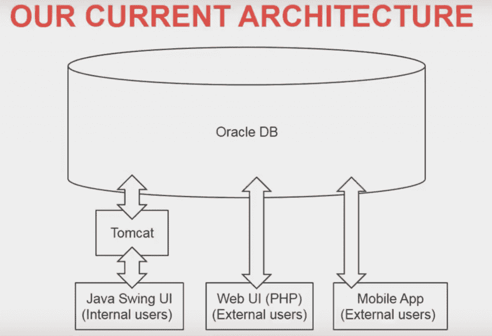
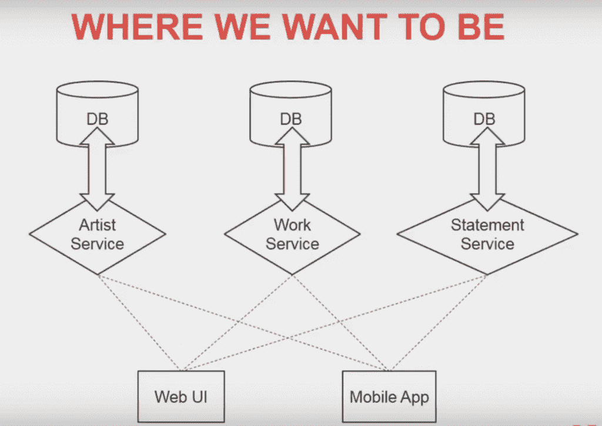
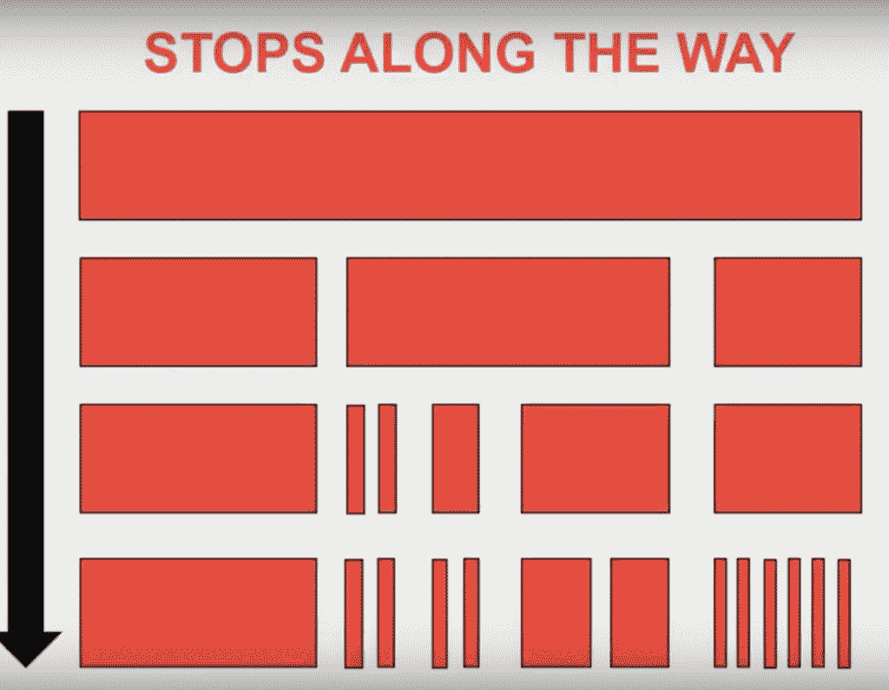
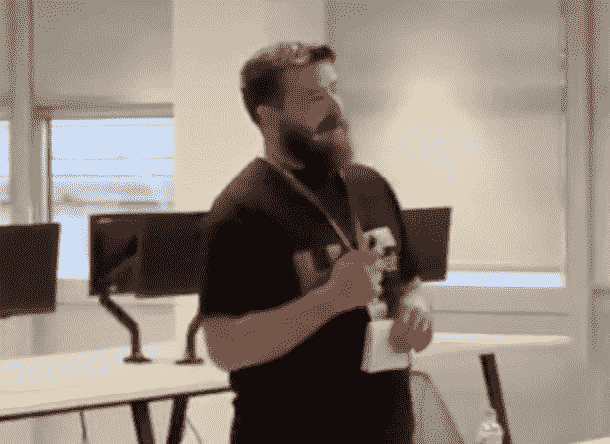

# 从整体服务到微服务:一家公司的计划

> 原文：<https://thenewstack.io/from-monolith-to-microservices-one-companys-plan/>

有不止一种方法可以撇去一块巨石。系统设计者似乎有两种流行的方法——一头扎进去或者永远一点一点地挖出来，要么太粗心，要么太谨慎。

I 在伦敦举行的最新敏捷环岛会议上， [Kobalt Music](http://KobaltMusic.com) 技术经理 [Jeremy Ryan](https://www.linkedin.com/in/jeremy-ryan-5926a11b/?ppe=1) 讨论了他的公司正在努力转向更敏捷的架构的方法，其中包括渐进变革的路线。

为了理解 Ryan 和他的团队所面临的挑战，让我们先简单了解一下音乐行业错综复杂的财务网络 。 Kobalt 围绕推广和收取音乐版税提供服务。仅今年 3 月，该公司就处理了 5 亿份版税付款。

想象这一切发生在一个完整的巨石顶上。 “处理那么多数据的唯一方法就是一个巨型数据库，”瑞安说。

在 Kobalt 的例子中，这涉及到一个沉重的架构，它有一个“巨大的 Oracle 数据库”，一个供内部使用的 Java Swing 用户界面(UI)，一个用 PHP 为外部用户(如音乐出版商)构建的 web UI，以及一个供艺术家跟踪所有内容的移动应用程序。

他说“这是一个整体，但还不算太坏，而且到目前为止，它的伸缩性还不错。但是 Oracle 就是这样—你只要投点钱进去，它就会扩展。但你越想扩大规模，这个数字就会呈指数级增长。”

然而，该公司已经意识到该系统将在更长时间内扩展，但 Ryan 认为未来该公司将无力再扩展该系统，因此最终将需要分割该数据库。

Ryan 表示，该公司并不打算成为微服务架构的先驱，他说目前它将满足于较小的服务，理想情况下，稍后将全面采用微服务。

现在，该公司每周发布一次内部软件堆栈，解决了数百个问题。即使其中一个集成失败，发布也不会发生。Ryan 承认，现在有 80 名开发人员是“可行的”,但公司正在寻求扩大规模，至少翻一番，他预测这也将带来双倍的错误。在这种情况下，微服务肯定可以提供一些好处，比如能够释放孤立的部分。

该公司的设计者需要向前考虑，几年后，他们最终将扩展他们的团队，超过 Oracle 数据库不再为他们工作的程度。

## 何时何地开始

简单来说，循序渐进。很多公司没有去做微服务，因为他们做得太小太快了。科巴特不想重蹈覆辙。Ryan 说，他们的最终目标也不是 100%的微服务，而是相当多的微服务，一些服务，以及他们认为 it 不会分解的东西，它们不会成为“整洁且易于部署的服务”。

那么，你什么时候开始？你从哪里开始？

对于第一个问题，答案很简单——需要在 Oracle 数据库停止扩展之前立即开始。Ryan 认为，在大举投资更多甲骨文硬件之后，公司还有一两年的时间。但总有一天公司会达到其规模极限。

现在，关于如何开始将应用程序分解成更小的服务的问题。对 Kobalt 来说，它从简单的东西开始。

Ryan 说:“你可以看看你的申请，找到一些你可以删减的细节。你可能“有些事情不需要直播，尽管现在一切都是直播。”

目前，一切都实时地看着 Oracle 数据库，但他说并非一切都需要如此。

例如，当你在 Spotify 上播放音乐时，艺术家可能需要长达两年的时间才能从那次收听中赚钱。通常，艺术家只会得到一张支票，但不会明白它是从哪里来的。

“我们正试图缩短这一时间，而我们能做到的唯一方法是，利用我们的托收协会，而不是任何特定国家的托收协会，减少人员链中的步骤，”瑞安说。

他说门户网站不需要显示实时数据。

“如果他们已经等了两年才知道这些信息是从哪里来的，他们可以等两个小时。”

当然，随着新项目的出现，他们希望从一开始就摆脱数据库的束缚，面向服务。并且这些服务尽可能小，尽可能针对特定的任务。

然而，Ryan 认为肯定会有他们不能分割成更小的服务或微服务的东西。目前，该公司将从“当事情真的开始咬我们的时候”开始切碎。

Ryan 最强烈的建议是不要试图同时做所有的事情。

Ryan 用上面的条形图指出，如果设计团队试图从 A 点一直到 D 点，“我们几乎肯定会失败，或者会花费非常长的时间，可能太长了。”

相反，他们希望分割成稍小的服务，然后再分割成更小的服务，直到尽可能接近微服务架构。

由于这个庞大的数据库以前从未遇到过，他们必须做好适应的准备。而且要记住你不一定要有微服务，只要足够小就行。

然而，一名观众指出，这可能是一种效率低下的方式，需要不止一次地重新架构，并且只关注短期、快速的成功。

瑞安回应说，他现在正在制定计划，而不是在预测未来。

“我们大致知道我们想去哪里，也模糊地知道我们将如何到达那里，但我们能够改变这一点，”瑞安说。

“这是我们愿意改变的，因为如果有必要的话，我们准备放弃所有这些(计划)。”

## 但是在测试的过程中要一直努力

当然还有测试，测试，测试。Ryan 认为 Kobalt 有很好的测试覆盖率，但是它花费的时间太长了——半小时到 90 分钟——当你试图给更多的开发人员更多的自主权让他们自己发布时，当他们需要快速知道是否有东西坏了时，这就成了一个更大的问题。他们想把每次测试缩短到两三分钟。

微服务需要持续的部署和持续的集成，这意味着持续的测试。

## 向食物链的上游销售

你怎么能出售这种长期投资，短期中断？ 对于 Kobalt 来说，这是一个更容易的销售。

Ryan 说:“向高层管理人员推销最简单的方法就是出示账单。“甲骨文非常好，但如果你能说出我们继续增长的预计成本:停止点在哪里，我们如何避免这种情况？”

如果您不仅可以节省上市时间，还可以直接节省资金，微服务对大多数公司来说都是一个引人注目的举措。这不是唯一的答案，也不是完美的答案。它是关于为你的团队和你的架构找到正确的适应和过渡。

通过 Pixabay 的特征图像。

<svg xmlns:xlink="http://www.w3.org/1999/xlink" viewBox="0 0 68 31" version="1.1"><title>Group</title> <desc>Created with Sketch.</desc></svg>