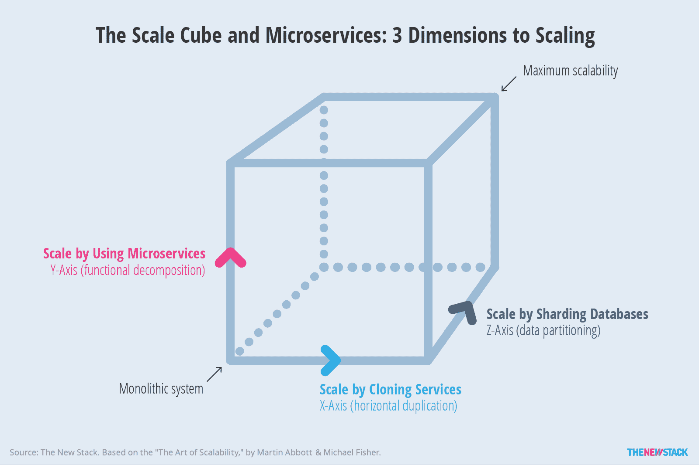
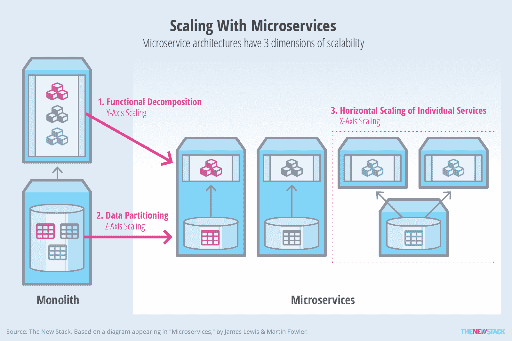

# 从整体到微服务:一种架构策略

> 原文：<https://thenewstack.io/from-monolith-to-microservices/>

[Vivek June ja](http://www.cloudgeek.in)

[Vivek June ja 是一名驻首尔的工程师，专注于云服务和微服务。他于 2008 年开始从事云平台工作，是 AWS 和 Eucalyptus 的早期采用者。他还是一名技术布道者，在印度的各种技术会议上发表演讲。他在 CloudGeek 和他自己的网站上写作。](http://www.cloudgeek.in)

大多数 IT 之外的人不知道管理复杂的企业系统有多困难。这是一种微妙的平衡行为，它取决于对任何一个变化将如何影响整个系统的理解。

新开发人员在开始工作之前要花几个月的时间学习系统的代码库。即使是最有知识的开发团队也害怕做出改变或添加新代码，这会以某种不可预见的方式中断操作，因此最普通的改变都会被讨论到令人作呕。

当事情出错时，运营责备开发，开发责备 QA。项目经理责怪预算和其他人。企业对 IT 失去信心，开始寻找外包商来取代内部团队。

除非你一直生活在岩石下，否则你一定听说过微服务如何彻底改变这种情况，实现一个新的、更加敏捷的世界，在这个世界中，开发人员和运营团队携手合作，快速、安全地交付小型、松散耦合的软件包。功能不是由一个单一的整体系统来实现，而是由一组较小的服务来协调它们的操作。

你如何让它工作？你来对地方了。我们会解释这一切。虽然采用微服务不可能存在一刀切的方法，但检查指导成功采用工作的基本原则是有帮助的。

## 采用微服务

对于采用微服务的团队来说，一种常见的方法是识别整体系统中的现有功能，这些功能既不是关键的，也与应用程序的其余部分相当松散地耦合。例如，在电子商务系统中，事件和促销通常是微服务概念验证的理想候选对象。或者，更复杂的团队可以简单地要求所有新功能都必须作为微服务来开发。

在每个场景中，关键的挑战是设计和开发现有系统和新微服务之间的集成。当使用微服务重新设计系统的一部分时，通常的做法是引入粘合代码来帮助它与新服务对话。

API 网关可以帮助将许多单独的服务调用组合成一个粗粒度的服务，这样做可以降低与单一系统集成的成本。

主要思想是用离散的微服务慢慢替换系统中的功能，同时最小化必须添加到系统本身以支持这种过渡的改变。这对于降低维护系统的成本和最小化迁移的影响非常重要。

## 微服务架构模式

有许多架构模式可以用来构建可靠的微服务实现策略。

Martin Abbott 和 Michael Fisher 在他们的书《可伸缩性的艺术》中阐述了“伸缩立方体”的概念，举例说明了使用微服务来更轻松地伸缩系统的各种方法(图 1)。微服务模式映射到立方体的 Y 轴，其中功能分解用于扩展系统。然后可以通过克隆(X 轴)或分片(Z 轴)进一步扩展每个服务。

图 1:展示了 Martin Abbott 和 Michael Fisher 的“scale cube”方法，通过功能分解来扩展系统。

阿利斯泰尔·考克伯恩介绍了“端口和适配器”模式，也称为[六边形架构](http://alistair.cockburn.us/Hexagonal+architecture)，用于构建可以独立测试的应用程序。然而，正如 James Gardner 和 Vlad Mettler 所提倡的，它已经越来越多地用于构建基于可重用微服务的系统[。六边形架构是一种称为](https://skillsmatter.com/skillscasts/5280-hexagonal-microservices)[有界上下文](http://martinfowler.com/bliki/BoundedContext.html)的模式的实现，其中与特定业务领域相关的功能不受任何外部变化或影响。

迁移到微服务的企业将这些原则付诸实践的例子比比皆是。Click Travel 开源了它的 [Cheddar 框架](https://github.com/ClickTravel/Cheddar)，它在一个易于使用的项目模板中捕获了这些想法，供 Java 开发人员为 Amazon Web Services 构建应用程序。SoundCloud 在对其应用程序进行大规模重构的尝试失败后，[将他们的微服务迁移](http://www.infoq.com/news/2014/06/soundcloud-microservices)建立在使用有界上下文模式来识别与域的其余部分不耦合的内聚特性集的基础上。

刚接触微服务的团队面临的一个挑战是处理跨越多个独立服务的分布式事务。在单块系统中，这很容易，因为状态更改通常保存在应用程序所有部分共享的公共数据模型中。然而，微服务的情况并非如此。

[cyclone slider id = " ebook-2-赞助商"]

在处理分布式事务时，让每个微服务管理自己的状态和数据会增加架构和操作的复杂性。良好的设计实践，例如域驱动设计，通过固有地限制共享状态，有助于减轻这种复杂性。

面向事件的模式，如[事件源](http://martinfowler.com/eaaDev/EventSourcing.html)或命令查询责任分离( [CQRS](http://martinfowler.com/bliki/CQRS.html) )可以帮助团队确保分布式微服务环境中的数据一致性。使用事件源和 CQRS，支持分布式事务所需的状态更改可以作为事件(事件源)或命令(CQRS)传播。然后，参与给定事务的每个微服务可以订阅适当的事件。

这种模式可以扩展到支持微服务在处理最终一致性时的[补偿](https://en.wikipedia.org/wiki/Compensating_transaction)操作。Chris Richardson [在 hack.summit() 2014 的演讲中展示了这个](http://www.slideshare.net/chris.e.richardson/building-and-deploying-microservices-with-event-sourcing-cqrs-and-docker-hacksummit-2014)的实现，并通过 GitHub 分享了示例代码[。同样值得探索的是弗雷德·乔治的“流和急流”概念，它使用异步服务和高速消息总线来连接应用程序中的微服务。](https://github.com/cer/event-sourcing-examples)

图 2:以微服务为基础，通过数据分区和水平扩展可以实现更高水平的可伸缩性。

虽然这样的架构很有前途，但重要的是要记住，在从单一系统向微服务集合过渡的过程中，两个系统将并行存在。为了降低迁移的开发和运营成本，微服务所采用的架构和集成模式必须适合系统的架构。

## 架构和实现考虑事项

### 领域建模

领域建模是设计一致和松散耦合的微服务的核心。目标是确保您的应用程序的每个微服务都充分隔离于系统中其他微服务的运行时副作用和实现中的变化。

隔离和绝缘微服务也有助于确保其可重用性。例如，考虑可以从单一电子商务系统中提取的促销服务。使用移动网络、iOS 或 Android 应用程序的各种消费客户端都可以使用这项服务。为了使这一点可预测地工作，“促销”的领域，包括它的状态实体和逻辑，需要与系统中的其他领域隔离，如“产品”、“客户”、“订单”等。这意味着促销服务不能受到跨域逻辑或实体的污染。

适当的领域建模也有助于避免沿着技术或组织边界对系统建模的陷阱，这导致数据服务、业务逻辑和表示逻辑都作为单独的服务实现。

Sam Newman 在他的书《构建微服务》中讨论了这些原则。Vaughn Vernon 在“实现领域驱动设计”中更深入地关注了这一领域

### 服务规模

在微服务社区中，服务规模是一个广受争议且令人困惑的话题。在确定微服务的合适规模时，首要目标是不要把它做成一个整体。

“单一责任原则”是考虑微服务系统中正确服务规模的驱动力。一些从业者提倡尽可能小的服务规模来进行独立的操作和测试。本着以下精神构建微服务

Unix 实用程序也导致易于维护和升级的小代码库。

架构师在设计大型领域时必须特别小心，比如电子商务系统中的“产品”,因为这些是潜在的整体设计，它们的定义容易发生很大的变化。例如，可以有各种类型的产品。对于每种类型的产品，可能有不同的业务逻辑。封装所有这些可能会变得很难，但是实现它的方法是在产品领域内设置更多的边界，并创建更多的服务。

另一个考虑是可替换性的概念。如果用新的实现或技术替换特定微服务的时间太长(相对于项目的周期时间)，那么它肯定是一个需要进一步调整其规模的服务。

### 测试

让我们来看看将单片系统逐步转变为基于微服务的系统的一些操作方面。可测试性是一个常见的问题:在开发微服务的过程中，团队需要执行服务与整体系统的集成测试。当然，这一想法是为了确保跨现有整体系统和新的微服务的业务运营不会失败。

这里的一个选择是让系统提供一些消费者驱动的合同，这些合同可以被转化为新的微服务的测试用例。这种方法有助于确保微服务总是以自动化测试的形式访问系统的期望。系统开发人员将提供一个包含样本请求和预期微服务响应的规范。然后，该规范用于创建相关的模拟，并作为在将新的微服务与现有系统集成之前运行的自动化测试套件的基础。

消费者驱动的契约测试库 Pact 是这种方法的一个很好的参考。创建一个可重用的测试环境，该环境可以部署整个系统的测试副本，并根据需要提供给微服务团队

也是有用的。这为那些团队消除了潜在的障碍，并从整体上改善了项目的反馈循环。实现这一点的一种常见方式是将整个系统容器化，采用 Docker 容器的形式，通过 Docker Compose 这样的自动化工具进行编排。这将快速部署系统的测试基础设施，并使团队能够在本地执行集成测试。

### 服务发现

当完成一个业务功能时，一个服务可能需要了解其他服务。服务发现系统实现了这一点，其中每个服务都引用一个包含其他服务端点的外部注册中心。这可以在处理少量服务时通过环境变量来实现；etcd、Consul 和 Apache Zookeeper 是通常用于服务发现的更复杂系统的例子。

### 部署

每个微服务都应该是可自我部署的，要么在运行时容器上部署，要么在自身中嵌入一个容器。例如，基于 JVM 的微服务可以在自身中嵌入 Tomcat 容器，从而减少对独立 web 应用服务器的需求。

在任何时间点，都可能有许多相同类型的微服务(即，按照 scale cube 的 X 轴伸缩),以允许更可靠地处理请求。大多数实现还包括一个软件负载平衡器，它也可以作为一个服务注册中心，如网飞尤里卡。这种实现还允许故障转移和透明的请求平衡。

### 构建和发布管道

在实现微服务时，额外的考虑是很常见的，比如有一个持续的集成和部署管道。在基于微服务的系统中，值得注意的是，每个微服务都有一个随需应变、独占的构建和发布管道。这从整体上降低了构建和发布应用程序的成本。

发布实践还需要包括滚动升级或蓝绿部署的概念。这意味着，在新的构建和发布周期中的任何时间点，都可以有相同微服务的并发版本在生产环境中运行。在慢慢淘汰旧版本之前，可以将一定比例的活动用户负载路由到新的微服务版本，以测试其操作。这有助于确保微服务中的失败更改不会削弱系统。在失败的情况下，主动负载可以被路由回同一服务的旧版本。

### 功能标志

另一个常见的模式是允许特性标志。像配置参数一样，可以将特征标志添加到系统中，以允许开启或关闭特征。在系统中实现这种模式将允许我们在标志打开时触发相关微服务的使用。这使得从单片系统迁移到微服务的特性的 A/B 测试变得容易。如果功能的现有版本和复制所述功能的新微服务可以在生产环境中共存，流量路由实现和功能标志可以帮助交付团队更快地构建终端系统。

## 微服务采用期间的开发人员生产力

整体架构之所以吸引人，是因为当整个系统仍然很小的时候，它们允许新的业务特性在紧张的时间表上快速周转。然而，随着系统的增长，这变成了开发和操作的噩梦。

如果和你的巨石柱一起工作总是像现在这样痛苦，你可能不会拥有它。相反，系统之所以成为整体，是因为在整体上添加东西一开始很容易。

当构建一个新的功能或系统是复杂的，并且有许多移动部分时，给予开发人员选择“微服务优先”方法的权力。这样做需要围绕架构和自动化的强有力的规程，这反过来有助于创建一个允许团队快速、干净地构建微服务的环境。

构建这种开发人员基础设施的一种方法是创建一个标准样板项目，封装微服务设计的关键原则，包括项目结构、测试自动化、与仪器和监控基础设施的集成、断路器和超时等模式、API 框架和文档挂钩等。

项目模板允许团队更少地关注搭建和粘合代码，而更多地关注在基于分布式微服务的环境中构建业务功能。像 Dropwizard、Spring Boot 和网飞·凯伦这样的项目是解决这个问题的有趣方法。在它们之间做出正确的选择取决于架构和开发人员的技能水平。

### 监控和操作

共存的单片系统和微服务需要对性能、系统和资源进行全面监控。如果通过微服务复制系统的特定功能，这一点会更加明显。收集性能和负载的统计数据将允许比较整体式实现和基于微服务的实现。这将有助于更好地了解新实施给系统带来的好处，并增强进一步迁移的信心。

### 组织考虑

从整体系统转移到微服务最具挑战性的方面是所需的组织变化，例如构建拥有其微服务所有方面的服务团队。这需要创建多学科单位，包括开发人员、测试人员和操作人员等。这个想法是拥抱更多的集体代码所有权和对软件工艺的关心。

## 结论

本文中分享的大多数观点要么已经在各种规模的组织中得到实践，要么已经取得了成果。然而，这不是一个放之四海而皆准的范例。因此，关注进化模式和采用战争故事是很重要的。随着越来越多的组织从整体系统转向微服务，我们将在这个过程中学习更多东西。

<svg xmlns:xlink="http://www.w3.org/1999/xlink" viewBox="0 0 68 31" version="1.1"><title>Group</title> <desc>Created with Sketch.</desc></svg>