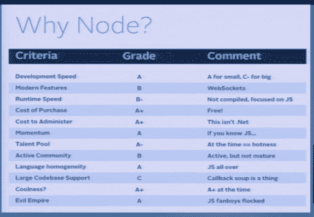

# 从 Node.js 到 Go，为什么一个创业公司做出了转变

> 原文：<https://thenewstack.io/from-node-js-to-go-why-one-startup-made-the-switch/>

在刚刚过去的 4 月 24 日至 26 日于丹佛举行的 Gophercon 大会上， [PopTip](https://poptip.com) 的创始人兼首席执行官凯尔西·费尔特(Kelsey Falter)为她公司的后端服务器选择了 [Go](https://golang.org) 而不是 [Node.js](http://nodejs.org/) 。她的故事是一个公司选择 Go 的例子，因为它在系统级管理方面有出色的能力。至于 Node.js，有很多例子可以说明该服务是如何在企业中使用的。在未来关于组织正在构建的新堆栈的帖子中，我们将探讨公司如何使用 Node.js。这篇文章只是关于一家公司，以及它如何通过转向 Go 来解决 Node.js 遇到的挑战。

https://www.youtube.com/watch?v=mBy20FgB68Q

PopTip 的 Node 问题始于大约两年前。Falter 说她知道如何编写 JavaScript，并认为她可以利用这一背景来学习 Node。开发速度让公司很容易上手 Node。它具有现代特征，如网络插座。它也是免费的，管理成本很低。Node 社区有动力、语言同质性和人才库。当时，它也有酷的因素。以下是她的总体成绩:

PopTip 帮助公司提供公众意见的统计分析。它的客户包括 CNN、欧莱雅、Spotify 和许多其他公司。这些客户的规模要求 PopTip 扩展其代码。它的服务依赖于机器学习和数据流。随着公司规模的扩大，管理任务变得越来越复杂，这是 Node.js 的一个常见抱怨,“回调汤”很容易让 Node 运行起来，但 PopTip 的增长带来了各种问题，Falter 在她的演示中描述了这些问题:

*   不能一前一后启动多个应用层。
*   如果实例停止运行，基础架构会出现单点故障。
*   服务的所有功能都在一个进程上运行。
*   由于高峰使用期间的高 CPU 和网络负载，延迟成为一个问题。
*   无法横向扩展。

## 但是为什么要去呢？

当技术债务变得太多的时候，特别是由于 PopTip 服务的扩展。这也是一个商业决策:该公司已经获得了风险融资，而且有客户需要管理。

当 PopTip 的一名工程师花了一个周末用 Go 复制核心处理结构时，这种转变出现了。仅通过从一个节点移动到另一个节点，文本处理就增加了 64%。PopTip 正式评估了 Go，并通过了记分卡测试:它有运行速度，管理成本最小，人才库非常好，并且竞争框架没有争夺开发人员的注意力。

Falter 说，PopTip 开始在应用服务器上使用 Go，然后删除了代理。去年秋天，该公司在 Golang 也做了网络前端。

自从采用 Go 以来，PopTip 已经能够以 Node 无法实现的方式扩展其基础设施。这是你的经历吗？你的公司从 Node 转到 Go 了吗？为什么？

<svg xmlns:xlink="http://www.w3.org/1999/xlink" viewBox="0 0 68 31" version="1.1"><title>Group</title> <desc>Created with Sketch.</desc></svg>