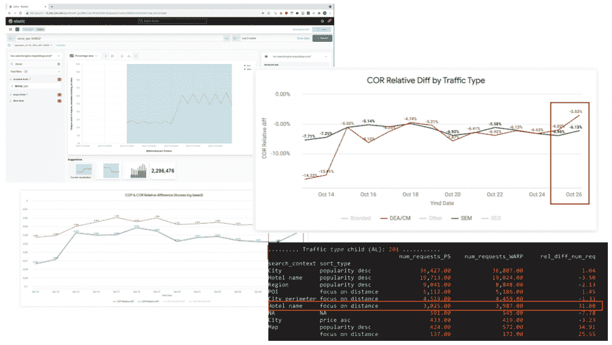
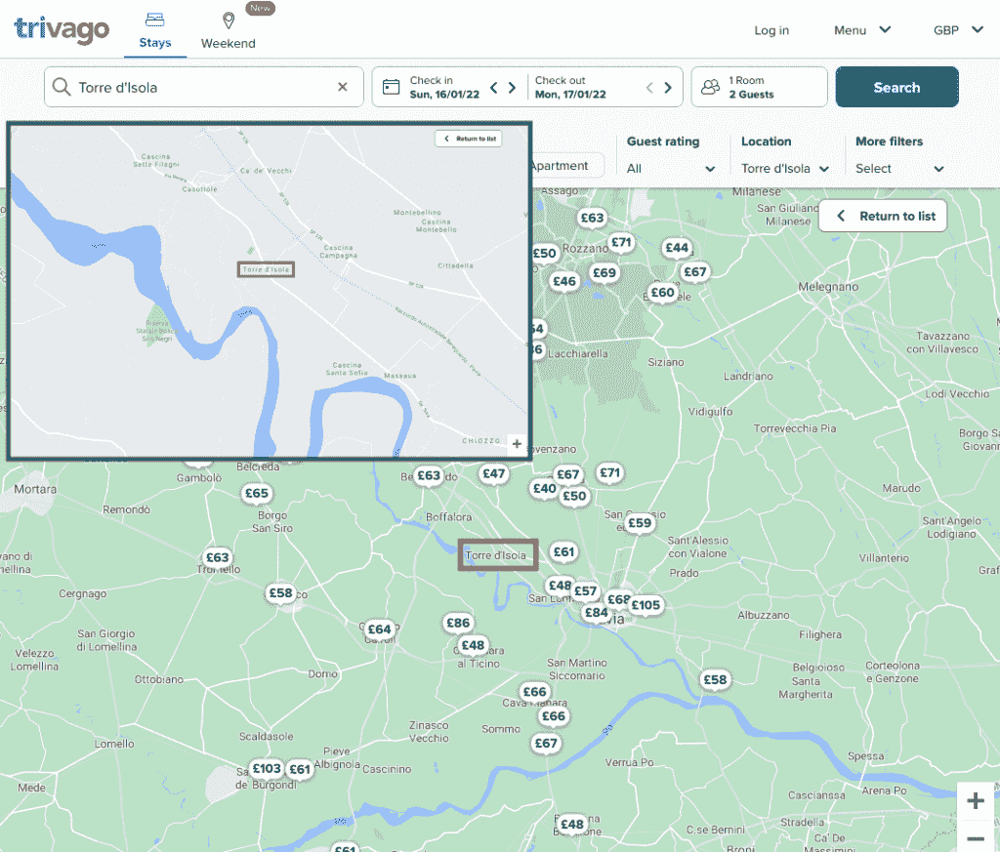
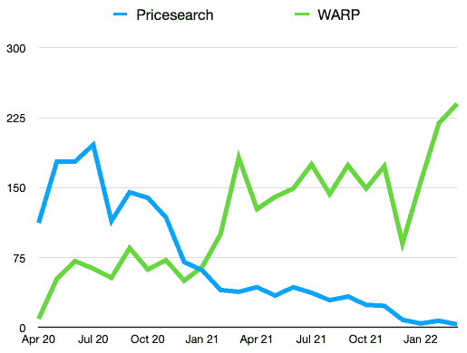

# 从 PHP 到 What Trivago 从重写 Web 应用中学到了什么

> 原文：<https://thenewstack.io/from-php-to-next-js-what-trivago-learned-rewriting-its-web-app/>

酒店搜索服务 [Trivago](https://www.trivago.com/) 在 [Next.js](https://nextjs.org/) 框架上用 [Typescript](https://thenewstack.io/how-typescript-won-over-developers-and-javascript-frameworks/) 重写了它的前端，替换了一个基于本土 JavaScript 框架的 PHP 代码库 [Melody](https://melody.js.org/) 。从 2020 年 4 月到 2021 年底，平台团队创建、测试和部署了新的应用程序，该应用程序将页面大小减少了 37%，同时增加了每日代码发布量。

工程都是关于权衡的，Trivago 团队接口平台负责人 Tom Bartel 在他最近的博客文章中出色地阐述了导致平台重写的权衡。这是一项艰巨的任务，尤其是当代码库本身没有任何“错误”或缺陷的时候。

什么在起作用？这个网站很大程度上。用户正在享受网络和手机的全部功能。有一个训练有素的工程团队，其中许多人喜欢他们的职能工作职责。

什么“不起作用”？Melody 是本土制作的，所以没有广泛传播。生态系统很小，文档也很有限，工程方面的(例如 Google 和 Stack Overflow)非常有限或者根本没有帮助。最多有两个核心维护人员，任何时候都至少有一个随叫随到。让新员工入职很有挑战性，一些人表示担心他们正在学习和培养不可转移的技能。

加倍下注旋律？分配资源来更新框架，更新和添加质量文档，并培训工程师来维护？或者向下凝视…

## …空白页

这不是一个新项目，但它是一个新项目。由于这项工作在内部被称为 Web 应用程序重写项目(WARP ),是完全重写而不是重构，所有新的项目问题都出现了:

*   库:哪个对实用程序、日期计算等最有吸引力？
*   CSS 文件:如何组织？
*   应用程序状态:如何维护它？
*   事件传输:这将如何发生？
*   HTML 页面:这会静态预生成吗？
*   结构:用于 URL 和页面。
*   应用程序初始化:它将如何工作？
*   组件 API:设计会是什么样子？

## 决定，决定！

面对如此多的决策和团队远程工作(当该项目于 2020 年 4 月开始时，远程协作仍被视为新事物)，Trivago 工程师实施了一种令人难以置信的方法，务实地解决触摸工程问题并最终做出决策。

*   决策文档:该文档收集并组织了工程师的相关事实和观点。
*   决策会议:讨论最终导致决策的观点的场所。
*   决策负责人:策划文档，准备决策会议，并确保形成决策。

一些决策很容易达成，而另一些决策来之不易，一些决策从文档到测试都成功了，而另一些决策由于实现没有达到最初的预期而被重构。

正是在另一个对一些开发人员来说太复杂的决定的实施过程中，Trivago 工程师决定继续使用 Next.js 并做出反应。

从 Trivago 试错重写过程中得到的一个很好的建议是致力于决策，但在必要时保持开放的心态和正确的方向。根据最佳知识和意图做出的决策可能会在实施过程中带来新的见解。

## 快到了

一旦重写功能完全正常并对用户有用，它就暴露在现实世界中，并使用仪表板、检查和比较进行测试，作为工程师查看需要注意什么的指南。

*   **用户互动**:这在不同产品之间有区别吗？如果是这样，原因是 bug 还是别的？
*   **收入**:新的应用程序会以同样的速度转发到预订网站吗？
*   **搜索类型** : Trivago 自动调整搜索类型以获得更好的结果。例如，如果搜索范围太窄，Trivago 将扩展参数并添加结果。有一个直接的迹象表明有些东西出了问题，那就是列表的不同。这引起了进一步的调查。

它花了几个月的工程，但最终，开关被翻转，所有的用户流量到新的应用程序。

## 收获了回报！

### 用户利益

启动时间很大程度上取决于 Trivago 提供的代码的大小。由于工程师非常依赖并回馈开源库，如 Next.js、Preact 和 react-use，他们密切关注代码大小。

新产品将主题页面的页面重量从 2.1 MB 减少到 1.7 MB (19%)，将结果页面的页面重量从 4.1 MB 减少到 2.6 MB (37%)。将单页面应用程序转换成多个页面，并使用 Next.js 的自动代码分割特性，结果证明非常有益。

因此，Trivago 现在在较弱的硬件上运行更流畅。占所有 Android 客户端约 0.5%的 Android 6 是使用 Trivago 应用程序的最弱硬件。他们的测试显示，该应用程序在 Android 6 上运行流畅。

### 开发者利益

这是一个坚实的联系回到为什么重写开始摆在首位。更干净的代码库，具有高质量、广泛可用的文档，包括内部文档和全球生态系统文档，可在 google 和 Stack Overflow 上搜索。新开发人员有一个更容易的入职时间，有更多的熟悉感和可转移的技能来发展。

没有更快开发的确切证据，在新代码库(见上图)中，每月合并的拉请求更高，与在旧冷库工作的工程师数量相同。

与前两次相比，现在每天有 10 次发布。再进行一点清理，额外的遗留系统将被关闭，从而为新的应用程序提供更多的资源。

总的来说，这次大规模重写是有成本的，也有不少困难，收入有所损失，尽管它与 2020 年的旅行放缓很好地匹配。工程团队在工程技能和软技能方面都得到了极大的发展。

考虑到所有的挫折，这个项目无疑是成功的。

<svg xmlns:xlink="http://www.w3.org/1999/xlink" viewBox="0 0 68 31" version="1.1"><title>Group</title> <desc>Created with Sketch.</desc></svg>