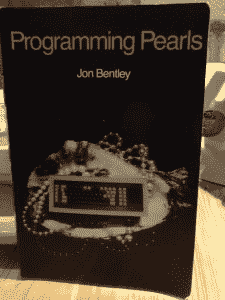

# 来自书库:工程权衡

> 原文：<https://thenewstack.io/from-the-stacks-the-engineering-tradeoff/>

向我们推荐了《编程珍珠》这本书

[Evan Prodromou](https://twitter.com/evanpro)

，创始人

[Fuzzy.io](http://www.fuzzy.io)

，一个 AI 点播关节。

工程师从权衡的角度考虑问题。每增加一个新功能，就会有一些东西被拿走，或者变得更复杂。一个抽走复杂性的抽象经常会带来它自己的复杂性。思考这个问题“你有什么没告诉我的？”在你的下一次供应商会议上。

但是，有时候，假设你必须做出[工程上的权衡](http://link.springer.com/article/10.1007%2FBF01581342#page-1)来做出一些改进，实际上会阻碍你想出一个真正优雅的解决方案，一个在所有方面都简单优越的解决方案。

这是 Jon Bentley 在《编程珍珠》一书中提供的智慧珍珠之一。那是珍珠，不是 Perl。在拉里·沃尔于 1986 年创建 Perl 之前，本特利写了这本书，当时他在美国电话电报公司·贝尔实验室。

在第一章  中，Bentley 考察了程序员关于速度和资源的工程权衡的公认智慧:程序使用的内存量可以减少，假设人们不介意程序需要更长的时间来完成，思路是这样的。

然而，情况并非总是如此。Bentley 写道:“我的经验是，减少程序的空间需求也会减少它的运行时间。”。"需要处理的数据越少，处理数据的时间就越少."

Bentley 警告说，提出这样的解决方案需要更多的思考。有时需要一个“啊哈”的时刻，在这个时刻，开发人员为一个看似困难的问题找到了一个意想不到的简单解决方案。作为一个例子，Bentley 提出了在一长串连续整数中寻找一个丢失的整数的问题。

人们可以让计算机进行顺序搜索，一次搜索列表中的两个号码，检查它们是否相同。然而，这种方法可能需要很长时间，平均 n/2 比较为“n”个整数。另一项被称为二分搜索法的技术的天才之处在于，它只是简单地计算集合中的位数，然后将集合减半，直到缺失的位数被精确定位。这种方法将工作量减少了一个数量级，而且速度也更快。

“仔细分析一个小问题有时会产生巨大的结果，”他写道。

专题图片:纽约地铁站的贴纸，[曼哈顿中城](http://joabj.com/Photos/2015/1502-SA-NYC-Midtown-Slap.html)。

<svg xmlns:xlink="http://www.w3.org/1999/xlink" viewBox="0 0 68 31" version="1.1"><title>Group</title> <desc>Created with Sketch.</desc></svg>