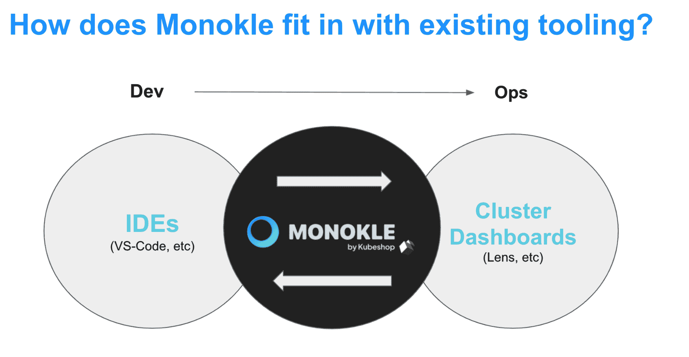

# 从 YAML 工程师到 YAML·赫尔德

> 原文：<https://thenewstack.io/from-yaml-engineer-to-yaml-herder/>

[Ole lens mar](https://www.linkedin.com/in/olensmar/)

[Ole 是 Kubeshop 的 CTO。在 Kubeshop 之前，Ole 是 SmartBear 的 CTO 兼首席架构师。他是 SoapUI 的创始人，也是 OpenAPI 倡议的主席。](https://www.linkedin.com/in/olensmar/)

在 Kubernetes 世界中，一个常见的比喻是，你不是 DevOps 工程师或站点可靠性工程师，而是 YAML 工程师。放眼望去，到处都有另一份 YAML 清单需要讨论。

创建、编辑、更新和应用这些清单是 YAML 工程师的日常工作。用于检查和理解集群中对象的工具很多，但是用于与创建、编辑、验证和调试清单相关的预部署任务的集成工具却很少。随着这些清单的大小和复杂性的增长，试图管理样板代码并找出您当前的上下文和您试图修复的生产集群之间的微小差异几乎是不可能的。可以花几个小时来找出小错误，而且这些时间并不便宜。您的整个团队或企业！—当难以捉摸的 YAML 压痕将您的生产环境作为人质时，可能会被阻止。

试图手动管理 YAML 文件正在将我们从 DevOps 把基础架构当成牛的理想状态转移到把基础架构当成宠物的状态。将每一个肥胖手指错误或 CVE 更新恢复健康是一个艰苦的过程。YAML 工程师是兽医，护理每一只 YAML 宠物恢复健康。

必须有一个更好的方法来管理清单，把 YAML 工程师变成 YAML 牛的牧人。

## **从云原生 DevX 到 OpX**

放眼云原生开发者，我们看到了一个完全不同的世界。现代集成开发环境，如 [Github Codespaces](https://github.com/features/codespaces) 和 [Gitpod](https://www.gitpod.io/) ，都是为了加速开发人员的“内部循环”，因此他们可以专注于编写代码，而不是争论细节。有了基于云的 ide，甚至帮助同事或审查代码都变得轻而易举。

短暂的开发环境不会让你失去当前的环境。只需打开一个包含其环境的新工作空间，进行编辑或注释，然后切换回您的工作。能够用代码描述这个过程有很多好处，从减少配置漂移到为自动化创造许多可能性。

我们需要找到一种方法，将云原生开发者体验(DevX)的优势转化为更好的运营体验(OpX)。YAML 的工程师没有同样多的选择来加速他们的内部循环。代码编辑器将获得一些支持，或者是本地的，或者是通过插件(这些插件可能不能很好地协同工作),或者他们可以选择使用另一个 CLI (yech🤮).真正需要的是一个“manifest IDE ”,以一种良好集成和一致的方式帮助完成所有这些任务，从而创建云原生 OpX。

## **monkle:将 OpX 带入云原生环境**

[monkle](https://monokle.kubeshop.io/)是你的开源 YAML IDE，把真正的 OpX 带到云原生世界。Monokle 使得在将 YAML 清单部署到集群之前管理和调试它们变得很容易。

首先，Monokle 帮助您快速获得清单的高级视图，以及它们包含的资源和关系。它允许您可视化和导航集群内外的资源，并根据您想要进行的任何更改来区分它们。它验证资源之间的引用，以确保您没有拼错对象名或名称空间，并让您以交互方式修复它们，以确保您的更改能够完成工作。

一旦你理解了你的清单是如何工作的，Monokle 可以让你轻松地编辑资源，而不需要学习或查找 YAML 语法。您可以重构清单，同时仍然保持所有清单中名称和引用的完整性。最后，如果你使用的是 kustomize 或者 Helm，可以预览和调试它们生成的资源；验证它们的链接、值等。您甚至可以将一组生成的资源与集群中已经运行的资源进行比较，这一切都是为了确保当您点击“部署”按钮时，一切都会像您在预发布会议上承诺的那样顺利进行。

Monokle 把 OpX 带到了 YAML 的工程师那里，这些工程师想把他们的 YAML 清单变成牛，而不是像对待宠物一样对待它们。

Monokle 正好位于传统开发人员 ide 和操作集群仪表板之间。ide 非常擅长管理单个清单，但是在提供以清单为中心的已定义资源及其关系和相关工作流的视图时，通常无法提供“全局视图”。另一方面，集群仪表板通常不提供任何使用清单的功能。它们都是关于检查和管理已经在集群中运行的资源，而不是关注预先部署的工件或工作流。

Monokle 填补了这一空白，它提供了 Kubernetes 清单的整体视图，并直接关注相关的工作流——编辑、验证、调试、区分、部署等。Monokle 可以很好地与 ide 和集群仪表板一起工作，用以清单为中心的功能和工作流来补充它们。

## 【Monokle 入门

Monokle 正处于开源的初级阶段；有这么多的方向，需要解决的问题和让用户开心！不过，最终，这是为了让管理清单的人的生活更轻松。如果你正在寻找提高你的云原生 OpX，给 Monokle 一个尝试。下载它或从 GitHub 构建，让我们知道我们能做些什么来让你成为一个更快乐的 YAML 工程师。

### 链接

<svg xmlns:xlink="http://www.w3.org/1999/xlink" viewBox="0 0 68 31" version="1.1"><title>Group</title> <desc>Created with Sketch.</desc></svg>