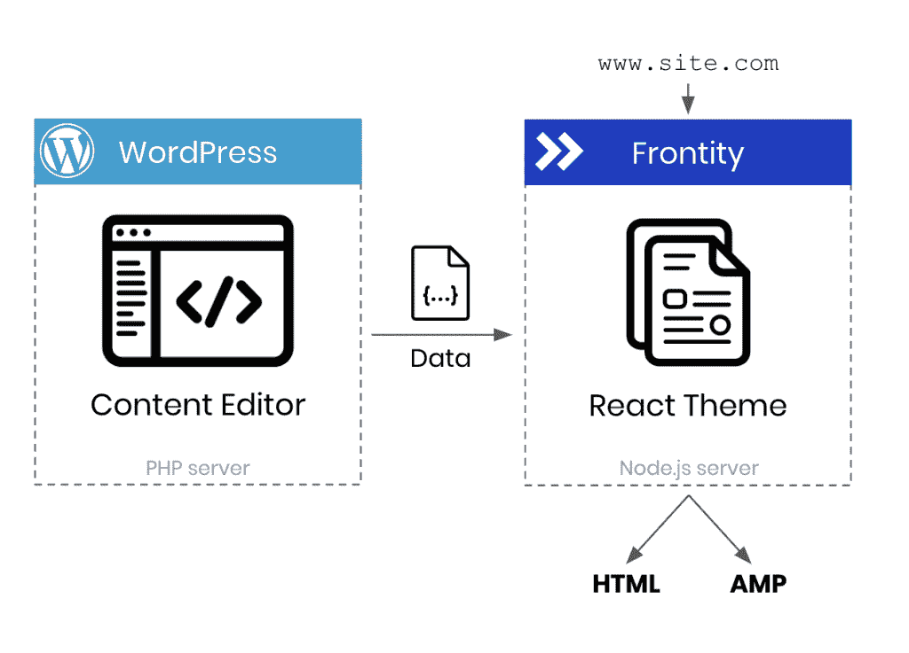

# WordPress 作为开发平台的前沿性和未来

> 原文：<https://thenewstack.io/frontity-and-the-future-of-wordpress-as-a-dev-platform/>

 [理查德·麦克马努斯

理查德是 New Stack 的高级编辑，每周撰写一篇关于网络和应用程序发展趋势的专栏文章。此前，他在 2003 年创立了读写网，并将其打造为全球最具影响力的科技新闻和分析网站之一。](https://twitter.com/ricmac) 

上周，WordPress 背后的公司 Automattic 继续其最近的收购行动，收购了一家名为 Frontity 的 React 框架公司。虽然这次收购本身主要是一次“收购”，但由于 Frontity 的技术是开源的，它也透露了一些 Automattic 对 WordPress 未来的计划。很明显，Automattic 现在不仅仅将 WordPress 视为一个内容平台，也是一个开发平台。更重要的是，一个包含“无头 CMS”方法的开发平台——正如我将在本文中解释的，这是 WordPress 的一种用法，并不总是被 Automattic 所提倡。

为了了解 WordPress 如何从 Frontity 的技术中获益，我联系了 Frontity 的联合创始人兼首席执行官 Pablo Postigo。

“WordPress 已经是网络上最好的内容平台。我们希望帮助它成为网络上最好的开发平台，”Postigo 和他的联合创始人 Luis Herranz 在他们的公告中写道。这些话呼应了 WordPress 联合创始人兼 Automattic 首席执行官[马特·莫楞威格](https://twitter.com/photomatt)的话，他[在他的博客](https://ma.tt/2021/08/frontity-to-join-automattic/)上写道，Frontity 的收购“将有利于我们的努力，因为我们继续使块和主题 API 成为使用的乐趣，并使 WordPress 成为网络上最好的开发平台。”

“在我看来，WordPress 一直是一个网络开发平台，”Postigo 告诉我。"由于 WordPress 的可扩展性模式，你可以利用第三方插件或主题."

也许是这样，但是 Frontity 似乎已经加大了人们如何为 WordPress 开发的赌注。去年 10 月，当马伦韦格在与 T4 的辩论中点名批评 Frontity 时，他自己也承认了这一点[。“[……]Frontity 之类的东西允许你使用 React 构建无服务器预渲染的 WordPress，”Mullenweg 曾说过，这是对比尔曼声称开发者不再对 WordPress 生态系统感兴趣的反驳。](https://thenewstack.io/jamstack-vs-wordpress-round-2-the-two-matts-debate/)

## 什么是前沿性？

Postigo 和 Herranz 创建的是 WordPress 的 React 框架，于 2019 年推出。它允许开发者构建一个 React 应用，将 WordPress 作为所谓的“无头 CMS”换句话说，WordPress 本身只是用来创建和管理内容——它不再是设计或发布过程的一部分。相反，Frontity 通过 WordPress REST API 访问内容，然后“使用 React 生成显示在浏览器中的最终 HTML”

这可以加快页面加载速度，并在表示方面提供更大的灵活性，但也使发布过程变得复杂。正如在它的[架构页面](https://docs.frontity.org/architecture)上所解释的，一个 Frontity 项目“总是需要两台服务器”:一台运行 PHP 的普通 WordPress 服务器用于内容，另一台运行 Node.js 的 Frontity 服务器用于表示和发布。

让事情变得更复杂的是，有两种不同的“模式”(配置)来设置 Frontity 项目:解耦和嵌入式。在解耦模式下，主域指向托管 Frontity 的 Node.js 服务器。在嵌入式模式下，主域指向 WordPress 服务器。去耦模式具有更简单的架构:

来源:Frontity

Frontity 使用非常受欢迎的 JavaScript 框架 React，为 JavaScript 开发人员更多地参与 WordPress 项目提供了机会。Postigo 告诉我 Frontity 让他们“看到让 WordPress 对 JavaScript 开发者更有吸引力的机会有多大。”这将是他们加入 Automattic 后的主要关注领域之一。

## 变得没头了

正如你所看到的，Frontity 的一个关键方面是它只使用 WordPress 作为内容——这在业内被称为“无头 CMS”方法，因为它将前端(表示)和后端(内容)分开。近年来，Headless 变得更加流行，部分原因是 Netlify 创建并推广的 [Jamstack 架构](https://thenewstack.io/jamstack-vs-wordpress-which-is-the-future-of-web-architecture/)的兴起，[在其栈中包含了](https://jamstack.org/) headless CMS。

众所周知，马特·莫楞威格一直对 Jamstack 和 headless CMS 概念持怀疑态度。早在 2017 年 9 月，他[在 Twitter 上发表观点](https://twitter.com/photomatt/status/910949582334451712)“我会对任何被贴上‘无头’标签的东西进行长期押注。“但从那以后，他似乎已经认识到了无头 CMS 的好处，至少从 Frontity 的收购来看是这样的。在他关于 Frontity news 的博客文章中， [Mullenweg 写道](https://ma.tt/2021/08/frontity-to-join-automattic/)“我相信我们仍然可以从解耦系统中学到很多东西，我们可以将这些知识融入 WordPress 本身，因为我们强调性能、灵活性和开发的简易性。"

这里值得注意的是，Automattic 拥有的企业托管服务 [WordPress VIP](https://wpvip.com/) 包括一个无头选项[——尽管它警告说“无头 CMS 的一个固有缺点是复杂性。”WordPress 行业的其他人也对 headless 做出了类似的举动。](https://wpvip.com/2021/08/26/how-to-go-headless-on-wordpress-vip/) [WP 引擎](https://wpengine.com/)，WordPress VIP 的竞争对手，[在三月份宣布了](https://www.businesswire.com/news/home/20210304005267/en/WP-Engine-Launches-Atlas-the-Future-of-Headless-WordPress)其首个无头 WordPress 服务，名为 Atlas。

## JavaScript 和 React 在 WordPress 中的作用

尽管 Automattic 似乎有点不情愿地接受了无头趋势，但它对将 React 更多地集成到 WordPress 生态系统中感兴趣也就不足为奇了。根据最新的[栈溢出开发者调查](https://insights.stackoverflow.com/survey/2021#section-most-popular-technologies-web-frameworks)，React 现在已经超过 jQuery 成为最常用的 web 框架。因此，如果 WordPress 想要成为“网络上最好的开发平台”，瞄准 React 开发者是有意义的。

另外，现代 WordPress 最重要的部分是使用 JavaScript 和 React 构建的:Gutenberg，模块化编辑界面。正如 Postigo 所解释的，“使用 Gutenberg，内容中的所有内容现在都是一个块，这些块可以用 React 来设计和扩展。”此外，开发人员可以使用 React(或者更一般地说，JavaScript)创建新类型的块。

古腾堡项目已经为[提供了一个开发平台](https://developer.wordpress.org/block-editor/how-to-guides/platform/)，由“一组可以在你的网络应用中使用的 JavaScript 包和工具”组成。因此，Frontity 的创始人无疑会想方设法扩展这一功能。

这是 WordPress 生态系统的重点从 PHP 逐渐转移到 JavaScript 的延续，这始于 2015 年 11 月，当时 Mullenweg 宣布了一个新的基于 JavaScript 的 WordPress 代码库。从那以后，JavaScript、React 和 API 统治了 WordPress 世界，但是 Frontity 的收购给 JavaScript 工厂增加了更多的优势。

虽然，根据 Postigo 的说法，这并不一定意味着 React 会被带入 WordPress 界面。

“目前，React 用于块编辑器 UI(在 WordPress 的管理端)。但这次收购(Frontity)并不意味着我们将把 React 引入 WordPress PHP 或整个网站的编辑主题，也不意味着 Frontity 框架或其任何实质性部分将被并入 WordPress。”

## 倾向于 Headless 和其他 Web 开发趋势

WordPress 的创新有时会受到不公平的批评。在 WordPress 社区中，Gutenberg 界面一直是[有争议的](https://wptavern.com/matt-mullenweg-addresses-controversies-surrounding-gutenberg-at-wordcamp-portland-qa),但是尽管它偶尔会有一些怪癖，但不可否认它是我们现在生活的模块化网络世界的正确用户界面。同样，在 2020 年栈溢出开发者调查中，WordPress 被选为“最可怕的”平台(尽管它在今年的调查中神秘地未被提及)。

尽管有反弹，Automattic 已经显示出它对现代网络技术的全情投入——甚至到了拥抱使用 WordPress 的程度，如果可能的话，它宁愿避免使用 WordPress(headless CMS)。对 Frontity 的收购是倾向于向去耦和 JavaScript 支持的 web 框架转变的又一个例子。我很想看看 Frontity 的创造者们对古腾堡的未来会有什么影响。

<svg xmlns:xlink="http://www.w3.org/1999/xlink" viewBox="0 0 68 31" version="1.1"><title>Group</title> <desc>Created with Sketch.</desc></svg>